# 参考视频

+ [【拯救者】操作系统速成（期末+考研+专升本+自考 均适用）含整套考题讲解 4k](https://www.bilibili.com/video/BV1nG411j72M)，不全，讲的还行，后续文件管理、I/O管理需要付费观看

+ [408操作系统考前梳理](https://www.bilibili.com/video/BV1XxCJBEEKn)，有点难
+ [《操作系统》4小时期末不挂科！期末速成丨考前突击丨期末不挂科丨考点总结](https://www.bilibili.com/video/BV1ju6TYHEKU)，**经典速成课**
+ [操作系统原理期末速成不挂科主攻大题](https://www.bilibili.com/video/BV1qd4y177eA)，**经典大题课速成**

# 基本概念

操作系统的定义、结构简图、四大资源管理

操作系统位于**硬件**与**用户程序（应用软件）**之间。

操作系统的特征：**并发、共享、虚拟、异步**

+ 并发 vs 并行
+ 共享：互斥共享，同步共享

+ 虚拟：把一个物理上的实体变为若干个逻辑上的对应物。时分复用技术、空分复用技术。
+ 最基本的特征：**并发、共享**

操作系统的发展阶段

+ 手工操作
+ 单道批处理
+ 多道批处理
+ 分时操作系统：Unix、Linux。以时间片为单位为各个作业、用户进行服务
+ 实时操作系统：硬实时、软实时

操作系统的结构设计

+ 传统操作系统
  + 无结构os
  + 模块化结构os
  + 分层式结构os
+ 客户/服务器模式：客户机、服务器、网络系统
+ 面向对象的程序设计
+ 微内核os结构

特权命令

处理机状态：管态和目态，即内核态和用户态，用户态不能执行特权命令，内核态可以执行除访管指令的所有指令

用户态切换到内核态的方式

+ 系统调用
+ 中断
+ 异常

原语：原子操作，不可中断

系统调用：

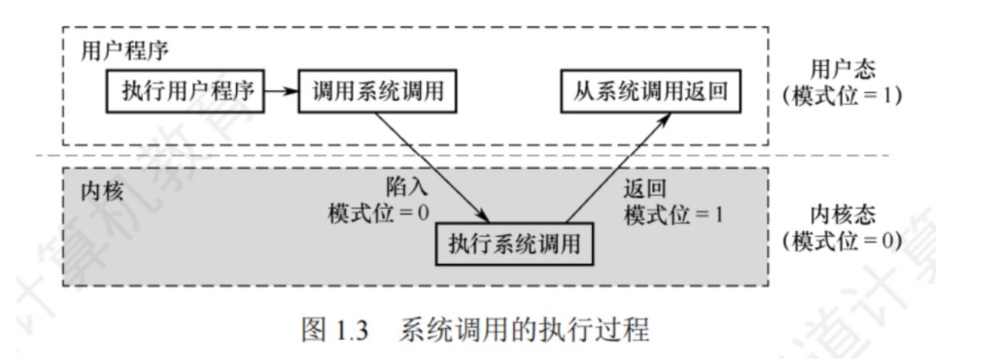


# 进程管理

## 进程管理

+ 进程调度：指操作系统从就绪队列中选择一个进程，将CPU分配给它执行的过程
  + ==触发进程调度的几种情况==：
    + 进程运行完毕；发生异常无法运行，运行态 → 终止态
    + 执行中的进程因为I/O请求而暂停执行，运行态 → 阻塞态
    + 在进程通信或同步过程中执行某种原语，等待其他进程释放资源或发送消息，运行态 → 阻塞态
    + 时间片用完（抢占式调度），运行态 → 就绪态
+ 进程同步：对系统中多个进程共享临界资源的控制和协调
+ 进程控制：进程的创建、撤销、进程状态之间的转换
+ 进程安全

## 进程 vs 线程

+ 进程：系统资源分配的最小单位

+ 线程：CPU调度的最小单位

## 进程控制块PCB

PCB：维护进程的基本信息以及运行状态

进程状态转换：进程三态 + 创建 + 终止

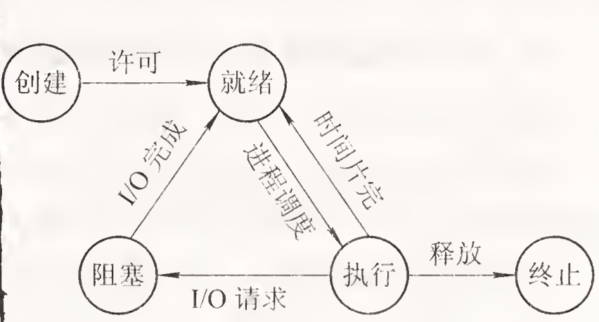


## 进程同步

进程同步

+ 同步：多个进程因合作产生的直接制约关系，使得进程有一定的先后执行顺序，必须前面的执行完了后面的才能执行
+ 互斥：多个进程同一时刻只能有一个进程进入临界区
+ 信号量：整形变量，有两个原子操作，通常执行这两个操作时屏蔽中断（可重入锁 / 悲观锁，ReentrantLock）。如果信号量取值只能为0或1则为互斥信号量。
  + P操作：信号量-1，占有资源
  + V操作：信号量+1，释放资源

临界资源：在同一时刻仅允许一个进程访问的共享资源

临界区：访问临界资源的代码。


## 悲观锁 vs 乐观锁

ReentrantLock（或 synchronized）

+ 属于**互斥锁 / 排他锁**
+ 同一时刻只允许一个线程进入临界区
+ 其他线程会**阻塞等待**

 ==乐观锁（如 CAS）==

+ 不加锁，不阻塞
+ 先假设“不会冲突”，如果真的冲突了，再处理（重试）

```
线程A读取数据 version=1
线程B读取数据 version=1

线程A修改 → 更新为 version=2（成功）
线程B修改 → 发现version不一致 → 失败 → 重试
```

PV操作中的互斥信号量本质上对应的是一种悲观的互斥锁机制，在Java中更类似于ReentrantLock或synchronized，而不是乐观锁（如CAS）

| 类型          | 是否阻塞 | 是否互斥     | 是否对应PV互斥信号量 |
| ------------- | -------- | ------------ | -------------------- |
| ReentrantLock | ✅ 阻塞   | ✅ 互斥       | ✅ 是                 |
| synchronized  | ✅ 阻塞   | ✅ 互斥       | ✅ 是                 |
| 乐观锁（CAS） | ❌ 不阻塞 | ❌ 非严格互斥 | ❌ 否                 |


## 访问临界区的四个同步原则

+ 空闲让进

+ 忙则等待

+ 有限等待

+ 让权等待


## 经典进程同步问题

生产者消费者问题

哲学家进餐问题

读者写者问题

## 管程

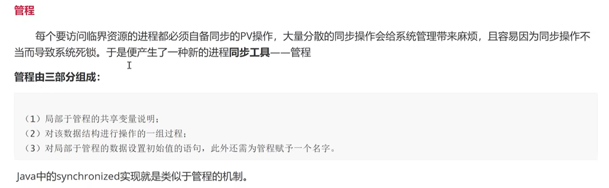

## synchronized vs ReentrantLock

1. synchronized（隐式锁）

+ **加锁方式**：通过关键字修饰方法或代码块

  ```java
  synchronized(obj) {
      // 临界区
  }
  ```

+ **释放锁**：由 JVM 自动完成（退出代码块或发生异常）

+ **异常处理**：不会导致锁泄露

+ **条件控制**：使用 `wait()` / `notify()` / `notifyAll()`

------

2. ReentrantLock（显式锁）

+ **加锁方式**：手动调用 `lock()`

  ```java
  lock.lock();
  try {
      // 临界区
  } finally {
      lock.unlock();
  }
  ```

+ **释放锁**：必须手动调用 `unlock()`（通常写在 finally 中）

+ **异常处理**：如果未释放锁，可能导致死锁

+ **条件控制**：使用 `Condition`（`await()` / `signal()`）


| 对比维度        | synchronized                | ReentrantLock                                                |
| --------------- | --------------------------- | ------------------------------------------------------------ |
| 实现层面        | JVM 内置（基于 Monitor）    | JUC库（基于 AQS）                                            |
| 锁类型          | 非公平锁（默认）            | 支持公平/非公平锁（**公平锁**指多个线程请求同一把锁时，**按照请求锁的先后顺序（FIFO队列）依次获得锁**。） |
| 可重入性        | 支持                        | 支持                                                         |
| 获取锁方式      | 阻塞式，不可中断            | 可中断（lockInterruptibly）                                  |
| 超时机制        | 不支持                      | 支持（tryLock(timeout)）                                     |
| 条件变量        | 单一条件队列（wait/notify） | 多个 Condition                                               |
| 锁释放          | 自动                        | 手动                                                         |
| 灵活性          | 较低                        | 更高                                                         |
| 性能（现代JDK） | 已优化，性能较高            | 在高竞争场景更灵活                                           |

总结：

`synchronized` 是基于管程的内置同步机制，使用简单、自动管理锁；
`ReentrantLock` 是基于 AQS 的显式锁，功能更丰富，但需要手动控制。


# 处理机调度

处理机调度的三个层次

+ 高级调度：外存 → 内存，作业调度，从后备队列将作业调到内存中并为其创建进程，发生频率最低
+ 中级调度：外存 → 内存，进程调度，从挂起队列将进程的数据段、程序段调回内存
+ 低级调度：内存 → CPU，从就绪队列选择一个进程并为其分配处理机，发生频率最高

==调度的方式：抢占式、非抢占式==

调度准则（衡量指标）

+ 系统吞吐量 = 单位时间内处理作业的数量 = 完成的总作业数 / 总花费时间
+ CPU利用率 = CPU有效工作时间 / （CPU有效工作时间 + CPU空闲等待时间）
+ 等待时间
+ 周转时间 = 等待时间 + 服务时间 = 作业完成时间 - 作业到达时间
+ 响应时间 = 作业开始运行的时间 - 作业到达时间
+ 平均周转时间
+ 带权周转时间 = 周转时间 / 服务时间
+ 平均带权周转时间

调度算法

+ 先来先服务 FCFS
+ 短作业优先 SJF：饥饿现象
+ 优先级调度算法
+ 高响应比优先调度算法 HRRN：响应比 = （当前等待时间 + 运行时间） / 运行时间
+ 多级反馈队列调度算法：饥饿现象
+ 时间片轮转调度算法 RR

# 死锁

定义：多个进程互相等待对方释放资源，从而陷入无限等待状态，导致系统无法继续进行正常操作。


产生死锁的四个必要条件

+ 互斥条件（不可破坏）
+ 请求和保持条件
+ 不可抢占条件
+ 循环等待条件

预防死锁：破坏必要条件中的一个或几个

避免死锁：安全状态（安全序列） + 银行家算法

死锁的检测

+ 死锁检测算法（死锁定理）
+ 死锁解除算法：资源剥夺法、撤销进程法、进程回退法


# 内存管理

## 存储器管理（实存）

内存管理功能：内存的分配与回收，地址转换，内存空间的扩充（虚存），存储保护


用户源程序变成可在内存中执行的程序：编译，链接，装入


### 链接

### 装入

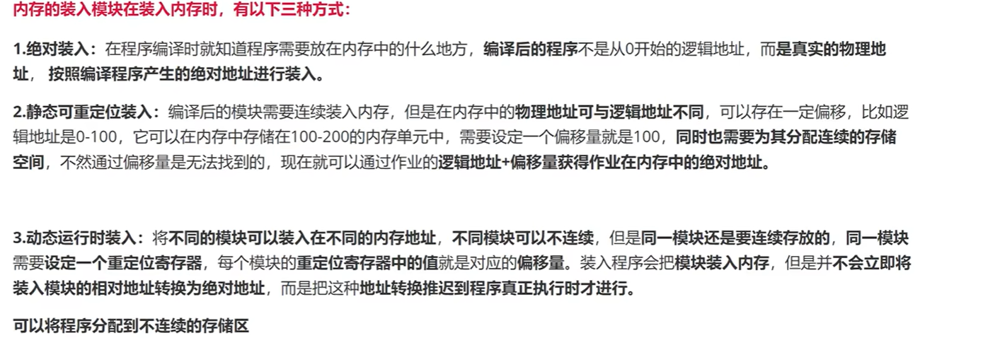

### 覆盖

### 交换


### 连续分区分配方式

单一连续分配：无外部碎片，有内部碎片
固定分区分配：同上
动态分区分配：无内部碎片，有外部碎片

### 动态分区分配的算法

首次适应算法FF：按地址递增
循环首次适应算法NF：地址递增，从上次结束部分接着找
最佳适应算法BF：按分区大小递增
最坏适应算法WF：按分区大小递减

快速适应算法

伙伴系统

### 非连续分配方式

非连续分配方式：将进程分散装入不相邻的分区中
基本分页存储管理方式（地址变换）
基本分段存储管理方式
段页式存储管理方式


### 地址变换机构

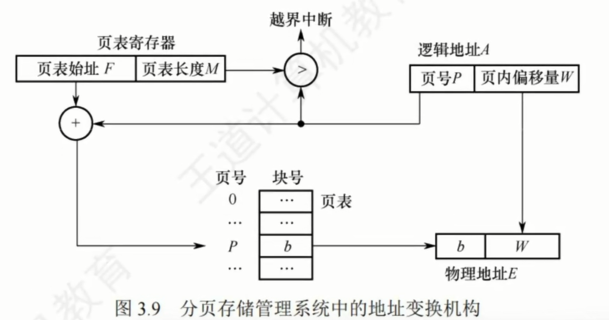

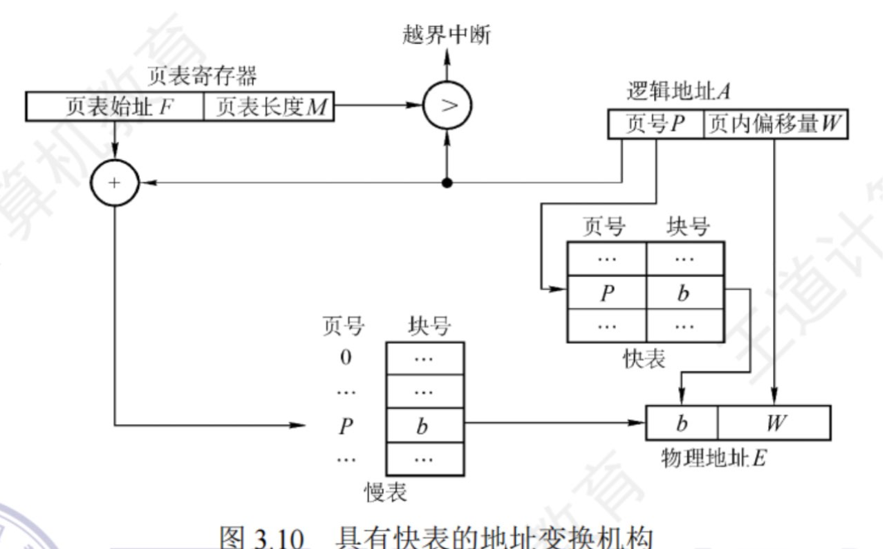

## 虚存

局部性原理：时间局部性，空间局部性

虚存：实存+请求调入+置换

### 虚存实现的三种方式

请求分页存储管理
请求分段存储管理
请求段页式存储管理

### 缺页中断

### 快表

### 地址转换流程


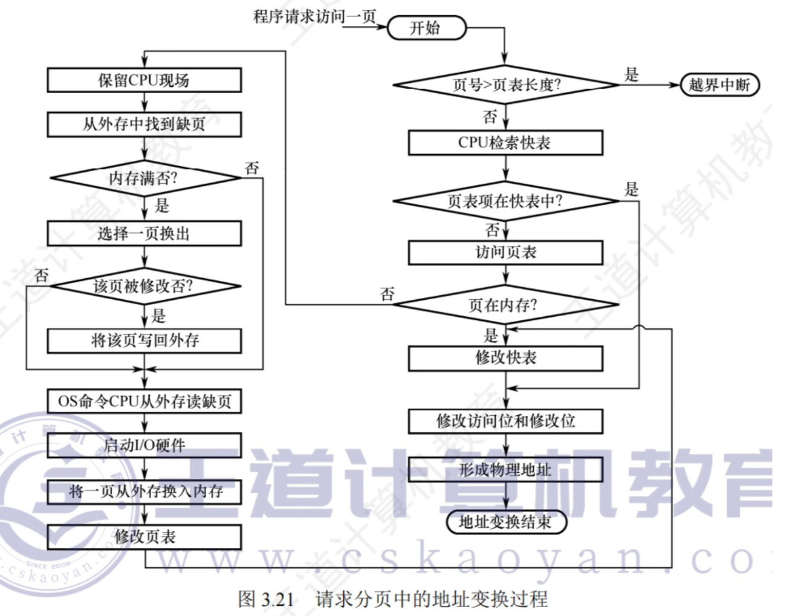

### 页面置换算法

最佳页面置换算法OPT
先进先出页面置换算法FIFO（Belady现象，物理块增多，缺页次数不减反增）

最近最久未使用置换算法LRU

最少使用置换算法LFU

Clock置换算法：简单的Clock置换算法，改进型Clock置换算法

### 页面抖动


### 页面置换策略

固定分配局部置换
可变分配局部置换
可变分配全局置换

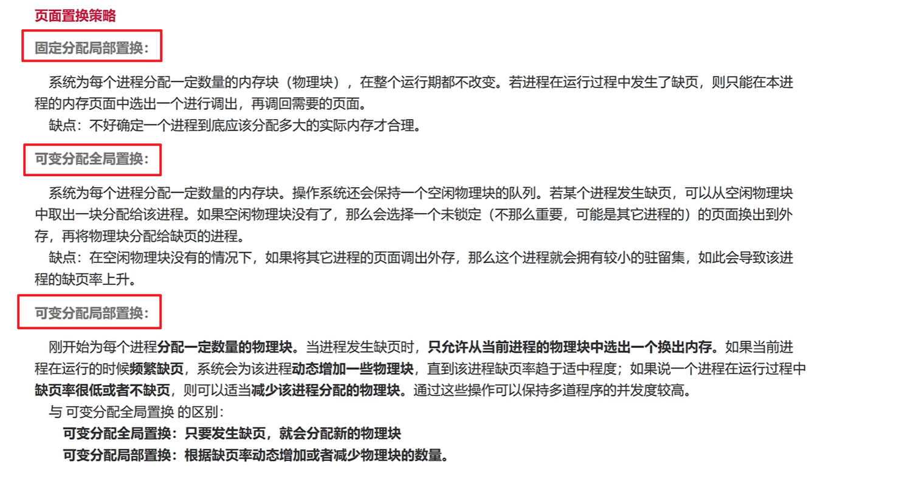

# 文件管理

## 文件系统

概念：文件是以计算机硬盘为载体的储存在计算机上的信息集合

功能：文件管理，目录管理、文件空间管理、文件共享和保护、提供方便的接口


## 文件逻辑结构的分类

+ 无结构文件
+ 有结构文件
  + 顺序文件：隐式寻址（不能随机访问），显式寻址（随机访问）
  + 索引文件（随机房屋内）
  + 索引顺序文件（随机访问）

## 文件目录

**文件目录**：文件控制块的有序集合，一个文件控制块即为一条文件目录项

**文件控制块 FCB**：用于描述和控制文件的数据结构，每个文件都有一个文件控制块

分类：单级目录，二级目录，树形目录，图形目录

**索引结点**：将文件名与文件描述信息分开，其中文件描述信息形成索引结点的数据结构（i结点），这样文件目录只存放文件名和对应索引结点的指针，文件目录不会过大，一个盘块中可存放的文件目录项增多，启动盘块的次数降低，节省开销

## 文件的实现

1、**文件分配方式**：连续分配、链接分配、索引分配（对应的结构分别是顺序结构、链式结构、索引结构）

2、**文件存储空间管理**：空闲表法、空闲链表法、位示图法

混合索引：（其中间接地址采用的是索引表，n次间接即n层索引）

## 文件共享

**硬链接**

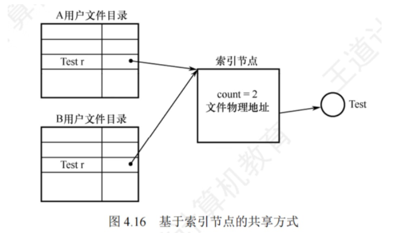

**软链接（符号链接）**

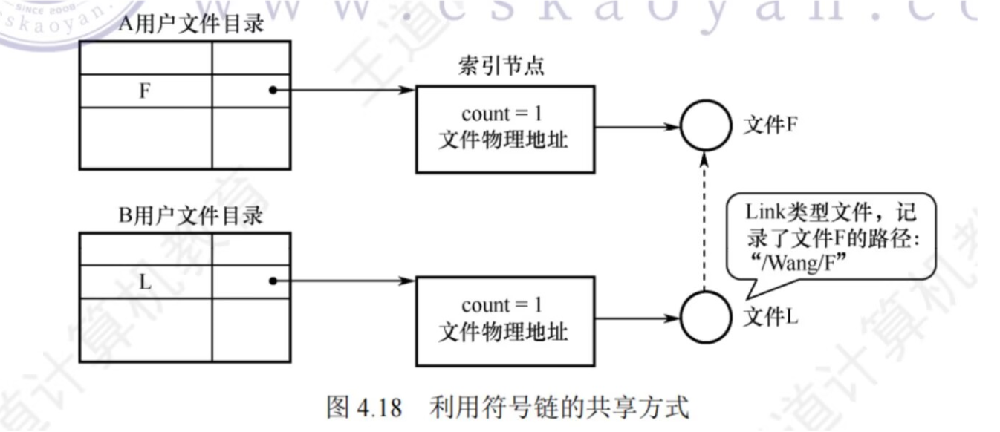

# 磁盘管理（设备管理）

## 磁盘结构

- 盘面（Platter）：一个磁盘有多个盘面；
- 磁道（Track）：盘面上的圆形带状区域，一个盘面可以有多个磁道；
- 扇区（Track Sector）：磁道上的一个弧段，一个磁道可以有多个扇区，它是最小的物理储存单位，目前主要有 512 bytes 与 4 K 两种大小；
- 磁头（Head）：与盘面非常接近，能够将盘面上的磁场转换为电信号（读），或者将电信号转换为盘面的磁场（写）；
- 制动手臂（Actuator arm）：用于在磁道之间移动磁头；
- 主轴（Spindle）：使整个盘面转动。

<div align="center">  </div><br>

## 磁盘调度算法

读写一个磁盘块的时间的影响因素有：

- 旋转时间（主轴转动盘面，使得磁头移动到适当的扇区上）
- 寻道时间（制动手臂移动，使得磁头移动到适当的磁道上）
- 实际的数据传输时间

其中，寻道时间最长，因此磁盘调度的主要目标是使磁盘的平均寻道时间最短。

### 1. 先来先服务

> FCFS, First Come First Served

按照磁盘请求的顺序进行调度。

优点是公平和简单。缺点也很明显，因为未对寻道做任何优化，使平均寻道时间可能较长。

### 2. 最短寻道时间优先

> SSTF, Shortest Seek Time First

优先调度与当前磁头所在磁道距离最近的磁道。

虽然平均寻道时间比较低，但是不够公平。如果新到达的磁道请求总是比一个在等待的磁道请求近，那么在等待的磁道请求会一直等待下去，也就是出现饥饿现象。具体来说，两端的磁道请求更容易出现饥饿现象。

<div align="center">  </div><br>

### 3. 电梯算法

> SCAN 扫描算法

电梯总是保持一个方向运行，直到该方向没有请求为止，然后改变运行方向。

电梯算法（扫描算法）和电梯的运行过程类似，总是按一个方向来进行磁盘调度，直到该方向上没有未完成的磁盘请求，然后改变方向。

因为考虑了移动方向，因此所有的磁盘请求都会被满足，解决了 SSTF 的饥饿问题。

<div align="center">  </div><br>

> CSCAN 循环扫描算法

按一个方向来进行磁盘调度，直到该方向上没有未完成的磁盘请求，然后从头仍然按照该方向处理请求。

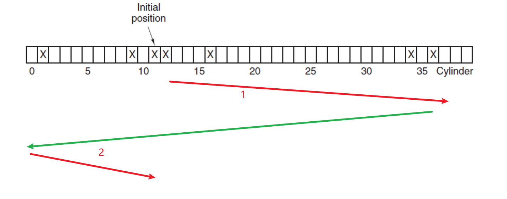


当1按照递增方向处理完请求后，回到最小的处理请求序号按递增方向处理剩余请求。

# 输入输出系统I/O

## I/O通道

三种通道类型

+ 字节多通路通道
+ 数组选择通道
+ 数组多路通道

瓶颈问题：通道数量不足造成的瓶颈现象，传输数据受到限制

## 对I/O设备的控制方式

轮询的可编程I/O方式

中断的可编程I/O方式

直接存储器访问方式（DMA方式）

I/O通道控制方式

## spooling系统

spooling技术：假脱机技术，是对脱机输入/输出的模拟

组成

+ 输入井，输出井
+ 输入进程，输出进程
+ 输入缓冲区，输出缓冲区
+ 井管理程序

## 缓冲区

引入原因：

+ 缓和cpu与I/O设备之间速度不匹配的矛盾

+ 减少对cpu的中断频率，放宽对cpu中断响应时间的限制
+ 解决数据粒度不匹配的问题
+ 提高cpu与I/O设备之间的并行性

分类：单缓冲区，双缓冲区，环形缓冲区。以上主要用于生产消费模式

缓冲池：管理多个缓冲区


