# 参考文献

参考视频

+ [线性回归——机器学习的第一个模型](https://www.bilibili.com/video/BV1xrNGzrEJx)，线性回归
+ [逻辑回归—最常用的分类模型](https://www.bilibili.com/video/BV1gZDVBUEqC)，逻辑回归
+ [梯度下降——模型如何自己学会找最优参数](https://www.bilibili.com/video/BV1cpwuz7EgF)，线性回归
+ [如何理解梯度(方向导数的最大值)](https://www.bilibili.com/video/BV16S421X78A/)，梯度的数学、几何意义理解
+ [数据预处理全攻略](https://www.bilibili.com/video/BV1cGA3zREMA)，线性回归
+ [拟合前提——线性回归模型评估](https://www.bilibili.com/video/BV1nRXVBBEc4)，线性回归
+ [欠拟合与过拟合问题诊断与解决](https://www.bilibili.com/video/BV1Hb9EB9ESo)，线性回归
+ [分类问题：决策树+ID3算法+C4.5算法+考试例题讲解](https://www.bilibili.com/video/BV1PR4y1r7od)，决策树
+ [决策树——会 if...else 就能懂的机器学习算法](https://www.bilibili.com/video/BV1M8D7BWEVQ)，基尼系数，CART算法
+ [【决策树算法3】CART算法 数据挖掘 期末考试 计算题 详细步骤讲解](https://www.bilibili.com/video/BV1cL4y1v76m)，决策树CART，基尼系数，题目讲解
+ [随机森林——决策树模型升级版](https://www.bilibili.com/video/BV1NgQuBFEVY)，集成学习，随机森林
+ [集成学习之Boosting模型——XGBoost、LightGBM、CatBoost](https://www.bilibili.com/video/BV1QdQJBTEGV)，集成学习，Boosting系列
+ [06 Adaboost算法](https://www.bilibili.com/video/BV14Y41177VW)，集成学习，Adaboost算法流程
+ [adaboost实例讲解](https://www.bilibili.com/video/BV1iu4y1t7wF)，集成学习，Adaboost算法题步骤
+ [【数之道】支持向量机SVM是什么，八分钟直觉理解其本质](https://www.bilibili.com/video/BV16T4y1y7qj?spm_id_from=333.1245.0.0)，SVM硬间隔、软间隔、升维、核技巧介绍
+ [【数之道25】机器学习必经之路-SVM支持向量机的数学精华](https://www.bilibili.com/video/BV13r4y1z7AG)，SVM
+ [【数之道26】SVM支持向量机-核技巧Kernel Trick详解(多项式核函数，无限维度高斯核函数）](https://www.bilibili.com/video/BV1Nb4y1s7pE)，SVM
+ [【数之道27】详解SVM支持向量机软间隔数学思想](https://www.bilibili.com/video/BV1AS4y1K7Jf)，SVM
+ [支持向量机SVM超详细手动推导|机器学习期末](https://www.bilibili.com/video/BV18pEmzmE4n?spm_id_from=333.1245.0.0)，SVM，太难了没看懂
+ [【五分钟机器学习】物以类聚的Kmeans](https://www.bilibili.com/video/BV1ei4y1V7hX)，K-Means
+ [K-Means 聚类](https://www.bilibili.com/video/BV17Nd5BrEQS)，K-Means
+ [【5分钟学算法】 #01 k近邻法](https://www.bilibili.com/video/BV1vA4y1o72F?spm_id_from=333.1245.0.0)，KNN
+ [学生视频-KD树](https://www.bilibili.com/video/BV1d5411w7f5)，KNN，kd树
+ [【五分钟机器学习】环境会影响你的决策：K近邻算法（KNN)](https://www.bilibili.com/video/BV13K411H7Zs)，KNN
+ [2.4 特征工程【斯坦福21秋季：实用机器学习中文版】](https://www.bilibili.com/video/BV1t44y1x7Hw?spm_id_from=333.1387.favlist.content.click)，特征工程，李沐老师的课
+ [机器学习期末考试速成（大题）-02朴素贝叶斯](https://www.bilibili.com/video/BV1Li4y1R7NB?spm_id_from=333.1245.0.0)


参考笔记

+ [机器学习-up【谦行】](https://www.yuque.com/qx2io/smtwex/ae9tduy1ixmry3yl#LuTLA)
+ [李沐——特征工程【斯坦福21秋季：实用机器学习中文版】](https://c.d2l.ai/stanford-cs329p/_static/pdfs/cs329p_slides_3_3.pdf)


参考文章

+ [梯度下降 (Gradient Descent)](https://blog.csdn.net/weixin_45091300/article/details/120173250)
+ [深度学习数学基础(二)～随机梯度下降(Stochastic Gradient Descent, SGD)](https://blog.csdn.net/qq_33419476/article/details/114023178)
+ [机器学习——逻辑回归](https://blog.csdn.net/cytlovely/article/details/143944622)
+ [最大似然函数](https://blog.csdn.net/m0_64254014/article/details/146320804)
+ [机器学习——K-近邻算法（KNN）](https://blog.csdn.net/cytlovely/article/details/144142722)
+ [深度学习——独热编码(One-Hot Encoding)](https://blog.csdn.net/yang2330648064/article/details/148025348)
+ [第十二章 贝叶斯](https://blog.csdn.net/zz_wen/article/details/141640344)

# 一、线性回归

## 什么是线性回归？

**线性回归（Linear Regression）**是机器学习中最经典的模型之一，它通过构建**线性方程**来**拟合数据的内在分布规律**，从而==实现对连续数值的预测==。

（1）线性

不只是直线，其实在数学上，线性描述的是**输入与输出之间按比例变化、可叠加的关系**。一个映射 $f$ 如果满足以下两个性质：

+ 齐次性：$f(ax) = af(x)$
+ 可加性：$f(x+y) = f(x)+f(y)$

就被称为线性映射。几何解释二维空间中，线性关系表现为一条直线，在高维空间中，表现为平面或超平面。

（2）回归

“回归”（Regression）一词源于统计学家弗朗西斯·高尔顿（Francis Galton）的经典研究。他观察到，身高极高或极矮的父母，其子女的身高往往会**向群体平均值靠拢**（而不是继续走向极端），这一现象被称为**回归均值**。

而在机器学习领域，回归的概念被进一步引申：旨在**通过数据建模变量间的映射关系，进而实现对连续数值的预测**。

（3）在线性回归中，找到一条最合适的直线/平面，去拟合数据，实现以下内容：

+ 数据点是散的
+ 我们用一条线去逼近它们
+ 这个过程就叫回归

## 线性回归模型公式

最简单的线性回归模型只有一个特征，预测公式：$\hat y = wx+b$，已房价预测为例，各个符号含义如下

| **符号** | **含义**                                           |
| -------- | -------------------------------------------------- |
| $\hat y$ | 模型的预测值（如预测房价）                         |
| $x$      | 输入特征（如面积）                                 |
| $w$      | 权重（weight，斜率）——面积每增加 1㎡，房价变化多少 |
| $b$      | 偏置（bias，截距）——当面积为 0 时的理论基准值      |

这里的 w 和 b 就是模型需要学习的参数，所谓训练模型本质上就是**搜索一组最合适的 w 和 b**。

## 损失函数：均方误差MSE

为了判断**当前这组参数到底好不好**，我们需要一种方法来度量预测值与真实值之间的偏差——这就是**损失函数（Loss Function）**。在线性回归中，最常用的损失函数是**均方误差（Mean Squared Error, MSE）**，思路非常直白：

1. 对每个样本，计算**预测值 − 真实值**（即误差）；
2. 将误差取平方（消除正负号、放大较大误差）；
3. 对所有样本求平均。

$$
MSE = \frac{1}{n} \Sigma(\hat y - y)^2
$$

**预测值离真实值越远，损失越大。** 模型训练的目标，就是让损失函数的值尽可能小。


==使用 MSE 有两个好处==

+ 消除正负号的影响，让误差绝对值化，防止**求和之后正负误差互相抵消**。因为$误差=\hat y - y$，所以误差有正有负，如果有误差为-0.4，0.4，结果误差为0了，损失函数达到误差最小了，这是不合理的。
+ 放大误差便于模型优化，例如误差为 3 和 0.4，平方后变为 9 和 0.16，差异更明显。

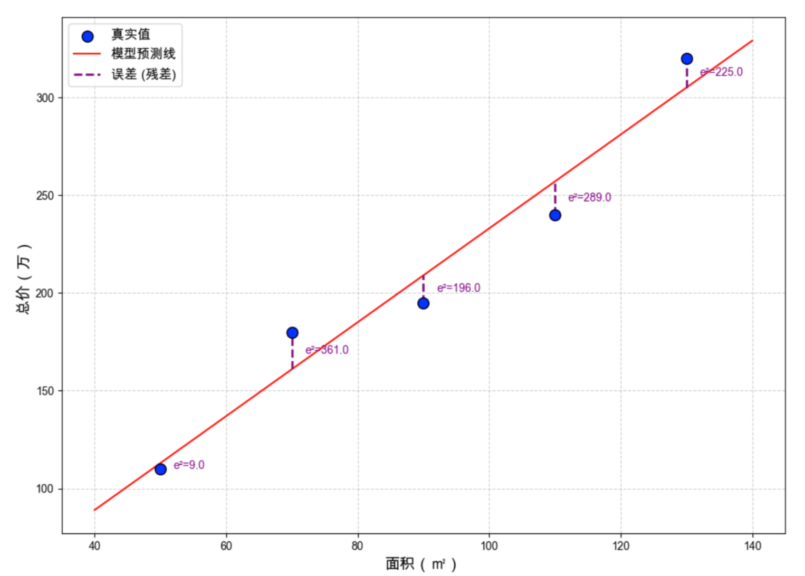

## 梯度下降 Gradient Descent

**如何自动调整w和b，改大一点还是改小一点才能让模型变准？**

解决这一问题的最通用算法是**梯度下降（Gradient Descent）**。它是一种迭代优化算法，核心思想是：沿着损失函数下降最快的方向，逐步调整参数，直至找到最优解。

梯度（偏导数）告诉我们如果把这个参数调大一点，损失会增大还是减小、增减有多快。既然目标是让损失变小，那就朝着让损失减小的方向调整参数，每次只调一小步，反复迭代，损失就会一点一点降下去。

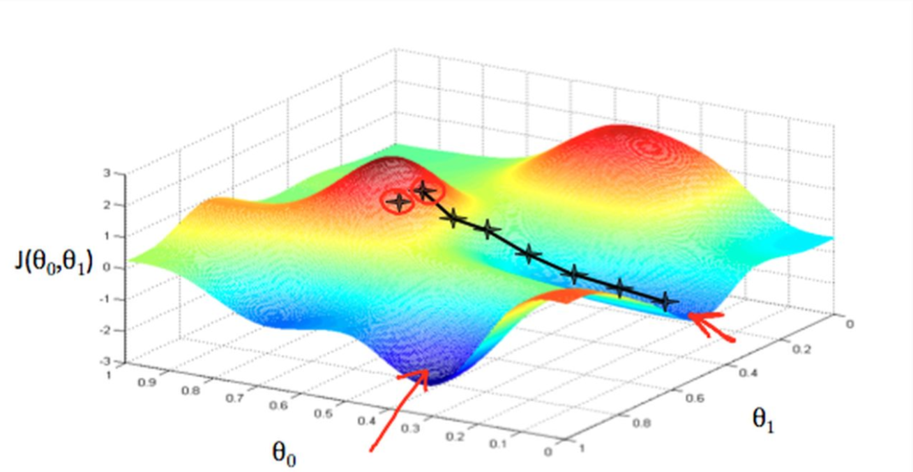


于是，训练过程可以总结为一个不断循环的流程：**输入数据 → 计算预测 → 计算损失 → 计算梯度 → 更新参数。**

每完成一轮循环参数就更接近一点，经过多轮迭代模型逐渐收敛到最优解，这整个过程就是**模型训练**。


如果损失函数时凸函数，那么是有全局最小值，经过一定的调整与训练，梯度下降一定会达到最优解；

如果不是凸函数，那么存在局部最优解，训练时可能达到局部最优解而不是全局最优解

## 多特征线性回归（向量化）

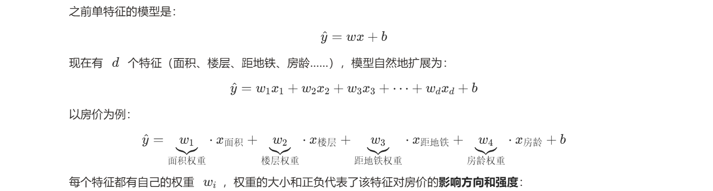


==向量化==

当特征很多时，把公式全部展开写会非常冗长。借助**向量**的记号，可以将其写得更简洁：
$$
\hat y = w^Tx+b
$$
其中：
$$
x=\left[\begin{matrix} x_1 \\ x_2 \\ ... \\ x_d \end{matrix} \right]，
w=\left[\begin{matrix} w_1 \\ w_2 \\ ... \\ w_d \end{matrix} \right]
$$
$w^Tx$ 就是向量的**点积**（内积），展开后恰好等于$w_1x_1+w_2x_2+...+w_dx_d$。

你会发现，不管是 1 个特征还是 100 个特征，模型的本质结构完全一样——都是特征的加权求和再加偏置，损失函数依然用 MSE，优化方法依然用梯度下降，只不过需要同时更新更多的参数。

## 多项式回归 Polynomial Regression

### 定义

现实中的数据并不总是沿着一条直线分布，比如当房价随面积的增长先慢后快时，直线就无法很好地拟合了。这时可以引入多项式回归，将模型扩展为：
$$
\hat y = w_1x + w_2x^2 + + ... + w_dx^d + b
$$
其中 d 是多项式的阶数。当 d=1 时，就是普通的线性回归；当 d=2 时，拟合出的是一条抛物线；阶数越高，曲线就越灵活。

> 注意：阶数并非越高越好。过高的阶数会让模型"死记"训练数据中的噪声，导致在新数据上表现很差——这就是所谓的过拟合（Overfitting）。

### 为什么出现非线性项，模型依然是线性的？

尽管此时特征量已经是高阶，即**出现了$x^2、x^3$等非线性项**，函数仍然是线性方程，==因为实际上 $\hat y$ 是关于参数 $w、b$ 的函数，即 $\hat y$ 是$w_1,w_2,...,w_d,b$的线性组合==，特征量$x$是参数$w、b$的系数，因此多项式回归本质上仍属于广义线性模型的范畴，可以用与线性回归相同的方法来求解。

## 由线性回归拓展

### 逻辑回归

如果我们要解决的不是预测房价而是判断邮件是否是垃圾邮件这样的分类问题，就不能直接输出一个连续数值，而需要输出一个概率。

做法很简单：在线性回归的输出后面，加上一个 Sigmoid 激活函数，把输出值压缩到 (0,1) 区间表示概率：


这就是**逻辑回归（Logistic Regression）**，虽然名字里还带着回归，但它**解决的其实是分类问题**。通过估计概率来判断某个事件发生的可能性，通常适用于二分类问题。

> 输入 $x$ → 输出属于某一类的概率 $P(y=1 | x)$

逻辑回归里的“回归”，本质上指的是“对函数/概率的建模”，而不是“预测连续值”

**逻辑回归 = 线性回归 + 激活函数**

### 深度学习

逻辑回归只有一层变换，表达能力有限。如果把许多个类似的"线性变换 + 激活函数"逐层堆叠起来，就构成了神经网络：

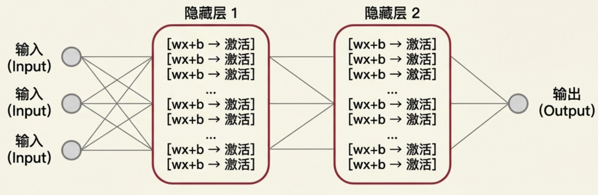

每一层都能提取更高层次、更抽象的特征，这就是深度学习（Deep Learning）的核心思想——**让模型自己学习数据中从低级到高级的特征表示**。

**可以说深度学习并不是凭空出现的新事物，而是线性回归思想的逐步演化与层层叠加。**

# 二、线性回归其他细节

## 1、梯度下降


一个最简单的线性回归模型可以写成：
$$
\hat y = wx+b
$$
其中w是权重（weight，斜率）， b是偏置（bias，截距），训练模型的本质就是找一组最合适的w和b。

整个模型训练过程是一个不断自我修正的闭环：

**输入数据 → 计算预测 → 计算损失 → 计算梯度 → 更新参数 → 再次输入数据 → ...**

在这个闭环中，损失函数可以说是裁判，用来度量模型预测值 $y$ 与真实值 $y$ 之间的偏差，以线性回归最常用的均方误差（MSE)为例：
$$
MSE = \frac{1}{n} \Sigma(\hat y - y)^2
$$
损失函数的值越大，说明模型预测得越不准；值越小说明模型越好。因此，**训练的目标就是：让损失函数的值尽可能小。**

损失函数能告诉我们当前参数有多不准，可如何决定是把参数调大一点，还是调小一点呢？

**梯度下降（Gradient Descent）**是一种自动调参的算法，恰好可以解决以上问题。

### 数学原理

（1）导数 / 斜率

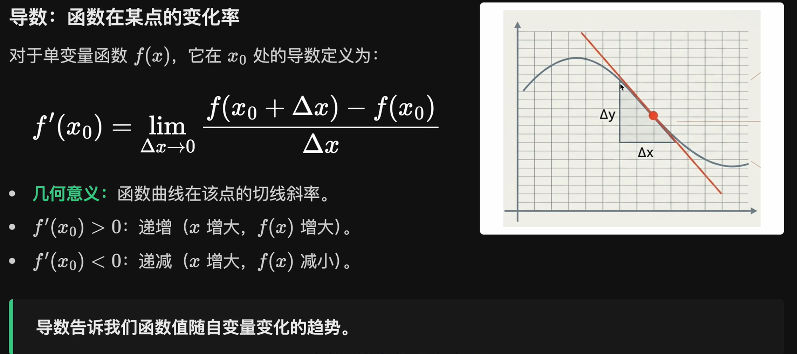

（2）偏导数

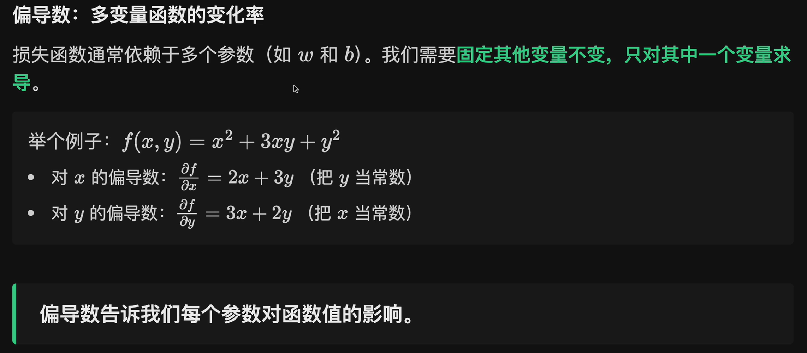

### 公式

**梯度：函数增长最快的方向，是一个向量**

+ 斜率是函数变化最快的方向
+ 梯度是一个向量，增长最快方向指的是整个梯度向量的方向，而不是每一个分量单独看。

把所有变量的偏导数组合成一个向量，我们就得到了**梯度（Gradient）**。
$$
\nabla L(w,b) = (\frac{\partial L}{\partial w},\frac{\partial L}{\partial b})
$$
如果有更多参数$\theta_1, \theta_2,...,\theta_d$，梯度就是：
$$
\nabla L(\theta) = (\frac{\partial L}{\partial \theta_1},\frac{\partial L}{\partial \theta_2},...,\frac{\partial L}{\partial \theta_d})
$$
梯度下降的参数更新公式为：
$$
\theta_{new} = \theta_{old} - \eta·\nabla L(\theta_{old})
$$
让我们逐项拆解这个公式：

| **符号**                 | **含义**                            | **类比**           |
| ------------------------ | ----------------------------------- | ------------------ |
| $\theta_{old}$           | 当前的参数值                        | 你现在站的位置     |
| $\nabla L(\theta_{old})$ | 在当前参数处的梯度                  | 脚下最陡的上坡方向 |
| $ \eta$                  | 学习率（Learning Rate），**超参数** | 每一步迈多大       |
| $- \eta·\nabla L$        | 沿梯度反方向移动一步                | 朝下坡方向迈一步   |
| $\theta_{new}$           | 更新后的参数值                      | 你走到的新位置     |

**为什么要减去梯度？** 因为梯度指向函数增大的方向，而我们要最小化损失函数，所以需要往**反方向**走。

**为什么要乘以学习率****？**梯度只告诉我们方向和陡峭程度，学习率控制我们每一步走多远。太大会步子迈太大而跳过谷底，太小则龟速前进浪费时间。

对于线性回归的具体场景，参数更新公式展开为：
$$
w_{new} = w_{old} - \eta ·\frac{\partial L}{\partial w} \\
b_{new} = b_{old} - \eta ·\frac{\partial L}{\partial b}
$$

### 学习率（超参数）实验

在 $y = x^2$ 中，梯度（导数）是 $2x$，更新公式是：$x_{new} = x-lr×2x = x(1-2·lr)$，其中 lr 是学习率，**learning rate**。

1. `lr = 0.05`**（太小）：**
   X 在右侧山坡上慢慢往下挪，10 次迭代根本走不到谷底（）。这就是为什么学习率太小会导致**收敛极慢**。
2. `lr = 0.3`**（适中）：**
   X 顺滑地几步就滑到了谷底  的位置，没有多余的动作。
3. `lr = 0.9`**（偏大）：**
   X 一步跨过了谷底到了左边，下一步又跨到了右边，但每次跨越的幅度越来越小，最终**呈“Z”字形震荡收敛**到底部。
4. `lr = 1.1`**（爆炸）：**
   X 不仅在两边疯狂横跳，而且**越跳越高，直接飞出画幅**，数字呈指数级增大，这就是典型的**梯度爆炸**。

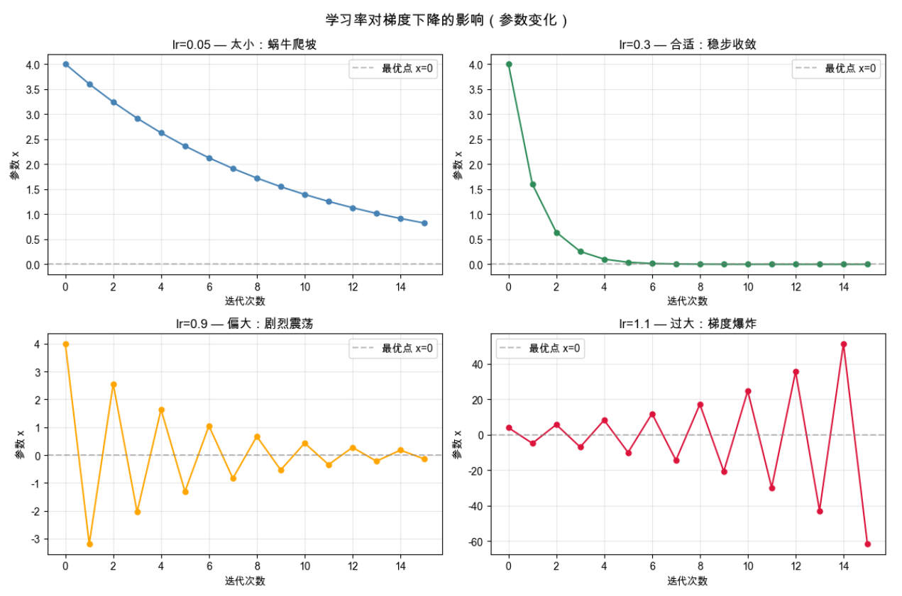

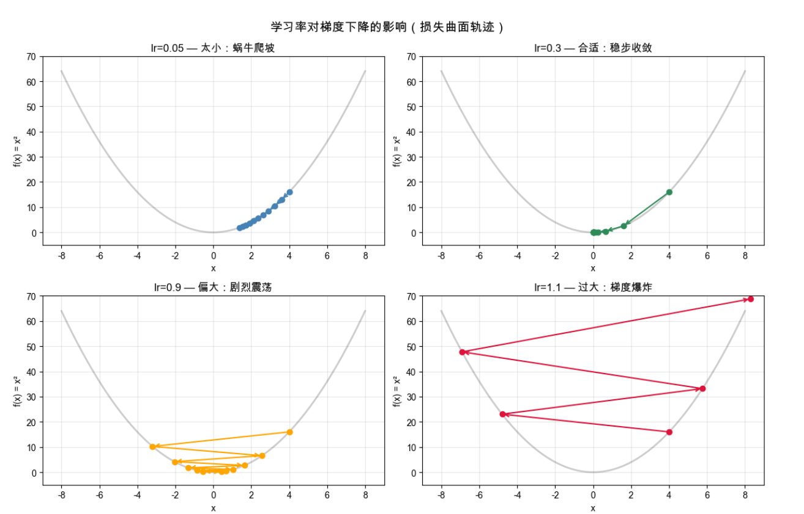

### 梯度下降的优化算法

标准梯度下降法虽然原理直观，但在实际应用中存在显著局限性：**收敛速度较慢、易陷入局部最优、对学习率等超参数敏感**。在工程实践中，我们通常无需手动实现基础算法，而是直接采用业界成熟的梯度下降优化器。

1. **动量法（Momentum）**

基础梯度下降只看当前这一步的坡度，容易在狭长山谷中来回震荡，走出锯齿形路线。

动量法借鉴了物理学中惯性的概念——**每次更新参数时，将历史更新方向累积为一个"速度"，连续同向则加速，来回变化则相互抵消**。就像小球从山坡滚下，凭借惯性能冲过小坑洼而不是卡在里面。

这样做显著减少了震荡、加速了收敛，还有助于跳出局部最优。不过惯性也是双刃剑，动量过大时可能冲过最优点。

它特别适合损失曲面存在大量狭长山谷的场景，也常用于对泛化性能要求较高的计算机视觉任务——许多经典图像模型至今仍使用 SGD + Momentum 来训练。

2. **AdaGrad（自适应梯度）**

动量法解决了方向上的问题，但所有参数仍然共用同一个学习率。现实中有些参数频繁更新，有些参数很少被触及，一刀切显然不合理。

AdaGrad 的做法是**为每个参数自动维护独立的学习率**：它累积每个参数的历史梯度平方和，梯度大的参数自动减小步幅，梯度小的参数则保持较大学习率，让稀疏特征也有充分的学习机会。问题在于，历史梯度只增不减，到了训练后期所有参数的学习率都趋近于零，训练可能提前停滞。

它最擅长处理稀疏数据场景，比如自然语言处理中的词向量训练、推荐系统中的大规模稀疏特征学习，这类场景中不同特征的出现频率差异悬殊，AdaGrad 的自适应特性恰好能发挥优势。

3. **RMSProp（均方根传播）**

RMSProp 正是针对 AdaGrad 学习率单调衰减这一问题的改进。**它用指数加权移动平均替代了简单累加，让学习率具备了遗忘能力——只关注近期的梯度变化，不再被遥远的历史拖累**。

这样既保留了自适应学习率的优势，又避免了后期停滞。但它只解决了步幅问题，缺少动量机制，在方向上没有加速能力。

它特别适合非平稳目标函数的优化，比如循环神经网络（RNN）的训练，这类任务中梯度的统计特性会随时间不断变化，RMSProp 的遗忘机制能够很好地适应这种动态性。

4. **Adam（自适应矩估计）**

Adam 把动量的方向加速和 RMSProp 的自适应步幅结合，它同时维护两套信息——**一套跟踪梯度的方向趋势（动量），一套跟踪梯度的大小变化（自适应学习率）**，两者结合使它既跑得快又跑得稳。它的默认超参数在绝大多数场景下直接可用，收敛快且对学习率选择不敏感。

Adam 几乎适用于所有深度学习任务，从 Transformer 语言模型到生成对抗网络，从强化学习到多模态模型，尤其在模型结构复杂、调参预算有限的情况下，它是最稳妥的选择。

> Adam 是目前深度学习中最广泛使用的优化器，也是大多数项目的默认首选。不确定用哪个，选 Adam 通常不会错。

### 梯度下降的变体：全量、随机与小批量

除了前面讨论的如何更智能地更新参数，还有另一个维度的选择值得关注：**每次更新参数时，究竟该用多少数据来计算梯度？** 围绕这个问题，梯度下降衍生出了三种经典变体。

1. **批量梯度下降（Batch Gradient Descent, BGD）**

批量梯度下降每次**用全部训练数据计算梯度**，然后更新一次参数，这也正是我们前面实战中所采用的方法。

优点：由于使用了完整数据集，它计算出的梯度最为准确，更新方向也最稳定，对于凸函数而言一定能收敛到最优解。

缺点：当数据量很大时（想象有100万条数据），每走一步都需要遍历整个数据集，计算开销巨大；同时它也无法进行在线学习，必须拿到所有数据后才能开始训练。

2. **随机梯度下降（Stochastic Gradient Descent, SGD）**

随机梯度下降每次**只用一条随机抽取的训练数据计算梯度**，然后立刻更新参数。

优点：这使得每一步的计算极其轻量，同时天然引入的随机性有助于模型跳出局部最优，还支持在线学习。

缺点：但仅凭单条数据估计出的梯度噪声很大，更新方向不够稳定，导致收敛过程呈现剧烈震荡，整体效率反而可能受损。

3. **小批量梯度下降（Mini-batch Gradient Descent）**

小批量梯度下降则是对前两者的折中。它每次随机抽取一个小批量（mini-batch） 的数据——通常为 32、64、128 或 256 条——来计算梯度并更新参数。

这样既保留了批量梯度下降中梯度估计相对准确、方向相对稳定的优势，又兼顾了随机梯度下降计算高效、具备一定随机性的长处。

| **维度**        | **BGD（全量）** | **Mini-batch** | **SGD（单样本）** |
| --------------- | --------------- | -------------- | ----------------- |
| 每步计算量      | 大              | 适中           | 小                |
| 梯度准确度      | 精确            | 近似           | 噪声大            |
| 收敛稳定性      | 很稳定          | 较稳定         | 震荡剧烈          |
| 能否利用GPU并行 | ✅               | ✅（最佳）      | ❌                 |
| 实际使用        | 小数据集        | **主流选择**   | 很少单独使用      |

现代 GPU 擅长并行计算，一次处理一个批量的数据几乎与处理单条数据一样快。Mini-batch 既能充分利用 GPU的并行能力，又能保持梯度估计的合理精度，因此 **Mini-batch 已经成为业界的主流选择。**  

在深度学习中当我们说 SGD 时，通常指的是 **Mini-batch SGD**，而非每次只用一个样本的纯随机梯度下降。

### 梯度下降是深度学习的基础

梯度下降不一直是在机器学习中应用，从最经典的神经网络到 GPT 这样的前沿模型，无一例外都依靠梯度下降来训练和优化。可以说理解了梯度下降，就打通了理解一切深度学习模型的底层逻辑。

**（1）反向传播**

深度神经网络可能有数百万甚至数十亿个参数。训练这样的网络，核心依赖两步：

+ **前向传播（Forward Propagation）**：输入数据从输入层逐层经过隐藏层，最终得到输出和损失值。
+ **反向传播（Back Propagation）**：从损失函数出发，利用**链式法则**逐层计算每个参数的梯度，然后用**梯度下降**更新所有参数。

反向传播解决的是如何高效计算梯度的问题，而梯度下降解决的是拿到梯度后如何更新参数的问题。两者缺一不可，共同构成了深度学习训练的引擎。

> 深度学习训练 = 反向传播（计算梯度） + 梯度下降（更新参数）

**（2）从线性回归到大语言模型**

GPT 的训练过程，本质上与我们今天手动实现的线性回归梯度下降完全一致——只不过模型更复杂（Transformer 架构），参数更多（数千亿），数据更大（整个互联网），损失函数不同（交叉熵），优化器更先进（AdamW）。但**核心思想——沿着梯度方向更新参数，让损失越来越小从未改变。**

**理解了梯度下降，就掌握了深度学习模型训练的核心。**后续无论是学习卷积神经网络（CNN）、循环神经网络（RNN），还是 Transformer，你都会发现，训练它们的核心算法，始终是我们今天学习的——梯度下降。

## 2、数据预处理

真实世界中，数据往往充满各种问题：

+ 存在缺失值和异常值
+ 包含文本、类别等非数值类型
+ 量纲差异巨大（房价是百万级，房间数是个位数）

在算法界，有一句至理名言：

> "Garbage In, Garbage Out."（垃圾进，垃圾出）

因此，训练模型之前必须先进行数据预处理（Data Preprocessing）。本节课我们将学习如何把"脏数据"转化为模型可直接使用的高质量数据，并掌握常用的数据预处理工具：Pandas、Matplotlib、Seaborn 与 scikit-learn。

### 数据集划分

拿到数据后，应该**先划分数据集，再做预处理**。机器学习中，通常将数据集划分为三个部分：

| **数据集** | **占比** | **用途**                                 |
| ---------- | -------- | ---------------------------------------- |
| 训练集     | 60%–80%  | 训练模型，学习数据中的规律               |
| 验证集     | 10%–20%  | 调整超参数，评估模型在未见过数据上的表现 |
| 测试集     | 10%–20%  | 模拟真实世界数据，最终评估模型泛化能力   |

==如果先对全量数据做填充、缩放，再划分数据集，测试集的统计信息（如均值、最大值）就会泄露到训练过程中==，这就是**数据泄露**（Data Leakage）。好比学生在考试前偷看了答案，成绩虚高，实际能力却没提升。

> **fit**：拟合，学习数据的规律，即计算均值、标准差等参数。fit不改变数据。
>  **transform**：使用已经学习到的规律转换数据
>
> 原则：所有 fit 操作只在训练集上进行，测试集只做 transform。

`sklearn`提供了方便的数据划分工具，为了简单我们可以只划分训练集和测试集。所有探索和规则制定（EDA、计算均值等）都必须只在 训练集`X_train` 上进行！

### 数据探索分析（EDA）

当我们拿到一份陌生数据时，并不清楚哪些列有问题、需要什么处理。**EDA（Exploratory Data Analysis，探索性数据分析）** 就像是给数据做一次全面体检——**通过统计指标和可视化图表，直观地发现数据中的问题和规律**，为后续预处理提供依据。

（1）基本信息

查看数据集的数据类型和缺失情况。（博主用的 Titanic 泰坦尼克号生存预测数据集）

```
X_train.info()
```

```
Column       Non-Null Count  Dtype  
─────────    ──────────────  ─────  
PassengerId  712 non-null    int64  
Pclass       712 non-null    int64  
Name         712 non-null    object   ← 文本
Sex          712 non-null    object   ← 文本
Age          569 non-null    float64  ← 有缺失！
SibSp        712 non-null    int64  
Parch        712 non-null    int64  
Ticket       712 non-null    object   ← 文本
Fare         712 non-null    float64
Cabin        161 non-null    object   ← 大量缺失！
Embarked     710 non-null    object   ← 少量缺失
```

（2）数值特征统计

```
X_train.describe()
```

```
       PassengerId  Pclass     Age   SibSp   Parch     Fare
count       712.0   712.0   569.0   712.0   712.0    712.0
mean        448.7     2.3    29.5     0.5     0.4     33.3
std         258.6     0.8    14.6     1.1     0.8     52.4
min           1.0     1.0     0.4     0.0     0.0      0.0
25%         222.5     2.0    20.0     0.0     0.0      8.0
50%         445.0     3.0    28.0     0.0     0.0     15.7
75%         668.5     3.0    38.0     1.0     0.0     33.4
max         891.0     3.0    80.0     8.0     6.0    512.3
```

> 量纲 = 特征的单位和数值尺度。量纲描述一个数据**用什么单位衡量**，以及**数值大小处于什么级别**。

机器学习中更关注的是不同特征之间的尺度差异。Fare 0~512，而 Pclass 1~3，数值范围差距很大，可能导致模型偏向 Fare，因此需要标准化或归一化。

（3）数据可视化

可以使用 Matplotlib 和 seaborn 对数据进行可视化（柱状图、热力图），看出更多端倪。

（4）EDA关键发现

通过以上可视化，我们得出n条关键发现，它们将直接指导后续的预处理策略。

+ 找到强特征，比如性别（女性存活率更高，绅士风度）、舱位等级（一等舱存活率更高）
+ 缺失值
+ 异常值，包括左偏、右偏，即偏态处理

> 强特征：与预测目标高度相关，对模型预测结果贡献较大的特征。
>
> 右偏（正偏，Positive Skew），表现为均值 > 中位数
>
> + 大部分数据集中在较小值区域
> + 少量特别大的值形成长尾
> + 尾巴向右延伸
>
> 左偏（负偏，Negative Skew），表现为均值 < 中位数
>
> + 大部分数据集中在较大值
> + 少量特别小的数据形成长尾

### 数据清洗

**（1）处理重复值**

对于数据中重复的行删除即可


**（2）处理缺失值**

当数据集中出现缺失值时，处理策略需根据缺失比例及特征类型灵活选择：

**按缺失比例决定删除策略：**

+ 缺失极低（< 5%） 且为随机缺失 → 直接删除对应样本行（有时候一行数据特征量很多，为了一个缺失值删除一行数据不合适，需要找到合适的方法填充缺失值，比如使用均值、中位数）
+ 缺失极高（> 70%） → 该特征信息量匮乏，通常直接删除整列

**按特征类型选择填充方法：**

+ **数值型特征**：用均值或中位数填充。均值适用于正态分布且无异常值的场景；中位数对极端值不敏感，在数据偏态或存在异常值时更加稳健
+ **类别型特征**：用众数填充，或新增 `"Unknown"` 类别。众数填充适合低缺失率场景；将缺失独立标记为 `"Unknown"` 则能保留"缺失本身可能蕴含的业务信息

sklearn 提供了 SimpleImputer 工具类处理缺失值，它可以扫描数据列，发现空缺后，根据设定的 strategy，自动计算一个值填进去

1. 初始化时设置 `strategy`
2. 在训练集上调用 `.fit()`算出均值/中位数/众数，保存在对象内部
3. 在测试集/新数据上调用 `.transform()`：将保存的数据进行填充

> 将训练集计算出的数据填充到测试集上，并不是数据泄露；
>
> 将所有数据放在一起计算出数据填充到训练集上，才是**数据泄露**，因为**测试集的数据进入了训练集**，相当于**考试提前偷考卷**。


**（3）处理异常值**

**异常值（Outliers）**是指数据中显著偏离其他观测值的极端值，它们可能是由于测量误差、数据录入错误或真实的极端情况产生的。可以使用**箱线图**检测异常值。

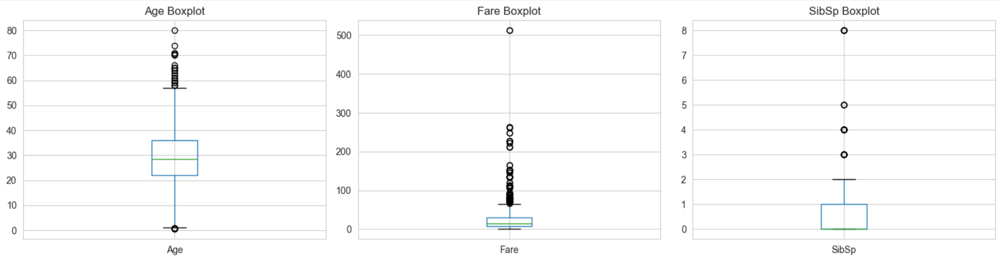

**Age (年龄)**:

+ 大部分乘客集中在 20-40 岁之间（箱体部分）。
+ 但在 60-80 岁之间有很多离群点。这说明船上有不少高龄乘客，虽然人数少，但他们是真实存在的，不是数据错误。

**Fare (票价)**:

+ **极度右偏**。绝大多数人的票价非常低（箱体被压扁在底部，接近 0-50 美元）。
+ 但是有极少数人的票价高得离谱，超过 500 美元！这些可能是一等舱乘客。
+ **对模型的影响**：这种巨大的差异会让模型难以训练，如果不处理（比如取对数 `log` 或分箱），模型可能会过度关注这几个高价票的人，而忽略了普通大众。

**SibSp (兄弟姐妹/配偶数)**:

+ 大部分人都是 0 或 1，独自旅行或夫妻同行。
+ 但也有一些大家庭，带着 3、4、5 甚至 8 个亲属，这也是真实的异常值。


使用==统计学方法（IQR，四分位距）==识别并处理票价（Fare）中的极端异常值，防止它们干扰机器学习模型的训练。不必直接删除这些异常数据，采用==截断==的策略，将过高的票价强行拉回到合理范围内即可。

1. 使用 IQR 方法计算 Fare 的异常值范围

   + 第一四分位数 `Q1`：25%位置的数据
   + 第三四分位数 `Q3`：75%位置的数据
   + 四分位距：`IQR = Q3 − Q1`

   + 根据规则：`[Q1-1.5×IQR, Q3+1.5×IQR]`，确定 Fare 的合理范围。

2. 检测异常值：以四分位距范围为标准，找出 Fare 小于下界或大于上界的数据。

3. 处理异常值：对 Fare 不直接删除异常样本，而采用**截断（Clipping/Winsorization）**

   + 小于下界的值替换为下界

   + 大于上界的值替换为上界

### 特征编码

由于大多数机器学习算法仅支持数值型输入，因此必须**将数据集中文本数据通过编码技术映射为数值形式**，以便模型能够进行数学运算。针对不同场景有三种常见的特征编码方法：序数编码（Ordinal Encoding）、独热编码（One-Hot Encoding）和标签编码（Label Encoding）。

这三种编码方式的核心区别在于**是否保留了类别的顺序信息**以及**是否引入了虚假的数值大小关系**。选择哪种方式，取决于你的数据特征类型和你使用的模型算法。

**（1）序数编码 Ordinal Encoding**

序数编码将类别映射为整数，且严格保留类别之间的顺序关系，比如`低 -> 0, 中 -> 1, 高 -> 2`。**适用于特征本身具有明确的等级或顺序，希望模型能够理解`高 > 中 > 低`这种数学关系**，比如

+ 教育程度：小学(1) < 初中(2) < 高中(3) < 本科(4) < 硕士(5) < 博士(6)
+ 满意度评分：非常不满意(0) < 不满意(1) < 一般(2) < 满意(3) < 非常满意(4)
+ 衣服尺码：XS(1) < S(2) < M(3) < L(4) < XL(5)
+ 舱位：经济舱(1) < 商务舱(2) < 头等舱(3)

我们对 Titannic 的 Fare 数据做下处理，1等舱 < 2等舱 < 3等舱。sklearn 的 `OrdinalEncoder` 工具类默认按字母顺序或出现顺序，这里我们手动指定 categories 以保证逻辑正确

```python
from sklearn.preprocessing import OrdinalEncoder

df_ordinal = df.copy()
df_ordinal['fare_category'] = pd.cut(df['Fare'], bins=3, labels=['Low', 'Mid', 'High'])

oe = OrdinalEncoder(categories=[['Low', 'Mid', 'High']]) # 显式指定顺序
df_ordinal['fare_cat_encoded'] = oe.fit_transform(df_ordinal[['fare_category']])

print(f"顺序定义: Low < Mid < High -> 0, 1, 2")
print(df_ordinal[['fare_category', 'fare_cat_encoded']].head())
```


**（2）独热编码 One-Hot Encoding**

线性模型（如线性回归、逻辑回归、SVM、神经网络）是通过计算数值的大小和距离来学习规律的。**如果对无序分类特征（如颜色）直接使用序数编码**，比如把颜色标记为：红=1, 绿=2, 蓝=3，**模型会认为蓝色比红色大 3 倍，或者绿色介于红蓝之间**。对于颜色这种没有大小之分的概念，**这种假设是完全错误的，会导致模型训练偏差**。

独热编码的核心思想是：把每个类别取值都变成一个独立的列。它不再用一个大小的数字，而是用一组 0 和 1 来表示。假设我们有一个颜色特征，包含红、绿、蓝三种取值，转换效果如下：

| **样本** | **颜色 (原始文本)** | **错误的序数编码** |
| -------- | ------------------- | ------------------ |
| A        | 🔴 红                | 1                  |
| B        | 🟢 绿                | 2                  |
| C        | 🔵 蓝                | 3                  |

独热编码转换为

| **样本** | **是红色** | **是绿色** | **是蓝色** |
| -------- | ---------- | ---------- | ---------- |
| A        | 1          | 0          | 0          |
| B        | 0          | 1          | 0          |
| C        | 0          | 0          | 1          |

这样，每种颜色都是平等的，没有任何大小顺序之分。

独热编码虽然好，但有个缺点：有 N 种颜色，就要增加 N-1 列。如果只有 3 种颜色，增加 2 列没问题。如果有 1000 种城市名称，就会增加 999 列！**这会让数据变得非常稀疏，计算变慢甚至导致内存溢出。**仅当类别数量较少时使用独热编码，类别很多可以考虑 **Embedding**。


**（3）标签编码（Label Encoding）**

标签编码将类别简单映射为整数（0, 1, 2...），**不保证顺序，但引入了数值大小**。适用场景仅限于三类情况：

+ 二分类特征（如性别，0/1等价于独热且更省空间）
+ 分类任务的目标变量/标签列，大多数分类算法要求目标变量必须是整数标签
+ 树模型，如XGBoost、随机森林等，因其不依赖数值距离，可处理高维无序类别

严禁将其用于**线性模型**和**多分类无序特征**，此类情况必须改用独热编码和序数编码。


### 特征构造与删除

原始数据直接丢给模型效果通常并不理想，很多时候我们需要对现有的特征进行合并、删除等操作，才能挖掘出数据背后真正的规律

在这一步中，我们将基于对泰坦尼克号背景的理解，做三件关键的事：

+ **合并特征**：将分散的亲属数量合并为“家庭规模”，并标记出“独自一人”的乘客，因为家庭结构可能直接影响逃生策略。
+ **提取信息**：从看似无用的姓名中提取出头衔（如 Mr, Mrs, Master），这能帮我们识别出社会地位和特殊群体。
+ **删减噪音**：果断删除那些缺失太多、格式混乱或者会导致数据泄露的列，只保留最核心的特征。

通过这一番去粗取精，我们将把杂乱的原始记录转化为模型更容易理解的高质量特征。

### 特征缩放：标准化、归一化

在 Titanic 数据集中部分特征的量纲差异极大，直接使用这样的数据进行训练，模型会错误地认为数值较大的特征（如 Fare）比数值较小的特征（如 Age）更重要，从而赋予其过大的权重。损失函数的等高线会呈现极度狭长的椭圆形。这导致梯度下降在更新参数时反复震荡，需要极多的迭代次数才能找到最优解，甚至可能无法收敛。

为了解决这一问题，我们通常需要特征数据进行缩放，以下两种处理方式最为常见。

**（1）标准化 Standardization**

这是最常用的方法，尤其适用于数据分布近似正态分布的场景，它将数据转换为均值为 0、标准差为 1 的分布。
$$
z = \frac{x - \mu}{\sigma}
$$
+ 结果**没有固定范围**，可正可负
+ 对**异常值相对鲁棒**，因为它是基于均值和标准差进行计算的，所以容易受到异常值的影响。
+ 适合：得益于数据清洗对异常值的处理，标准化相对而言比较稳定，是**线性模型、逻辑回归、神经网络和支持向量机 (SVM)** 等算法的首选预处理方法。

**（2）归一化 Normalization**

归一化将数据线性变换到一个固定的区间，通常是 [0, 1]。
$$
x' = \frac{x - x_{min}}{x_{max} - x_{min}}
$$
+ 优点：结果**严格落在 [0,1]**，不会出现负数
+ 缺点：**受异常值影响明显**，如果数据中混入一个极大的离群点，会导致其他正常数值失去原有的分布特征。
+ 适合：**KNN、K-Means、图像像素（0-255→0-1）**。它最适合用于图像数据处理（像素天然有 0～255 的边界）、作为神经网络的输入（Sigmoid 等激活函数是有界的），或在算法强制要求数据范围时使用。

### 工程最佳实践：特征管道

前面的步骤虽然清晰，但手动操作容易出错且难以维护，sklearn 提供提供了 Pipeline 把整个流程串起来，用 ColumnTransformer 对不同类型列做不同处理。它能：

1. **防止数据泄露**：自动保证 **fit** 只在训练集，**transform** 应用到测试集。
2. **代码简洁**：将预处理和模型封装在一起。
3. **便于部署**：保存一个 Pipeline 对象即可用于生产环境预测。

>`Pipeline`：串联处理流程
>
>`ColumnTransformer`：对不同类型特征采用不同处理方式

特征管道的作用：**将预处理、特征工程和模型训练封装为流水线，确保流程可复用、无泄露、易部署**

举个例子：泰坦尼克号

```py
from sklearn.pipeline import Pipeline
from sklearn.compose import ColumnTransformer

# 重新加载干净的原始划分数据（为了演示 Pipeline）
X_train, X_test, y_train, y_test = train_test_split(
    df.drop('Survived', axis=1), 
    df['Survived'], 
    test_size=0.2, random_state=42
)

# 定义我们要处理的列
numeric_features = ['Age', 'Fare', 'SibSp', 'Parch']
categorical_features = ['Sex', 'Embarked', 'Pclass'] # Pclass虽是数字，但其实是类别(1,2,3等舱)

# 1. 为数值列创建流水线：先填补缺失值 -> 再做标准化
numeric_transformer = Pipeline(steps=[
    ('imputer', SimpleImputer(strategy='median')),
    ('scaler', StandardScaler())
])

# 2. 为类别列创建流水线：先填补缺失值 -> 再做独热编码
categorical_transformer = Pipeline(steps=[
    ('imputer', SimpleImputer(strategy='most_frequent')),
    ('onehot', OneHotEncoder(drop='first', handle_unknown='ignore')) # 忽略测试集中没见过的新类别
])

# 3. 使用 ColumnTransformer 将两条流水线组合起来
preprocessor = ColumnTransformer(
    transformers=[
        ('num', numeric_transformer, numeric_features),
        ('cat', categorical_transformer, categorical_features)
    ])

# 4. 一键处理！
# fit_transform 训练集
X_train_ready = preprocessor.fit_transform(X_train)
# transform 测试集
X_test_ready = preprocessor.transform(X_test)

print("预处理流水线搭建成功！生成的矩阵形状:", X_train_ready.shape)
```


## 3、模型评估

### 建立baseline

在深入评估之前，我们需要一个可靠的起点。在机器学习实践中，**Baseline（基线模型）** 是指首个快速实现、相对简单但具备完整流程的模型。换一种说法，**Baseline（基线模型）指的是一个没有进行改进的基础模型，用于提供一个比较标准。**它的核心价值不在于极致精度，而在于**建立参照系——后续的所有优化尝试，都需以此为基准进行对比**。

+ 选取数据集（加州房价 California Housing）
+ 数据探索EDA
+ 划分数据集
+ 数据预处理：对数据集进行标准化、归一化、数据清洗
+ 训练baseline
+ 结果评估


前提条件：

+ Baseline：**线性回归（Linear Regression）**
+ 改进模型：**随机森林回归（Random Forest Regressor）** 或 **XGBoost**


**baseline和改进模型的相同之处**

| 对比项       | Baseline                            | 改进模型           | 是否必须相同 |
| ------------ | ----------------------------------- | ------------------ | ------------ |
| 数据集来源   | 加州房价数据集                      | 加州房价数据集     | ✅ 必须相同   |
| 数据样本     | 同一批房价样本                      | 同一批房价样本     | ✅ 必须相同   |
| 特征变量     | 8个输入特征（收入、房龄、房间数等） | 相同8个特征        | ✅ 必须相同   |
| 数据清洗方式 | 缺失值处理、异常值处理方式          | 相同处理流程       | ✅ 必须相同   |
| 数据划分     | train/test划分                      | 相同train/test划分 | ✅ 必须相同   |
| 随机种子     | random_state=42                     | random_state=42    | ✅ 建议相同   |
| 训练数据     | 训练集                              | 训练集             | ✅ 必须相同   |
| 测试数据     | 测试集                              | 测试集             | ✅ 必须相同   |
| 评价指标     | MSE、RMSE、MAE、R²                  | MSE、RMSE、MAE、R² | ✅ 必须相同   |
| 测试环境     | CPU/GPU、Python环境                 | 相同               | ✅ 建议相同   |

**Baseline 与改进模型的变化**

| 对比项         | Baseline（线性回归） | 改进模型（随机森林） | 是否允许变化 |
| -------------- | -------------------- | -------------------- | ------------ |
| 模型结构       | 线性函数             | 多棵决策树集成       | ✅ 可以改变   |
| 参数数量       | 少                   | 多                   | ✅ 可以改变   |
| 参数设置       | 默认参数             | 调整树数量、深度等   | ✅ 可以改变   |
| 特征工程       | 原始特征             | 可以增加组合特征     | ⚠️ 需要说明   |
| 训练时间       | 较短                 | 较长                 | ✅ 可以改变   |
| 模型复杂度     | 低                   | 高                   | ✅ 可以改变   |
| 非线性拟合能力 | 弱                   | 强                   | ✅ 可以改变   |
| 预测精度       | 较低                 | 通常提升             | 目标         |

### 回归模型的评估指标

#### MAE 平均绝对误差

Mean Absolute Error

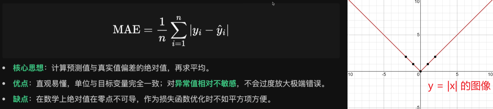

#### MSE 均方误差

Mean Squared Error
$$
MSE = \frac{1}{n} \Sigma(\hat y - y)^2
$$
和 MAE 的思路类似，MSE 但把取绝对值换成了取平方，这个平方操作会**放大大误差的影响**：偏差为 10 的样本，在 MSE 中贡献的惩罚是偏差为 1 的样本的 100 倍，而在 MAE 中只是 10 倍。

+ 如果你的业务场景对大偏差零容忍（比如预测偏差超过某个阈值就会造成严重后果），MSE 是更合适的优化目标。

+ 不过由于平方操作，MSE 的单位变成了目标变量单位的平方，不太直观。

> MSE 也是梯度下降训练时最常用的损失函数。

#### RMSE 均方根误差

Root Mean Squared Error
$$
RMSE = \sqrt{MSE}
$$
把 MSE 开个根号，**单位就回到和目标变量一致**了。它**既保留了 MSE 对大偏差的敏感性，又方便直接解读**，实际工程和数据科学竞赛（Kaggle）中用得最多。

> RMSE > MAE，说明存在一些偏差较大的样本把 RMSE 拉高了。
>
> RMSE 和 MAE 的差距越大，说明误差分布越不均匀，存在较大的离群误差

#### $R^2$ 决定系数

> 属于**无量纲指标**，R²表示的是**模型解释数据变化程度的比例**，本质上是一个比例值，因此没有单位。
>
> 作用：R² 衡量模型消除了总方差中多大比例的不确定性，可在不同数据集之间横向比较

$$
R^2 = 1-\frac{\sum(y_i - \hat {y_i})^2}{\sum(y_i - \overline {y})^2} = 1 - \frac{SS_{res}}{SS_{tot}}
$$

$y_i$：真实值

$\hat y_i$：模型预测值

$\bar y_i$：真实值的平均值

前面三个指标都在度量误差有多大，而 R² 回答的是：**模型比随机猜好多少？**

解析：$\overline y$ 表示取训练数据的结果的平均值，**使用均值来预测房价**，那不就是瞎猜吗。

公式中的分母 $SS_{tot}$ 是**目标变量本身的总方差**——如果我们不建模，对所有样本都直接预测均值 $\overline y$，误差就是 $SS_{tot}$。分子 $SS_{res}$ 是模型的**残差平方和**。所以 **$R^2$ 衡量的是：模型消除了总方差中多大比例的不确定性**。

+ $R^2 = 1$：分子为0，即模型预测误差为0，完美拟合，所有预测都精确命中真实值
+ $R^2 = 0$：分子分母相等，即模型预测和直接用均值预测一样，没有任何预测能力
+ $R^2 < 0$：分子大于分母，模型误差比均值预测误差大，说明模型存在严重问题，通常是 bug 或数据泄漏

> 举个例子，baseline训练后计算得到 R² = 0.5757，模型解释了约 57.6% 的房价方差。剩余 42.4% 的方差来自模型未捕获的因素——可能是特征不够、也可能是线性假设太强。对于只用 8 个特征的线性模型，这个结果是一个合理的起点，但还有明确的提升空间。

#### 指标选择的原则

没有最好的指标，只有最适合当前场景的指标：

| **场景**                               | **推荐指标** | **原因**                                     |
| -------------------------------------- | ------------ | -------------------------------------------- |
| 对大误差零容忍（如金融风控、安全领域） | MSE / RMSE   | 平方惩罚放大大误差，优化时会优先减少极端偏差 |
| 数据中存在离群点，需要稳健的度量       | MAE          | 不受个别极端值的过度影响                     |
| 不同量纲/不同数据集的模型横向对比      | R²           | 无量纲，归一化到 0~1 范围                    |
| 向非技术背景的业务方汇报               | RMSE / MAE   | 单位和目标变量一致，容易解释                 |

实际项目中，通常同时计算多个指标。单看一个指标容易遗漏信息，而指标之间的对比本身就能提供诊断线索，例如上面提到的 RMSE 与 MAE 的差距。

### 残差分析

指标给出的是一个全局汇总——它告诉你模型整体表现如何，但不告诉你模型在哪里表现好、在哪里表现差、为什么差，残差分析填补的正是这个空缺。

残差（Residual）的定义
$$
e_i = y_i - \hat y_i
$$
即真实值减去预测值。如果模型完美，则所有残差都是 0。现实中当然做不到，但我们关注的是残差是否呈现出某种规律性的模式，如果有说明模型遗漏了数据中的某些结构信息。

**举个例子，如图**

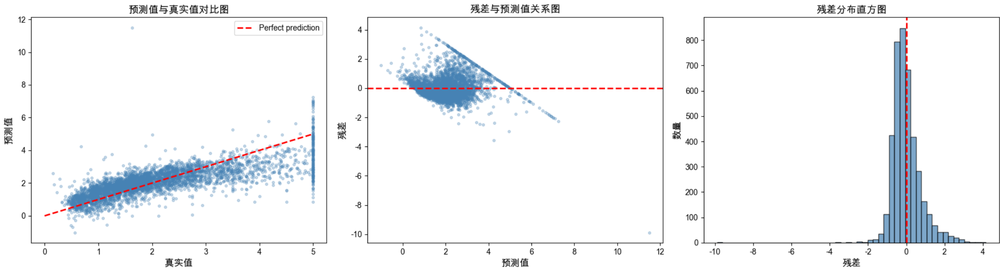

1. **预测值与真实值对比图**

   理想情况下，所有点都应落在红色对角线上。从图中可以看出，模型整体具备预测能力（数据点大致沿对角线分布），但存在明显的系统性偏差：真实值较高时，预测值普遍偏低（点落在红线下方），说明**模型倾向于低估高价房产**。此外，右侧出现的垂直聚集现象（大量真实值为 5.0 的样本），这是前面数据采集时做的**数据截断**，即目标变量的最大值刚好是 5.00，所有超过 50 万美元的房价都被统一记录为 5.0。

2. **残差与预测值关系图**
   如果模型没有系统性问题，散点应该均匀、随机地分布在红色零线两侧。但我们看到，随着预测值增大，残差的发散程度也在变大，呈现出漏斗的形状。这说明**模型预测高房价时非常不稳定**，误差忽大忽小。

3. **残差分布直方图**
   理想的残差应**近似正态分布、均值为 0**。图中残差的峰值确实集中在零附近，但整体呈现**右偏**且**带有长尾**——再次印证了模型对部分高房价样本预测不准、严重低估的问题。

这些发现直接告诉我们下一步优化的方向，比如处理截断的异常值、对房价目标变量做对数变换等。

### K-折 交叉验证

到目前为止，我们的所有评估都基于一次 train/test split。这里有一个隐患：评估结果依赖于数据怎么分。换一个 `random_state`，R² 可能从 0.57 变成 0.60 或 0.55。我们怎么知道 0.5757 这个数字反映的是模型的真实水平，而不仅仅是这次划分运气好？

为了获得更稳定、更具统计显著性的评估结果，即**剔除随机性带来的评估偏差**，我们采用 **K-Fold 交叉验证**（K-Fold Cross-Validation）。

> K-Fold 原理非常简单，将数据均匀分成 K 份（称为 K 个 fold）。每一轮取其中 1 份作为测试集，剩余 K-1 份作为训练集，训练模型并在测试集上评估。重复 K 轮，每一份数据恰好被用作测试集一次，最终报告 K 次评估结果的均值和标准差。

```python
from sklearn.model_selection import cross_val_score

# 注意：cross_val_score 会在内部完成 fit 和 predict，不需要手动划分
scores = cross_val_score(
    LinearRegression(), X_scaled, y,
    cv=5,                              # 5 折交叉验证
    scoring='neg_mean_squared_error'   # sklearn 约定：scoring 越大越好，MSE 前面加负号
)

# 将负 MSE 转换回 RMSE
rmse_scores = np.sqrt(-scores)

print("每折 RMSE:")
for i, score in enumerate(rmse_scores):
    print(f"  Fold {i+1}: {score:.4f}")
print(f"\n平均 RMSE: {rmse_scores.mean():.4f} ± {rmse_scores.std():.4f}")
```


```
每折 RMSE:
  Fold 1: 0.6963
  Fold 2: 0.7890
  Fold 3: 0.8039
  Fold 4: 0.7370
  Fold 5: 0.7033

平均 RMSE: 0.7459 ± 0.0437
```

标准差 0.0437，相对于均值 0.7459 约 5.9%。这说明线性回归模型在不同数据划分下表现非常稳定——这是线性模型的一个典型优势：方差低、稳定性好。

## 4、欠拟合与过拟合

### 定义

**（1）欠拟合（Underfitting）**

欠拟合是指模型过于简单，未能充分学习训练数据中的规律，导致其在训练集和测试集上的表现都很差。

就像一个学生只背了课本的目录，连课堂上讲过的例题都做不对，考试遇到新题更是无从下手。他不是粗心，而是压根没学进去。

**（2）过拟合（Overfitting）**

过拟合是指模型过于复杂，不仅学到了数据中的真实规律，还将噪声也一并记住了，导致其在训练集上表现优异，但在测试集上表现明显下降。

就像一个学生死记硬背了所有课后习题的标准答案，题目稍加变化就束手无策——他记住的是答案本身，而非解题方法。

### 使用学习曲线诊断拟合问题

学习曲线是诊断欠拟合/过拟合最直观的工具，它**展示了随着训练样本数量增加，训练误差和验证误差的变化趋势**。

假设数据的真实规律是 $y = x^2$，我们在此基础上添加一些随机噪声，生成了一组训练数据点，现在分别用不同复杂度的多项式来拟合这些数据。

（1）模拟数据

首先引入必要的工具，并准备一下数据，然后使用`PolynomialFeatures`给原始特征添加平方项、交叉项

+ **degree=1**: 线性模型，无法捕捉二次关系，导致欠拟合
+ **degree=2**: 二次多项式，与真实数据生成过程匹配，良好拟合
+ **degree=15**: 高次多项式，过度拟合训练数据中的噪声，导致过拟合

（2）模拟结果

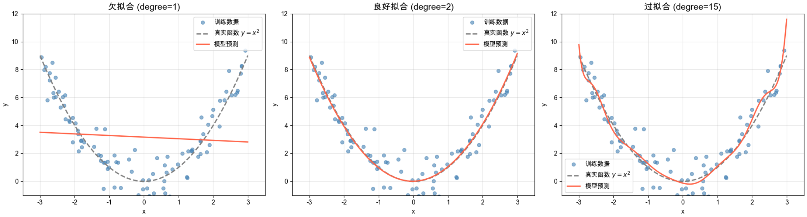

可以看到

+ 图 1： 使用 $y= wx+b$，一条直线去拟合一条抛物线，显然力不从心。无论怎么调整斜率和截距，直线都无法捕捉数据的弯曲趋势。**欠拟合**
+ 图 2： 使用 $y = w_1x^2 + w_2x + b$，二次多项式与真实规律的形式完全匹配，能够精准地捕捉数据的抛物线趋势，同时不会被噪声带偏。
+ 图3：使用 $y = w_1x^{15} + w_2x^{14} + ... + w_{15}x+ b$，15 次多项式去拟合这些数据点，曲线会精确地穿过每一个训练样本——包括那些受噪声干扰偏离真实规律的点，曲线变得扭曲而怪异。**过拟合**

（3）学习曲线

`learning_curve`会自动用不同数量的训练数据去训练模型，然后分别计算：

+ 训练集得分（模型学自己见过的数据有多好）
+ 验证集得分（模型学没见过的新数据有多好）

最后画出两条曲线，一眼看出模型是过拟合、欠拟合还是刚刚好。

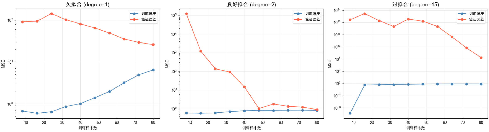

可以看出来

+ **图 1**： 验证误差始终和训练误差非常接近，且都维持在高位（约 20~100）。模型太简单既学不会训练数据，也泛化不好，属于典型的**欠拟合**

+ **图 2**：验证误差一开始很高，随着样本数增加快速下降，最后和训练误差几乎重合，都维持在低位（5～10）。模型复杂度刚好，既拟合了训练数据，又能很好泛化到新数据。

+ **图 3**：训练误差几乎为 0，**验证误差始终远高于训练误差**，且数值巨大（10⁸），模型太复杂（15 次多项式），过度学习了训练数据中的噪声和细节，完全无法泛化，属于典型的**过拟合**

### 如何解决欠拟合

欠拟合意味着模型太简单，无法捕捉数据中的真实模式，核心思路是让模型更有表达力。

**（1）特征工程**

特征工程是解决欠拟合最常用、最有效的方法之一，通过**构造更有信息量的特征**，即使用简单模型也能获得好效果。

常见的特征工程方法有

| 方法       | 说明                     | 示例                                 |
| ---------- | ------------------------ | ------------------------------------ |
| 多项式特征 | 添加特征的高次项和交互项 | $x_1,x_2→x_1,x_2,x_1^2,x_2^2,x_1x_2$ |
| 特征交叉   | 组合两个或多个特征       | 面积 = 长 × 宽                       |
| 数学变换   | 对数、平方根、指数等     | $log(income)$                        |
| 领域特征   | 结合业务知识构造         | 从日期中提取"是否周末"               |
| 分箱       | 将连续值离散化           | 年龄 → 青年/中年/老年                |

**（2）增加训练轮数**

如果模型还没有训练到收敛就提前停止了，自然表现不佳，这时候可以：

+ 检查训练过程中损失是否仍在下降

+ 适当增加 epochs 数量，给模型更多的学习时间


**（3）增加模型复杂度**

当特征工程不够时，可以直接使用更复杂的模型。比如在模型评估中演示的加州房价 $R^2$ 可以训练到 0.57 左右，但如果引入多项式、决策树、随机森林等复杂模型会显著提升其 $R^2$

### 如何解决过拟合

#### 常见方案

过拟合意味着模型太复杂，模型记住了训练数据的噪声，常用的解决方案有几种：

| **技术**           | **核心思想**                 | **适用场景**                |
| ------------------ | ---------------------------- | --------------------------- |
| **增加训练数据**   | 更多数据让噪声被稀释         | 数据获取成本低时            |
| **正则化 L1、L2**  | 给模型复杂度加惩罚           | 最通用的方法                |
| **降低模型复杂度** | 用更简单的模型               | 模型明显过于复杂时          |
| **特征选择**       | 去掉无关或冗余特征           | 特征多而样本少时            |
| **交叉验证**       | 更可靠地评估泛化能力         | 所有场景                    |
| **早停**           | 训练到验证误差开始上升时停下 | 迭代式模型（神经网络/GBDT） |
| **Dropout**        | 随机丢弃神经元               | **深度学习**                |
| **数据增强**       | 通过变换扩充训练集           | 图像/文本/音频              |

可能很多同学第一直觉是降低其复杂度就可以了，但现实训练模型我们很难判断该怎么调整，正则化技术可以帮我们自动惩罚不相关的特征，让模型自动降低复杂度。

#### 正则化

**正则化 Regularization**本意是使之变得规则、整齐、正常，在机器学习中没正则化时，模型会疯狂拟合造成，变得很不正常。使用加正则化，让模型别太极端、别太复杂，回归正常的简单形态

在前面的多项式演示中，我们用 15 次多项式去拟合 $y=x^2$，结果模型为了穿过每一个带有噪声的训练点，把某些系数 $w_j$ 推到了极端的值：
$$
\hat y = w_0 + w_1x + w_2x^2 + ... + w_{15}x^{15}
$$
一旦出现 $w_{15} = 387.2, w_7 = -1041.8$ 这样的极端系数，曲线就会剧烈震荡——这就是过拟合。

回顾普通线性回归的损失函数：
$$
J(w) = \frac{1}{2n} \sum_{i = 1}^n(\hat y_i - \hat {y_i})^2
$$
它只关心一件事：**拟合得准不准**，完全不管系数有多大，这就是问题所在。


正则化的核心思想是**在损失函数中额外加一个惩罚项**，系数越大、罚得越重，从而**逼迫模型用尽可能小的系数来完成拟合**。根据惩罚方式的不同，正则化分为两种：

**L2 正则化（Ridge，岭回归）** 在 MSE 后面加上所有权重的**平方和**作为惩罚：
$$
J_{Ridge}(w) = \frac{1}{2n} \sum_{i = 1}^n(\hat y_i - \hat {y_i})^2 + \alpha \sum_{j = 1}^p w_j^2
$$
**L1 正则化（Lasso）** 则加上所有权重的**绝对值之和**作为惩罚：
$$
J_{Lasso}(w) = \frac{1}{2n} \sum_{i = 1}^n(\hat y_i - \hat {y_i})^2 + \alpha \sum_{j = 1}^p |w_j|
$$
两者唯一的区别就在于惩罚的计算方式——平方还是绝对值。但正是这个看似微小的差异，导致了截然不同的优化效果：

+ **L2** 会将所有权重均匀地**压缩到接近 0 的小值**，但**不会恰好等于 0**。当所有特征都对预测有一定贡献，或者特征之间存在多重共线性时，L2 表现最为稳定。
+ **L1** 则会将不重要特征的权重**直接压缩到 0**，相当于**自动进行特征选择**。当数据集有大量特征、但真正起作用的只是少数几个时，L1 就非常有价值了。

> L2 正则化叫**岭回归**，是因为没有正则化时，损失函数曲面是一个很深的峡谷，参数很容易跑到峡谷深处，变得特别大，导致过拟合。加上L2 正则后，损失函数变成了一个中间凸起的山脊形状，这道山脊从几何上把参数“顶住”了，将它们限制在一个靠近原点的较小范围内，防止它们在峡谷深处不受控制地乱跑。
>
> **Lasso**实际上是一个缩写：**L**east **A**bsolute **S**hrinkage and **S**election **O**perator（最小绝对值收缩与选择算子）。恰好这个缩写与英文单词 lasso（套索）同形，也非常形象——L1 正则化会把不重要的特征系数直接"勒"到 0，就像用套索把无用的变量套住、收紧、剔除掉，天然具备**特征选择**的能力。

#### 正则化之前需要标准化（特征缩放）

==在使用 L1/L2 正则化时，必须先使用 `StandardScaler()` 对特征进行标准化。如果特征尺度不一样（**不同特征的数值范围、数量级差异太大**），正则化对系数的惩罚就会极不公平。==

举个例子，房价预测的四个参数的特征尺度不同：

```
面积       100~300
房间数量   1~10
```

当模型 $y = w_1x_1 + w_2x_2 + b$ 加入 L2 正则，
$$
Loss = MSE + \lambda(w_1^2+ w_2^2)
$$
则权重与惩罚项的数值可能出现如下情况

| 特征     | 权重 | L2惩罚 |
| -------- | ---- | ------ |
| 面积     | 0.5  | 0.25   |
| 房间数量 | 20   | 400    |

> 房间数量的权重大，因此受到更强惩罚。模型会倾向于减少房间数量这个特征的重要性。
>
> 但实际上，不是房间数量不重要，而是房间数量的数值范围太小，所以需要更大的权重。


标准化StandardScaler公式：
$$
x' = \frac{x - \mu}{\sigma}
$$
作用：让均值接近于0，方差接近于1。

将数据进行标准化处理之后，特征尺度接近，多个特征可以受到同等惩罚。

#### 正则化示例分析

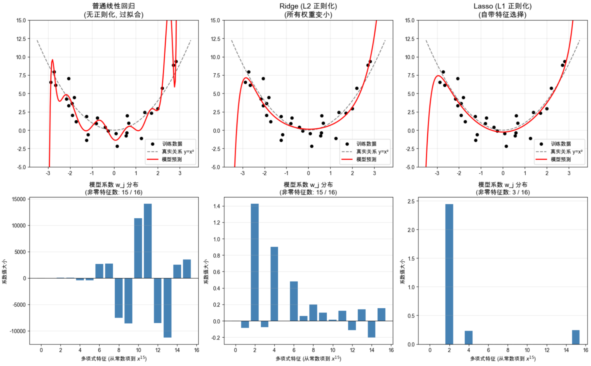

1. 拟合曲线表现

+ 普通线性回归：曲线像过山车一样剧烈震荡，试图穿过每一个带有噪声的训练点，典型过拟合
+ Ridge (L2)：曲线变得非常平滑，不再去迎合个别噪声点，基本还原了抛物线的形状
+ Lasso (L1)：曲线同样变得平滑，并且形状与 Ridge 略有不同，非常接近真实的 $y=x^2$

2. 底层系数 $w_j$ 表现
+ 普通线性回归：为了制造出剧烈的震荡，模型把某些系数推到了极端值
+ Ridge (L2)：把所有极端的峰值都压扁，系数大多被限制在 `[-3, 3]` 之间，16 个系数全都在起作用
+ Lasso (L1)：大部分参数值为 0，模型最终只保留了少数几个关键特征（比如 $x^2$ 项），其他高次项直接被剔除

# 三、逻辑回归

线性回归能预测房价、股票价格这样的连续数值。但面对这类问题线性回归就无能为力了。

我们把==预测离散的标签，输出是有限个互斥类别的任务==称为**分类（Classification）**，最常见的是**二分类（是/否）**，也可扩展到多分类，如手写数字识别 0-9、图像分类猫/狗/鸟。线性回归无法胜任这类任务，而逻辑回归正是为此而生的入门算法。

一句话总结：**线性回归解决是多少的问题，逻辑回归解决属于哪一类的问题**。

## 为什么引入逻辑回归？

一个容易出现的问题，分类时用线性回归预测，大于 0.5 算 1、小于 0.5 算 0，不就可以了？答案是不行，使用线性回归处理分类任务主要有两个缺陷：

+ **输出范围失控**：线性回归的输出是 $(−∞,+∞)$。在分类问题中我们希望输出是一个概率，必须在$ (0, 1) $之间。如果预测结果是 10000 或者 -50，这在概率学上毫无意义。
+ **极易受异常值影响**：假设用线性回归区分肿瘤，突然数据里多了一个极其巨大的恶性肿瘤样本，整条回归线就会被严重拉偏，导致原本预测准确的普通样本被错误分类。

为了解决这个问题，我们需要==为线性回归叠加一个变形器——这就是逻辑回归==。

重复前面的结论：**逻辑回归 = 线性回归 + 激活函数**

## 激活函数 sigmoid

线性回归的输出 $z = wx + b$ 可以是任意实数，而分类需要一个 0 到 1 之间的概率值。为了完成这个映射，逻辑回归引入了 **Sigmoid 函数**：
$$
\sigma(z) = \frac{1}{1+e^{-z}} = \frac{1}{1 + e^{-(wx+b)}}
$$
从公式上可以看出来，**逻辑回归 = 线性回归 + Sigmoid**。前半段算预测值，Sigmoid 把预测值转成概率，最后按概率做决定。

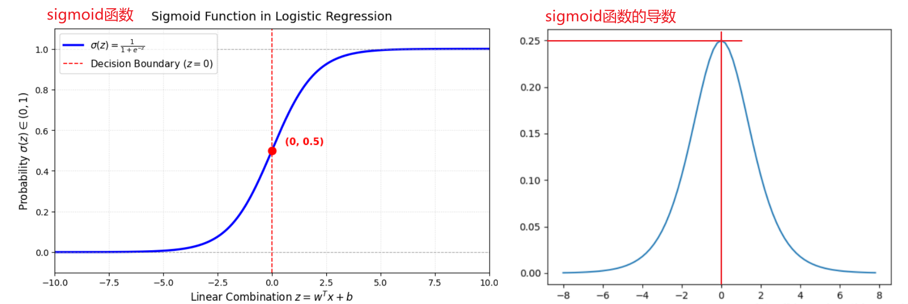

数学界有那么多函数可以实现将数值映射到 $(0,1)$，为什么机器学习偏爱 Sigmoid？因为它完美契合了分类任务的三个需求：

+ 输出天然具有概率含义
  + Sigmoid 的输出严格限制在 $(0,1)$ 之间，刚好可以解释为样本属于正类的概率。比如输出 0.8 就代表模型有 80% 的把握认为是正类。而线性回归的输出可以是 -3.5 或 12.7 这样的值，没法把它理解成概率。
+ 自带决策分界点
  + 从图像中可以看到，$\sigma(0) = 0.5$，这意味着：
    + $wx + b > 0$ → 概率大于 0.5 → 判为**正类**
    + $wx + b < 0$ → 概率小于 0.5 → 判为**负类**
  + 所以**决策边界**其实就是 $wx + b = 0$ 这条直线，Sigmoid 函数告诉我们的是离分界线多远，有多大把握。
+ 处处可导，导数极简
  + 提问：既然只是区分正负，直接规定 z > 0 输出 1、z < 0 输出 0 不就行了？
  + 回答：问题在于这种**阶跃函数在跳变点无法求导**，如下图，梯度下降根本用不了。
  + 而 Sigmoid 是一条连续、平滑的曲线，处处可导，而且导数公式极其简洁：$\sigma'(z) = \sigma(z)·(1-\sigma(z))$
  + 算完 Sigmoid 的值顺手就能得到导数，不需要额外计算。这让梯度下降的效率非常高，也是后面损失函数推导能大幅化简的关键原因。

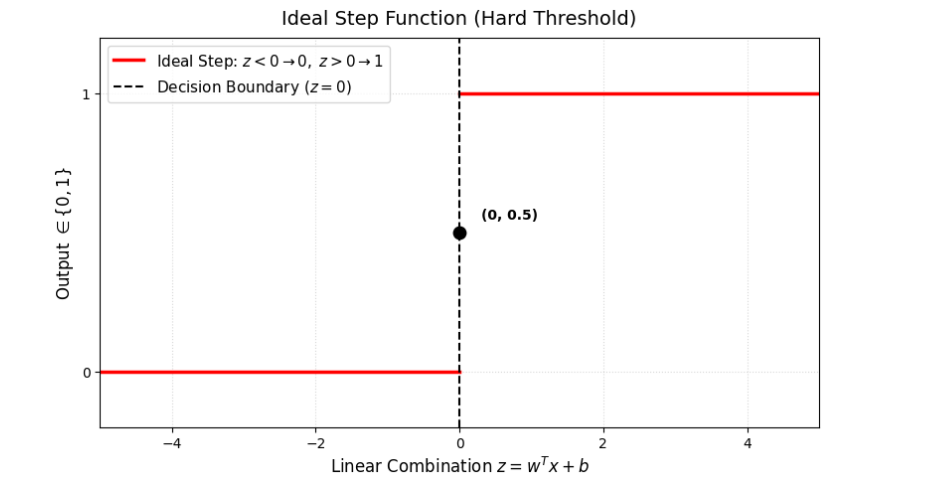

## 损失函数

### 为什么不使用MSE

因为线性回归的预测值是线性的，所以这个损失函数是一个凸函数（开口朝上，抛物线；开口向下是凹函数），无论初始参数怎么设置，梯度下降都能找到全局最优解。

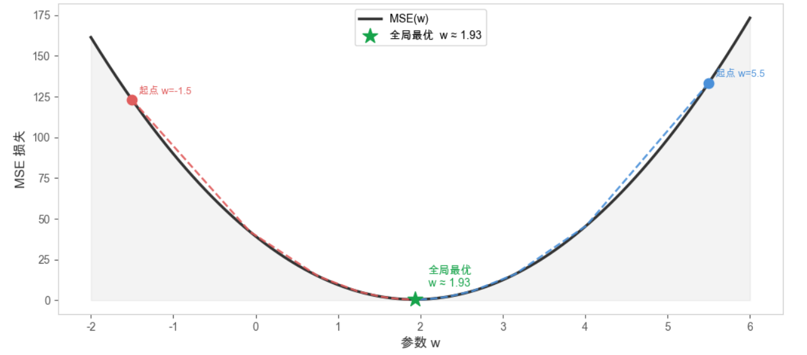

（1）局部最优解

逻辑回归因为引入了**非线性的 Sigmoid 函数**，如果再把 MSE 套在上面，整个损失函数就会变成一个**非凸函数**。

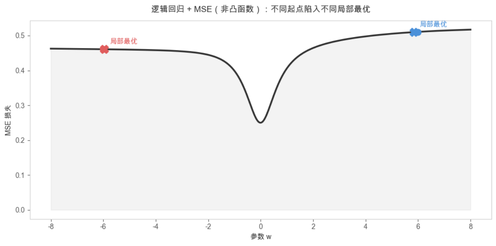

非凸函数不像一个光滑的碗，可能存在局部极小值或平缓区域，从图中可以看到：

+ 红色轨迹从左侧出发，最终卡在左侧的一个坑里
+ 蓝色轨迹从右侧出发，最终卡在右侧的另一个坑里

两条轨迹收敛到了不同的局部最优，这意味着模型训练的结果完全依赖于参数初始值，极不稳定。


（2）梯度消失

另外 Sigmoid 函数的特性是当输入很大或很小时，输出会非常接近 1 或 0。如果模型预测值接近 1，那么其梯度 $\hat y·(1 - \hat y)$ 就会接近 0。这就导致即使预测错了，梯度也接近于 0，参数几乎不更新，模型直接停止学习，这就是**梯度消失**。

### 设计损失函数：交叉熵损失函数

#### 分类问题损失的特征

对于二分类任务，模型输出的是一个概率 p，这个概率有很明确的含义：

+ p≈1：模型非常相信样本属于正类
+ p≈0：模型非常相信样本属于负类
+ p≈0.5：**模型最不确定**，给出的结果相当于随机

因此，一个合理的损失函数应该满足：

+ 如果真实标签 y=1，那么 p 越接近 1 越好，越接近 0 惩罚越大
+ 如果真实标签 y=0，那么 p 越接近 0 越好，越接近 1 惩罚越大

> 这里要特别注意一个常见误区：p=0.5 并不是损失最大，而是模型最不确定。真正损失最大的时候，是模型非常自信但预测错了。
>
> 例如：
>
> + 真实 y=1，却预测 p≈0
> + 真实 y=0，却预测 p≈1

#### 数学原理

为了设计出符合上述特征的损失函数，我们需要借用三个重要的数学工具：

（1）log函数

对数函数是指数函数的逆运算。在机器学习中，我们最常使用的是自然对数（以自然常数 $e ≈ 2.718$ 为底），通常记作 $ln(x)$ 或直接写成 $log(x)$。

如果我们只看 x 属于 (0,1) 区间，映射为模型预测的概率 p，对 y 轴 $log(p)$ 取负得到 $-log(p)$ 

+ 当预测概率 p 趋近于 1 时，$-log(p) → 0$
+ 当预测概率 p 趋近于 0 时，$-log(p) → ∞$

这正好符合我们对损失函数的期待：

+ 概率越接近真实标签，损失越小
+ 概率越偏离真实标签，损失越大
+ 如果模型非常自信但完全错了，损失会被放大得非常厉害

所以$log(x)$是一个非常适合拿来构造分类损失的函数。

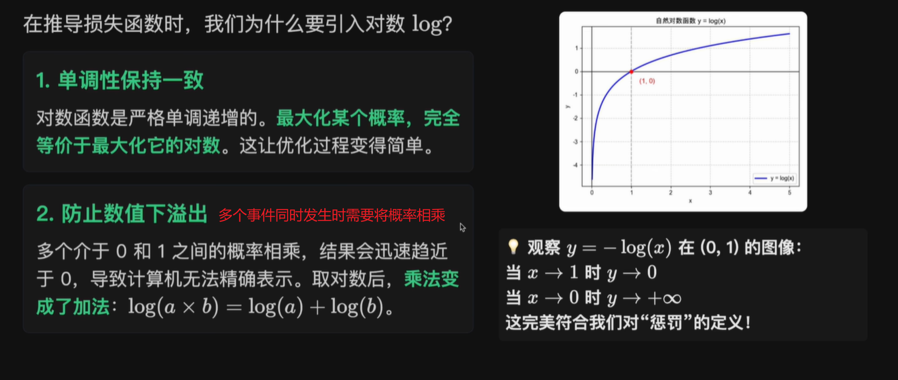

（2）伯努利分布

伯努利分布描述的是一次试验中，某个事件发生或不发生的概率。为了数学上的方便，我们通常这样定义：

+ **成功**：我们感兴趣的事件发生，记为 $Y=1$。
+ **失败**：该事件不发生，记为 $Y=0$。

对于二分类问题，标签 $ y \in {0,1} $，我们可以把单个样本的标签看成服从伯努利分布，概率为 \( p \)，那么：

$$
\begin{cases}
P(Y = 1) = p \\
P(Y = 0) = 1 - p
\end{cases}
$$
为了方便计算，可以把这两个公式合并成一个统一的公式：

$$
P(Y = y) = p^y (1 - p)^{1 - y}
$$
代入验证一下：

- 当 $y = 1$时，后半部分 $(1 - p)^{1 - y}$ 变成了 1，结果是 $p$
- 当 $y = 0$ 时，前半部分 $p^y$ 变成了 1，结果是 $1 - p $

在逻辑回归里，y 是样本的真实标签，$\hat{y} $ 是模型预测样本属于正类的概率，我们代入公式：

$$
P(y) = \hat{y}^y (1 - \hat{y})^{1 - y}, \quad 其中 \hat{y} = \sigma(wx + b)
$$
（3）最大似然估计

+ **概率 (Probability)** 是在**已知模型参数**的情况下，预测**未知数据**出现的可能性。
+ **似然 (Likelihood)** 是在**已知观测数据**的情况下，评估**未知模型参数**的合理性。

最大似然估计（Maximum Likelihood Estimation, MLE）是统计学中用于估计模型参数的一种方法。它的核心思想是找到一组参数，**使得观测数据在该参数下出现的概率最大**。

因此，我们要找到一组参数 θ，使得这组数据出现的似然函数值最大。最大似然函数是实现这一目标的关键工具。

> 逻辑回归通过 **最大化似然函数** 或 **最小化损失函数** 来优化模型参数 θ。


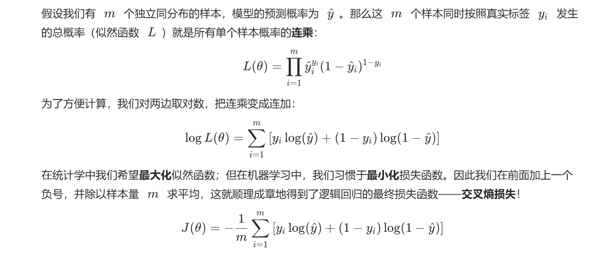


### 交叉熵损失函数

对于单个样本，交叉熵损失函数为：

$$
\mathcal{L}(y, \hat{y}) = - \left[ y \log(\hat{y}) + (1 - y)\log(1 - \hat{y}) \right]
$$

其中：
- $y \in \{0,1\}$：真实标签  
- $\hat{y}$：模型预测为正类的概率  

对于包含 $n$ 个样本的数据集，总损失（平均损失）为：

$$
\mathcal{L} = - \frac{1}{n} \sum_{i=1}^{n} \left[ y_i \log(\hat{y}_i) + (1 - y_i)\log(1 - \hat{y}_i) \right]
$$
因为对于任何一个样本，真实标签 y 要么是 0 要么是 1，所以公式中永远只有一项在起作用，另一项会被自动乘以 0 消掉。

| **真实标签** | **损失项**          | **含义**                                         |
| ------------ | ------------------- | ------------------------------------------------ |
| y = 1        | $-log(\hat{y})$     | 预测概率越接近 1，损失越小；接近 0 时损失 → $+∞$ |
| y = 0        | $-log(1 - \hat{y})$ | 预测概率越接近 0，损失越小；接近 1 时损失 → $+∞$ |

使用交叉熵作为损失函数时，它是一个**严格的凸函数**，无论初始权重在哪里，梯度都不会消失，在远离最优解的地方，梯度反而很大，能够引导模型快速且稳定地收敛到全局最优点。

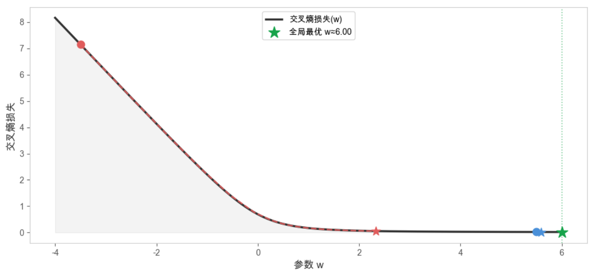

## 梯度下降

逻辑回归的梯度推导过程中，Sigmoid 的导数和交叉熵的导数恰好大量约分抵消，最终结果和线性回归的形式一模一样，唯一的区别在于 $\hat y$ 的含义不同

|                   |            **线性回归**             |            **逻辑回归**             |
| :---------------: | :---------------------------------: | :---------------------------------: |
|   **权重梯度**    | $\frac{1}{m}\Sigma(\hat y - y)·x_j$ | $\frac{1}{m}\Sigma(\hat y - y)·x_j$ |
|   **偏置梯度**    |   $\frac{1}{m}\Sigma(\hat y - y)$   |   $\frac{1}{m}\Sigma(\hat y - y)$   |
| $\hat y$ **含义** |              $wx + b$               |          $sigmoid(wx + b)$          |

## 模型评估指标

线性回归用 MSE / RMSE / R² 衡量预测值与真实值的偏差，这些指标都建立在连续数值的误差上。分类任务的输出是离散的类别标签，需要一套不同的评估体系。**准确率（Accuracy，预测正确的样本占总样本的比例）**是最直观的指标，但它有明显局限

>  假设 99% 的样本是负类，只要模型无脑预测「全是负类」，准确率就能达到 99%，但这个模型毫无价值。

分类评估的核心工具是**混淆矩阵**，从它出发可以推导出精确率、召回率、F1、ROC/AUC 等指标。

+ ​	

举个例子，针对肿瘤预测，有以下判断

+ 对角线上的数字越大越好，代表预测正确的样本数
+ **FN（漏报恶性）** 在医疗场景中危害最大——真实是恶性却被预测为良性，患者可能因此延误治疗
+ **FP（误报恶性）** 的代价相对较低，只是增加不必要的复查
+ 混淆矩阵直观展示了模型在每个类别上的具体表现，是准确率之外最重要的参考

### 精确率、召回率、F1

+ 精确率（precision）：**查准率**，预测为正类的样本中，真正是正类的比例（预测质量）。
+ 召回率（recall）：**查全率**，所有真正的正类中，被成功预测出来的比例（覆盖能力）。
+ F1 Score：主要针对数据类别不平衡，权衡查准率、查全率

$$
P = \frac{TP}{TP + FP}\\
R = \frac{TP}{TP + FN}\\
F_1 \ Score = 2\frac{PR}{P+R}
$$

> **精确率 vs 召回率**：二者往往存在权衡。降低决策阈值可以提高召回率（漏报更少），但会降低精确率（误报更多）。根据业务场景决定侧重哪个。
>
> 在乳腺癌这类场景中，**恶性（0）的召回率**是最重要的指标——宁可误报，不能漏报
>
> 若召回率不足，可以通过调低决策阈值（默认 0.5）来提升，以牺牲部分精确率为代价

### ROC曲线、AUC值

阈值：假设为n，分类的概率超过n，则可以判定为正例。

精确率/召回率依赖于决策阈值（默认 0.5），换一个阈值结果就不同。**ROC 曲线**通过遍历所有可能的阈值，完整**展示模型在不同工作点下的表现**

+ FPR：横轴，表示负样本分错的概率

+ TPR：纵轴，表示正样本分对的概率

$$
FPR = \frac{FP}{FP+TN} \\
TPR = \frac{TP}{TP+FN}
$$

**AUC（Area Under Curve）**：ROC 曲线下面积，取值 0~1：

+ AUC = 1.0：完美模型
+ AUC = 0.5：随机猜测（对角线）
+ AUC 越大，模型区分正负类的能力越强，且**与阈值无关**

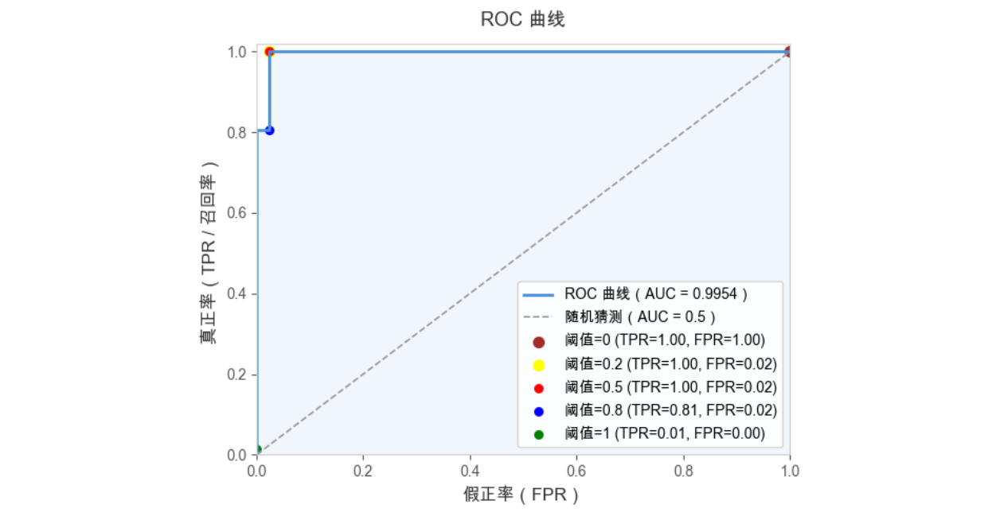

**结果分析**

+ AUC 接近 **1.0**，ROC 曲线紧贴左上角，说明**模型在任意阈值下都能较好地区分恶性和良性**
+ 曲线越靠近左上角（高 TPR + 低 FPR），模型性能越好；对角虚线代表随机猜测的基准线
+ **AUC 与具体阈值无关**，是比单一准确率更稳健的综合评价指标，适合用于**模型之间的横向对比**

### 评估指标总结

| **指标** | **公式**                                                     | **适用场景**                 |
| -------- | ------------------------------------------------------------ | ---------------------------- |
| *准确率* |  | 类别均衡时的快速评估         |
| *精确率* |  | 误报代价高（如垃圾邮件过滤） |
| *召回率* |  | 漏报代价高（如疾病检测）     |
| *F1*     | 精确率与召回率的调和平均                                     | 两者都重要时的综合指标       |
| *AUC*    | ROC 曲线下面积                                               | 与阈值无关的模型整体能力评估 |

## 多分类问题

逻辑回归天生是二分类器，但可以扩展到多分类。从二分类扩展到多分类时，最自然的形式就是 **Softmax Regression（也叫多项逻辑回归，Multinomial Logistic Regression）**，一次性输出所有类别的概率。

多分类逻辑回归中，每个类别都有一个线性打分函数，**模型先为每个类别计算分数，再通过 Softmax 把这些分数转成一组概率**，最后选择概率最大的类别作为预测结果。
$$
P(y = k) = \frac{e^{z_k}}{\sum_{j=1}^{n}e^{z_j}}
$$
如果只有 2 个类别，Softmax 就退化成了 Sigmoid，所以 Sigmoid 是 Softmax 的特例。

> 逻辑回归就是最简单的神经网络，Softmax 多分类逻辑回归就是神经网络中最常见的输出层形式之一。

## 总结

逻辑回归虽然简单，但**可解释性强、训练快、不容易过拟合**，工业界依然大量使用。

# 四、决策树

## 定义与结构组成

决策树：从根节点开始一步步走到叶子节点。所有的数据最终都会落到叶子节点，**既可以做分类也可以做回归**。

决策树是以实例为基础的归纳学习算法。它从一组无次序、无规则的元组中推理出决策树表示形式的分类规则。

决策树类似于流程图的树结构，其中每个内部节点表示在一个属性上的测试，每个分支代表一个测试输出，而每个树叶节点代表类或类分
布。树的最顶层节点是根节点。

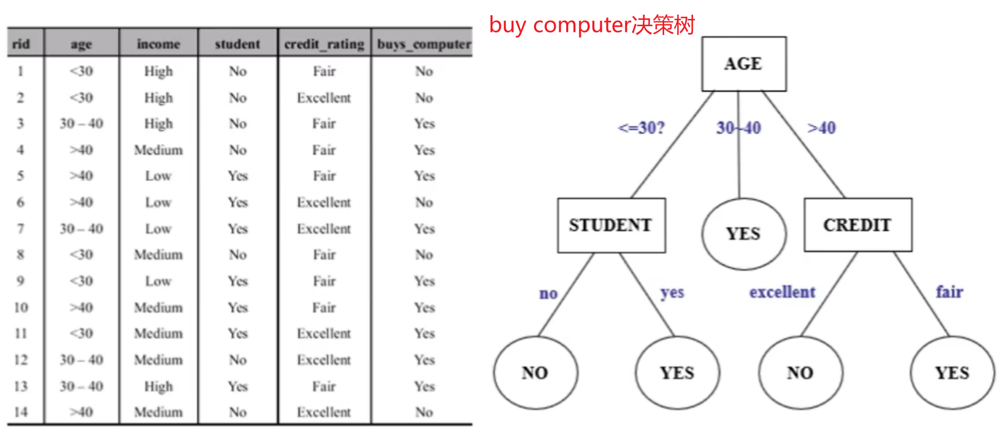

树的组成

+ 根节点：第一个分类选择点
+ 非叶子节点与分支：中间过程
+ 叶子节点：最终分类结果

## 模型建立

使用决策树进行分类分为两步：

1. 训练阶段：利用训练集建立并精化一棵决策树，建立决策树模型。这个过程实际上是一个从数据中获取知识，进行机器学习的过程。

2. 测试阶段：利用生成完毕的决策树对输入数据进行分类。对输入的记录，从根结点依次测试记录的属性值，直到到达某个叶结点，从而找到该记录所在的类。

问题的关键是建立一棵决策树，即**决策树分类模型建立**，两个阶段：

1. 建树：决策树建树算法是一个递归的过程，最终将得到一棵树。
2. 剪枝：剪枝目的是降低由于训练集存在噪声而产生的起伏

**建立决策树通用算法**

1. 创建一个根节点，并将所有训练数据分配给根节点
2. 选译最佳的分割属性
3. 根据分割点的每个属性值，在根节点上添加一个分支。沿着分支的特定分割点，将数据划分到互斥的子集中。
4. 对每个叶节点重复步骤2和步骤3，直到达到停止条件

## 熵：每层如何选择最佳的分割属性

简单来说，每层选择哪一个属性，继续向下做分支的时候可以使得分类最简单（层数最少）。

核心目标：**通过一种衡量标准，来计算通过不同属性进行分支选择后的分类情况，找出来最好的那个属性当成根节点**，每层以此类推。

衡量标准：**==熵==（表示随机变量不确定性的度量，即体系内混乱程度）**

**熵计算公式**：$H(x)=-\sum p_i×log p_i,i=1,2,...,n$，自定义log底数，有时候也用$E(x)$表示

+ 例如：A集合$[1,1,1,1,1,1,1,1,2,2]$，B集合$[1,2,3,4,5,6,7,8,9,1]$
+ 显然A集合的熵值要低，因为A里面只有两种类别，相对稳定一些；而B中类别太多了，熵值就会大很多
+ 在分类任务中我们希望通过节点分支后数据类别的熵值大还是小呢？
+ **log**函数的作用：放大体系的混乱程度，举个例子，$p_i$范围一定在`[0,1]`之间，$y$取值范围是$[-∞,0]$，当$p_i$趋于0时，可以看到$|y|$的值变化的很大，这样可以放大变化程度
+ 熵值为0，**纯度**最高

**熵：不确定性越大，得到的熵值也就越大**

+ 当p=0或p=1时，H(p)=0，随机变量完全没有不确定性
+ 当p=0.5时，H(p)=1，此时随机变量的不确定性最大

> 决策树构建应该是信息熵逐步下降的过程。

信息增益：属性使得类别Y的不确定性减少的程度（即，**熵值下降的程度**）

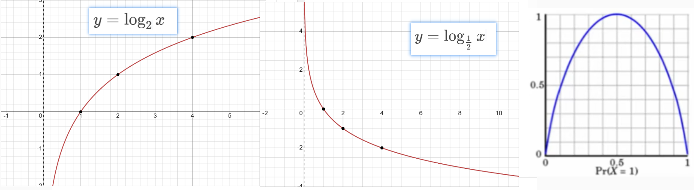

## 常见决策树算法

常用的决策树算法

+ ID3：$Gain(S,A) = E(S) - E(S,A)$，$E(x)$表示熵
+ C4.5：$Gain-ratio = \frac{Gain(A)}{I}$
+ C5
+ CART：$Gini(p) = \sum_{k = 1}^K p_k(1-p_k) = 1 - \sum_{k = 1}^Kp_k^2$
+ CHAID
+ M5

决策树算法的主要区别

+ 分割方式：选择哪个属性做分割属性，有不同的衡量标准，取值多少
+ 停止条件：何时停止构建决策树
+ 剪枝方式：先剪枝 vs 后剪枝

### ID3：信息增益

公式：
$$
Gain(S,A) = E(S) - E(S,A)
$$
其中$E(x)$表示熵。


ID3是Quinlan提出的一个著名决策树生成方法
+ 每一个非叶结点对应着一个非类别属性，树枝代表这个属性的值。叶结点代表从树根到叶结点之间的路径对应的记录所属的类别属性值
+ 每一个非叶结点都将与属性中具有最大信息量的非类别属性相关联。
+ 采用信息增益来选择能够最好地将样本分类的属性

ID3算法的优点：

+ ID3算法通常只需要测试一部分属性就可完成对训练数据集的分类
+ 从ID3算法构建的决策树中，很容易获得相应的决策规则

ID3算法的缺点：

+ ID3算法在选择根节点和内部结点的属性时，使用**信息增益**作为评价标准
+ 信息增益倾向于**选择取值种类较多的属性进行划分**，**不一定是最优属性进行划分**（比如使用编号作为根节点属性，信息增益最大，但是过拟合）
+ ID3算法只能对属性值为离散型的数据集进行划分（构建决策树），不能处理属性值为连续型的数据集


题目示例

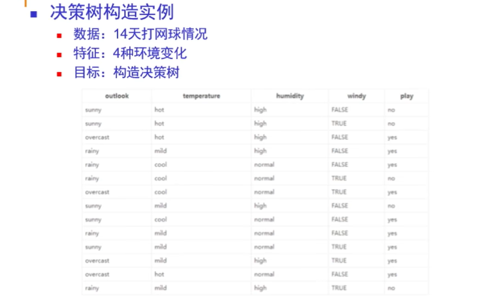

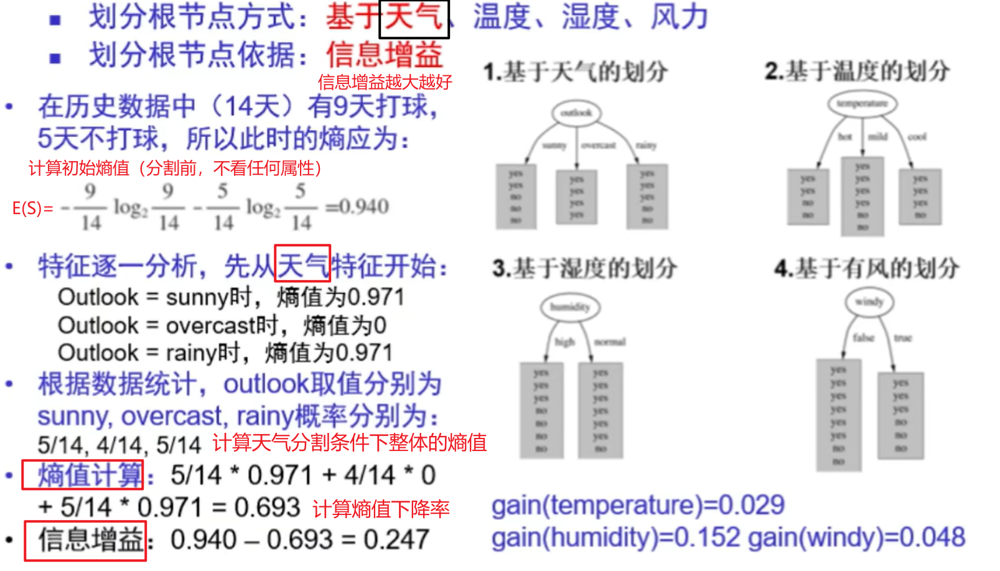

练习题

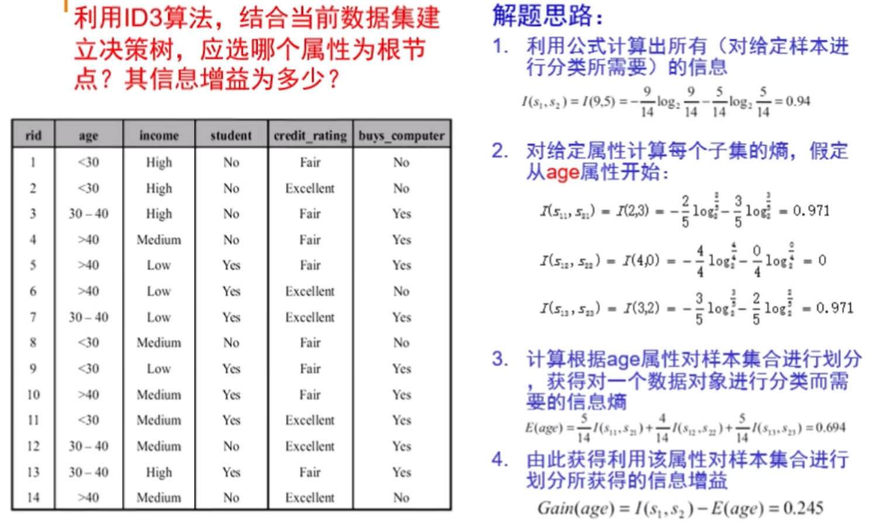

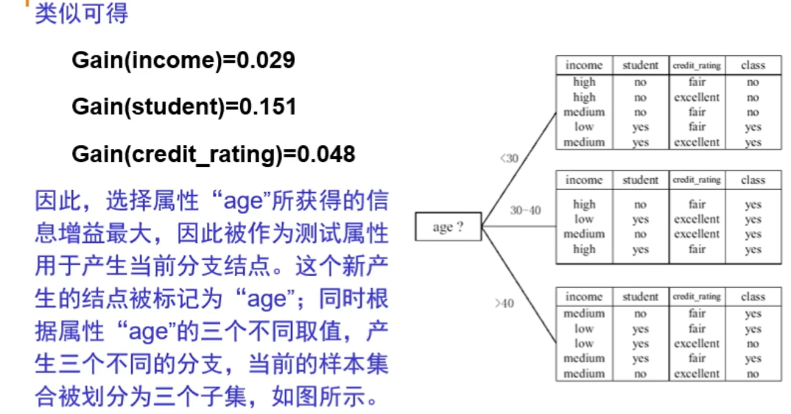


### C4.5：信息增益率（ID3的升级版）

C4.5算法是从ID3算法演变而来，除了拥有引D3算法的功能外，C4.5克服了ID3在应用中的不足，主要体现在：

+ 用信息增益率选择属性，克服了用**信息增益**选择属性时**偏向选择取值多的属性**的不足
+ **能够完成对连续属性的离散化处理**；可以处理具有缺少属性值的训练样本
+ 属性的信息增益率 = **属性信息增益**$Gain(A)$ / **属性分割熵**$I = SplitInfo_A(D)$

公式
$$
Gain-ratio = \frac{Gain(A)}{I} \\
SplitInfo_A(D) = - \sum_{j = 1}^v \frac{|D_j|}{|D|} × log_2(\frac{|D_j|}{|D|})
$$
区分属性分割熵与整体的熵（无条件熵）

+ 属性分割熵：看属性自身分为几类，计算熵，与整体的分类结果无关
+ 整体的熵：看根据几个属性得到的分类结果，按照分类结果计算熵

题目示例：Gain(income)的计算参考ID3中的计算过程

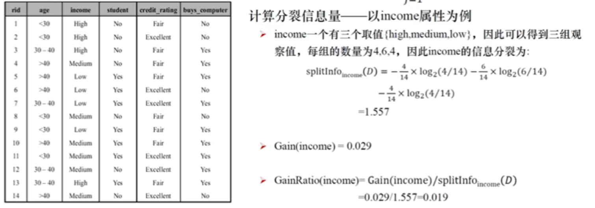

练习题

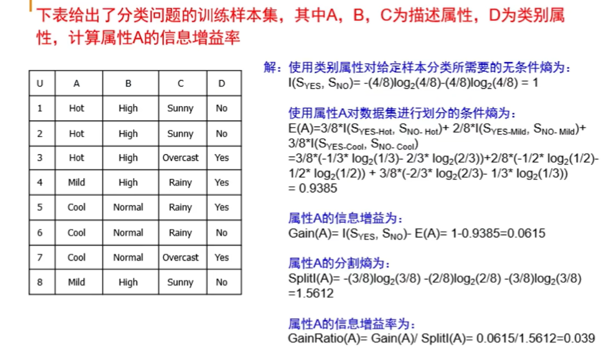


### CART：基尼系数

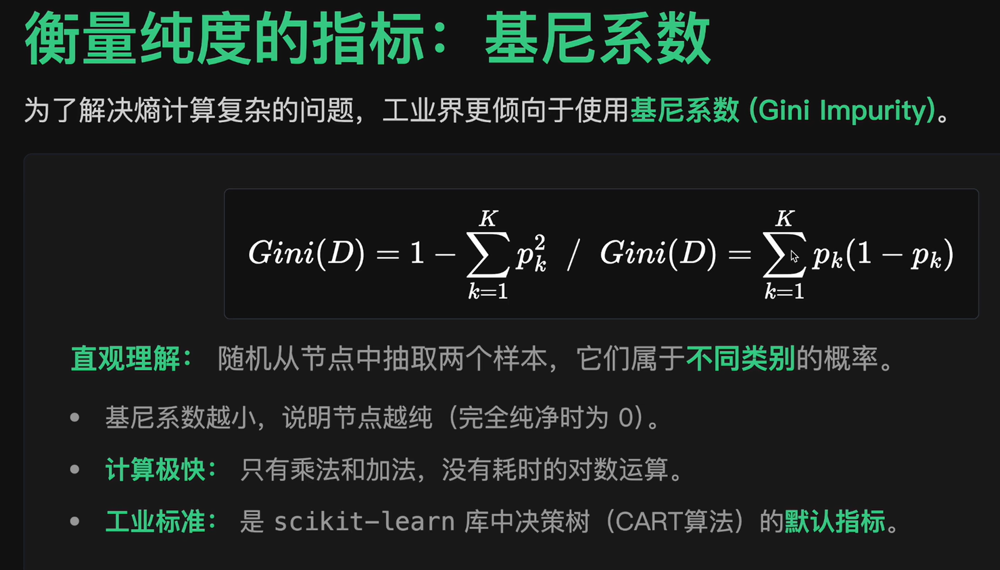

经典题目：鸢尾花分类

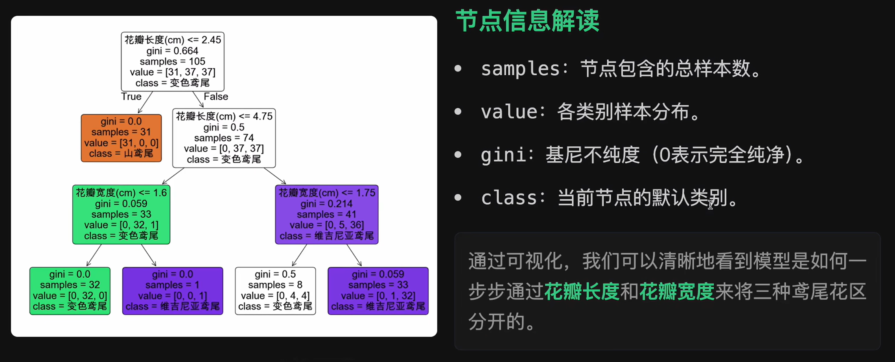

练习题

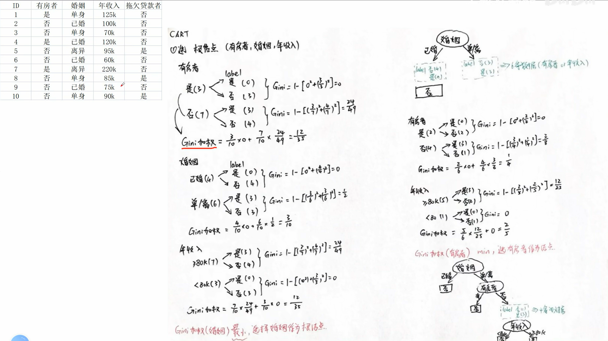


## 决策树剪枝

连续值处理：在一串数据中的每一个位置做一次分割，计算熵值，选熵最小的。比如分割为`[60]`和`[70,75,85,95,100,120]`，分割为`[60,70]`和`[75,85,95,100,120]`

剪枝：防止过拟合

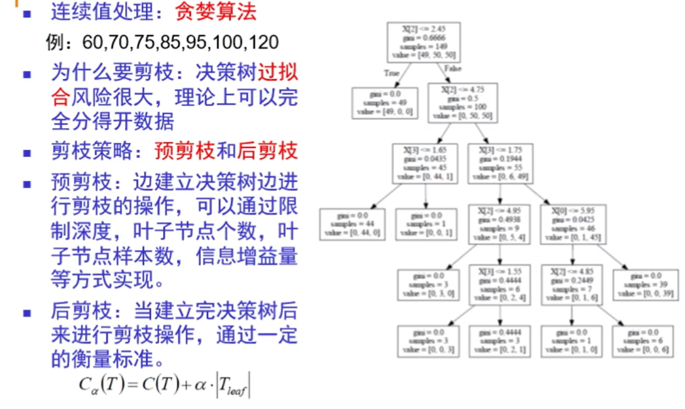

**决策树容易过拟合，稳定性比较差** → 随机森林、梯度提升树（GBDT、XGBoost、LightGBM）

# 五、集成学习 Ensemble Learning

**集成学习（Ensemble Learning）**：**将多个弱学习器组合成一个强学习器**，以获得比任何单一模型更好的泛化性能。

## 分类

集成学习有两大主流思想：Bagging 和 Boosting。它们的目标都是把一群弱模型组合成一个强模型，但实现路径截然不同。

**（1）Bagging：少数服从多数**

随机森林背后的思想就是 Bagging（**B**ootstrap **Agg**regat**ing**）：

+ **有放回采样**，给每棵树准备一份不同的训练数据；随机选特征，让每棵树学到不同的视角
+ **最终投票/平均**，综合所有树的意见给出结果

**（2）Boosting：接力纠错**

+ 树依次训练，一棵接一棵，每棵新树专注于前面所有树犯的错误
+ 最终所有树的预测累加起来

**每个新模型都在拟合前面模型的残差（错误），接力合作，逐步逼近真实答案。**参考高尔夫的进球过程

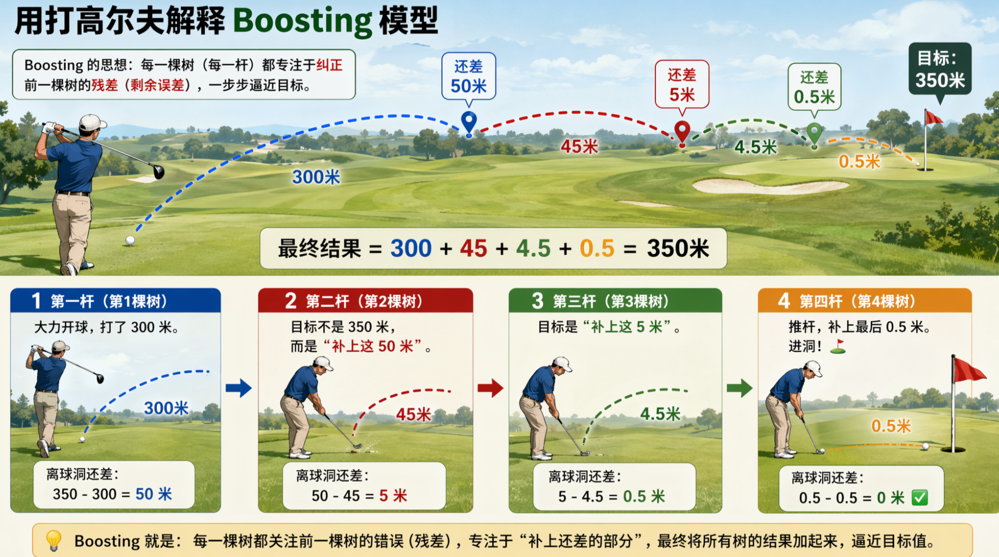

| **维度**     | **Bagging（随机森林）** | **Boosting（梯度提升树）** |
| ------------ | ----------------------- | -------------------------- |
| 训练方式     | 多棵树并行独立训练      | 多棵树串行依次训练         |
| 每棵树的目标 | 学习原始目标            | 学习前面模型的残差         |

## Bagging——随机森林

想象一下，你遇到一个医学难题。你是愿意只听一位医生的诊断，还是愿意请一个由 100 位不同专长的医生组成的会诊团，最后投票表决？显然，后者的容错率更高，结果更可靠。

随机森林就是这样一个专家团，它不再依赖一棵树做决定，而是通过**随机采样**建立起成百上千棵各不相同的决策树，组成一片森林。预测时让所有树独立给出判断，最终汇总结果（分类投票 / 回归求平均）。这种机制有效中和了**单棵树的偏见与错误**，让模型既准确又稳健。

### 为什么叫随机森林？

顾名思义，这个名字包含两个核心词汇：**"随机"** 和 **"森林"**。

+ **森林（Forest）**：由大量决策树组成。决策树是基础模型，通过一系列 `IF-THEN` 规则对数据进行逐层切分。
+ **随机（Random）**：这是算法的灵魂。如果所有树都用完全一样的数据和特征训练，那 100 棵树长得一模一样，投票也就失去了意义。为了保证每棵树的**多样性**，算法引入了**双重随机性**：

#### 样本随机（Bootstrap）

采用**有放回抽样**。

假设训练集有N个样本，每次训练一棵树时，从原数据集中随机有放回地抽取N个样本，构成该树专属的训练子集。由于是有放回的，**部分样本会被重复抽到，部分样本则完全不会出现**——这使得每棵树使用的样本都略有不同。

被抽到的样本经过去重之后称为训练集，剩余从未被抽到的样本即为测试集。

#### 特征随机（Random Subspace）

在决策树的每个节点进行分裂时，并不考虑全部特征，而是**随机抽取其中一个子集**（通常取 $\sqrt d$ 个，$d$ 为总特征数)，然后**仅在这些候选特征中寻找最优分裂点**。

这一步极其关键。举个例子：假设数据中"收入"是一个非常强的预测特征。没有特征随机时，每棵树的根节点都会选"收入"，导致**所有树结构高度相似——这"长得差不多的树投票，和一棵树也没什么区别**。

加入特征随机后，有些树在根节点根本看不到"收入"，被迫用其他特征来分裂。这些树单独来看可能不如总是用收入的树准确，但它们**提供了不同的视角**，组合起来反而更强。这就是集成学习的精髓——个体不必完美，多样性才是力量。

### 袋外估计（OOB）：免费的验证集

每次 Bootstrap（有放回抽样） 采样时，某个样本在N次抽取中始终未被选中的概率为：


也就是说每棵树大约有 **1/3 的样本**没参与训练，这些未参与训练的样本被称为该树的**袋外样本（Out-of-Bag, OOB）**。这意味着，无论数据集是 1 万条还是 100 万条，**每棵树在训练时，天然就会漏掉约 36.8%的数据，而这些数据刚好就成了天然的验证集**。

随机森林的这一独有特性完美实现了**训练与验证的无缝融合**，它彻底**省去了额外划分验证集和交叉验证的繁琐开销**，让所有数据都能直接投入训练并同步支持超参数调优；这种零浪费的机制在小数据集场景下尤为珍贵，确保了每一个珍贵的样本都能发挥出最大价值。

### 算法工作流程

了解了核心机制，我们来看随机森林的完整运行步骤：

**第一步：构建森林**
设定森林中树的数量 `n_estimators`（如 100、500）。

**第二步：逐棵生成决策树**
对于第 $t$ 棵树（$t = 1,2,...,T$）：

1. 通过 Bootstrap 从原始数据集中有放回地抽取 N 个样本，作为该树的训练集；
2. 基于该训练集开始构建决策树：在每个节点分裂时，随机选取m个候选特征，在其中找到最佳切分点；
3. 让树充分生长，**通常不剪枝**，或仅设置一个较大的最大深度。

**第三步：集成输出**
所有树训练完毕后，对新样本 x 进行预测：

+ **分类任务**：每棵树投出一票，采用**多数表决（Majority Voting）**：


+ **回归任务**：每棵树输出一个数值，采用**简单平均（Averaging）**：


### 特征重要性

实际工作中，**随机森林**不只用来预测，还**常用来做特征重要性分析**，这是随机森林在工业界最常用的能力之一。很多时候，特征重要性分析非常有价值，它能帮你理解

+ 哪些因素在起作用？
+ 哪些特征可以舍弃？

有两种计算特征重要性的方法：

+ **基于不纯度减少（MDI）**：统计每个特征在所有树的所有节点上带来的不纯度（如基尼系数）下降量之和，再取平均。计算快，训练时顺便就可以得到，这是 sklearn 默认计算方式。但 MDI 对高基数特征有偏好（如 ID 列，虽然 ID 对预测毫无意义）。
+ **基于排列的重要性（Permutation Importance）**：将某个特征的值随机打乱，观察模型性能下降了多少。下降越多，说明该特征越重要。这种方法更可靠，不受特征基数影响，是目前更被推荐的方法。

### 优缺点

随机森林用**样本随机 + 特征随机**制造多样性，再用集体投票消除个体偏差——它未必是精度最高的模型，但几乎总是最值得首先尝试的那一个。


核心优势

+ **抗过拟合能力强**：**单棵决策树极易过拟合**，但通过 Bagging 和特征随机化的融合，极大地降低了模型的方差。
+ **极简的数据预处理**：**不需要对数据进行归一化或标准化**，能够很好地处理缺失值，并且对异常值不敏感。
+ **高维数据友好**：即使有成千上万个特征，它也能从容应对，不需要显式的降维。
+ **附赠特征重要性**：模型训练完后，可以自然地输出各个特征对预测结果的贡献度，非常有利于业务上的归因分析。
+ **天然支持并行计算**：因为每棵树的生成是完全独立的，所以可以完美利用多核 CPU 加速训练。


局限性

+ **黑盒模型**：虽然单棵决策树可解释性极强（白盒），但成百上千棵树组合在一起后，就变成了难以直观解释的黑盒。
+ **计算与内存开销大**：保存海量的树结构需要较大的内存空间；在预测阶段，每一条数据都需要穿过所有的树，预测速度相对较慢，不适合极其追求毫秒级延迟的在线场景。
+ **在噪音极大的分类任务中**：仍然有一定概率出现过拟合。

## Boosting

### GBDT的原理

GBDT，即 Gradient Boosting Decision Tree，**梯度提升决策树**，是 GradientBoosting 框架下使用的较多的一个模型，且在 GBDT 中，其**基学习器**是分类回归树，也就是 CART，且使用的是 CART 树中的回归树。

我们说每棵新树学习上一轮的残差，逐步逼近真实值。既然核心操作是拟合残差，那叫残差提升树不就行了？为什么偏偏要叫梯度提升树？

GBDT 的模型是多棵树的累加，它不像线性回归或神经网络那样，有一个固定维度的参数向量 θ 可以调。它的==优化方式==是**每一轮添加一整棵新树 $h_m(x)$** 来改进模型。

可是没有参数可调，怎么优化？GBDT 作者 Friedman 把我们熟悉的梯度下降类比到了这个场景中：

|              | **经典梯度下降**                                             | **GBDT**                                   |
| ------------ | ------------------------------------------------------------ | ------------------------------------------ |
| 优化对象     | 参数 θ（一组数字）                                           | 函数 $F(x)$（一个模型）                    |
| 当前状态     | 当前参数值 $\theta_{m-1}$                                    | 当前模型 $F_{m-1}(x)$                      |
| 下降方向     | 负梯度 $-\frac{\partial L}{\partial \theta}$                 | 负梯度 $-\frac{\partial L}{\partial F(x)}$ |
| 更新方式     | $\theta_m = \theta_{m-1} - \eta · \frac{\partial L}{\partial \theta}$ | $F_m(x) = F_{m-1}(x) + \eta·h_m(x)$        |
| 每一步做什么 | 调整参数数值                                                 | 添加一棵新树 $h_m(x)$                      |

$$
F_m(x) = F_0(x) + \eta·\sum_{k = 1}^m h_k(x)
$$

所以 GBDT 每一轮做的事情是：

1. 计算每个样本上的负梯度，当前模型最应该修正的方向
2. 训练一棵决策树**去拟合这些负梯度值**
3. 把这棵树乘以学习率加到现有模型上，相当于沿着下坡方向走一小步

当损失函数是**均方误差MSE**时：
$$
L = \frac{1}{2}(y - F(x))^2
$$
对 $F(x)$ 求导，取负号：
$$
-\frac{\partial L}{\partial F(x)}  =y - F(x) = 残差
$$
**在 MSE 下，负梯度恰好就是残差，**这就是为什么前面说每棵新树拟合残差。但这只是梯度提升在 MSE 这个特殊损失函数下的表现，换成其他损失函数负梯度就不再是简单的残差了：

| **损失函数**     | **负梯度（每棵新树拟合的目标）**                             |
| ---------------- | ------------------------------------------------------------ |
| 均方误差（MSE）  | $y - F(x)$，是残差                                           |
| 绝对误差（MAE）  | $sign(y - F(x))$，只有方向±1，对异常值更稳健                 |
| 对数损失（分类） | $y - p$，真实标签减去预测概率，这也是为什么 GBDT 可以处理分类问题 |

不管什么损失函数，只要能求导，GBDT 就能算出负梯度，训练新树去拟合它。 

+ **Gradient（梯度）**：说的是优化方法——**用负梯度来指引每棵新树的学习方向**，残差只是 MSE 下的特殊表现
+ **Boosting（提升）**：说的是最终效果——多棵弱决策树逐步叠加，**模型能力不断提升**

两者合在一起，就是**梯度提升树（Gradient Boosting Decision Trees）**。

### GBDT的优缺点

优点

+ **预测精度高**：在结构化/表格数据上，GBDT 长期霸占各类竞赛和业务场景
+ **可以处理混合特征**：数值型、类别型（编码后）都能用
+ **自带特征重要性**：可以帮助理解哪些特征对预测影响最大
+ **对特征缩放不敏感**：不需要标准化或归一化
+ **损失函数灵活**：可以自定义损失函数，适配各种业务需求

缺点

+ **训练速度较慢**：串行训练，树之间无法并行（训练单棵树内部可以并行）
+ **容易过拟合**：特别是数据量少、噪声大的时候，需要仔细调参
+ **对超参数敏感**：学习率、树的数量、树的深度等参数需要认真调节
+ **不擅长超高维稀疏数据**：如文本的 one-hot 编码，这种场景下线性模型或深度模型可能更合适
+ **类别特征处理不够原生**：经典 GBDT 需要**手动编码类别特征**（转成One-hot 编码）

### 工业界的进化：XGBoost / LightGBM / CatBoost

经典 GBDT 算法确立了 Boosting 框架，但在实际工业应用中仍面临诸多挑战，训练大数据太慢、容易过拟合、类别特征处理麻烦……

为此，三大工业级框架应运而生。

#### XGBoost

2014 年陈天奇开发的 XGBoost（eXtreme Gradient Boosting）可能是机器学习历史上最具影响力的开源项目之一。

**核心改进**

+ **正则化**：在目标函数中显式加入树复杂度的惩罚项（叶节点数量 + 叶节点权重的 L2 正则），有效防止过拟合
+ **二阶梯度信息**：经典 GBDT 只用一阶梯度，XGBoost 同时利用**二阶梯度**，使得分裂点选择更精准
+ **工程优化**：支持列采样、缓存感知访问、核外计算等，使得单机处理上亿样本成为可能
+ **内置正则化和 Early Stopping**：训练过程更可控

#### LightGBM

2017 年微软推出的 LightGBM 主打一个字：**快**。

**核心改进**

+ **直方图算法：** **XGBoost 默认会去遍历所有数据点寻找分裂点**；而 LightGBM 将连续的浮点特征分段（分桶）成离散的直方图。寻找分裂点时只需要遍历这些分桶，计算量呈指数级下降，且内存占用极小。
  + **带深度限制的 Leaf-wise 生长策略：** 传统决策树是一层一层整齐生长的（Level-wise）。LightGBM 则是谁的**残差大**就顺着谁往下长（Leaf-wise），这导致树的结构不对称，但在同等叶子节点下能达到更高的精度。

+ 它还引入了单边梯度采样（GOSS）和互斥特征捆绑（EFB），进一步将速度推向极限。

LightGBM 在大数据集上训练速度通常是 XGBoost 的 **5~10 倍**，内存消耗也更低。

#### CatBoost

2017 年俄罗斯互联网巨头 Yandex 针对类别特征的处理推出的 CatBoost（Category Boosting）。在处理具有**大量类别型特征**的业务场景中，它是当之无愧的王者。

**核心改进：**

+ **原生支持类别特征：** 以前用 XGBoost，**开发者必须手动把类别特征转换成 One-hot 编码**（如果类别有一万个，特征就会暴增一万列，稀疏且低效）。CatBoost 可以直接把类别型特征扔进去，它内部有一套极强的方法（Target Statistics）自动处理。
+ **排序提升：** GBDT 家族有一个隐患叫**预测偏移**，即GBDT模型在迭代训练过程中，由于每轮都基于同一训练集计算梯度并更新模型，使得模型学习到的梯度方向逐渐偏离真实数据分布下的最优梯度方向，导致模型预测结果相对于真实目标值产生系统性偏差的现象。（产生原因：GBDT不断在训练集上修正残差，但由于修正过程过度依赖当前训练数据，模型逐渐偏向训练集的特征和噪声，使最终预测结果偏离真实规律）。CatBoost 通过一种极其**严谨的排序策略**，确保在训练每一个样本时，只使用排在它前面的样本信息，完美解决了这个问题，极大地提升了泛化能力。
+ **对称树结构：** 它强制生成的决策树是完全对称的，这使得预测时的速度（推理速度）比 XGBoost 和 LightGBM 都要快得多。

#### 三者如何选择？

| **场景**                             | **推荐框架**        |
| ------------------------------------ | ------------------- |
| Kaggle 竞赛，追求极致精度            | XGBoost 或 LightGBM |
| 大数据集（>100万样本），需要快速训练 | LightGBM            |
| 数据中有大量类别特征                 | CatBoost            |

### 总结

对决策树、随机森林、GBDT 做个简单总结

|            | **决策树** | **随机森林**         | **GBDT / XGBoost**   |
| ---------- | ---------- | -------------------- | -------------------- |
| 模型数量   | 1棵        | 多棵（并行）         | 多棵（串行）         |
| 集成策略   | 无         | Bagging：投票/平均   | Boosting：逐步累加   |
| 单棵树特点 | 可深可浅   | 深树（低偏差高方差） | 浅树（高偏差低方差） |
| 核心目标   | 基线模型   | 降低方差             | 降低偏差             |
| 过拟合风险 | 高         | 低                   | 中等                 |
| 训练速度   | 快         | 较快（可并行）       | 较慢（串行）         |
| 预测精度   | 一般       | 好                   | 通常最好             |

+ **决策树**是基础模型——简单符合直觉，但容易过拟合
+ **随机森林**用 Bagging 思想，让多棵树并行投票，降低方差
+ **GBDT**用 Boosting 思想，让多棵树串行纠错，降低偏差
+ **XGBoost / LightGBM / CatBoost**是 GBDT 的工业级进化，更快、更准、更易用

在实际工作中，面对结构化的表格数据，GBDT 家族（尤其是 XGBoost 和 LightGBM）几乎是默认的首选方案，它们在无数 Kaggle 竞赛和工业场景中证明了自己的实力。

### Adaboost（算法题）

算法内容

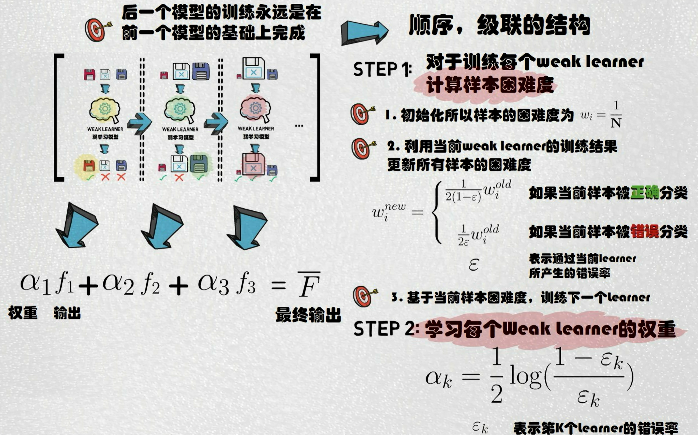

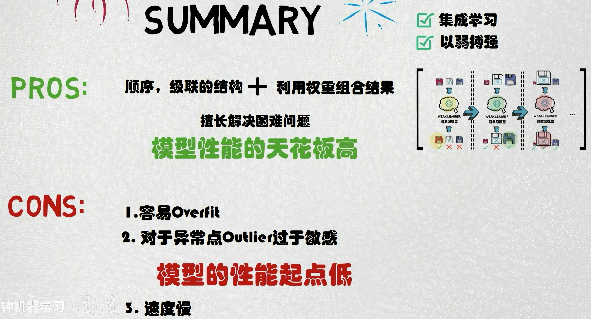

算法流程

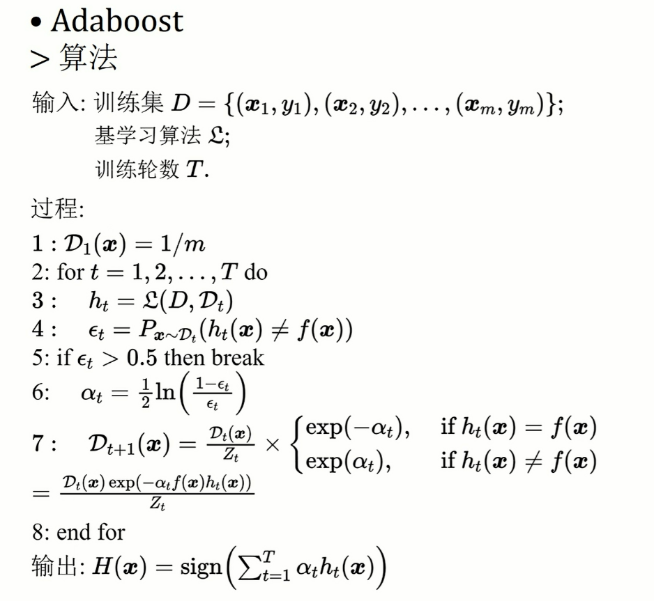

题目计算

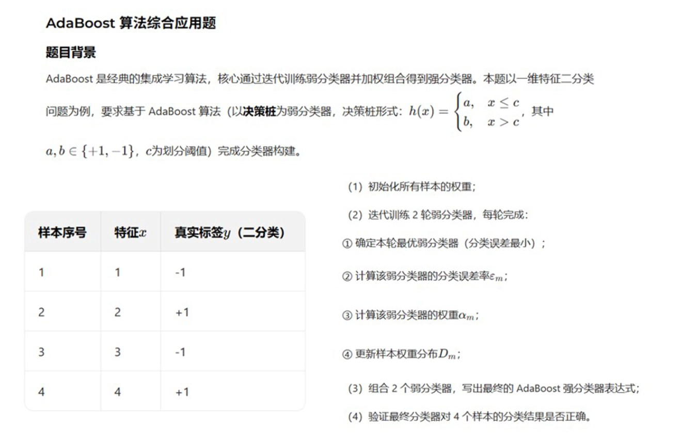

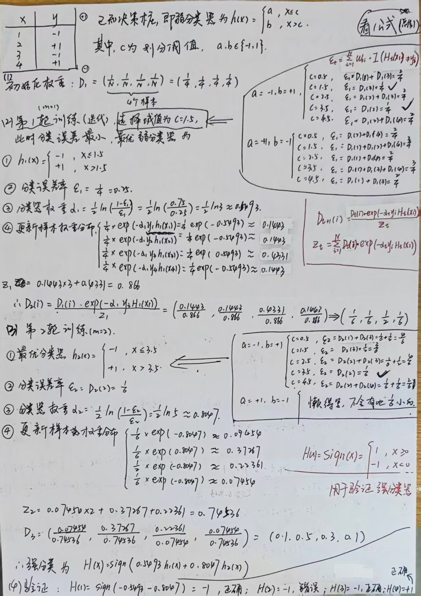

# 六、支持向量机 SVM

## 硬间隔&软间隔 

为了区分两类维度数据，N为数据的样本数，M为数据的维度数，如何设计一个维度为M-1的超平面将两类数据分开。以二维数据为例，需要找到一条**决策边界（decision boundary）**。

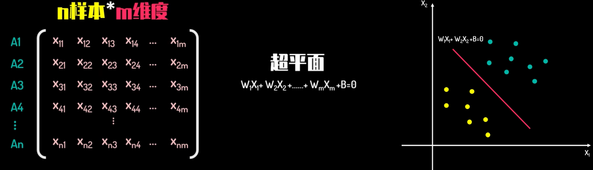

两类数据所有的点都与决策边界线保证一定的距离。这个距离起到缓冲区的作用，当缓冲区足够大时，分类结果的可信度更高。这个缓冲区叫做**间隔**。

间隔距离可以体现两类数据的差异大小，因此寻找最佳决策边界线的问题可以转化为求解两类数据的最大间隔问题。间隔的正中就是决策边界。当有新数据需要判断时，根据其与决策边界的相对位置，就可以进行分类。

间隔的上下边界所经过的数据点叫“**支持向量**”。这也是我们将本方法命名为“**支持向量机**”的原因。

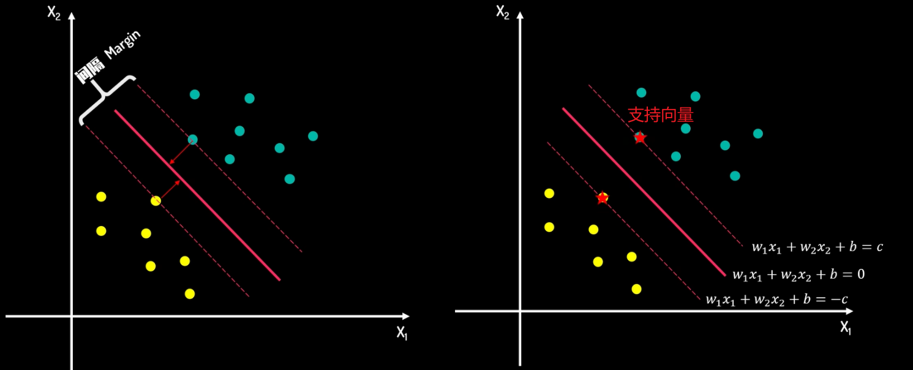

将等式两边同时除以c，分别用$w1'$，$w2'$，和$b'$替代原方程中的$w1,w2,b$，同时方程右边变为+1、0和-1。这样就方便将第一个和第三个方程定义为正负超平面。

因为$w1',w2',b'$只是求解的代号，替换成$w1,w2,b$也不影响运算。所以把$w1',w2',b'$替换回$w1,w2,b$：

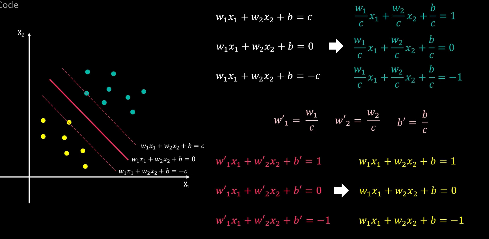

最终只需要求解w、b就可以得到三个超平面方程式，正超平面、负超平面、决策超平面。

所有正超平面及其上方的数据点为**正类**，所有负超平面及其下方的数据点为负类。当有新数据需要判断类别时，只需要判断它与决策超平面的相对位置即可。

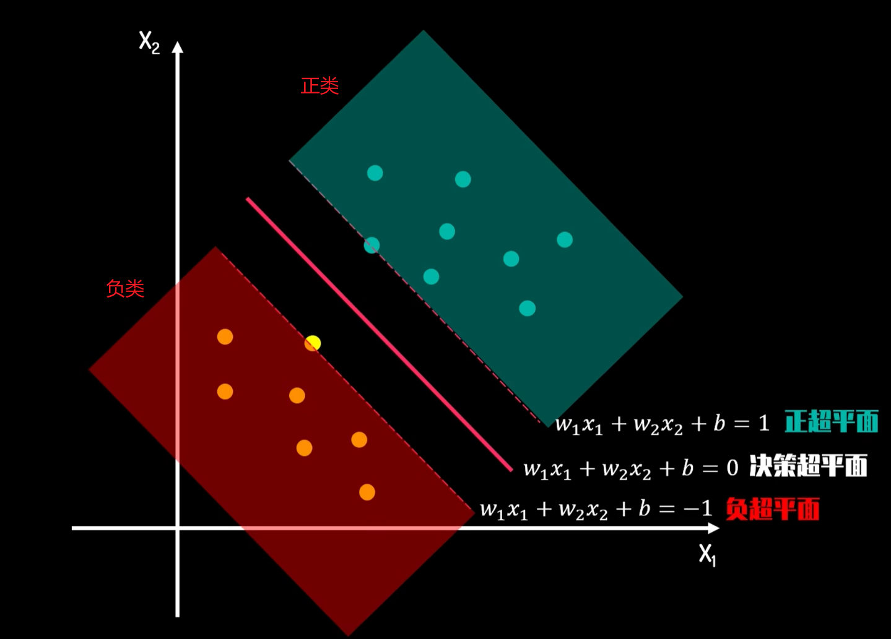

如果新加入一个异常数据点在政府超平面之间，为了拟合异常点就需要减小间隔，这种情况下考虑所有数据点得到的间隔叫做**硬间隔（hard margin）**，如果不想考虑异常点，就需要考虑损失。

为了防止异常点的影响，引入**损失因子**的概念。每个异常点都有对应的损失值：把间隔距离想象成经营收入，损失值想象成经营成本，于是目标就可以转换为最大化利润。该最优解下形成的间隔叫**软间隔（soft margin）**。

软间隔有一定的容错率，目的是在间隔距离和错误大小之间找一个平衡。

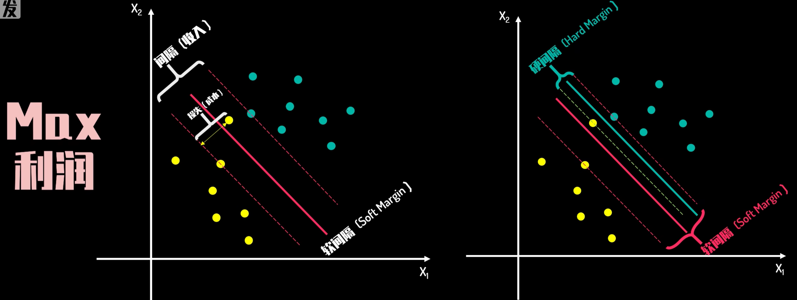

## 硬间隔的数学原理

### KKT条件

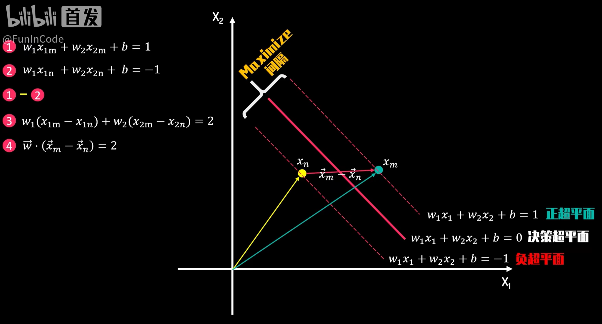

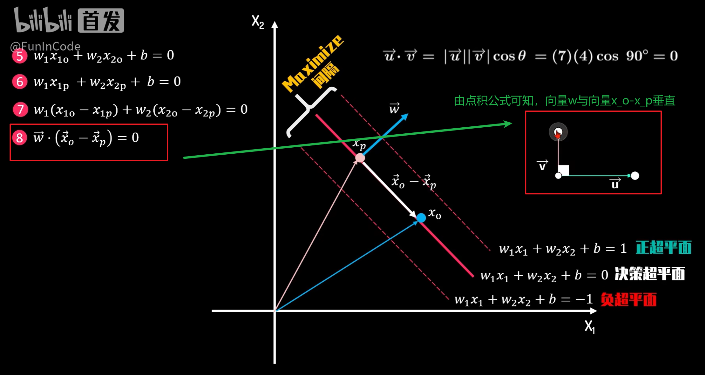

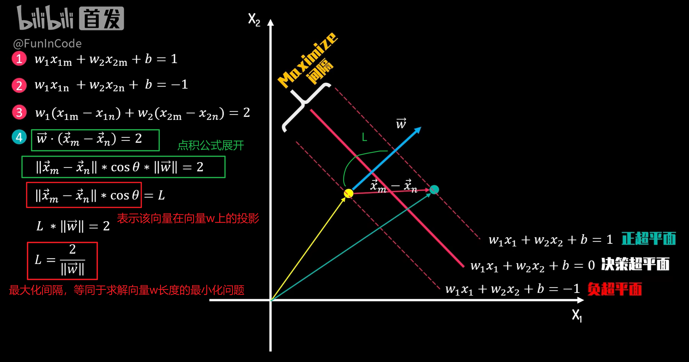

从以上推导过程可以看出，最大化间隔，等同于求解向量w长度的最小化问题。

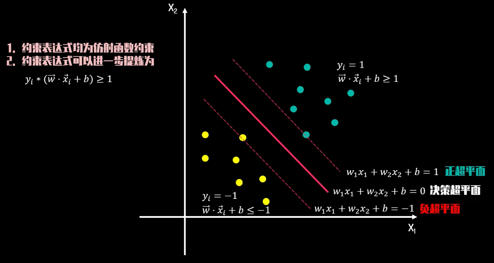

这是一个仿射函数约束下的凸优化问题。

如果约束条件是等式，可以直接使用拉格朗日乘子法求解；如果约束条件是不等式，则要增加一个非负项。如本例中，在右边添加$p_i^2$，将不等式约束转换为等式约束，这之后再使用拉格朗日乘子法，得到拉格朗日方程式：

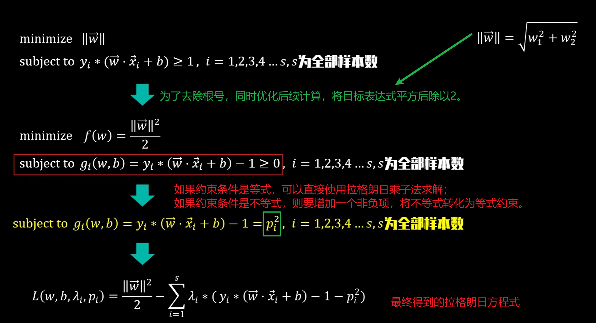

为求该拉格朗日方程式的极值，分别对$w,b,λ_i,p_i$求偏导，使求导结果为0，得到下图中的四个等式，将等式4左右两边再乘以一个$p_i$，将等式3代入到等式4中得到新的等式4：


已经开始看不懂了（从得到的两个式子的几何意义开始）。

拉格朗日函数不是间隔长度L。这里拉格朗日函数值越小，则w越小，才能使得真正的间隔长度L越大。因此如果λ小于零，则越违背约束条件，拉格朗日函数越小，这个时候显然不是我们想要的。


因此$\lambda_i ≥ 0$，加上该条件，则得到所谓的**KKT**条件。


### SVM对偶性


回到之前的SVM对偶问题的求解：先对最小化部分求解。

可以直接代入之前的KKT条件结果，得到更简洁的目标函数：


只有正负超平面的支持向量的$\lambda_i>0$，正超平面以上、负超平面以下的都是$\lambda_i=0$，根据下图中的KKT条件可以推算出来。所以计算向量w时只需要用到支持向量


之所以我们绕了这样一大圈去求对偶问题，除了对偶问题从目标函数表达式和约束条件上更简洁以外，更主要的原因是因为对偶问题有一个非常好的特征，也就是最优解仅根据支持向量的点积结果所决定，也可以理解为仅由支持向量的空间相似度所决定。而这就为我们下一期的Kernel Trick铺平了道路。

既然我们只需要得到空间相似度结果，而这直接就可以通过核函数求得，那为什么还需要绕一圈去寻找维度转化函数了呢？这个问题将在下期进一步讨论。

## 升维转换


升维转换：

+ 通过合适的维度转换函数，将**低维数据进行升维**
+ 在高维度下求解SVM模型，找到对应的**决策边界超平面**
+ 当有**新数据**需要进行分类预测时，可先对其进行**升维转换**，再根据高维度下的决策边界超平面进行判断。


但提升维度需要明确的维度转换函数，以及海量的数据存储和计算需求。为了**避免将数据送入高维度计算，同时保证同样的分类效果**，就要运用**Kernel Trick核技巧**。

由于**SVM本质**是**量化两类数据差异**的方法，而核函数Kernel function能提供高维度向量相似度的测量，通过选取合适的核公式，我们就可以不用知晓具体的维度转换函数，直接获得数据的高维度差异度，并以此进行分类判断。


## 核技巧（Kernel Trick）

参考视频：[【数之道26】SVM支持向量机-核技巧Kernel Trick详解(多项式核函数，无限维度高斯核函数）](https://www.bilibili.com/video/BV1Nb4y1s7pE)

记笔记无能了。🙃

## 软间隔的数学原理

由于新数据的加入，原硬间隔的约束条件被其破坏，产生了系统损失。这个包含损失的间隔就是“软间隔”。

这个违反约束的数据（新加入的异常值）对应的误差（或损失值）叫$\epsilon_a$：

铰链损失函数（Hinge Loss Function）
$$
\epsilon_a = max(0, 1 - y_i*(\overrightarrow w·\overrightarrow x_i + b))
$$
数据点a离负超平面越近时，一开始小于1的A越接近1，$\epsilon_a$越接近0；数据点a移动到负超平面时，A=1，$\epsilon_a$=0；数据点a向下越过负超平面后，A越大于1，原约束条件$A>=1$并不会被破坏，$\epsilon_a$保持为0。


与上面硬间隔的优化问题不同，在求解软间隔的优化问题过程中，需要引入损失值的概念，同时考虑向量w的长度和损失值$\epsilon_i$的大小。然而，向量w的长度和损失值$\epsilon_i$的大小是相互制约的：向量w的长度越大，间隔越小，原始数据越不容易出现分类错误，因此损失值$\epsilon_i$的总和越小；同理，向量w的长度越小，损失值$\epsilon_i$的总和越大。最后的最优解是当向量w的长度和损失值$\epsilon_i$的大小达到均衡的状态。


然后就能用硬间隔求解方法中类似的方法求解软间隔的优化问题。但在实际操作中，会对损失值部分乘以一个常数C，来控制对违反约束条件的数据点的容忍度。


## 算法题

题目


解答


# 七、聚类 K-means

## 无监督学习——聚类问题

刚学完监督学习时，我们通常已经习惯了“**数据 + 标签**”的训练模式：给定输入 X 和对应输出 y，让模型学习二者之间的映射关系。例如，在分类任务中，模型学习“特征 → 类别”的映射；在回归任务中，模型学习“特征 → 连续值”的映射。

然而在现实中我们经常会遇到**没有标签的数据**。这时数据本身并不会直接告诉我们答案是什么，但其中往往隐含着某种结构或规律，需要**通过算法去自动发现**。例如：

+ **用户画像与分群**
  假设我们掌握了大量用户的购买频次、消费金额等行为数据，希望将用户划分为若干群体，例如高价值用户、潜力用户或流失风险用户。但在实际开始分析之前，我们并不知道每个用户究竟属于哪一类。
+ **图像压缩**
  一张全彩图像可能包含数十万甚至上百万种颜色。如果希望只保留16种最具代表性的颜色来近似原图，从而减少存储空间，那么就需要从所有颜色中自动找出若干典型代表。
+ **异常检测**
  在服务器日志或网络请求数据中，我们可能希望识别出那些行为模式明显偏离常规的数据点，例如异常访问、恶意攻击或欺诈行为。但这些异常样本往往没有明确标签，只能通过数据分布特征去识别。

这类问题都属于**聚类问题**。所谓聚类，就是在没有标签的前提下，根据样本之间的相似性，将数据自动划分为若干组，即不同**簇**，使得**同组内样本尽可能相似，不同组之间尽可能有差异**。

## 核心思想

K-Means 是一种经典的聚类算法，用于将一批**无标签数据**自动划分为 K 个簇。它的思想非常直观：**让相似的样本尽量被分到同一组，并且使每一组内部尽可能紧凑。**

在 K-Means 中，所谓**相似**通常是通过**距离**来衡量的：

+ 距离越近，说明两个样本越相似；
+ 距离越远，说明两个样本之间的差异越大。

因此，K-Means 的目标可以理解为：**找到 K 个具有代表性的中心点，使每个样本都归属于离自己最近的那个中心，并尽可能减小所有样本到各自中心的距离。**


算法名称中的：

+ **K**：**预先指定**的**簇数**；
+ **Means**：均值，即每个簇的中心位置由该簇内所有样本的均值来表示。

## 核心概念

### 质心

质心就是一个簇的中心位置。如果一个簇中包含多个样本点，那么该簇的质心通常取这些点在各个维度上的**均值**，这也是算法名称中 “Means” 的来源。

例如，在二维空间中，一个簇包含三个点：$(1,2),(2,3),(3,4)$，那么这个簇的质心为：
$$
(\frac{1+2+3}{3},\frac{2+3+4}{3}) = (2,3)
$$
需要注意的是，**质心不一定是真实存在于数据集中的某个样本点**，它只是该簇所有样本位置的平均表示。

### 距离

在聚类过程中，K-Means 需要不断判断样本点之间以及样本点与质心之间的距离。最常用的距离度量方式是**欧氏距离**，也就是几何意义上两点之间的直线距离。

在二维平面中，A、B 两点之间的欧氏距离为：
$$
d(A,B) = \sqrt{(A_x - B_x)^2+(A_y - b_y)^2}
$$
当维度扩展到 (n) 维时，公式可以写为：
$$
d(A,B) = \sqrt{\sum_{i = 1}^n(A_i - B_i)^2}
$$
其基本思路并没有变化，只是在每一个维度上分别求差、平方、求和，最后再开平方。

### 簇内相似度

K-Means 所追求的是：**同一个簇中的样本尽可能彼此接近，并且尽量靠近该簇的质心。**通常这一目标通过簇内平方和 **SSE（Sum of Squared Errors）** 来衡量，其表达式为：
$$
SSE = \sum_{i = 1}^K \sum_{x \in C_i}||x - \mu_i||^2
$$
其中：

+ $C_i$ 表示第 i 个**簇**；
+ $\mu_i$ 表示第 i 个簇的**质心**；
+ $||x - \mu_i||^2$ 表示**样本点到质心的平方距离**。

**这个值越小，说明簇内样本越紧凑，聚类效果通常越好。**

因此，K-Means 的本质就是通过不断调整样本划分和质心位置，使簇内平方和持续减小，直到聚类结果趋于稳定。

## K-Means 的迭代流程

K-Means 的整体流程可以概括为：**选中心 → 分簇 → 更新中心 → 再分簇 → 直到稳定**。其本质是一种不断迭代、逐步优化聚类结果的过程。具体来说，算法通常按照以下步骤进行：

1. **初始化质心**
   预先指定聚类的簇数 K，从数据集中**随机选取** K 个初始中心点作为质心。

2. **分配样本到最近的簇**
   分别计算每一个样本到各个质心的距离，并将其划分到距离最近的那个质心所在的簇中。这样所有样本都会被分配到某一个簇里。

3. **更新质心位置**
   根据当前簇中的所有样本，重新计算该簇的中心点，即求这些样本在各个维度上的均值。更新后的质心会更准确地反映该簇样本的整体位置。

4. **重复划分与更新**
   由于质心位置发生了变化，原有的样本划分结果可能不再是最优的。因此，**需要重新计算每个样本到新质心的距离**，并**将样本分配到最近的簇中**。随后再依据新的簇划分结果更新质心。如此反复，算法便进入持续迭代的过程。

5. **判断是否收敛并停止**
   当满足以下任一条件时，算法可以停止迭代：

   + 质心的位置几乎不再发生变化；

   + 样本的簇归属不再变化；

   + 目标函数（如簇内平方和）的下降幅度已经非常小；

   + 达到预先设定的最大迭代次数。

综上，K-Means 的核心就是在**样本分配**和**质心更新**之间不断循环，通过迭代方式逐步减小簇内误差，直到聚类结果趋于稳定。

## K-Means 优化

### 初始质心选择 K-Means++

在 K-Means 中，首轮迭代通常会随机选择质心，但不同的初始质心往往会导致不同的收敛结果，甚至可能使算法陷入较差的局部最优解。也就是说，即使面对同一份数据，如果初始化方式不同，最终得到的聚类结果也可能存在明显差异。因此，初始质心的选取对 K-Means 的聚类效果具有重要影响。

为了减轻这一问题，实际应用中常采用 **K-Means++** 来改进初始化过程。K-Means++ 会先随机选取一个样本点作为第一个质心；之后，在选择下一个质心时，会优先考虑那些距离当前已有质心较远的样本点。重复这一过程，直到选出 K 个初始质心。

### 用肘部法则选择最佳 K 值

K-Means 最大的实际问题之一是簇数 K 需要由用户预先指定。然而在大多数真实场景中，数据应当被分成几类往往并不清晰，选择不当的 K 值可能导致聚类结果严重失真——K 取得太小，会强行将本来差异明显的样本合并到同一个簇中；K 取得太大，则会将原本紧凑的簇人为拆散，失去聚类的意义。

**肘部法则**是实际中**最常用的选 K 策略**，SSE 衡量的是所有样本点到其所在簇质心的距离之和。**SSE 越小，说明簇内样本越紧凑，聚类效果越好。** 


不难发现，随着 K 的增大，每个簇中的样本数量会减少，样本与质心之间的距离自然也会缩短，SSE 会持续下降。当 K 等于样本总数时，每个样本自成一簇，SSE 将降为零——但这显然没有任何实际意义。因此，SSE 越小并不意味着聚类结果越合理，关键在于找到一个**性价比最优的 K 值**。

肘部法则正是利用了这一规律，依次尝试不同的 K 值，分别计算对应的 SSE，然后将 K 与 SSE 的关系绘制成曲线。随着 K 的增大，SSE 起初会迅速下降，但当 K 超过某个值后，继续增加 K 所带来的 SSE 下降幅度会明显减小，曲线趋于平缓。这个**斜率突然减小、曲线由陡转平的拐点**，形如手肘的弯折处，因此被称为肘部。肘部所对应的 K 值，就是综合考虑聚类质量与模型复杂度后的较优选择。

## 聚类模型常见应用

### 常见应用举例

聚类算法虽然是一种无监督学习方法，不依赖任何标注数据，但在实际业务中却有着非常广泛的应用价值。它的核心作用是从无标签的数据中自动发现隐藏的结构和规律，进而为决策提供支持。

| **应用领域**   | **典型场景**         | **聚类的核心作用**                          |
| -------------- | -------------------- | ------------------------------------------- |
| **客户分群**   | 电商用户 RFM 分层    | 自动识别用户价值层级，支撑精准运营          |
| **图像处理**   | 颜色量化、图像分割   | 压缩颜色空间，划分图像语义区域              |
| **文档聚类**   | 新闻 / 论文自动归类  | 将海量文本按主题自动归组，辅助检索与推荐    |
| **异常检测**   | 网络入侵、信用卡欺诈 | 将远离所有簇中心的样本标记为潜在异常        |
| **数据预处理** | 连续特征离散化分桶   | 自适应分桶，增强特征表达能力                |
| **推荐系统**   | 协同过滤的冷启动     | 将新用户 / 物品归入相似簇，快速生成初始推荐 |

可以看出来聚类算法的价值不仅体现在单独作为分析工具使用，更常见的是作为**数据探索EDA、特征工程和系统冷启动**等环节的重要组成部分，与其他模型配合使用，从而在更大范围内发挥作用。

### 示例

使用 K-Means 可以把一张彩色图片里成千上万种颜色，压缩成 4 种、16 种、64 种颜色，实现图片瘦身、简化色彩。

```python
from sklearn.cluster import KMeans
from skimage import io
import numpy as np
import matplotlib.pyplot as plt

# 1. 读取图片并归一化
image = io.imread('your_image.jpg')  # 替换为你的图片路径
image = image / 255.0  # 归一化到 [0, 1]
h, w, c = image.shape
pixels = image.reshape(-1, 3)  # 展平为 (h*w, 3) 的像素矩阵

# 2. 对不同 K 值进行压缩
fig, axes = plt.subplots(1, 4, figsize=(20, 5))
axes[0].imshow(image)
axes[0].set_title(f'原图（{len(np.unique(pixels, axis=0))} 种颜色）')
axes[0].axis('off')

for idx, k in enumerate([4, 16, 64]):
    km = KMeans(n_clusters=k, n_init=10, random_state=42)
    labels = km.fit_predict(pixels)
    compressed = km.cluster_centers_[labels].reshape(h, w, c)
    
    axes[idx + 1].imshow(compressed)
    axes[idx + 1].set_title(f'K={k}（{k} 种颜色）')
    axes[idx + 1].axis('off')

plt.suptitle('K-Means 图像颜色压缩', fontsize=16)
plt.tight_layout()
plt.show()
```


K-Means 把 图片中相似的颜色聚成一类，每一类只保留一个中心颜色，所有像素都用这个中心颜色代替，K 越大，颜色越丰富，图片越清晰

1. 原图：几万种颜色
2. K=4：只有 4 种颜色（像卡通画）
3. K=16：16 种颜色（开始清晰）
4. K=64：64 种颜色（几乎和原图一样）

## 总结

K-Means 是一种非常经典的聚类算法，也是聚类任务中最常用的基线方法之一。它的核心思想简单直观：通过不断执行“样本分配”和“质心更新”两个步骤，使同一簇内的样本尽可能接近，不同簇之间尽可能区分。

### K-Means 的优点

K-Means 之所以应用广泛，主要得益于以下几个方面的优势：

+ **思想简单，容易理解**：流程非常清晰，就是不断“分配”和“更新”
+ **计算效率高**：对于大规模数据，K-Means 通常比较快，适合工程应用
+ **易于实现**：代码实现相对简单，是最常见的聚类入门算法之一
+ **结果可解释性**：每个簇都有一个中心，比较容易理解每类的特征

### K-Means 的局限性

尽管 K-Means 使用方便、效果直观，但它也有一些比较明显的局限，在使用时需要特别注意。

+ **需要预设 K**： 簇数需要事先指定，选择不当会严重影响结果（可用肘部法则、轮廓系数辅助选择）
+ **对初始值敏感**：不同的初始质心可能导致不同的收敛结果（可用 K-Means++ 改善初始化）
+ **只能发现凸形/球形簇**： 基于欧氏距离的度量假设簇是**球状分布**的，无法处理环形、月牙形等非凸形状（需要标准化、归一化等操作进行预处理）
+ **对噪声和离群点敏感**： 极端值会显著拉偏质心位置（可用 K-Medoids 替代）
+ **特征尺度敏感**： 不同量纲的特征会导致距离计算被大量纲特征主导，使用前需标准化

### K-Means 的实用改进

针对 K-Means 的一些固有问题，实际应用中通常会结合优化策略，以提升算法的稳定性和效果。

+ **使用 K-Means++ 进行初始化**：K-Means++ 的核心思想是让初始质心尽可能分散，从而减少糟糕初始化带来的影响。这种方法能够显著降低算法陷入较差局部最优解的概率，也是很多机器学习库中的默认初始化方式。
+ **多次运行并选择最优结果**：由于 K-Means 对初始值较敏感，因此常见做法是让算法从不同初始质心出发多次运行，然后选择目标函数值最小的一次结果。比如在 scikit-learn 中，常通过设置 `**n_init=10**` 来实现这一策略。
+ **使用 Mini-Batch K-Means 提高效率**：在大规模数据场景下，标准 K-Means 每次都使用全部样本更新质心，计算成本可能较高。Mini-Batch K-Means 则在每轮迭代中只使用一个小批量样本来更新质心，从而显著提高运行速度，适合海量数据集。

## 其他常见聚类算法


# 八、K近邻算法（KNN）

K-近邻算法（K-Nearest Neighbors, 简称 KNN）是一种基于实例的机器学习算法，广泛应用于分类和回归任务。它通过计算数据点之间的相似度（通常是距离度量），然后预测新的数据点的标签或数值。

KNN 的核心思想非常直观：“一个样本的类别（或数值）取决于其最邻近的 k 个邻居的类别（或数值）。”

## K近邻法三要素

+ 距离远近：距离度量（欧氏距离）
+ 参考点数量：K值（选择距离自己最近的K的点）
+ 分类决策规则：少数服从多数

举个例子：


## 算法流程

+ 准备数据集：数据集T中每一个元素是一个样本，其中$x_1,..,x_n$是样本特征，$y_1,..,y_n$是样本类别，新的待分类样本是$(x,y)$。
+ 根据距离度量计算和 K值计算 x 的邻域$N_k(x)$
+ 根据分类决策规则计算样本的类别 y


KNN 的流程详细步骤步骤：

+ 数据准备：将数据划分为训练集和测试集。
+ 计算距离：
  + KNN 通过计算待预测样本与所有训练样本之间的距离来找到最邻近的样本。
  + 常见的距离度量方法包括欧几里得距离、曼哈顿距离、余弦相似度等。
+ 选择 k 值：
  + k 是一个超参数，表示选择多少个最近邻居来进行投票或计算均值。合理选择 k 值对于 KNN 的表现至关重要。
+ 预测：
  + 对于分类问题，KNN 使用多数投票原则，根据 k 个最近邻居的类别进行投票，选出出现最多的类别。
  + 对于回归问题，KNN 使用均值或加权均值，将 k 个邻居的值进行平均或加权平均，得到预测值。
+ 输出结果：预测测试样本的类别或数值。

## kd树：计算样本x的邻域

如果计算待分类样本与每一个数据样本的距离，慢且开销大。为了更快的求出邻域，使用kd树的方式。

kd树（K-dimension tree）是一种对k维空间中的实例点进行存储以便对其进行快速检索的树形数据结构。

kd树是是一种二叉树，表示对k维空间的一个划分，构造kd树相当于不断地用垂直于坐标轴的超平面将K维空间切分，构成一系列的K维超矩形区域。kd树的每个结点对应于一个k维超矩形区域。

利用kd树可以省去对大部分数据点的搜索，从而减少搜索的计算量。

### 构建kd树

+ 以x轴为标准找到n个样本中x坐标的中位数，将该节点（节点4）作为根节点
+ 以根节点x坐标为分界线，将平面分成左右两个部分
+ 在根节点左侧的三个节点中，以y轴为标准，找到这三个样本点y坐标的中位数，即节点1，将节点1存储在左子树中
+ 以节点1的y坐标为分界线，将根节点左半部分分成上下两个部分。
+ 当分出的子空间中只有一个节点时，该节点作为kd树的叶子节点
+ 仿照以上过程完成kd树的创建（x、y轮流作为划分标准）


### 搜索kd树（递归+回溯，深度优先）

已知创建好的kd树如下：


> 由于找根节点的时候，中位数为$\frac{5+7}{2}=6$，而点$(5,4),(7,2)$到6的距离是一样的，所以两个点都可以作为根节点。

当前目标点：$(3,4.5)$，首先从根节点出发找到叶子节点

+ $X轴：3<7$，走左子树$(5,4)$
+ $Y轴：4.5>4$，走右子树$(4,7)$，即找到叶子节点，作为**当前最邻近点**
+ 开始回溯
  + 以当前目标点$(3,4.5)$为圆心，以该点到当前最邻近点$(4,7)$的距离2.69为半径作圆，为下图中的红色圆。
  + 回溯到$(5,4)$点，以当前目标点$(3,4.5)$为圆心，该点到$(5,4)$的距离为2.06，小于2.69，则$(5,4)$成为新的当前最邻近点。以二者间距离为半径作圆，为下图中的绿色圆。
  + 由于此时kd树的图像中，绿色圆与$(5,4)$的下半部分的超平面有相交，所以需要进入$(5,4)$的左子树进行查找，重新计算距离，得到新的最邻近点$(2,3)$，距离1.8，作一个新的蓝色圆。
  + 回溯到父节点$(5,4)$，此时$(5,4)$的子节点都遍历完了，所以继续回溯到根节点$(7,2)$，此时蓝色圆与$(7,2)$的右子树不相交，所以不需要进入右子树进行查找


## 对比其他算法模型

### 逻辑回归


### 对比K-means


## 算法的应用

比如，电影网站的推荐系统


根据已知样本以及所给条件，退出待分类样本（喜好），从而用于给该用户推荐内容。

# 九、特征工程

## 介绍

为什么需要特征工程？

因为机器学习的算法比较喜欢定义的比较好的、它能比较好的去处理的、固定长度的输入输出。

+ 在深度学习之前，特征工程是机器学习模型中最重要的一块了。需要手动设计特征抽取。
+ 深度学习，使用一个神经网络替换特征提取器（原来是人工设计的），因为人工查找还是有局限性的，有可能缺失的部分。
  + 训练一个CNN替换特征提取器
  + 功能与最终任务更相关
  + 局限性：数据匮乏，计算繁重

接下来介绍如何对以下几种数据做特征工程：表，文本，图片视频

## 对表（Tabular Data）做数据工程

1. 对于整型或浮点型的数据，可以直接用，或者是把最大最小值拿出来，再把这个数据分成n个子区间，如果值在区间中，则会给它对应区间的下标i【这样可以让机器学习算法不去纠结一个具体的值（细粒度的值）】
2. 对于类别的数据，一般采用one-hot（独热）编码（虽然有n列，但是只有每一列有值）【虽然有很多的类别但是常见的只有几个类，可以将少数的类别变成不确定的类别，只保留那些比较重要的类别，这样可以把这些重要的类别放到可控的单元内】
3. 对于时间的特征，将时间的数据弄成机器学习算法能知道这些天数中是有特殊意义的日子（周末、休息日、新年之类的）
4. 特征组合：这样子能拿到两两特征之间相关性的东西


## 对文本数据做特征工程

+ 可以将文本换成一些词元（token）

  + Bag of words（BoW） model：把每一个词元（token）弄成one-hot编码，再统计句子里的各个词元数量【这里要注意的是，怎么样把词典构造出来，不能太大也不能太小；BoW model最大的问题在于原句子的信息丢失了】。

  + Word Embeddings（词嵌入）：将词变成一个向量，向量之间具有一定的语义性的（两个词之间对应的向量之间的内积比较近的话，说明这两个词在语义上来说是比较相近的）

+ 可以使用预训练的模型（BERT，GPT-3）


## 对图片/视频做特征工程

+ 传统是用手动的特征方式来做，如SIFT
+ 现在用预训练好的深度神经网络来做，如ResNet、I3D


## 总结

+ 特征是与目标任务相关的原始数据的表示
+ 特征工程与特征学习
  + 如果可能，最好选择后者(图像/视频/音频/文本)
  + 稍后将在“迁移学习”中介绍更多内容


# 十、无监督学习——降维 PCA

## 维度灾难

在机器学习和数据科学的日常实践中，我们经常会遇到包含成百上千个特征的庞大数据集。虽然直觉上认为数据越多，信息越丰富。但在实际操作中，当**特征维度急剧增长**时一系列问题随之而来，这被统称为**维度灾难**，主要体现在以下几个方面：

+ 计算成本急剧增长： 特征越多，模型训练和预测时需要计算的参数量就越大，**导致严重的算力和时间开销**。
+ 数据稀疏性与过拟合风险： 在高维空间中，数据点之间的距离分布变得极其**稀疏**。为了让模型学到有效的模式，所需的数据量会呈指数级增加。如果数据量不足，模型极易记住噪声，导致严重的过拟合。
+ 距离度量失效：在高维空间中，数据点之间的距离趋于均匀化。当维度足够高时，任意两个点之间的距离都趋于相等，这使得基于距离的算法（如 KNN、K-Means）几乎失效。
+ 多重共线性问题： 许多特征之间往往存在强相关性（例如“房屋面积”与“房间数量”），这不仅无法提供额外信息，还会干扰线性模型对特征权重的评估。

## 传统的降维方式

为了应对数据特征过多问题，我们需要**对数据进行预处理，减少特征数量**，称之**降维**。传统的降维方法主要分为两类：

1. **特征选择（Feature Selection）：** 直接从原始特征库中挑选出最有价值的特征子集，剔除无用或冗余的特征。常见的方法包括过滤法（如方差阈值、相关系数）、包装法和嵌入法（如 L1 正则化）。
2. **特征提取（Feature Extraction）：** 将高维的原始特征映射（转换）到一个低维的新特征空间中，新特征通常是原始特征的组合。

特征选择的缺点在于它是一种非此即彼的粗暴操作，直接丢弃某些特征可能会导致部分有用信息的永久丢失。

为了**在降低维度的同时最大程度保留原始数据的信息，尤其是特征之间的组合信息**，特征提取算法应运而生，而其中最经典、应用最广泛的就是 PCA（主成分分析）。

## 主成分分析法——PCA

**主成分分析（Principal Component Analysis, PCA）** 是一种**无监督的线性降维算法**。

它的核心思想是：**将高维数据投影到低维空间，同时尽可能保留数据中存在的最大方差（即信息量）**。

给一个立体的茶壶拍照，如果从正上方拍，可能只能看到一个圆（丢失了壶嘴和把手的信息）；但如果选择一个绝佳的侧面角度，拍出来的照片就能清晰地展示茶壶的全貌。**PCA 就是在数学空间中帮你寻找这个绝佳角度的算法，这些角度就是所谓的主成分（可以保留最大信息量的特征或者整合后的特征）。**


### 身高与体重

在介绍数学公式之前，我们先看个例子建立对 PCA 直观理解。假设我们正在构建一个健康风险预测模型，数据集中有身高和体重两个特征，我们把这批数据画到二维坐标系上，横轴是身高，纵轴是体重：


仔细观察这张图，会发现一个规律：身高越高的人，体重往往也越重。这些数据点不是随机散布在整个二维平面上，而是大致沿着一条从左下到右上的对角线排列。

这说明什么？说明身高和体重这两个特征之间存在强烈的正相关关系，它们在很大程度上携带着重叠的信息。PCA 做的事情就是找到那条最能代表数据走势的对角线方向，然后**把所有数据点都投影到这条线上**。


投影之后，每个人在这条线上只需要一个数值就能表示他的位置，我们就把 2 维数据降到了 1 维。

而这个新的 1 维特征，可以联想到医学上大家熟知的概念——BMI（体重指数）！（可能不是跟BMI一样，但是都综合考虑两个指标）BMI 综合考虑了身高和体重，用一个数字来衡量一个人的体型胖瘦程度。PCA 在不知道任何医学知识的情况下，纯粹从数据的数学结构出发，自动发现了这个组合特征。

> **PCA 不是简单地扔掉某个特征，而是将多个相关特征融合成一个新的综合特征。**这个新特征保留了原来两个特征的大部分信息，同时消除了它们之间的冗余。

### 房子的地段

当然，现实中的数据**往往不止两个特征之间有相关性**。接下来我们看一个更复杂的例子。假设我们在构建一个二手房价格预测模型，数据集中有以下 6 个特征：

| **特征**   | **说明**                    |
| ---------- | --------------------------- |
| 地铁距离   | 距离最近地铁站的距离        |
| 公交线路数 | 周边 1km 内的公交线路数量   |
| 商场数量   | 周边 2km 内的商场数量       |
| 学校评分   | 周边学区学校的综合评分      |
| 医院等级   | 周边最近医院的等级（1-3级） |
| 公园面积   | 周边绿地公园的总面积        |

这 6 个特征表面上看起来各不相同，但如果你仔细思考，会发现它们背后都和一个隐藏的概念密切相关——地段好坏， 一个地段好的小区，往往同时具备地铁近、公交多、商场多、学校好、医院近、公园大。这 6 个特征之间存在大量的正相关关系，携带着高度重叠的信息。

如果我们直接把这 6 个特征都塞进模型，会带来以下问题：

+ **多重共线性**：地铁距离和公交线路数高度相关，模型很难判断到底是哪个特征在起作用
+ **特征冗余**：6 个特征中的很多信息是重复的，白白增加了模型复杂度
+ **难以解释**：模型给出地铁距离的权重是 -0.23，但这个数字对业务人员来说很难理解

PCA 分析这 6 个特征之间的相关性，自动发现它们可以被压缩成少数几个综合成分：

**第一主成分（PC1）≈ 地段综合分**

```plain
PC1 = 0.45×(−地铁距离) + 0.42×公交线路 + 0.40×商场数量 + 0.38×学校评分 + 0.36×医院等级 + 0.35×公园面积
```

PC1 综合了所有 6 个特征，赋予每个特征一定的权重，得到一个地段综合评分。这个成分可能解释了原始 6 个特征约 **70%** 的方差信息。

**第二主成分（PC2）≈ 生活便利 vs 自然环境**

```plain
PC2 = 0.52×公园面积 + 0.48×公交线路 − 0.43×商场数量 − 0.40×地铁距离
```

PC2 捕捉的是另一个维度的差异：有些小区公园多、公交方便但商场少（郊区宜居型），有些小区商场密集、地铁近但绿化差（市中心商业型）。这个成分可能解释了额外 **15%** 的方差。

**两个主成分合计解释了约 85% 的信息**，于是我们可以把 6 维特征压缩成 2 维，大幅降低了复杂度，同时业务人员也能更直观地理解这两个综合指标的含义。

> PCA 的本质是**在数据中寻找那些背后的隐藏因子，原始特征之所以彼此相关，是因为它们都受到这些隐藏因子的驱动**。PCA 通过数学方法，把这些隐藏因子挖掘出来，**用少数几个综合维度来替代大量冗余的原始特征**。

## PCA 的数学原理

方差是指每个数减去均值，平方后再平均。数据越分散，方差越大；

协方差是指两个变量各自减去均值后相乘再平均。数值的正负反映两个变量是否同步变化。

PCA 的底层逻辑建立在协方差矩阵和特征值分解之上。假设我们有一个包含个样本，个特征的数据集矩阵（大小为），将其降维到维，其完整的数学步骤如下：


> 图中PC1为第一主成分，PC2为第二主成分

### 数据中心化

首先，需要将每个特征的数据进行去中心化处理，即**减去该特征的均值**，**使处理后的特征均值为 0**。大部分时候还会做一下标准化，这是为了**消除不同特征量纲和量级带来的影响**。


其中是第个特征的均值。

>量纲 = 特征的单位和数值尺度。量纲描述一个数据**用什么单位衡量**，以及**数值大小处于什么级别**。

假设我们测量了 5 个人的身高、坐高、体重三项指标：

| 人   | 身高(cm) | 坐高(cm) | 体重(kg) |
| ---- | -------- | -------- | -------- |
| A    | 160      | 90       | 55       |
| B    | 170      | 95       | 65       |
| C    | 180      | 100      | 80       |
| D    | 150      | 85       | 45       |
| E    | 175      | 98       | 72       |

中心化后的数据矩阵 


### 计算协方差矩阵

协方差可以衡量两个变量之间的相关性，我们计算去中心化后数据矩阵的协方差矩阵：


是一个的对称矩阵，其对角线元素是各个特征的方差，非对角线元素是特征之间的协方差。


+ 对角线元素是各特征的方差（身高 145，坐高 37.3，体重 190.3）
+ 非对角线元素是特征之间的协方差（如身高与体重的协方差 165.25，说明两者正相关较强）

### 计算特征值与特征向量

对协方差矩阵进行特征分解，求解所有特征值和对应的特征向量：


+ **特征向量**：就是新的坐标轴方向，即**主成分方向**。
+ **特征值**：代表数据投影到对应特征向量上的方差大小，**反映该主成分包含的信息量**。

解特征方程得到三个特征值：


对应的单位特征向量：


+ 第一主成分的三个分量均为正值，且身高和体重的系数较大。它综合反映了身高、坐高、体重共同增减的"体型大小"维度
+ 第二主成分中身高系数为负、坐高和体重系数为正，可能捕捉了"同样身高下偏胖或偏瘦"的维度
+ 第三特征值接近 0，说明数据实际上几乎完全落在一个二维平面上，三维数据有强冗余

### 选取主成分并构建投影矩阵

将计算出的特征值按从大到小的顺序排列：。
由于我们要降维到维，因此只选取前个最大的特征值对应的特征向量，将它们按列拼接，形成一个的投影矩阵。

一般会根据累计解释方差率来决定把数据降到什么维度，选出前 k 大的特征值加起来，除以所有特征值之和，找到能超过 95% 阈值的最小 k。


总方差和：

+ PC1 解释方差率：
+ PC2 解释方差率：
+ PC3 解释方差率：0% 

前两个主成分累计解释方差率达到 100%，因此选择 ( k=2)，将三维数据降到二维


### 数据投影

最后，将原始的中心化数据矩阵乘以投影矩阵，得到降维后的新数据矩阵（大小为 ）：


降维结果：


原始数据为 5 x 3 矩阵，经 PCA 降维后用两个新特征完整表达了原始信息

+ **PC1**（体型大小）解释 89.9% 方差，从左到右大致是从瘦小到魁梧（D → A → B → E → C）
+ **PC2**（胖瘦比例）解释 10.1% 方差，在同一体型水平上区分相对胖瘦

三个高度相关的物理量被压缩为两个独立的主成分，消除了冗余，同时也便于在二维平面上进行可视化


## 随机森林 VS PCA

我们知道随机森林也可以通过特征重要度来做降维，做个简单对比

| **维度**     | **随机森林特征选择** | **PCA**                  |
| ------------ | -------------------- | ------------------------ |
| 是否监督     | 需要标签             | 无监督                   |
| 是否线性     | 可捕捉非线性         | 纯线性                   |
| 解释性       | 高（原始特征）       | 低（新主成分是线性组合） |
| 适用场景     | 业务强、可解释需求   | 纯性能、特征高度相关场景 |
| 阿里典型案例 | 用户画像、风控规则   | 图像 embedding、CTR 预估 |

> 先用随机森林筛掉明显无关特征，再用 PCA 做二次降维，效果往往 1+1>2。

## 总结

PCA 是解决数据维度过高的优雅方案，它不仅能通过压缩维度大幅提高算法的计算效率，还能有效消除特征间的共线性，甚至常被用作高维数据探索性的可视化工具，如将百维数据降至 2D 或 3D 绘图。

**优势：**

+ 无须人工干预，完全基于数据方差进行正交变换。
+ 能有效降低数据噪音，缓解过拟合。

**局限性：**

+ **线性假设：**PCA 假设数据的主成分是线性的。对于非线性结构的数据，传统 PCA 效果不佳，需要求助于 Kernel PCA 或 t-SNE、UMAP 等非线性降维算法。
+ **可解释性丧失：**降维后的新特征是原始特征的线性组合，失去了原本的业务含义。例如无法再解释鸢尾花数据集中主成分 1究竟代表的是花萼还是花瓣。
+ 对异常值比较敏感，因为异常值会显著影响方差的计算。


# 十一、朴素贝叶斯

朴素贝叶斯分类器是一种基于贝叶斯定理的概率分类算法，通过计算样本属于每个类别的概率，选择概率最大的类别作为预测结果。

它的核心思想：**根据已经观察到的特征，计算样本属于不同类别的概率，然后选择最可能的类别。**

## 贝叶斯公式

朴素贝叶斯的基础是贝叶斯公式：
$$
P(A|B) = \frac{P(B|A)P(A)}{P(B)}
$$

+ $P(A|B)$ 表示在事件 (B) 发生的条件下，事件 (A) 发生的概率，称为后验概率（posterior probability）。
+ $P(B|A) $表示在事件 (A) 发生的条件下，事件 (B) 发生的概率，称为似然概率（likelihood）。
+ $P(A)$ 表示事件 A发生的概率，称为先验概率（prior probability）。
+ $P(B)$ 表示事件 B发生的概率，称为边缘概率（marginal probability），可以表示为$P(B) = P(B|A)P(A) + P(B|\neg A)P(\neg A)$。
+ $P(B|\neg A)$ 表示在 (A) 不发生的情况下，事件 (B) 发生的概率。
+ $P(\neg A)$表示 (A) 不发生的概率。


> 为什么叫**朴素**贝叶斯？
>
> 因为它做了一个非常强的假设：**特征之间相互独立**，即$P(x_1,x_2,x_3∣y)=P(x_1∣y)P(x_2∣y)P(x_3∣y)$

## 朴素贝叶斯分类器

朴素贝叶斯分类器基于以下假设：

1. **特征条件独立假设**：给定类别的条件下，各个特征之间是相互独立的。这意味着每个特征对于类别标签的影响是独立的，不受其他特征的影响。
2. **贝叶斯定理**：朴素贝叶斯分类器使用贝叶斯定理来计算给定特征下每个类别的后验概率。


朴素贝叶斯分类公式：


> 含义：选择 **先验概率 × 每个特征出现概率** 最大的类别。


常见的朴素贝叶斯分类器

+ GaussianNB (高斯朴素贝叶斯)
+ MultinomialNB (多项式朴素贝叶斯)
+ BernoulliNB (伯努利朴素贝叶斯)
+ ComplementNB (互补朴素贝叶斯)
+ CategoricalNB (类别朴素贝叶斯)

## 算法题


# 十二、协同过滤算法	====
