# 参考文献

参考视频

+ [【走进机器学习大门】速通机器学习基础知识](https://www.bilibili.com/video/BV1Xa411374B)，本文主要依据
+ [【五分钟机器学习】机器分类的基石：逻辑回归Logistic Regression](https://www.bilibili.com/video/BV1gA411i7SR)，简要介绍

参考教程

+ [机器学习和统计学的区别？](https://blog.csdn.net/qlkaicx/article/details/136120921)
+ [机器学习与深度学习](https://www.cnblogs.com/johnnyzhao/p/17736377.html)
+ [机器学习、深度学习和强化学习的关系和区别是什么？](https://www.zhihu.com/question/279973545)
+ [机器学习的分类](https://blog.csdn.net/wt334502157/article/details/139661576)
+ [过拟合与欠拟合](https://blog.csdn.net/qq_42012732/article/details/107318550)
+ [一篇文章完全搞懂正则化（Regularization）](https://blog.csdn.net/weixin_41960890/article/details/104891561)
+ [机器学习-数据集划分](https://blog.csdn.net/weixin_45862390/article/details/145310725)
+ [机器学习常用评价指标：ACC、AUC、ROC曲线](https://blog.csdn.net/shiaiao/article/details/108936801)
+ [第十二章 贝叶斯](https://blog.csdn.net/zz_wen/article/details/141640344)

# 一、基础知识与术语

## 1. 机器学习的定义

机器学习，即machine learning，简写为ML。

机器学习是一种数据分析技术，它**使计算机系统能从以往的经验（或者说数据）中学习并改进自身的性能**，而无需进行明确的编程。换句话说，机器学习就是让机器从数据中找出规律并利用这些规律做出预测或决策。

机器学习是计算机利用已有的数据（经验），得出了某种模型，并利用此模型预测未来的一种方法。

+ 适用范围：数据挖掘、模式识别、计算机视觉、语音识别、统计分析、自然语言处理等。

+ 能解决什么问题：对于给定数据的预测问题

## 2.机器学习的三要素

（1）模型

模型是我们要学习的规律，用**数学语言描述的一个参数系统（从训练数据中学习到的映射关系，用于对新数据进行预测）**。比如最简单的线性回归模型：房价 = 系数1 × 面积 + 系数2 × 卧室数 + 常数。这里的系数就是需要从数据中学习的参数。

**假设空间**：在学习算法开始之前，根据选择的模型类型和限制条件，所有可能的模型（假设）的集合。

（2）策略

策略是**选取最优模型的评价准则**。我们通常用一个“损失函数”来度量模型预测的好坏，损失越小模型越好。比如用预测值和真实值之差的平方作为损失。也可以要求，在误差/损失最小的基础上，要求时间尽量短等。

（3）算法

算法是**求解最优模型的具体计算方法**，即**如何找到最小化损失函数的参数**。给定训练数据和损失函数，我们需要一个算法去找到使损失最小的那组参数。最常用的就是梯度下降法。

## 3.机器学习与统计学statistics的关系

关联：机器学习是基于统计学的框架。

不同点

+ 目标
  + 机器学习的核心目标是建立一个可以自动学习和改进的模型，以**预测未知数据**。它更**关注结果的准确性和模型的泛化能力**，通常不关心模型是否可以解释。
  + 统计学的目标是**探究变量之间的关系，理解数据的内在结构和规律，以及确定这些关系的显著性**。它更关注统计量服从什么分布、假设检验是否显著、模型拟合是否合理等问题。
+ 方法
  + 机器学习通常使用训练数据来训练模型，然后通过测试数据来评估模型的性能。在训练过程中，机器学习算法会自动调整模型的参数，以最小化预测错误。
  + 统计学则更注重模型的构建和解释，通常使用统计方法（如回归、方差分析等）来推断变量之间的关系，并通过置信区间、显著性检验等方法来评估模型的合理性。
  + **机器学习通过牺牲一些可解释性来获得更强大的预测能力**，相对于统计学习，机器学习更像一个黑箱操作。举个例子，机器学习的神经网络算法，以及统计学的线性回归。

共同点

+ 数据驱动：机器学习和统计学都是以数据为基础的学科，都需要从数据中提取信息并进行推断。
+ 模型建立：两者都需要建立模型来描述数据。机器学习中的模型通常是参数化的，而统计学中的模型可能是参数化或非参数化的。
+ 预测和推断：机器学习和统计学都可以用于预测和推断。机器学习模型可以对新数据进行预测，而统计学模型可以用于推断变量之间的关系和预测未来趋势。

## 4.机器学习的分类

+ 监督学习（Supervised Learning）：处理包含有模型正确输出值的数据，即**有标记数据**。例如图像识别数据中，每一张图像都有相应分类标记。
  + 分类（离散的标签值）、回归（连续的标签值）
+ 强化学习（Reinforcement Learning）：**处理的数据仅包含有模型打分值**，而不知道模型到底应该输出什么，因此只能**靠算法去不断的探索，寻找打分值最高的模型输出**。
  + Q学习、深度Q网络（DQN）、策略梯度、深度确定性策略梯度（DDPG）等
  + 例如围棋游戏，缺乏每一步走棋的最佳指导，只能通过最终的输赢作为打分，自主探索寻找最佳模型。
  + 想象你在玩一个电子游戏，你的目标是尽可能获得高分。每做出一个动作，你都会得到一些反馈（得分增加或减少）。强化学习就像这个过程，算法通过不断尝试和从结果中学习来找到获得最大奖励的行为策略。
+ 无监督学习（Unsupervised Learning）：**数据中完全没有关于模型输出好坏的客观评估**。这时通常会人为的设置某种学习目标，以开展学习，例如把256维人脸照片压缩到4维，此时并没有任何关于这4维应该如何的信息，一种做法是使得这4维能够还原出256维的人脸，这就是一种人为设定的目标。这种还原自身信息的做法也叫自监督学习，虽然名称中有“监督”，其实是一类借用监督技术的无监督学习。
  + **聚类**（ 聚类任务的目标是将数据集分成几个组，使得组内的数据点相似度高，组间的数据点相似度低）、**降维**（降维任务的目标是将高维数据映射到低维空间，以便数据可视化或减少计算复杂度）、**异常检测**（识别与正常模式不同的异常数据点）


## 5.特化与泛化

**特化（specialize）**

+ 定义：从一个较大的假设空间或一般假设出发，通过增加限制条件，使其变得更加具体、更符合某些数据特征的过程。
+ 在机器学习中的意义：训练过程实际上是在假设空间中不断调整，初始时是所有可能分类规则，经过数据约束得到符合训练样本的规则，进一步训练得到误差最低的规则，最终得到最优假设（误差最小的参数及其模型）
+ 过度特化：过拟合。模型只记住训练数据，泛化能力下降。

> 假设目标：判断动物是否是鸟。从“动物”逐步限定为“有羽毛 + 会飞 + 有喙的动物”，就是一种特化。

**泛化（generalization）**

指一个通过机器学习得到的模型对于新样本的识别能力。我们也叫做举一反三的能力，或者叫做学以致用的能力。

## 6.归纳偏好、奥卡姆剃刀原理

归纳偏好：机器学习算法在多个符合训练数据的假设中，优先选择某类假设的“倾向”。模型挑选规律也有自己的偏好，太可怕了。

奥卡姆剃刀原理：如非必要，勿增实体”(Entities should not be multiplied unnecessarily)。如果多个模型的预测效果相近，此时选择最简单的模型。

奥卡姆剃刀原理是指，在科学研究任务中，应该优先使用较为简单的公式或者原理，而不是复杂的。**应用到机器学习任务中，可以通过减小模型的复杂度来降低过拟合的风险，即模型在能够较好拟合训练集（经验风险）的前提下，尽量减小模型的复杂度（结构风险）。**


**问：奥卡姆剃刀原理是否是正确的？**

可能正确，他不保证100%正确。但可以保证在现有已知事实下，不做无谓的思考。奥卡姆剃刀原理理解为“问题的复杂度应该和方法的复杂度相匹配”会更贴切一些，简单问题不应去增加模型的复杂度来解决。通俗点讲，对于一个简单问题，应该用简单的方法去解决，而不应该去增加模型的复杂度。

## 7.NFL定理

机器学习中的人生启示：“没有免费的午餐”定理（NFL）。

该定理的核心思想是，对于所有问题和所有潜在的学习算法，它们在平均情况下的性能是相同的。

这意味着，不存在一种算法可以在所有问题上表现最优。在机器学习领域，这意味着没有一种普适的模型或方法可以解决所有类型的任务。相反，不同的问题需要不同的算法和策略。

## 8.一些基本概念

训练集（Training Set）：包含已知输入输出对的数据集，用于训练模型。
输入（Features）：特征或独立变量，表示为X。
输出（Labels）：标签或目标变量，表示为y。
模型（Model）：从训练数据中学习到的映射关系，用于对新数据进行预测。
损失函数（Loss Function）：衡量模型预测结果与真实值之间差异的函数。
训练（Training）：通过优化算法最小化损失函数，调整模型参数的过程。
测试集（Test Set）：未见过的输入输出对数据集，用于评估模型性能。

## 9.过拟合、欠拟合

参考文章：[过拟合与欠拟合](https://blog.csdn.net/qq_42012732/article/details/107318550)

**过拟合（over fitting）**

+ 定义：模型中包含参数过多，学习器把训练样本自身的一些特点当作了所有潜在样本都会具有的一般性质，这样就会导致泛化性能下降，这种现象称为过拟合。
+ 具体表现：高方差。最终模型在训练集上效果好；在测试集上效果差。模型泛化能力弱。
+ 原因：
  + 训练数据中噪音干扰过大，使得学习器认为部分噪音是特征从而扰乱学习规则。
  + 建模样本选取有误，例如训练数据太少，抽样方法错误，样本label错误等，导致样本不能代表整体。
  + 模型不合理，或假设成立的条件与实际不符。
  + 特征维度/参数太多，导致模型复杂度太高。
+ 解决方法
  + 拓展数据集
  + 数据增强，分为有监督和无监督两种方式
    + 有监督：采用预设规则的方式对数据进行变换，比如几何变换，通过图像平移、反转、缩放、切割等手段将数据库成倍扩充
    + 无监督：学习已有数据的分布，随机生成一些新数据，比如生成对抗网络GNN
  + 降低模型的复杂度：
    + 正则化（regularization）：将权值的大小作为惩罚项加入到损失函数里。由于高次项导致了过拟合的产生，所以如果我们能让这些高次项的系数接近于0的话，我们就能很好的拟合了。一般常用**L1正则化**（**Lasso**，**让部分参数为0**，产生稀疏性，可以实现特征选择）、**L2正则化**（**Ridge**，岭回归，**部分参数趋于0**，但是不等于0，主要用于限制模型复杂度，防止过拟合）。
  + 减少特征选择
    + dropout：训练过程中，对神经网络的全连接网络以一定的概率隐式去除部分神经元，使模型的泛化性更强，因为它不会太依赖某些局部的特征
    + 早停（early stopping）：在训练过程中，提早结束对神经网络的迭代。
    + 集成学习：使用决策树过拟合时，可以使用随机森林就没有那么容易过拟合（这个不会）


正则化L1、L2的公式
$$
Loss_{L1} = Loss + λ\Sigma_{j = 1}^m|w_j| = Loss + λ(∣w_1∣+∣w_2∣+...+∣w_m∣) \\
Loss_{L2} = Loss + λ\Sigma_{j = 1}^mw_j^2 = Loss + λ( w1^2+w2^2+...+wm^2 )
$$


**欠拟合（under fitting）**

+ 定义：模型参数过少，指对训练样本的一般性质尚未学好。学习器的学习能力不够，不能很好的捕捉到数据特征。
+ 具体表现：高偏差。在训练集及测试集上的表现都不好。
+ 原因：模型复杂度过低、特征量过少
+ 解决方法
  + 增加特征数
  + 增加模型复杂度
  + 减小正则化系数

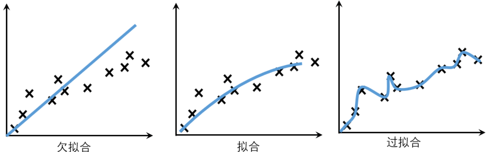

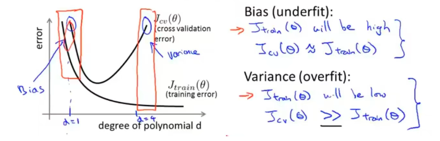

## 10.数据集的划分

+ `8:2`留出法：划分为训练集、测试集
+ 交叉验证：K-Fold交叉验证，将数据随机且均匀地分成k分，k为10，假设每份数据的标号为0-9
  + 第一次使用标号为0-8的共9份数据来做训练，而使用标号为9的这一份数据来进行测试，得到一个准确率
  + 第二次使用标记为1-9的共9份数据进行训练，而使用标号为0的这份数据进行测试，得到第二个准确率
  + 以此类推，每次使用9份数据作为训练，而使用剩下的一份数据进行测试
  + 共进行10次训练，最后模型的准确率为10次准确率的平均值
  + 这样可以避免了数据划分而造成的评估不准确的问题
+ 自助法：以自助采样（可重复采样、有放回采样）为基础。
  + 每次随机从D中抽出一个样本，将其拷贝放入D，然后再将该样本放回初始数据集D中，使得该样本在下次采样时仍有可能被抽到
  + 这个过程重复执行m次后，我们就得到了包含m个样本的数据集D′，剩下的D-m条数据作为测试集，这就是自助采样的结果。

## 11.对模型性能的度量

不同类型模型的度量方法不同

分类模型

+ 错误率：E= a / m，其中a是分类错误的样本的数量，m是样本的总数
+ 精度：accuracy = 1 - E
+ 查准率（precision）：针对预测集而言，在预测的正例中，实际正例的所占比。
+ 查全率（recall）：针对标签为真的集合而言，在实际正例中，预测正例的占比。
+ F1 Score：$F_1 \ Score = 2\frac{PR}{P+R}（P：查准率，R：查全率）$，主要针对数据类别不平衡，权衡查准率、查全率

回归模型

+ 拟合优度$R^2$
+ 均方误差MSE

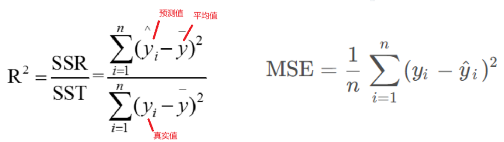

## 12.几个重要的曲线

### PR曲线

横轴召回率，纵轴精确率。分类器在不同阈值下会得到一系列不同的精确率和召回率值，通过将这些值以召回率为横坐标、精确率为纵坐标绘制成曲线，即为PR曲线。曲线上每个点表示了在对应召回率下的最大精确率值。当Ｐ＝Ｒ时成为平衡点（BEP），如果这个值较大，则说明学习器的性能较好。所以PR曲线越靠近右上角性能 越好。

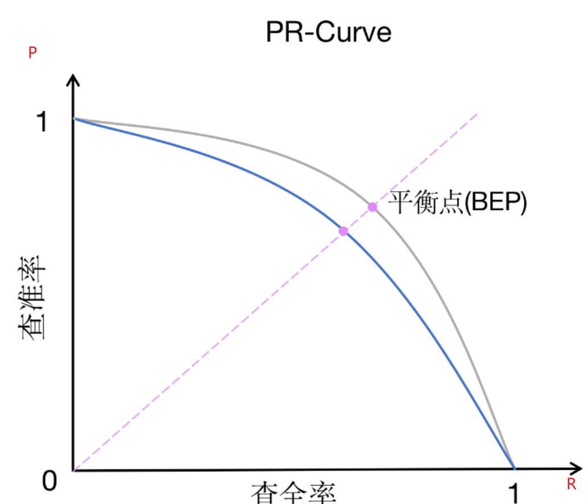

### 混淆矩阵

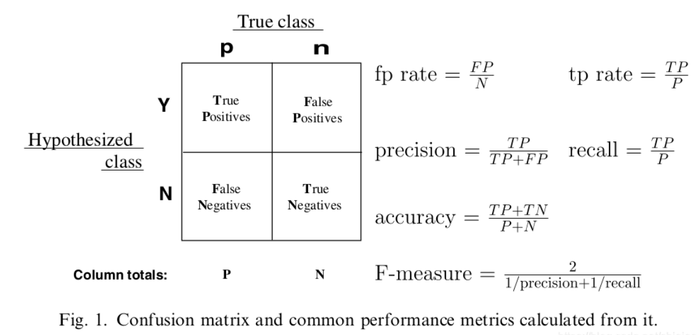

基于样本预测值和真实值是否相符，可得到4种结果：
**TP**（True Positive）：样本预测值与真实值相符且均为正，即真阳性
**FP**（False Positive）：样本预测值为正而真实值为负，即假阳性
**FN**（False Negative）：样本预测值为负而真实值为正，即假阴性
**TN**（True Negative）：样本预测值与真实值相符且均为负，即真阴性

通俗解释：以预测值是否与真实值相符，判别真假；

### ROC曲线

横坐标为FPR（False Positive Rate），纵坐标为TPR（True Positive Rate）。

通俗解释：**FPR表示负样本分错的概率；TPR表示正样本分对的概率**
$$
FPR = \frac{FP}{FP+TN} \\
TPR = \frac{TP}{TP+FN}
$$
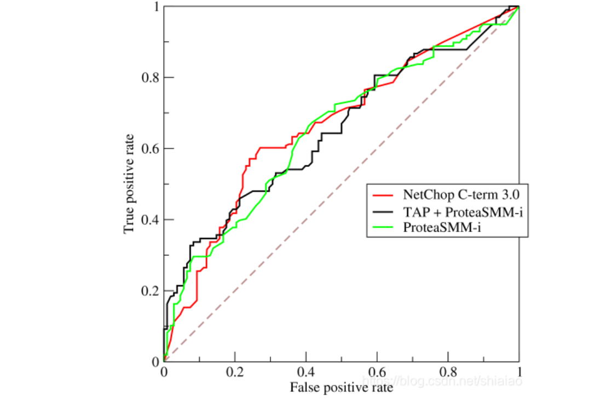


阈值：假设为n，分类的概率超过n，则可以判定为正例。

如果把假警报率理解为代价的话，那么命中率就是收益，所以也可以说在阈值相同的情况下，希望假警报率（代价）尽可能小，命中率（收益）尽可能高，该思想反映在图形上就是ROC曲线尽可能地陡峭。曲线越靠近左上角，说明在相同的阈值条件下，命中率越高，假警报率越低，模型越完善。

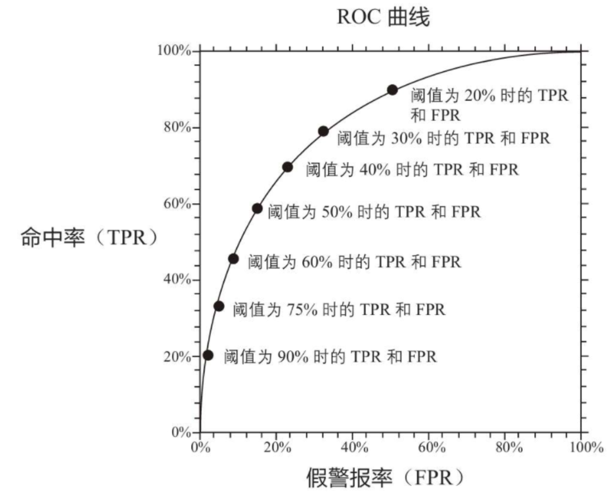


**AUC（Area Under Curve）**被定义为ROC曲线下的面积，显然这个面积的数值不会大于1。又由于ROC曲线一般都处于y=x这条直线的上方，所以AUC的取值范围在0.5和1之间。使用AUC值作为评价标准是因为很多时候ROC曲线并不能清晰的说明哪个分类器的效果更好，而作为一个数值，对应AUC更大的分类器效果更好。

### KS曲线

区别于ROC曲线将假警报率（FPR）作为横坐标，将命中率（TPR）作为纵坐标，KS曲线将阈值作为横坐标，将命中率（TPR）与假警报率（FPR）之差作为纵坐标，如下图所示。

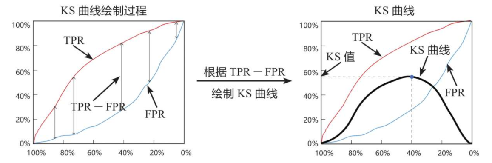

和ROC曲线一样，除了可视化的图形外，还需要一个可以量化的指标来衡量模型预测效果，与ROC曲线对应的是AUC值，而与KS曲线对应的则是KS值，**KS值**就是KS曲线的峰值。

一般情况下，我们希望模型有较大的KS值，因为较大的KS值说明模型有较强的区分能力。不同取值范围的KS值的含义如下：

+ KS值小于0.2，一般认为模型的区分能力较弱；
+ KS值在[0.2，0.3]区间内，模型具有一定区分能力；
+ KS值在[0.3，0.5]区间内，模型具有较强的区分能力。

## 13.损失函数

**一范数（L1范数）和二范数（L2范数）都是衡量向量“大小”或“距离”的方法**，在机器学习、优化算法、正则化中非常常见。

+ 一范数：各个元素绝对值之和
+ 二范数：各个元素平方和再开根号（欧氏距离）

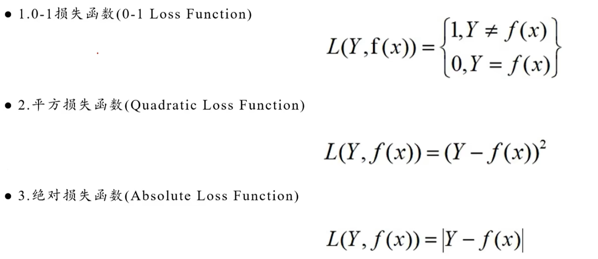


## 14.区分深度学习与机器学习

+ 机器学习：通过优化方法挖掘数据中规律的学科，让机器从数据中找出规律并利用这些规律做出预测或决策
+ 深度学习：运用了神经网络作为参数结构进行优化的机器学习算法
+ **人工智能**是最宽泛的概念，其核心理念是让机器表现出类似人类的智能；
+ **机器学习**是人工智能的一个子集，其核心理念是不靠人工编写规则，让机器自己从数据里找规律并利用这些规律做出预测或决策；
+ **深度学习**特指使用了多层神经网络架构进行优化的机器学习算法，可以自动提取数据特征，发现更深层的模式。

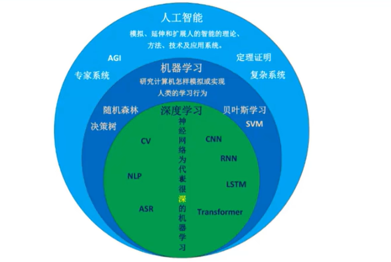

# 二、数据工程与机器学习

## 1.数据工程的基本步骤

1. 对问题的背景和用户的需求进行分析

2. 对分析出来的需求进行数据挖掘

   + 对数据进行清洗处理：提高数据质量，让数据能够被模型正确使用。比如，缺失值处理，异常值处理，重复数据处理，数据格式统一（日期等）

   + 构造特征工程

   + 选择机器学习模型，参数调优，确定模型

   + 训练模型，得到训练结果，对结果进行解释、描述、可视化

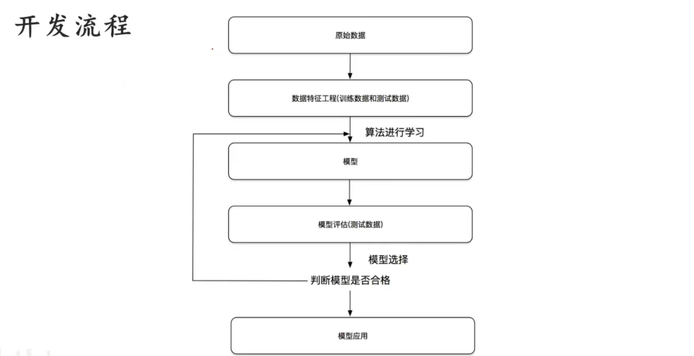

补充：**数据挖掘**是从大量数据中利用统计学、机器学习和数据库技术发现隐藏规律和有价值信息的过程。

**数据挖掘 = 数据处理+特征工程+机器学习算法+结果分析**

```
1. 问题定义与需求分析
2. 数据获取与理解
3. 数据预处理
        ├── 数据清洗
        │      ├── 缺失值处理
        │      ├── 异常值处理
        │      ├── 重复数据处理
        │      └── 格式统一
        │
        └── 数据转换
               ├── 标准化
               ├── 归一化
               └── 编码处理
4. 特征工程
        ├── 特征提取
        ├── 特征选择
        ├── 特征构造
        └── 特征降维
5. 模型选择与优化
        ├── 选择算法
        ├── 参数调优
        └── 模型比较
6. 模型训练与评估
        ├── 模型训练
        ├── 性能评价
        ├── 结果解释
        └── 可视化展示
7. 模型部署与应用
```


## 2.特征工程（feature engineering）

**向量化**：将任意的数据格式转化为具有良好特性的向量形式

**特征选择**： 选择最相关、最有代表性的特征，舍弃不相关或冗余的特征。这有助于减少维度，提高模型的训练和预测效率。特征选择的指标有WOE，IV，用于衡量特征包含的信息。一般选择IV，为啥？

**分类特征向量化的方式**

+ 映射编码：label encoding，但是一些库默认数值特征反映了代数量，如果0、1表示男女，那么代数量上女性大于男性
+ 二进制编码：映射编码的二进制形式
+ 独热编码：one-hot encoding，把每一个类别当做一个新的特征量，如果类别很多，特征矩阵纬度会很大，后续需要对数据纬度进行降维。通常得到稀疏矩阵，占内存多。

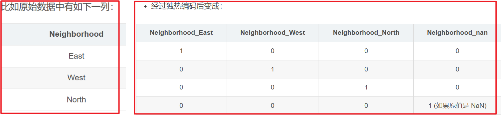

**文本特征**：通常将文本特征转化为一组数值，比如单词统计，使用TF-IDF算法（词频-逆文档频率），防止常用词聚集过高的权重

**图像特征**：用像素来表示，维度一般很大，长、宽、通道数。

**衍生特征**：原始特征经过数学变换得到新特征，在数据输入到模型之前就已经变换好了。

**快速搭建特征工程的方法**：特征管道。定义一个管道对象（即一个对数据的执行序列流水线），之后模型会按照序列的顺序，依次执行序列中的操作。比如，一个特征管道的操作包含：用均值填充缺失值、将衍生特征转换为二次方、拟合线性回归模型。

# 三、机器学习的模型

## 1.模型分类

+ 有监督模型
  + 单模型
    + 线性模型：线性回归、逻辑回归、Lasso、Ridge、LDA
    + k邻近（KNN）
    + 决策树：ID3、C4.5、CART
    + 神经网络：感知机、神经网络
    + SVM支持向量机：线性可分、线性不可分、线性支持
  + 集成学习
    + Boosting
    + Bagging
+ 无监督模型
  + 聚类：k-means、层次聚类、谱聚类
  + 降维：PCA、SVD
+ 概率模型
  + EM算法
  + MCMC
  + 贝叶斯：朴素贝叶斯、贝叶斯网络
  + 概率图：CRF、HMM
  + 最大熵模型


模型的类别有两种：
概率模型（Probabilistic Model）和非概率模型（Non-Probabilistic Model）。

1. 概率模型：决策树、朴素贝叶斯等。
2. 非概率模型：感知机、支持向量机、K-means以及神经网络等。

可按照判别函数线性与否分成线性模型与非线性模型，

1. 线性模型：感知机、线性支持向量机、K-means
2. 非线性模型：核支持向量机、神经网络

## 2.线性回归 Linear Regression

如何找到拟合函数的最佳参数？即如何找到使误差最小的模型参数？

+ 最小二乘法：$\theta = (X^TX)^{-1}X^Ty$
+ 梯度下降法：$\theta = \theta - \alpha \nabla J(\theta)$

损失函数：均方误差 MSE

评估指标：

+ MSE（Mean Squared Error，均方误差）
+ RMSE（Root Mean Squared Error，均方根误差）
+ MAE（Mean Absolute Error，平均绝对误差）
+ $R^2$（决定系数）：衡量线性拟合的优劣程度
+ Adjusted $R^2$（调整后的决定系数）

多重共线性：参与回归的特征变量本身是否有联系、是否存在线性关系

+ 相关矩阵
+ 方差膨胀检验 VF

## 3.逻辑回归 Logistic Regression

分类模型，预测的是概率，而不是函数的连续值

激活函数：**sigmoid 函数**，将$[-\infty, +\infty]$范围的数据压缩成$(0,1)$之间的值（都是离散的数值）

最小化误差：梯度下降法、最小二乘法

损失函数：交叉熵损失函数

模型评估：查准率P，查全率R，F1 Score，混淆矩阵，ROC曲线，AUC值

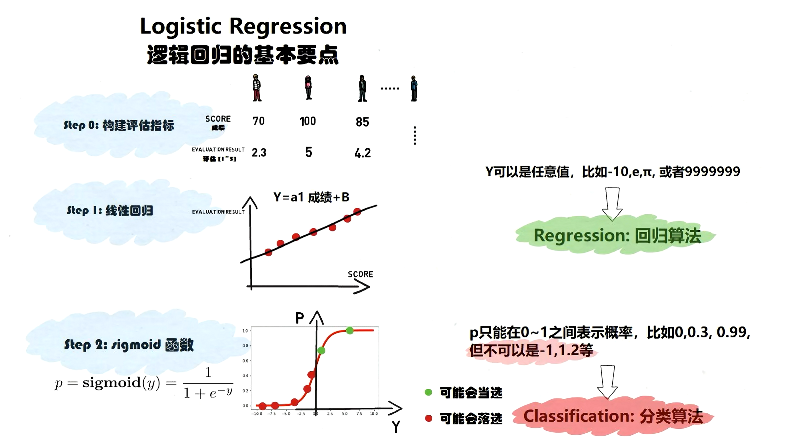

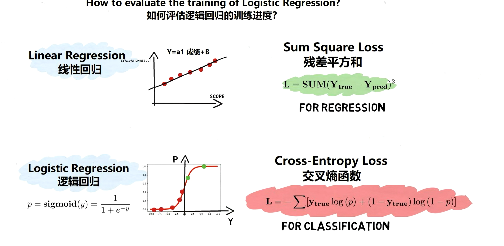

## 4.决策树 decision tree

集成学习的基础，因为集成学习的弱学习器基本都是树模型。

建树的决策依据（如何选取每层的属性）

+ 基尼系数
  + $Gini(p) = \sum_{k = 1}^K p_k(1-p_k) = 1 - \sum_{k = 1}^Kp_k^2$，$p_k$表示在该属性的某个类别对应的样本中，分类结果的第k类样本在这些样本中的占比。
    + 举个例子，属性为花瓣长度（长、短，两种类别），分类结果为是否变色。先求出花瓣长度为长的m个样本中，变色的占比为$p_1$，不变色占比$p_2$，求出$Gini(length=长)=1-p_1^2-p_2^2$，然后求出花瓣长度为短的n个样本中，变色、不变色的占比，然后求出$Gini(length=短)$。
  + 如果这个属性的类别有n个，按照该类别的每个类的占比对上面的基尼系数进行加权求和
    + 在上面花朵分类的例子中，最后加权求和为$\frac{m}{m+n}Gini(length=长) + \frac{n}{m+n}Gini(length=短)$
  + 当分类到最后一层时，由于类别只有一个，$1 - \sum_{k = 1}^Kp_k^2 = 1-1=0$。因此基尼系数是**用来衡量一个集合的纯净度**，集合中国只有一个类别的时候最纯净，基尼系数为0.
+ 信息熵 $H(x) = - \sum p_i × log_2 p_i$，计算信息增益 $Gain(S,A) = H(S) - H(S,A)$，信息增益表示整个集合S在使用某种类别A之后熵值下降程度，信息增益越大越好


剪枝：防止没有必要的分类（分支）

+ 前剪枝（预剪枝）：一边建立决策树一边剪枝。利用超参数限制决策树，比如最大深度
+ 后剪枝：决策树建立完成之后再剪枝，或者合并子树。

## 5.朴素贝叶斯分类器

是一种生成分类方法。

朴素贝叶斯分类器是一种基于贝叶斯定理的概率分类算法，通过计算样本属于每个类别的概率，选择概率最大的类别作为预测结果。

它的核心思想：**根据已经观察到的特征，计算样本属于不同类别的概率，然后选择最可能的类别。**

朴素贝叶斯的基础是贝叶斯公式：
$$
P(A|B) = \frac{P(B|A)P(A)}{P(B)}
$$

+ $P(A|B)$ 表示在事件 (B) 发生的条件下，事件 (A) 发生的概率，称为后验概率（posterior probability）。

+ $P(B|A) $表示在事件 (A) 发生的条件下，事件 (B) 发生的概率，称为似然概率（likelihood）。

+ $P(A)$ 表示事件 A发生的概率，称为先验概率（prior probability）。

+ $P(B)$ 表示事件 B发生的概率，称为边缘概率（marginal probability），可以表示为$P(B) = P(B|A)P(A) + P(B|\neg A)P(\neg A)$。

+ $P(B|\neg A)$ 表示在 (A) 不发生的情况下，事件 (B) 发生的概率。

+ $P(\neg A)$表示 (A) 不发生的概率。


> 为什么叫**朴素**贝叶斯？
>
> 因为它做了一个非常强的假设：**特征之间相互独立**，即$P(x_1,x_2,x_3∣y)=P(x_1∣y)P(x_2∣y)P(x_3∣y)$


朴素贝叶斯分类器基于以下假设：

1. **特征条件独立假设**：给定类别的条件下，各个特征之间是相互独立的。这意味着每个特征对于类别标签的影响是独立的，不受其他特征的影响。
2. **贝叶斯定理**：朴素贝叶斯分类器使用贝叶斯定理来计算给定特征下每个类别的后验概率。


常见的朴素贝叶斯分类器

+ GaussianNB (高斯朴素贝叶斯)
+ MultinomialNB (多项式朴素贝叶斯)
+ BernoulliNB (伯努利朴素贝叶斯)
+ ComplementNB (互补朴素贝叶斯)
+ CategoricalNB (类别朴素贝叶斯)

## 6.支持向量机SVM support vector machine

SVM是一种判别分类方法。并不是为每一类数据都建模，而是用分割线 / 超平面的方法将各种类型分开，待测数据点位于分割线 / 超平面的哪一侧就是哪个类型。

原理：找一个**最大间隔超平面**将正负样本分开，使得决策分割线 / 超平面到正负分割线 / 超平面的距离（间隔）是最大的。

+ 如果无法用一条直线（二维）或者一个平面（高维）把不同类别的数据完全分开，就叫**线性不可分**。
+ 如果这些数据点是线性不可分的，需要使用**核函数**进行变换。
+ 核函数思想：**将低维空间中线性不可分的数据映射到高维空间**，使其变成线性可分。

## 7.主成分分析PCA与流行分析

都是无监督算法。

PCA（主成分分析）：降维。通过对原始特征进行线性组合，构造一组新的互相正交的特征（主成分），然后寻找数据方差最大的方向作为主轴。每个样本点在这些主轴方向上的投影值，就是对应的主成分。

如何选择主成分的数量？

需要看每个主成分的累计方差贡献率。

流行学习：升维。将低维的流行嵌入高维空间的方法。

## 8.K近邻（KNN） K Nearest Neighbor

一种分类方法，有监督算法。

原理：

+ 分类：在已有的数据中寻找最近的k个数据，用这k个数据投票决定新样本的类别
+ 回归：在已有的数据中寻找最近的k个数据，用这k个数据的平均值作为它的标签值


如何衡量样本的数据：欧氏距离。计算之前需要先标准化消除量纲，有两种标准化（将数据范围压缩到$[0,1]$）的方式

+ mean max标准化：$\frac{x - min}{max - min}$
+ z score标准化：$\frac{x - mean}{标准差}$，其中mean是均值

## 9.K均值 K-means

一种聚类方法，无监督算法。

原理：将样本分为k类（自己设定k的值），从样本中随机选取k个点作为各个簇（每个类的样本点组成一个簇）的质心（中心点），将剩下的样本点划分到距离它最近的质心的簇中，然后更新质心（取算术平均值）。然后继续划分、更新，直至所有质心不再变化，得到k个稳定的簇。

不一定能得到最优的聚类结果，且聚类效果与k值密切相关，所以涉及到的k的取值问题（调参）

+ 网格搜索
+ 肘部法则

## 10.DBSCAN

一种聚类方法，解决了K-means荷包蛋类型数据的分类问题。

59：00

## 11.集成学习

将若干个弱学习器集成到一起形成一个强学习器。主要分为两类

+ Bagging算法：随机森林 random forest。使用若干个弱学习器一起投票 / 取均值

+ Boosting算法：adaboost / GBDT / XGBoost / LightGBM。将弱学习器提升为强学习器，给强学习器更大的权重，然后再进行投票。


随机森林：数据随机（有放回抽样），特征随机。降低过拟合的风险。

AdaBoost：**调整错误样本的权重**，使得学习器重视之前分类错误的样本，每轮迭代中加一个新的螺旋器，不断调整直到分类数低于预设值，或者迭代次数达到预设值。 学习率是一个正则化项，即每个弱学习器的权重的缩减系数。

GBDT：Gradient Boosting Decision Tree，梯度提升决策树。它的主要思想是**使用决策树拟合残差（负梯度）**，将损失函数的负梯度作为残差的近似值，不断使用残差迭代和拟合决策树。

XGBoost：GBDT算法的高效实现。主要优化的方面

+ 在GBDT损失函数中加入正则化的部分，对误差作二阶泰勒展开，梯度提升树只有一阶泰勒展开。提高准确性和泛化能力。
+ 对每个弱学习器做选择，找到合适的子节点（分裂效果最好的点）进行分裂，找出特征和特征值。提升运行效率。
+ 不需要额外的标准化

LightGBM：核心原理如下

+ 带深度限制的 Leaf-wise 生长策略：每次只分裂增益最大的叶子节点
+ 直方图算法：对特征值先进性分析统计评述后，再遍历寻找最优的分割点
+ 并行学习：特征并行，数据并行。提高运行效率

## 12.智能推荐（协同过滤算法）

从用户相似或产品相似的角度出发，进行相似性度量。

找到相似的用户就可以给他推荐相似的产品，反之亦然。

相似性度量的方法

+ 欧氏距离
+ 余弦相似度
+ 皮尔逊相关系数：Pearson Correlation Coefficient，协方差除以两个标准差的积

## 13.关联分析 Apriori

挖掘频繁出现的组合，并描述组合内对象同时出现的模式和规律。

关联分析的目标是发现：数据中不同项目之间是否存在某种规律性的关联关系。

> 经典例子：买啤酒的人是否也经常买尿布？

支持度（Support）：规则中项集的出现频率，表示在整个数据集中，A 和 B 同时出现的概率。


置信度（Confidence）：规则的可靠性，表示在所有包含 A 的记录中，有多少比例同时包含 B。


算法流程

+ 设定算法最小的支持度和置信度的阈值
+ 根据最小的支持度找到所有频繁的项集
+ 根据最小的置信度发现强关联规则