# 参考文献

参考文章：

+ [深度神经网络训练过程与常见概念](https://juejin.cn/post/7523259855789293608)
+ [AI 基础知识从 0.4 到 0.5—— 计算机视觉之光 CNN](https://juejin.cn/post/7500509972897120296)

# 一、线性代数基础

参考视频：[【子豪兄+深度之眼】深度学习“花书”啃书指导视频！独家讲解+笔记](https://www.bilibili.com/video/BV1Gk4y1m7LQ)，P6-第二章

参考教材：花书中文版.pdf，第二章 线性代数

## 基本概念

标量 → 向量 → 矩阵 → 张量（三维及以上）

行列式 → 矩阵

矩阵转置

## 常用运算

**矩阵乘法**：对应位置的向量的点积。矩阵乘法不满足交换律 $AB ≠ BA$。

**单位矩阵 $I$**：Identity Matrices，主对角线元素为1，其他元素全为0。

**范数**

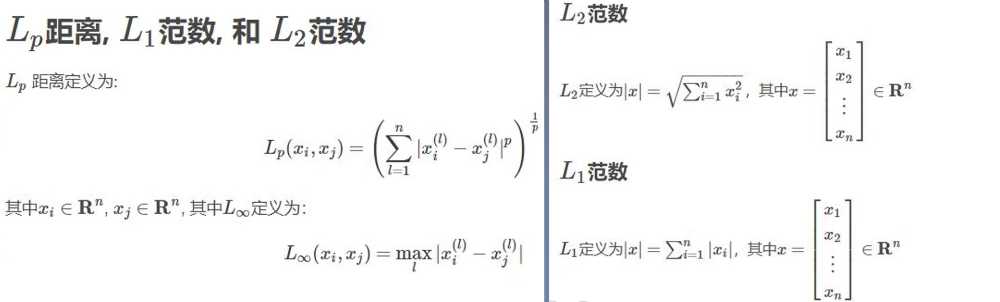

> $L_p$距离：闵可夫斯基距离
>
> $L_1$距离：曼哈顿距离，街区距离
>
> $L_2$距离：欧氏距离

**可逆矩阵**

+ 要想使矩阵可逆，该矩阵必须是一个方阵（square），即 m = n，并且所有列向量都是线性无关的。一个列向量线性相关的方阵被称为**奇异的（singular）**。

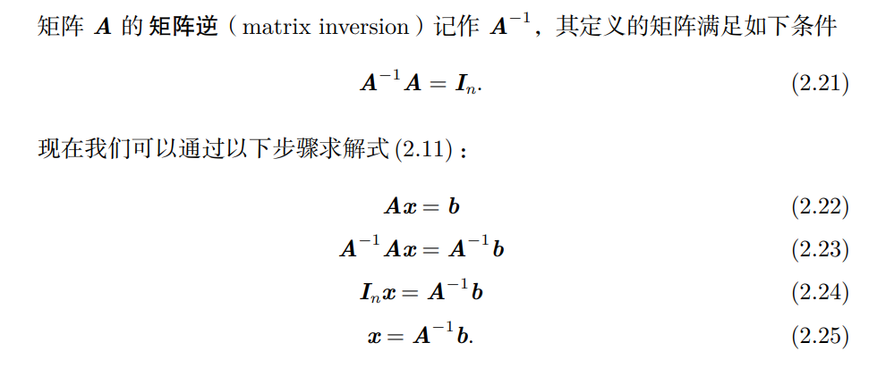

**特征分解**

+ 特征分解（eigendecomposition）是使用最广的矩阵分解之一，即我们将矩阵分解成**一组特征向量和特征值**。
+ 每个实对称矩阵都可以分解成实特征向量和实特征值。$A = QΛQ^⊤$

矩阵的**奇异值分解**

+ 奇异值分解（singular value decomposition, SVD），将矩阵分解为奇异向量（singular vector）和 奇异值（singular value）。
+ 通过奇异值分解，我们会得到一些与特征分解相同类型的信息。

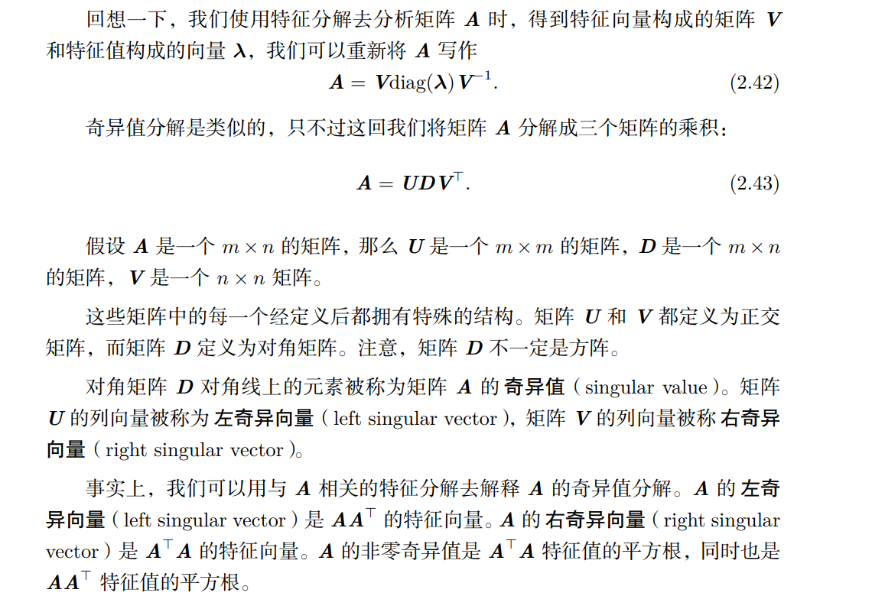

矩阵的**迹**（trace）：矩阵主对角线元素之和

## 实例：PCA

TODO：复现sk-learn里的算法，比如使用numpy实现逻辑回归。


# 二、概率论和信息论

[概率论期末速通 一小时](https://www.bilibili.com/video/BV1UN4y1v7Ux?spm_id_from=333.1387.favlist.content.click)

# 三、极大似然估计 MLE

参考视频

+ [机器学习必会，似然和极大似然估计，看一个动画，就全明白了](https://www.bilibili.com/video/BV1CR4y1L7RC/)，什么是似然，极大似然估计的意义是什么
+ [期末概率论之速成救命，7分钟学会最大似然估计](https://www.bilibili.com/video/BV1dh4y1g7gc)，极大似然估计的数学题解题步骤（概率论）
+ [【机器学习】重新理解线性回归 - 1 - 极大似然估计](https://www.bilibili.com/video/BV1QM4y167oZ/)，损失函数与最小二乘估计、极大似然估计之间的关系

## 概率、似然

概率：特定环境下某件事情发生的可能性。**在结果没有产生之前**，根据环境中的参数预测某件事情发生的概率。

+ 比如，已知天气、温度、湿度，预测加衣服这件事情发生的概率。
+ 再如，抛硬币之前，我们知道抛出正反面的概率都是0.5，但是抛完之后的结果就确定了，这个概率就没有意义了。

似然：基于已经确定的结果，**推测产生这个结果的可能环境，或者环境中的某些参数**。

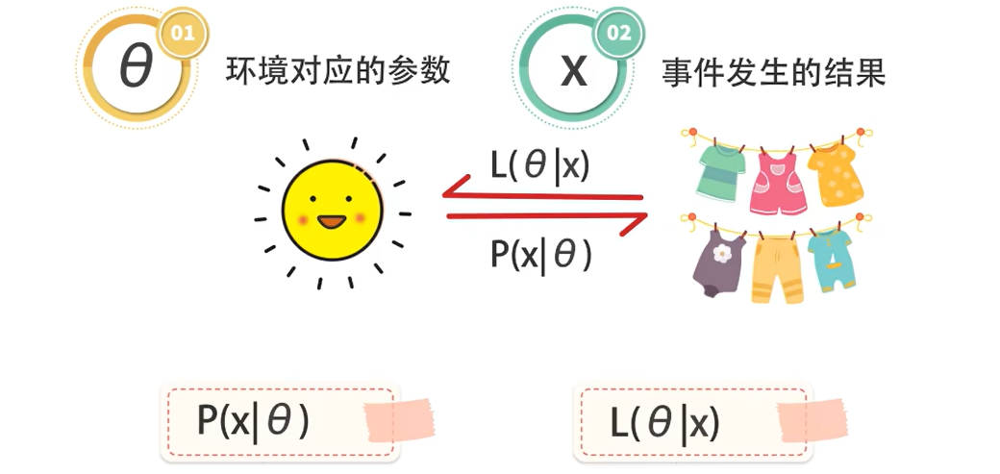

> P是关于x的函数，L是关于θ的函数。

## 极大似然估计

| 概念             | 方向        | 例子                       |
| ---------------- | ----------- | -------------------------- |
| 概率             | 参数 → 数据 | 已知硬币公平，问7正3反概率 |
| 似然             | 数据 → 参数 | 已知7正3反，猜硬币正面概率 |
| 极大似然估计 MLE | 让似然最大  | 找到最可能的θ              |

极大似然估计：寻找一个参数，使得当前观察到的数据出现的概率最大。公式如下：
$$
\hat \theta = arg \max_{\theta} L(\theta | X)
$$
似然函数的公式：
$$
L(\theta) = \prod_{i = 1}^n P(x_i|\theta)
$$
整体流程

+ 假设数据分布模型
+ 写概率函数 $P(X|θ)$
+ 将参数$θ$看成变量，得到似然函数 $L(θ)$
+ 对$L(θ)$取对数
+ 对参数求导
+ 令导数=0，求θ
+ 得到最大似然估计值 $\hat \theta$

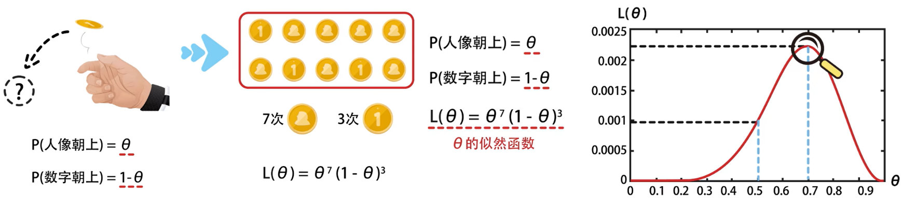

**数学推导过程**

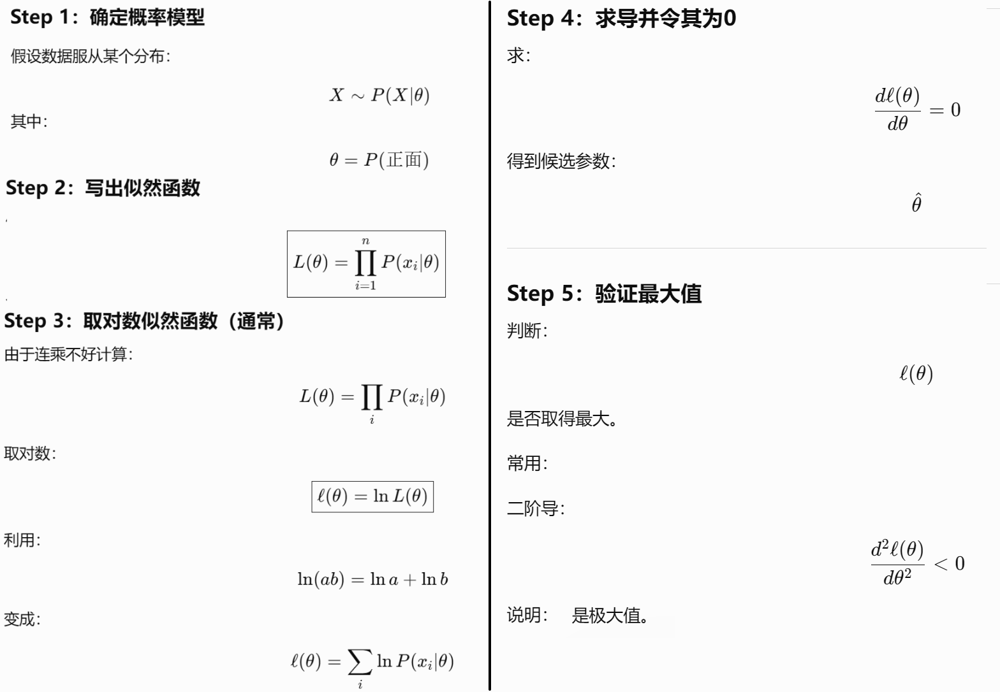

>实际数学例题参考视频：[期末概率论之速成救命](https://www.bilibili.com/video/BV1dh4y1g7gc)

## 极大似然估计 vs 最小二乘估计

最小二乘估计：找到一组参数值使得损失函数的值最小。

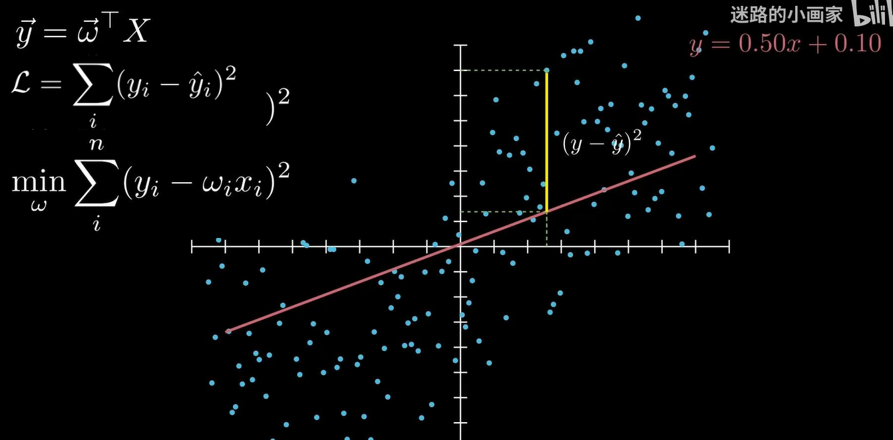

极大似然估计：求对数似然的最大值。

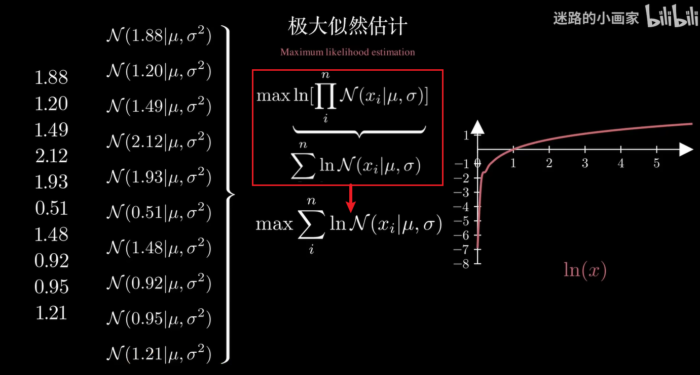

在线性回归中，将目标值y看作从一个高斯分布中采样而来的数据，即认为 $y∣x$（在给定 𝑥 条件下的 𝑦） 服从高斯分布，是因为现实数据中同一个输入 $x$ 会受到许多未建模因素影响（噪声 $\epsilon$），使输出 $y$ 在真实值附近随机波动；这些大量独立小误差叠加后近似服从均值为0、方差为 $\sigma^2$ 的高斯分布，因此写成 $y=w^Tx+b+\epsilon$，其中$\epsilon\sim N(0,\sigma^2)$。

> 根据中心极限定理：大量独立随机变量的和趋近于高斯分布。TODO

综上，目标值y对x的分布为$N(y_i|wx_i+b,\sigma^2)$，即当x取某个特定值时y的概率分布。


假设所有数据都遵循同一个条件分布，且数据点相互独立，就可以进行极大似然估计求解最佳参数（使得观察到的数据发生概率最大）。

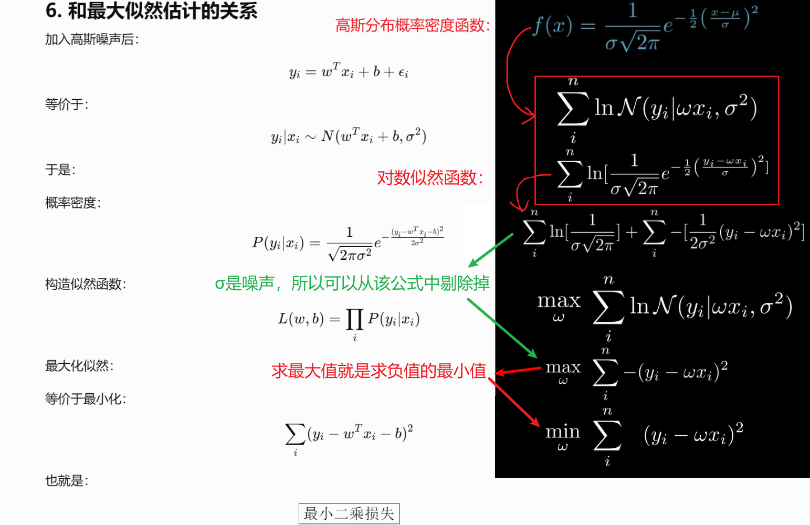

> 线性回归的均方误差损失，本质上是假设误差服从高斯分布后，通过最大似然估计推导出来的。
>
> 最小二乘估计，其实是极大似然估计在高斯分布下的一种特殊形式。

# 四、感知机

参考视频

+ [感知机：深度学习的 Hello World](https://www.bilibili.com/video/BV1FW9ZBhEEN)

参考文章

+ [感知机：深度学习的 Hello World-up主【谦行】](https://www.yuque.com/qx2io/deep-learning/kuqdhoh4p4wgirey)

## 思想起源

我们知道神经网络灵感是仿生学，感知机的诞生并非偶然，它是多个学科交汇、多代学者思想积累的产物。

故事得从 1943 年说起，神经科学家麦卡洛克与数学家皮茨联合发表了论文——"A Logical Calculus of the Ideas Immanent in Nervous Activity"。他们做了一件在当时看来极为大胆的事：把生物神经元用数学公式描述出来。

在他们的模型里，神经元被抽象为一个简单的逻辑单元：同时接收多个兴奋或抑制信号，当兴奋信号的总量超过某个阈值时，神经元激活并输出信号，否则保持沉默，这就是著名的 M-P 神经元，也是感知机最直接的前身。


然而，M-P 神经元有一个根本性的缺陷：权重必须由人工设定，机器本身无法学习。 这意味着它只是一个精巧的逻辑装置，而不是一个真正会学习的系统。

转机出现在 1949 年，心理学家唐纳德·赫布出版了《行为的组织》，指出如果两个神经元经常同时激活，它们之间的连接就会不断增强；反之则会逐渐减弱。这是人类历史上第一次从学习机制的角度解释神经连接的变化，也第一次给出了一个关键问题的生物学依据——权重是可以改变的。


美国心理学家兼计算机科学家弗兰克·罗森布拉特在 M-P 神经元的基础上，加入了一个至关重要的创新——让权重通过错误反馈自动调整。机器每做出一次错误预测，权重就自动修正一次，如此反复，直到学会正确分类。这个机制，就是感知机学习算法的核心。

1957年，罗森布拉特正式发表论文 "The Perceptron: A Perceiving and Recognizing Automaton"，感知机由此诞生。同年，他在 IBM 704 计算机上完成了感知机的程序模拟。

1958年，他更进一步，亲手造出了一台真实的物理机器——Mark I Perceptron，专门用于识别图像中的字母。这台机器由 400 个光电管模拟视网膜感知图像，由 512 个电动马达负责实时调整权重。虽然其外表与今天的神经网络毫无相似之处，却是人类历史上第一台真正意义上会自己学习的机器。

## 工作流程

感知机的工作原理非常简单：对输入做加权求和，与阈值比较做出判断，根据错误反馈微调修正权重，直到学会正确分类


如果我们有机器学习的基础，会发现感知机非常简单，把激活函数改成 Sigmoid 就是逻辑回归

这个结构放在今天来看极其简单，但它第一次把神经元模型、可变权重和错误驱动学习三件事整合在一起，构成了一个真正能自主学习的闭环系统。

### 第一步：输入与加权

感知机接收一组输入信号，比如 x₁、x₂、x₃，每一个输入代表数据的某个特征——可以是图像的像素值，可以是一封邮件里某个词出现的次数，也可以是任何你想让机器判断的指标。

但并不是每个特征都同等重要。为此，每一个输入都对应一个**权重** w，权重的大小，代表这个特征对最终判断的影响程度。**权重越大，这个特征越关键；权重接近零，说明这个特征几乎可以忽略。**

这个设计，正是对赫布理论的直接呼应——连接越强，影响越大。

### 第二步：求和与判断

拿到加权后的输入，感知机做的第一件事是把它们全部加起来，得到一个数值 z：


其中 b 是偏置项，可以把它理解为对判断基准线的一个微调，让模型更灵活。得到 z 之后，感知机开始做判断：

+ 如果 z 超过阈值 → 输出 1，在二分类问题中代表正类
+ 如果 z 没超过阈值 → 输出 0，在二分类问题中代表负类

这一步就是对 M-P 神经元激活或沉默机制的实现，整个过程可以用一个公式描述：


到这里，感知机完成了一次预测，但光能预测还不够，它还需要会纠错。

### 第三步：错误与修正


每做出一次预测，感知机就把结果和正确答案对比。如果预测正确，什么都不用做；如果预测错误，就按照下面的规则调整权重：
$$
w_i ← w_i + \eta · (y - \hat y) · x_i
$$
拆开来理解：

+ **y** 是正确答案，**ŷ** 是感知机的预测，两者之差就是误差信号
+ **xᵢ** 是这个特征的输入值，误差要按照输入的大小来分配责任
+ **η** 是学习率，控制每次调整的幅度，太大容易矫枉过正，太小学习又太慢

这个过程会反复进行，一轮又一轮地看数据、预测、对比、修正。每一次修正，权重都离正确答案更近一步。直到感知机对所有样本都能给出正确的预测，就表示学习完成了。

## 实例：预测身材偏胖还是偏瘦

光看公式难免抽象，我们来做一个具体的案例——用感知机判断一个人的身材是偏胖还是偏瘦。假设我们手里有一批数据，每个人有两个特征：

+ **x₁**：身高
+ **x₂**：体重

感知机要做的事情是：根据这两个特征，判断这个人的身材是**偏瘦（输出 0）** 还是**偏胖（输出 1）**。

### 代码

**定义感知机**

```python
class Perceptron:
    def __init__(self, learning_rate=1.0, n_iterations=100):
        self.lr = learning_rate             # 学习率 η
        self.n_iterations = n_iterations    # 最大训练轮数
        self.weights = None                 # 权重 w
        self.bias = None                    # 偏置 b
        self.errors_per_epoch = []          # 记录每轮错误数

    def fit(self, X, y):
        n_samples, n_features = X.shape

        # 权重和偏置全部初始化为 0
        self.weights = np.zeros(n_features)
        self.bias = 0
        self.errors_per_epoch = []

        for epoch in range(self.n_iterations):
            errors = 0  # 本轮错误计数

            for idx in range(n_samples):
                x_i = X[idx]
                y_true = y[idx]

                # ① 计算加权和：z = w1·x1 + w2·x2 + b
                z = np.dot(self.weights, x_i) + self.bias

                # ② 激活判断：z ≥ 0 输出 1，否则输出 0
                y_pred = 1 if z >= 0 else 0

                # ③ 计算误差
                error = y_true - y_pred

                # ④ 如果预测错误，更新权重和偏置
                if error != 0:
                    self.weights += self.lr * error * x_i   # 更新权重
                    self.bias += self.lr * error            # 更新偏置
                    errors += 1                             # 错误计数
                    print(f"第{epoch+1}轮，第{idx+1}个样本， 更新权重：{self.weights}, 更新偏置：{self.bias}")

            self.errors_per_epoch.append(errors)

            # 本轮零错误 → 收敛，训练结束
            if errors == 0:
                print(f"第{epoch+1}轮，错误数归零，训练收敛！")
                break

        return self

    def predict(self, X):
        # 计算加权和：z = w1·x1 + w2·x2 + b
        z = np.dot(X, self.weights) + self.bias
        
        # 激活判断：z ≥ 0 输出 1，否则输出 0
        return np.where(z >= 0, 1, 0)
```

**开始训练**

```python
model = Perceptron(learning_rate=0.5, n_iterations=100)
model.fit(X, labels)
```

### 可视化决策边界与训练曲线

经过若干轮训练之后，感知机最终会收敛到一组合适的参数，能够正确区分所有样本。这条在二维平面上把"偏瘦"和"偏胖"分开的线，就是感知机找到的**决策边界**。

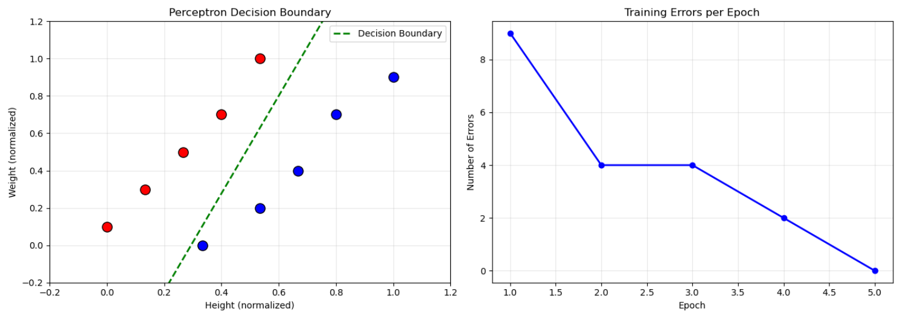

左图展示感知机在二维平面上找到的那条"决策边界"——正是文章中那条把偏胖和偏瘦分开的直线。右图展示每轮训练的错误数变化，可以直观看到模型的学习过程：从一开始错误不断，到最终错误归零。

## 感知机名声大噪

这个案例放在今天看，似乎稀松平常。但在 1958 年，当罗森布拉特展示 Mark I Perceptron 能够自动学会识别图像时，整个科学界都为之震动。

《纽约时报》随即在头版刊登报道，称这是："一台能够学习的电子计算机，是有史以来第一台能够像人脑一样认识、理解事物的机器。"

一时间，感知机成了那个年代最耀眼的科技明星。研究经费如潮水般涌来，无数学者投身这一领域，人们普遍相信，真正意义上的人工智能，已经近在眼前。然而，繁荣之下一个隐患正在悄悄积累。

## 深度学习的寒冬

回到我们的身材判断案例，偏胖和偏瘦的数据点在平面上分布得如此整齐，感知机只需要找到一条直线，就能完美地把它们分开。这种情况，有一个专门的名字，叫做线性可分。当数据线性可分时，感知机不仅能找到决策边界，而且一定能找到。

但现实中的数据，往往没有这么听话。设想一个更复杂的场景：同样的身高和体重，有些人因为肌肉密度高显得精壮，有些人脂肪率高显得虚胖——单靠身高和体重这两个特征，已经很难画出一条直线把所有情况正确分开了。

而在逻辑运算中，有一个更加极端的例子，把这个问题暴露得淋漓尽致，它的名字叫做 XOR（异或）。XOR 的规则很简单：两个输入相同时输出 0，两个输入不同时输出 1，把这四个点画在坐标平面上：

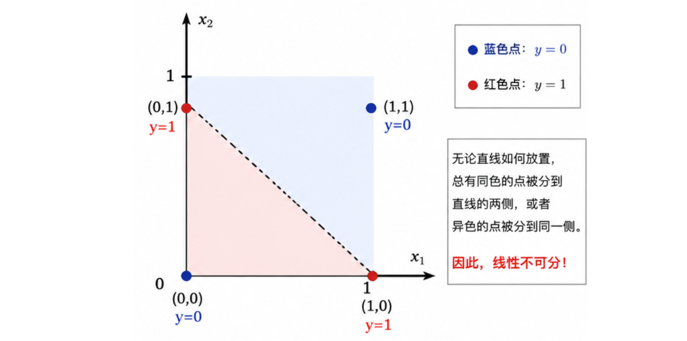

你会发现无论怎么画，都不存在一条直线能将其完整地分开。这不是技巧问题，而是数学上的根本限制——XOR  问题是线性不可分的，感知机对此无能为力。

MIT 人工智能实验室的权威学者马文·明斯基和西摩·帕普特，花了数年时间对感知机进行了系统而严密的数学分析，1969 年将结论写成一本书——《Perceptrons》，书中的核心论断只有一句话：

**感知机无法解决 XOR 这样的非线性问题，单层结构存在根本性的数学局限。**

《Perceptrons》一经出版，影响立竿见影，神经网络研究经费迅速撤离，大批学者对神经网络失去信心，转向其他方向，整个领域陷入了长达二十年的沉寂。

然而，明斯基和帕普特的批评并非无懈可击，他们的论证有一个隐藏的前提：**多层网络无法被有效训练**。但他们只是证明了单层感知机的局限，并没有证明这个训练难题永远无解——他们说的是现在做不到，而不是永远做不到。

这个微妙的缝隙，为日后的反击埋下了种子。

在几乎所有人都离场的寒冬里，仍有少数研究者选择留下。其中最具代表性的，是**杰弗里·辛顿（Geoffrey Hinton）**。在经费匮乏、论文难发、同行质疑的年代里，他始终坚信一件事：多层神经网络的训练问题不是死路，而是一道尚未解开的题。

这份坚持，最终等来了答案——**反向传播算法**。

## 多层感知机 MLP

### 用两层感知机解决 XOR

单个感知机在特征空间里画一条直线（或高维空间里的超平面），把数据分成两边，一条线只能做线性分割。但如果有两个感知机，就有两条线；三个感知机就有三条线——多条线就可以围出任意复杂的区域。

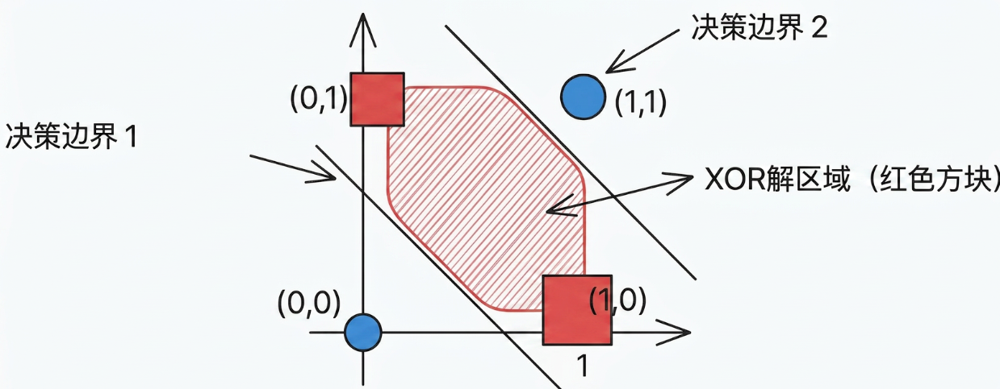

现在我们有了全部的概念工具，来看 MLP 如何具体解决 XOR 问题：

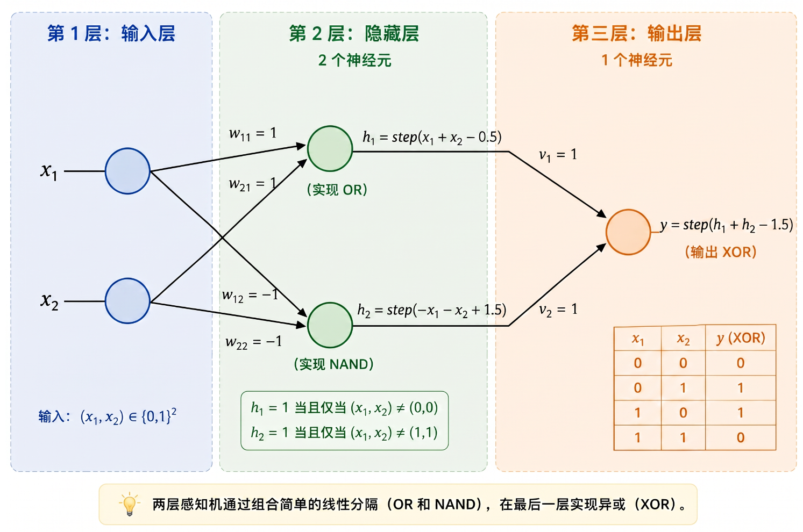

整个网络分三层：

+ **输入层**：接收两个特征 、
+ **隐藏层**：两个神经元使用不同的权重做并行运算，各自画一条分割线，经过阶跃函数激活后输出 0 或 1
+ **输出层**：将隐藏层的两个输出作为输入，通过另一组权重再做一次加权求和与激活，得到最终的异或判断

第一个隐藏神经元学会了至少一个输入为 1（对应 OR），第二个学会了不能同时为 1（对应 NAND），输出层把两个条件取交集——和我们在硬件电路中看到的组合逻辑完全对应。

### 多层结构的两个思想来源

这个思路并非凭空产生，它有两条独立的知识脉络支撑。

**第一条来自神经科学。** 1940 年代，神经科学家发现大脑皮层是分层处理的。视觉信号从视网膜出发，经过 V1、V2、V4、IT 等多个区域逐级加工——底层神经元响应边缘和方向，高层神经元响应人脸和物体。

麦卡洛克和皮茨在 1943 年造出第一个数学神经元模型时，目标就不是设计算法，而是用数学描述大脑的工作方式。既然生物大脑是多层的，数学模型自然也该是多层的。

**第二条来自数学中的函数逼近理论。** 工程师和数学家长期面对一个问题：给你一堆数据点，怎么找到背后的函数？这叫函数逼近（Function Approximation）。数学上早已知道，任何复杂函数都可以用简单函数的组合来逼近——泰勒展开用多项式逼近，傅里叶变换用正弦波叠加。


神经网络的思路与此一脉相承：一个神经元是一个简单的函数单元，多个神经元的组合可以逼近更复杂的函数，多层组合可以逼近任意复杂的函数。

### 多层感知机的一般结构

基于上述思想，我们把多个感知机按层排列、层间全连接，构成了**多层感知机（MLP）**，也就是最基础的神经网络：


它至少包含三层：输入层接收原始特征，数个隐藏层进行中间运算，输出层给出最终结果。每个神经元接收上一层所有神经元的输出作为输入，通过自己维护的权重和偏置做加权求和，再经过某个函数产生输出，传递给下一层。从数学上看，整个网络是函数的层层嵌套：


同一层里的多个神经元，作用是**并行提取多个不同的特征或规则**。而后续的层把前一层的输出作为输入，利用不同的权重进一步组合这些特征，逐层构造出更抽象、更有用的表示（类似 PCA 等降维方法从多维数据中提取主成分），这就是神经网络的核心工作原理。

结构有了，但一个关键问题随之而来。

### 多层线性变换无效 → 激活函数

如果每一层只是做线性变换（矩阵乘法加偏置），那么无论堆多少层都是徒劳的

假设第一层输出为 ，第二层输出为 。将第一层代入第二层：


令 ，，则 ——这仍然是一个线性变换。无论堆 2 层、10 层还是 100 层，最终效果都等价于单层线性网络。层层叠加，做的全是无用功。

问题出在哪里？出在**线性变换的组合仍然是线性变换**。**要让多层结构真正比单层更强，必须在层与层之间引入非线性**。

解决方案是在每个神经元的加权求和输出上，套一个非线性函数，称为**激活函数（Activation Function）**：


有了这个非线性的 ，层与层之间的组合就无法再被化简为单一线性变换，网络才真正获得了拟合复杂函数的能力。

最简单的激活函数是**阶跃函数（Step Function）**，也是早期感知机使用的方式：

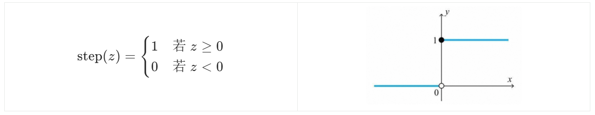

它模拟的是生物神经元的全有或全无特性——达到阈值就激活（输出 1），否则保持沉默（输出 0）。虽然后来的神经网络发展出了更优秀的激活函数（sigmoid、ReLU 等），但阶跃函数足以帮我们理解多层网络的核心原理。

### 万能逼近定理

XOR 只是个小例子，这种多层组合的能力到底有多强？1989 年乔治・西本科等人正式证明了**万能逼近定理（Universal Approximation Theorem）**：

==一个含有足够多神经元的单隐藏层 MLP，可以以任意精度逼近任意连续函数。==

这意味着 MLP 在理论上具备表达任何函数的能力。当然，足够多神经元和如何找到正确的权重是两个完全不同的问题——前者是表达能力，后者是训练能力。

### 如何训练模型仍旧是个问题

讲到这里你可能会问：既然多层网络的思想并不复杂，能力又这么强， 为什么神经网络还会经历长达二十年的寒冬？

一个可能颠覆你认知的事实：**MLP 的结构在 1960 年代就已经被提出了**，感知机的发明者罗森布拉特在 1962 年就讨论过多层网络。问题不是没人想到多层——而是想到了，却没法训练。

当时唯一的训练方法是感知机学习规则，它只适用于单层网络。对于多层网络，核心难题是：**隐藏层的误差该怎么分配？** 输出层的错误我们看得到，但中间那些隐藏神经元，每个该为最终错误承担多少责任？没人知道怎么算这个梯度。

直到 1986 年，Rumelhart、Hinton 和 Williams 发表论文，将**反向传播算法（Backpropagation）**与多层网络结合起来，提供了一套高效计算多层梯度的方法——引擎终于装上了深度学习这辆跑车。

下节课，我们就来了解让神经网络起死回生的反向传播算法。

# 五、基础知识点

## 1、反向传播 BP（Backpropagation）

参考视频

+ [反向传播：海量参数的神经网络如何训练](https://www.bilibili.com/video/BV1Lg5T6SEmP)，讲得好！
+ [【5分钟深度学习】#02 反向传播算法](https://www.bilibili.com/video/BV1yG411x7Cc)

参考笔记：[反向传播：海量参数的神经网络如何训练-up【谦行】](https://www.yuque.com/qx2io/deep-learning/bgzk7y4b52esmtzd)

### 神经网络训练全流程

在深入反向传播之前，先把神经网络训练的全流程串一遍，这样可以知道反向传播在整个流程中扮演的角色。


1. 初始化网络中各层神经元的权重和偏置参数；
2. 将输入数据送入网络进行**前向传播**，得到模型的预测结果；
3. 通过**损失函数**计算预测结果与真实标签之间的误差；
4. 利用**反向传播**算法，从输出层开始逐层计算损失对各参数的梯度；
5. 使用**梯度下降**根据梯度更新权重和偏置，从而减小损失值；
6. 不断重复以上过程，让模型逐步收敛，预测能力持续提升。

这个循环会重复成千上万次，每跑一次称为一个 **iteration（迭代）**，跑完所有训练数据一遍称为一个 **epoch**。

### 前向传播：模型用参数做预测

**前向传播**就是数据沿着网络从输入流向输出的过程。每个神经元接收上一层传来的特征向量，按各自的权重做线性加权求和、加上偏置，再经过非线性激活函数过滤，把信息重构为更高阶的特征，传递给下一层。

正是这种逐层抽象的机制，让神经网络具备了自动学习特征的能力，可以拟合远比传统机器学习更复杂的模式。

每个神经元做的事情都是同一套两步操作：

1. 对上一层所有输出做线性变换：
2. 用激活函数引入非线性，把结果作为新特征输出给下一层：

差别只在于每个神经元维护着自己的一套权重和偏置参数。

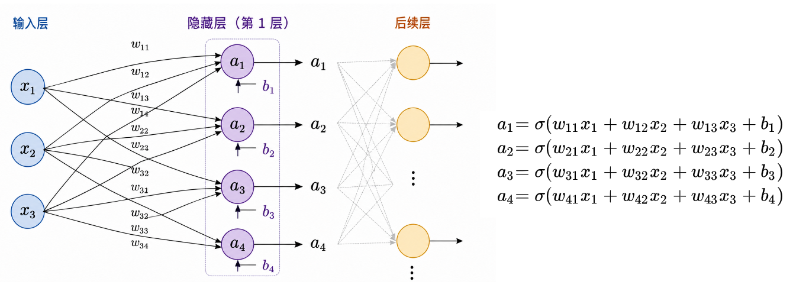

写成通项形式，第 $l$ 层第 $i$ 个神经元的输出为：
$$
a_i^{(l)} = \sigma(\sum_{j = 1}^n w_{ij}^{(l)}a_j^{(l-1)} + b_i^{(l)})
$$
也可以简写为向量内积：
$$
a_i^{(l)} = \sigma((w^{(l)})^Ta^{(l-1)} + b_i^{(l)})
$$
为了提高效率，神经网络不会一个神经元一个神经元地算，而是把同一层的所有神经元打包成矩阵，一次矩阵乘法搞定整层运算：
$$
A^{(l)} = \sigma(W^{(l)}A^{(l-1)} + b^{(l)})
$$
比如输入有三个特征、第一隐藏层有四个神经元，可以一次性算完：
$$
A^{(1)} = \sigma(W^{(1)}A^{(0)} + b^{(1)}) = 
\sigma
\left (
\begin{bmatrix}
w_{11} & w_{12} & w_{13} \\
w_{21} & w_{22} & w_{23} \\
w_{31} & w_{32} & w_{33} \\
w_{41} & w_{42} & w_{43}
\end{bmatrix} \\
\begin{bmatrix}
a_1^{(0)} \\
a_2^{(0)} \\
a_3^{(0)} 
\end{bmatrix} \\
+
\begin{bmatrix}
b_1^{(1)} \\
b_2^{(1)} \\
b_3^{(1)} \\
b_4^{(1)} 
\end{bmatrix}
\right )
$$

### 损失函数：把误差量化成一个数

前向传播结束后，我们得到了预测值 。但它和真实标签  之间往往有差距，这个差距需要被量化成一个具体的数字，才能指导后续的参数调整。这就是**损失函数（Loss Function）** 的作用。

线性回归中我们用过 MSE（均方误差）：


 越大，说明错得越离谱。问题随之而来：**该怎么调整权重矩阵**  **和偏置** **，才能让**  **变小？**

在线性回归、逻辑回归里，我们的答案是**梯度下降**：算出损失对每个参数的偏导数，组成一个向量——**梯度**，它指向损失上升最快的方向。要让损失下降，沿负梯度方向走一小步即可：


可一旦换到神经网络，事情就复杂多了。每个神经元的输出都是下一层的输入：


这是典型的**复合函数嵌套**，而且嵌套了好多层。要算出损失对深处某个参数的偏导数，必须借助一种强大的数学工具——**链式法则**。

### 链式法则与计算图

链式法则的核心思想很朴素：**如果**  **影响** **，** **又影响** **，那么**  **对**  **的总影响等于这两段影响的乘积**。

若 ，，则：


举个例子，，，可以画成下面这张**计算图**：

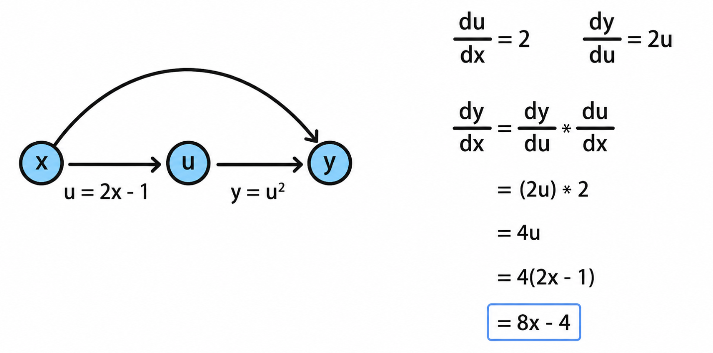

按链式法则：


**当函数有多个输入变量时，链式法则会变成"所有路径导数的和"**。设 ，而 、，那么：


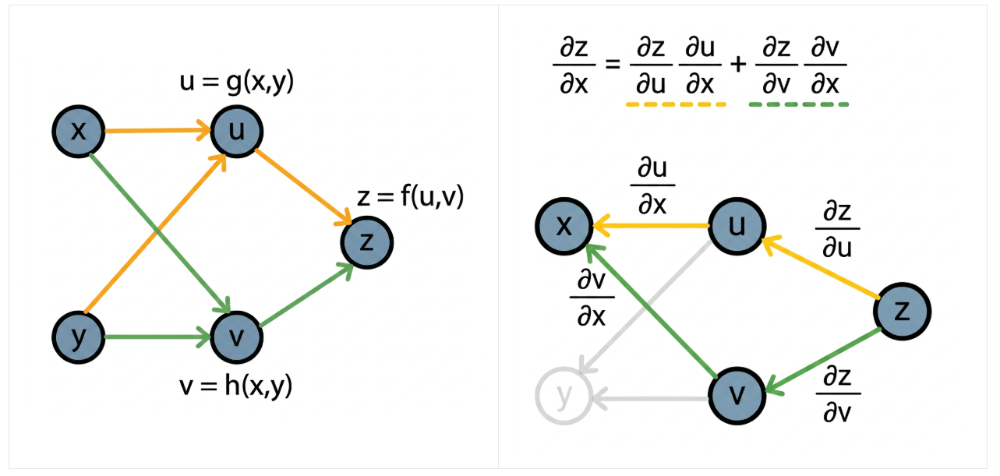

举个例子：，，


理解了前向传播和链式法则之后，我们终于可以正式拆解反向传播了。

### 反向传播：沿计算图寻找"背锅侠"

前面我们已经接触过计算图：**前向传播**沿箭头方向计算每个节点的值；**反向传播**则逆着箭头方向，用链式法则把每个节点的局部梯度一路乘回输入端。

计算图的妙处在于：它把复杂的多元复合求导，简化成了"沿路径相乘局部梯度"。每个节点只需关心自己的输入输出，无需理解全局结构。这也是为什么 PyTorch 等框架都基于计算图来实现自动微分。

==1. 构造一个极简神经网络==

为了把每一步算得清清楚楚，我们用一个最简化的网络：

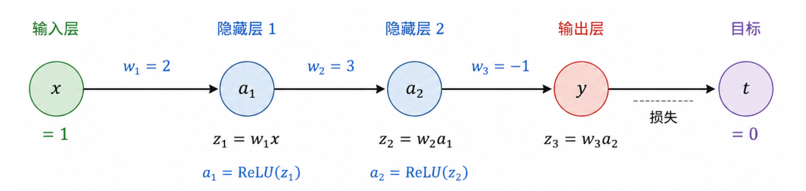

+ **网络结构**：3 层，每层 1 个神经元，无偏置；输入 ，目标 ；初始权重 ，，。
+ **激活函数**：为了让导数好算，把阶跃函数换成 **ReLU**——输入大于 0 时原样输出，否则输出 0。
+ **损失函数**：MSE 的简化形式 （系数  是为了求导后系数为 1，更简洁)。

==2. 前向传播==

按计算图从左到右一路算下来：

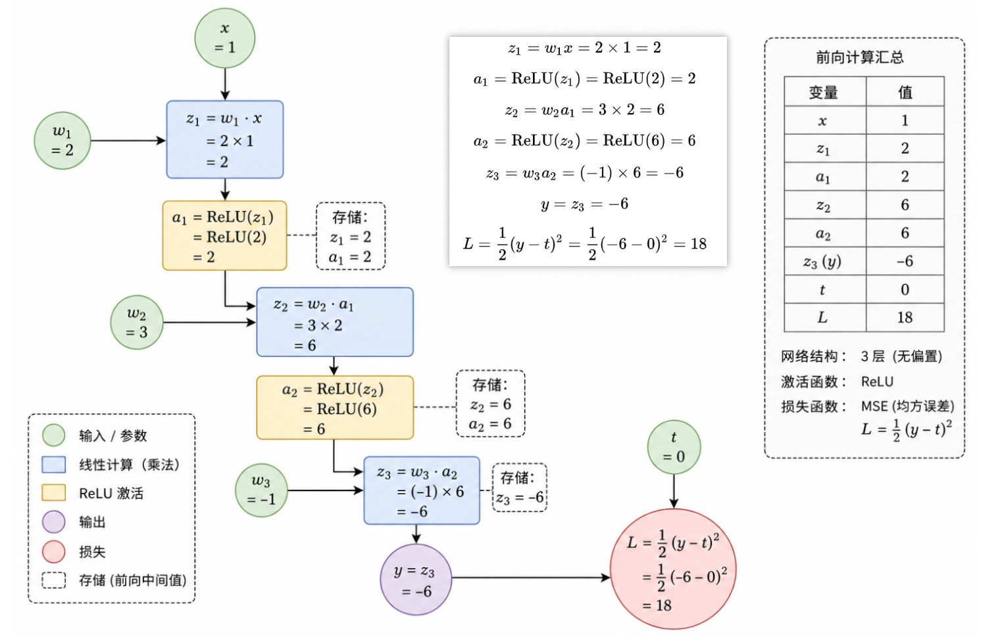

预测值  距离目标  还差得远，损失高达 18。下面就要靠反向传播来分锅了。

==3. 反向传播==

反向传播的核心思想是：**从损失函数出发，利用链式法则反向逐层算出每个参数对最终误差的"责任"**——也就是**梯度**。算出梯度后，我们就能用它来指导参数更新，让误差变小。

先准备好 ReLU 的导数：


可以看出来 ReLU 做激活函数的优势

+ 相对于阶跃函数而言 ReLU 可导，0 处导数可以规定为 1
+ 导数非常简单，可以大幅提升运算速度

反向传播过程如图所示

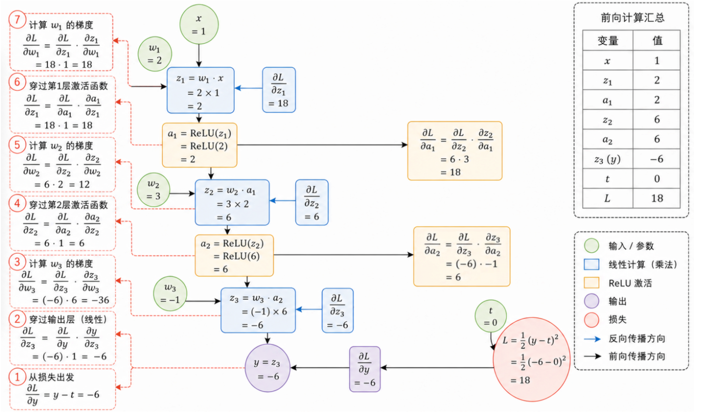

这样可以算出损失函数对每个参数的偏导数

| **参数梯度**                                                 | **梯度值** | **含义**                                                     |
| ------------------------------------------------------------ | ---------- | ------------------------------------------------------------ |
|  | **18**     |  每增加 1，损失增加约 18 |
|  | **12**     |  每增加 1，损失增加约 12 |
|  | **-36**    |  每增加 1，损失减少约 36 |

注意符号的含义：梯度为**正**意味着该参数增大会让损失上升，所以我们要**减小**它；梯度为**负**则相反，需要**增大**它。这正是梯度下降中"减去 "的由来。

### 梯度下降：更新参数

前向传播算出了误差，反向传播算出了梯度（指明了调整方向和力度）。接下来用梯度下降把参数往让损失下降的方向推一小步，再跑一次前向传播，验证误差是否真的变小了。

更新参数之后，重新进行前向传播计算出预测值$\hat y$，然后计算损失函数得到结果。

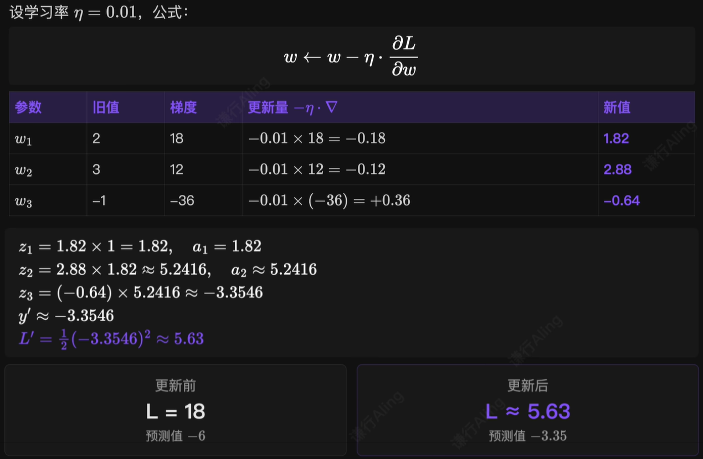

结论非常明显：损失大幅下降，预测结果从 -6 朝着目标值 0 明显靠近了一步。

> 这就是神经网络学习的本质：**前向传播算误差**  **反向传播算梯度**  **梯度下降更新参数**  **再次前向传播……**

如此循环成千上万次，直到损失降到接近 0，模型就训练好了。

### PyTorch实现自定义神经网络

理解了上面的全过程，就能体会 PyTorch 的优雅之处了。它通过核心机制**自动微分（Autograd）** 帮我们处理所有反向传播的细节：你只需写出前向计算公式，PyTorch 就会在后台自动构建计算图，再用一行 `loss.backward()` 把所有梯度一次算出来。

```python
import torch
import torch.nn as nn
# ── 数据 ────────────────────────────────────────
x = torch.tensor([[1.0]])
t = torch.tensor([[0.0]])
# ── 网络 ────────────────────────────────────────
model = nn.Sequential(
    nn.Linear(1, 1, bias=False),   # w1
    nn.ReLU(),
    nn.Linear(1, 1, bias=False),   # w2
    nn.ReLU(),
    nn.Linear(1, 1, bias=False),   # w3
)
# 初始化权重，与上面手算示例保持一致
with torch.no_grad():
    model[0].weight.fill_(2.0)
    model[2].weight.fill_(3.0)
    model[4].weight.fill_(-1.0)
# ── 损失函数 + 随机梯度下降优化器 ────────────────────────────
criterion = nn.MSELoss()
optimizer = torch.optim.SGD(model.parameters(), lr=0.01)
# ── 训练 100 轮 ──────────────────────────────────
for epoch in range(100):
    loss = criterion(model(x), t)   # 前向传播 + 计算损失
    optimizer.zero_grad()           # 清空上一轮残留的梯度
    loss.backward()                 # 反向传播，自动计算梯度
    optimizer.step()                # 梯度下降更新权重
    
    if epoch % 10 == 0:
        print(f"Epoch {epoch+1:3d} | 预测值: {model(x).item():7.4f} | 损失: {loss.item():.4f}")
```


## 2、激活函数

### 为什么要有激活函数

假设我们去掉所有激活函数，一个三层神经网络的输出就是：


把括号展开：


如果令 、，上式就退化成：


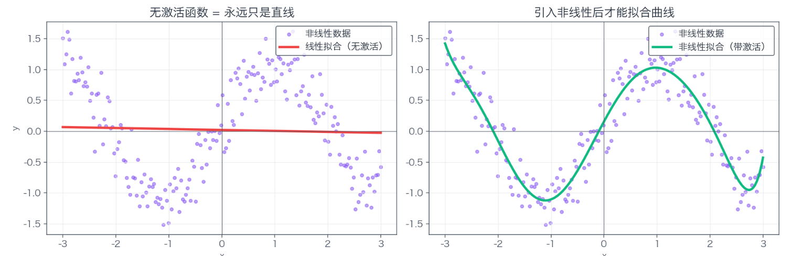

也就是说无论堆多少层，没有激活函数的神经网络始终是一个线性模型，当然这也是数学上线性变换本身的含义，在神经网络中不引入非线性，100 层和 1 层没有任何区别.

而现实世界里，绝大多数问题都是非线性的，猫和狗的边界不是一条直线，温度和销量也不是简单的正比关系。

激活函数在每一层之间插入一道非线性的弯，让神经网络得以拟合任意复杂的函数。

### 为什么不直接把线性函数做成非线性？

既然非线性这么重要，为什么不干脆把  这一步就做成非线性的？这样不就一步到位了吗？

问题问得好。从理论上来讲没问题，但工程实现上做不到。

线性运算的工程红利太大了，矩阵乘法  看似平平无奇，背后是几十年的数值计算积累：

+ GPU/TPU 就是为矩阵乘法量身打造的，cuBLAS 几毫秒就能算完亿级规模的 
+ 线性函数的梯度计算极其简单，，反向传播一行公式搞定

一旦把它换成某个复杂的非线性函数，这些红利全部消失：GPU 加速失效，梯度要逐元素手推，模型压缩也无从下手。更致命的是强非线性在多层叠加后会引发数值爆炸。 

以一个简单的替换  为例，仅仅叠加三层：


输出就已经包含了  的 8 次方，推广到 10 层则会直接爆表到 1024 次方，这种指数级膨胀的次幂会把网络拖进两个极端：

+ 前向计算时数值迅速冲向无穷大或因精度不足直接归零，导致模型瘫痪；
+ 反向传播时求导系数极其巨大，梯度彻底失控，模型根本无法收敛。

而把非线性单独抽出来作为激活函数，并刻意挑那些输出有界或导数温和的形式（Sigmoid 压在 0~1，Tanh 压在 -1~1，ReLU 正半轴导数恒为 1），就是为了主动掐断这条指数级膨胀的传染链。

历史上确实有二阶神经元、Maxout 等方案尝试过将线性与非线性揉在一起，结论惊人地一致，计算复杂度涨了一个数量级，模型效果的提升却不到 10%。因此线性变换 + 独立非线性激活的分层堆叠，是工程效率与理论简洁性之间最划算的折中。

### 一个好的激活函数需要具备的特点


### step(x) 阶跃函数

1958 年罗森布拉特用阶跃函数搭出了感知机


阶跃函数 时输出永远是 0， 时输出永远是 1。

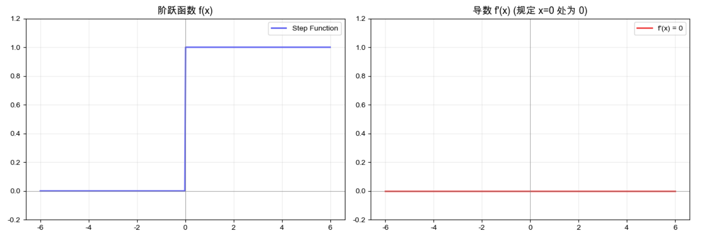

阶跃函数对单层感知机是有效的，但一旦放进多层神经网络，就会暴露出两个根本性的缺陷：

+ **梯度无法传播**：阶跃函数在以外的所有地方导数恒为 0，在处虽然存在一个无穷大的跳变，但工程上通常将其人为规定为 0 或忽略不计。这意味着无论网络有多深，误差信号在反向传播时一碰到阶跃函数就会被直接清零，梯度完全无法流回前层，训练从根本上就无从进行。
+ **信息损失过大**：阶跃函数的输出只有 0 和 1 两种状态，对输入的具体数值毫不敏感——无论输入是 0.001 还是 1000，只要过了阈值，输出一律为 1。网络因此完全丧失了对"程度"的感知能力，无法区分一个微弱信号和一个强烈信号之间的差异，大量有价值的数值信息在激活的瞬间就被永久丢弃了。

正是这两点致命缺陷，使得阶跃函数在多层网络中几乎毫无用武之地，也直接推动了后续更平滑、更连续的激活函数的诞生。

### Sigmoid：把开关变成了旋钮

1986 年辛顿等人把反向传播算法带回了神经网络，必须有一个处处可导的激活函数，他们沿用了一个早在 19 世纪就被用来描述人口增长的老朋友——Sigmoid（S 型函数）：


Sigmoid 函数的导数是一个简单乘法


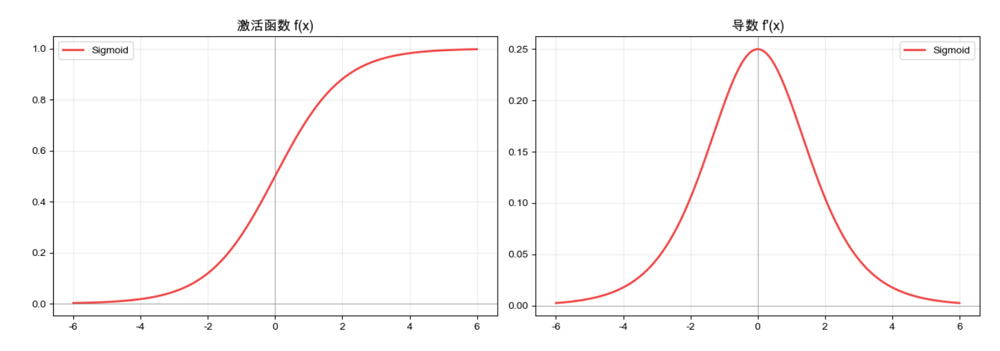

Sigmoid 的函数图像是一条优雅的 S 形曲线，严格压在 0 和 1 之间，它曾经是神经网络中最经典的激活函数之一。

优点：相比阶跃函数，Sigmoid 解决了几个致命问题。

+ **处处可导**：梯度下降可以工作了——这是反向传播能跑起来的硬性前提。
+ **输出在 (0,1) 之间**：在  处取值 0.5，可解释为概率——非常适合做二分类的输出层。
+ **平滑过渡**：输入 1.5 和输入 1.6 输出会有微小但有意义的差异，神经元终于有了模拟感。

缺点：但 Sigmoid 也带来了几个非常严重的问题。

+ **梯度消失**：Sigmoid 的导数最大值出现在 ，也只有 0.25。当  变大时，函数两端迅速进入饱和区，导数很快趋近于 0。这在深层网络中是致命的：反向传播每经过一层，就要额外乘一次这样的导数。即使按最理想的情况估计，经过 5 层之后，梯度也只剩下 。
  结果就是靠近输出层的参数每一步都在更新，而靠近输入层的参数可能要等上千步，才能积累出同样大小的变化。外层在百米冲刺，内层却还在原地踱步。网络看似在训练，实际上前几层几乎没有学到东西。这也是为什么早期神经网络很难训练得足够深，超过 5 层往往效果就明显恶化。
+ **输出不是零中心**：Sigmoid 的输出永远是正数。这样一来，如果某一层的输入整体偏正，那么下一层在反向传播时算出来的梯度往往也会长期保持同号——要么全正，要么全负。这会导致权重更新缺乏灵活性，它们常常只能一起增大或一起减小，而不是各自独立地朝最优方向调整。优化器因此很难沿着最直接的路径逼近最优解，而更像是在参数空间里走一条低效的 Z 字形折线。
+ **计算开销较高，且天然容易饱和**：Sigmoid 的表达式中含有指数项，计算代价比简单乘法高很多。更重要的是 Sigmoid 本质上是在把整个实数轴  用指数函数挤进  这一小段区间里。指数式压缩使两端的斜率以指数速度衰减，这才是饱和真正的来源——压缩本身并不必然带来梯度消失，但用指数挤压几乎一定会。

正因为这些问题，Sigmoid 如今已经很少再用于隐藏层；它主要保留下来的位置，是二分类任务的输出层。至于多分类任务，则通常交给 Softmax 来完成。

### Tanh（1990s）：把 Sigmoid 摆正

90 年代初，贝尔实验室的杨立昆在研究手写数字识别时，对 Sigmoid 输出非零中心带来的训练震荡和收敛缓慢感到非常困扰。他在 LeNet 系列工作中开始改用一个更适合隐藏层的激活函数——Tanh（双曲正切），并在 1998 年的论文 Efficient BackProp 中系统总结了这一选择背后的原因：


其导数形式也相对简洁：


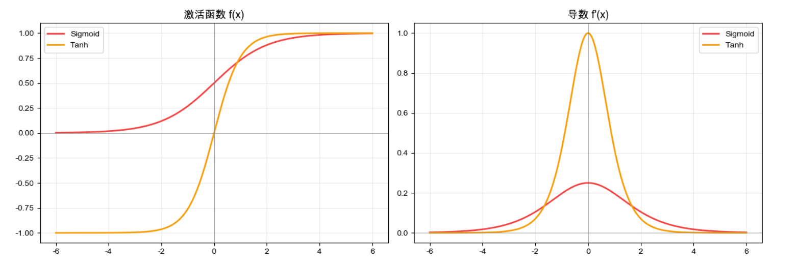

Tanh 函数图形和 Sigmoid 一样是 S 形，但 Tanh 的输出范围被拉伸到了  (-1, 1)，且关于原点对称——这是它和 Sigmoid 最关键的区别。Tanh 主要解决了 Sigmoid 作为隐藏层激活函数时的两个问题：

+ **梯度更大，梯度消失有所缓解**：Tanh 在附近的导数最大值是 1，而 Sigmoid 的最大导数只有 0.25，前者整整大了 4 倍。这意味着在反向传播时，梯度衰减得没有那么快，深层网络的训练会稍微容易一些。
+ **输出是零中心的：**Tanh 的输出既可能是正数，也可能是负数，下一层神经元接收到的输入不再总是同号，梯度方向也不容易被绑死成同一个方向。这样一来，Sigmoid 常见的那种 Z 字形震荡现象会明显减轻，优化过程更加顺畅，收敛速度也更快。

凭借这一改进，杨立昆基于 Tanh 训练出的 LeNet 在手写数字识别上取得了巨大成功。到 90 年代末，美国大约 10% 到 20% 的手写支票，已经可以由 LeNet 自动识别金额。在相当长的一段时间里，Tanh 都是神经网络隐藏层的事实标准。

不过，Tanh 并没有从根本上摆脱 Sigmoid 的局限。它本质上只是把 Sigmoid 做了“平移 + 拉伸”，S 形函数的本质没有变，因此两端饱和的问题依然存在：

+ 梯度消失依然存在： 一大， 也会饱和到 ±1，导数趋近于 0，深层网络仍然学不动
+ Tanh 和 Sigmoid 一样，都依赖指数函数，计算成本并不低，在大规模训练中仍然是一个负担。

所以，Tanh 虽然比 Sigmoid 更适合作为隐藏层激活函数，但它仍然只是一次改良，而不是一次真正意义上的突破。这也是为什么当时的 CNN 虽然已经能工作，但训练层数依旧有限，深层网络时代还远没有到来。

### ReLU（2010）：一个懒得动脑的天才设计

2010 年辛顿和同事提出了一个简单到令人发指的激活函数——ReLU（Rectified Linear Unit）


它的导数也同样极其简单：


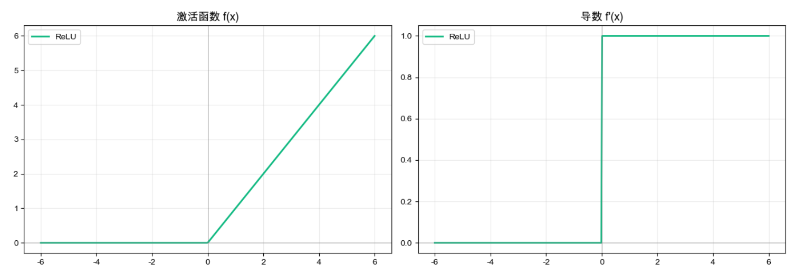

这个函数简单到让人第一眼会怀疑：这么粗糙的东西，真的能用吗？事实证明，不仅能用，而且它几乎亲手开启了深度学习的现代时代。

2012 年 ImageNet 竞赛上，辛顿和他的学生 Alex Krizhevsky、Ilya Sutskever 提出的 AlexNet，将图像分类错误率从前一年的 26.2% 一举降到了 15.3%。这个结果不仅远超当时所有传统方法，也比第二名足足低了 10.8 个百分点。这样的优势在 ImageNet 历史上前所未有。从那一刻起，整个计算机视觉领域迅速转向深度学习，而 AlexNet 所使用的激活函数正是 ReLU。

相比 Sigmoid 和 Tanh，ReLU 一下子解决了几个长期困扰深层网络的核心问题。

+ **大幅缓解梯度消失**：ReLU 在正半轴上的导数恒为 1，也就是说只要神经元被激活，梯度在反向传播时就可以几乎原样通过，不会像 Sigmoid 或 Tanh 那样层层缩小。链式法则在这里几乎变成了一条梯度直通车，深层网络第一次真正变得可以训练。虽然 ReLU 并不能从理论上彻底消灭所有梯度问题，但它至少移除了激活函数本身造成的大面积梯度衰减。
+ **计算极快**：ReLU 的前向传播只需要做一次简单的比较，取 0 和  的较大值。没有指数、除法，也没有复杂的函数逼近。相比 Sigmoid、Tanh，ReLU 的计算代价要低得多。在大规模网络中，激活函数会被调用数亿甚至数十亿次，这种特性会被放大成非常可观的训练速度优势。
+ **天然产生稀疏激活**：对于所有负输入，ReLU 都直接输出 0。也就是说，在任意一次前向传播中，往往只有一部分神经元真正被激活，另一部分神经元则完全沉默。这种稀疏激活与生物神经元的放电方式有些相似，也在一定程度上带来了正则化效果，网络不会总是动用所有神经元去拟合每一个样本，从而降低了过拟合风险。

正因为这几个优点，ReLU 很快取代了 Sigmoid 和 Tanh，成为深度学习时代最具代表性的激活函数。直到今天，它仍然是很多神经网络的默认选择。

不过，ReLU 也并非没有代价。在大规模训练中，它暴露出了几个典型问题。

+ **死亡 ReLU**：ReLU 的负半轴是一条贴着 0 的水平直线，导数恒为 0。如果某次参数更新之后，一个神经元对所有训练样本的预激活值都落在负区间，那么它的输出就会永远是 0，导数也永远是 0。这样一来，反向传播再也无法给它任何梯度，这个神经元就死掉了。
  一旦进入这种状态，它就彻底失去学习能力，后续训练几乎无法把它救回来。学习率过大时，这种现象尤其明显，甚至可能在训练初期就让大量神经元集体阵亡。这可以看作是 ReLU 用极致简洁换取高效率所付出的代价。
+ **输出不是零中心**：ReLU 的输出要么是 0，要么是正数，因此它依然不是零中心激活函数。这意味着它并没有彻底解决早期激活函数在优化路径上的所有问题，只是相比 Sigmoid，这个缺点已经轻得多——在正半轴梯度直通车的优势面前，非零中心带来的 Z 字形震荡基本可以接受。
+ **输出无上界，数值可能变得不稳定**：Sigmoid 和 Tanh 都会把输出压缩到固定区间内，而 ReLU 在正半轴上没有任何上界。这意味着，如果网络层数很深、参数又较大，激活值可能一路放大，导致输出方差越来越大，甚至引发数值不稳定。因此 ReLU 时代的深层网络通常都会搭配 Batch Normalization 等归一化技术，来稳定每一层激活值的分布，防止训练过程失控。

总的来说，ReLU 的伟大之处恰恰在于它的粗糙，它虽然没有 Sigmoid 和 Tanh 那样优雅的数学曲线，却凭借极低的计算成本、稳定的梯度传播和稀疏激活特性，第一次让真正的深层网络在工程上变得可训练、可扩展、可落地。它不是完美的激活函数，但它是深度学习历史上最重要的转折点之一。

### ReLU 的变体

ReLU 一战成名后，研究者们围绕如何让神经元不死如何让曲线更光滑展开了一系列改造。

#### Leaky ReLU

既然 ReLU 在负半轴完全归零会死，那就给它一个极小的值


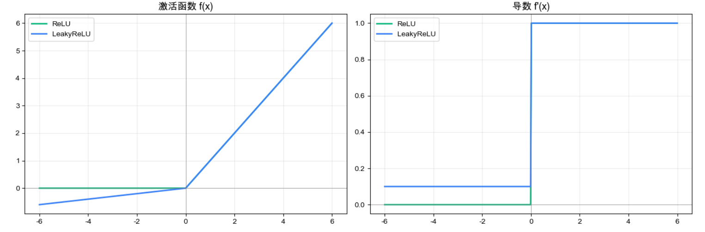

Leaky ReLU 的图像一条单调递增的折线——正半轴还是 45°直线，负半轴改为一条小斜率（约 0.01）的上行直线，几乎贴着 x 轴往左下方缓缓延伸。这样负半轴有了非零的小斜率，导数永远不为 0，神经元就不会彻底死亡，永远保留学习的可能性。

因此当训练神经网络过程中确实出现大量神经元死亡时，可以使用 LeakyReLU 替换 ReLU 试试。

但在 Leaky ReLU 中是手动设的超参数，0.01 不一定是最优值，调起来很烦。加上大多数情况下，ReLU 经过良好初始化和 BatchNorm 已经够用，Leaky ReLU 在工程实践中带来的提升常常不明显。

#### GELU：Transformer 的标配

ReLU 在处有一个硬性的切断，输入一旦为负信号就被直接清零，没有任何过渡。GELU 的出发点，正是想把这个硬门换成一种更柔和的软门——不再是非此即彼的开关，而是根据输入的大小，以一定概率决定放行多少信号。


其中是标准正态分布的累积分布函数，直觉上很好理解：越大越接近 1，信号几乎全部通过；越小越接近 0，信号被大幅压制。

由于本身没有闭合解析式，工程上通常使用以下基于 tanh⁡ 的近似公式：


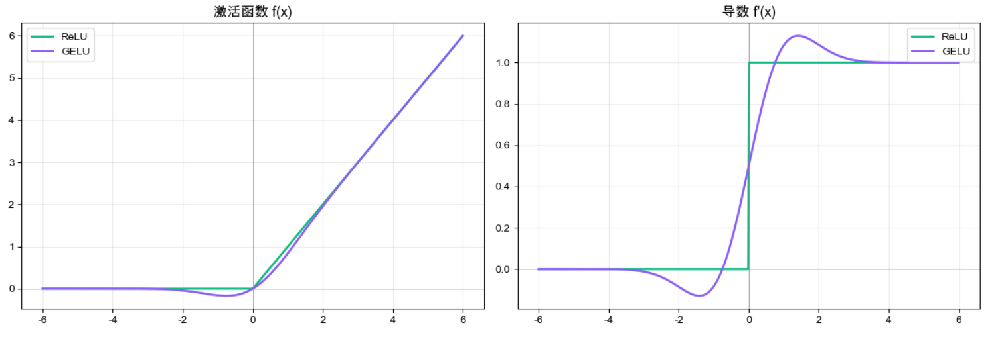

从图像上看，GELU 的整体形状类似于一条平滑版的 ReLU：在原点附近没有 ReLU 那种尖锐的折角，而是圆滑地过渡；负半轴有一个轻微的下凹，最低点约在  处取到 ，然后回升趋近 0。

GELU 的提出时间是 2016 年，但它真正进入大众视野是在 2018 年——Google 发布的 BERT 论文默认采用了 GELU 作为激活函数。此后 GPT 系列、ViT 以及几乎所有主流 Transformer 类大模型都相继跟进。GELU 在大模型时代的地位，几乎相当于 ReLU 在 CNN 时代的地位。

当然，GELU 也有它的代价。即便是上面这个近似版本，也需要计算 tanh⁡、三次方和平方根，比 ReLU 的单条指令要慢得多。因此在实际工程中，两者的适用场景已经相对清晰：

+ Transformer 类模型（BERT、GPT、ViT 等）的前馈网络层，在 2023 年之前的大模型中 GELU 已经成为事实标准；
+ 非 Transformer 场景（如轻量级 CNN、边缘部署等），ReLU 计算更轻，通常已经足够胜任。

#### Swish / SiLU

2017 年，Google Brain 做了一件颇有意思的事：让机器自己来选激活函数。他们通过神经架构搜索，让模型从大量候选函数中自动筛选出表现最优的那一个。结果搜出来的函数，长得和 GELU 几乎一模一样：


其中  就是老朋友 Sigmoid，函数形式极其简洁，用输入乘以自身经过 Sigmoid 之后的值，就这一步。

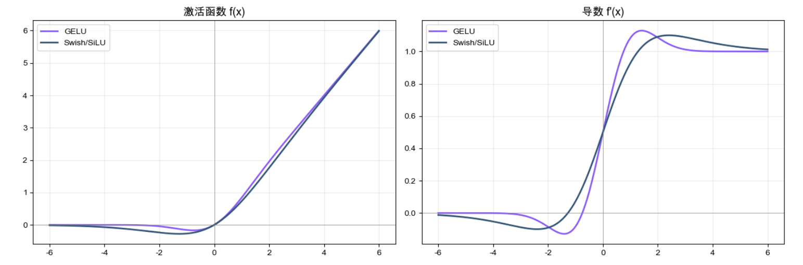

这里有个颇为有趣的历史细节，这个形式其实并非 Google 首创。在 2016 年，Elfwing 等人就已经独立提出了完全相同的函数，并将其命名为 SiLU（Sigmoid Linear Unit）。Google 在 2017 年用 NAS 重新发现了它，给它起了个新名字 Swish。所以两者本质上是同一个函数，PyTorch 中实现这一函数的是 `nn.SiLU`，文档里也注明了它即是 Swish。

从图像上看，Swish 和 GELU 的曲线几乎难以区分：在原点附近平滑过渡，没有 ReLU 的硬折角；负半轴有一个轻微的下凹，最低点约在处取到，随后缓缓回升趋近于 0。

Swish 相对于 GELU 的主要优势在于形式更简单：它只需要一个 Sigmoid，不需要 GELU 那样的 ⁡tanh 近似、三次方项和平方根，计算上稍微轻一些。而在实际效果上，Swish 整体优于 ReLU，与 GELU 也相当接近。

正因如此，Swish 在多个领域都站稳了脚跟：

+ 现代轻量级 CNN：EfficientNet、MobileNetV3 在精度与速度的权衡中都选择了 Swish 作为激活函数；
+ 大模型前馈层：LLaMA 引领诸多开源大模型 Mistral、Qwen、PaLM 等的 FFN 采用 SwiGLU；
+ 在对计算资源较为敏感、又希望比 ReLU 更进一步的场景下，Swish 是一个高质量的替代选项。

### 总结


激活函数的发展史，本质上是在寻找一个平衡点：既要给网络足够的非线性表达能力，又要让梯度传得动、计算跑得快、训练足够稳定。

+ 阶跃函数解决了神经元要不要激活的问题，但它太硬了，几乎无法反向传播，信息也丢得太狠，所以只适合早期感知机，不适合深层网络。
+ Sigmoid 第一次让可导的非线性真正进入神经网络，反向传播终于能工作了，还天然有概率解释，因此在早期非常重要。但它两端饱和、梯度太小、输出又不是零中心，网络一深就学不动。
+ Tanh 是在 Sigmoid 基础上的一次改良，输出变成零中心，梯度最大值也更大，训练明显更顺，因此在很长一段时间里成为隐藏层的标准选择。但它依然是 S 形函数，饱和和梯度消失的问题并没有从根上解决。
+ ReLU 则是一次真正的范式转折，用最直接的方式保住梯度：正半轴导数恒为 1，计算还极其便宜。正是它让深层网络第一次真正训练起来，直接开启了现代深度学习时代。
+ GELU / Swish 是 ReLU 的精修版，它们保留了 ReLU 易训练的优点，又把原点附近的硬折角改成了平滑过渡，让小负值也能以柔和方式参与计算，因此在大模型、尤其是 Transformer 中表现更好。但代价是计算更贵。

激活函数的演化方向，不是越来越复杂，而是越来越懂得在表达能力、梯度传播和工程效率之间做权衡。早期函数更关注有没有非线性，中期函数更关注梯度能不能传播，现代函数更关注在大规模训练下，能不能又稳、又快、又好。因此今天激活函数的格局也很自然：

+ 输出层：概率问题用 Sigmoid / Softmax
+ 普通隐藏层：很多场景下 ReLU 仍然够用
+ Transformer 和大模型：GELU / SiLU（Swish）更常见

## 3、损失函数

参考视频：[损失函数：告诉模型错了多少](https://www.bilibili.com/video/BV1jgGB6PE7S)

参考笔记：[损失函数：告诉模型错了多少-up【谦行】](https://www.yuque.com/qx2io/deep-learning/izmz005xxgzuxpfr)

> 损失函数：度量预测值与真实值之间的偏差。判断**当前这组参数到底好不好**

### MSE：回归任务的默认损失

**均方误差（Mean Squared Error, MSE）**，也叫 **L2 Loss**：


起计算过程非常简单，**逐样本算误差，对误差求平方，最后对平方和求均值**，几何上它就是预测点和真实点的欧氏距离的平方，所以也叫 **L2 损失**。

> 很多时候会看到  ，这种带  系数的写法只是为了让求导后  这条公式干净一点，不影响优化结果。

那为什么是平方而不是绝对值？有最朴素的两个理由：

1. **消去正负号**——直接求误差和的话，正负误差会互相抵消；
2. **放大大误差**——误差 3 平方后变 9，误差 0.4 平方后变 0.16，差距被显著拉开，让模型对大错误更敏感。

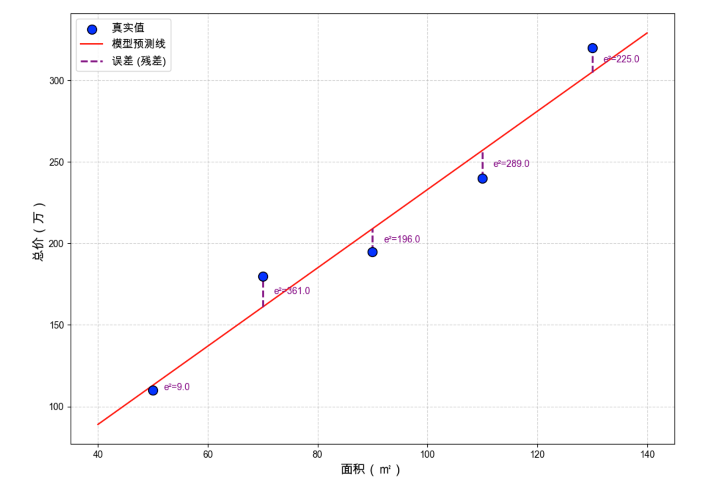

但平方还顺手送了一个极重要的好处——**梯度自适应**，MSE 处处光滑可导：


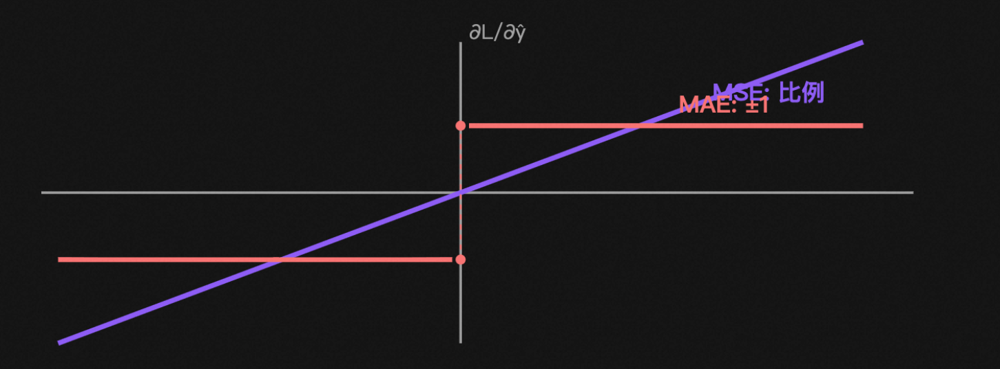

这是一条简单的直线：**预测离真值越远，梯度越大，模型修正得越快；预测值和真实值接近时，梯度自动变小，更新幅度变小**。这本身就提供了一种自适应步长的优化体验。

对比 MAE：


无论错得多离谱，梯度大小始终为 1——**远的拉不回来，近的又总是过冲**。

当然平方放大是双刃剑，一个标签出错的样本（比如真值 100，错标成 10000），它的贡献是 ，会把整个 batch 的梯度都带偏。标签质量差的场景里，MAE 或者 Huber Loss 通常更稳。

### MSE优势与局限

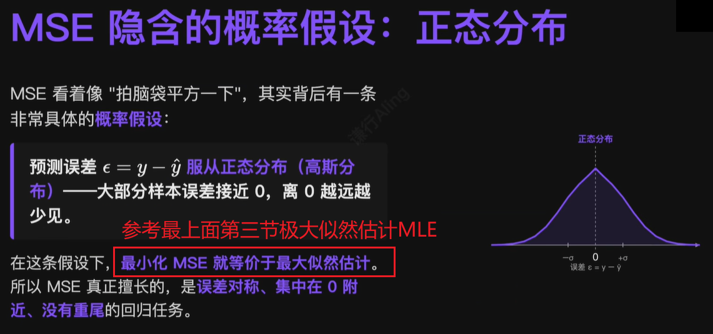

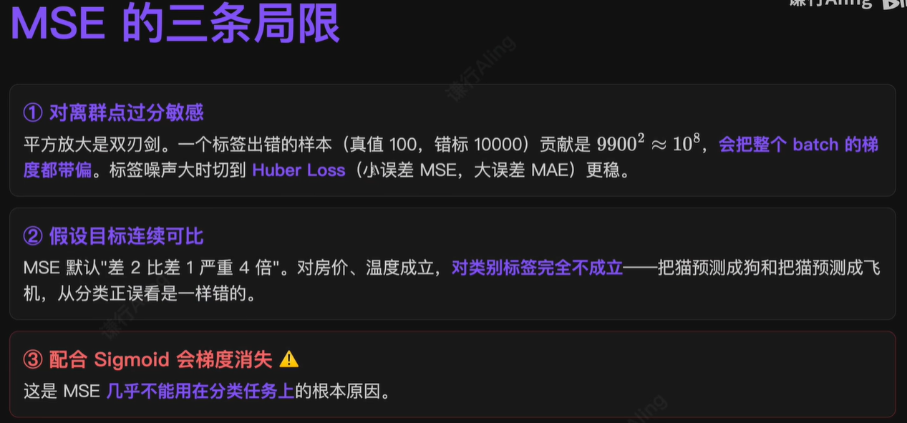

### 分类任务损失函数

#### 分类任务为什么不用 MSE

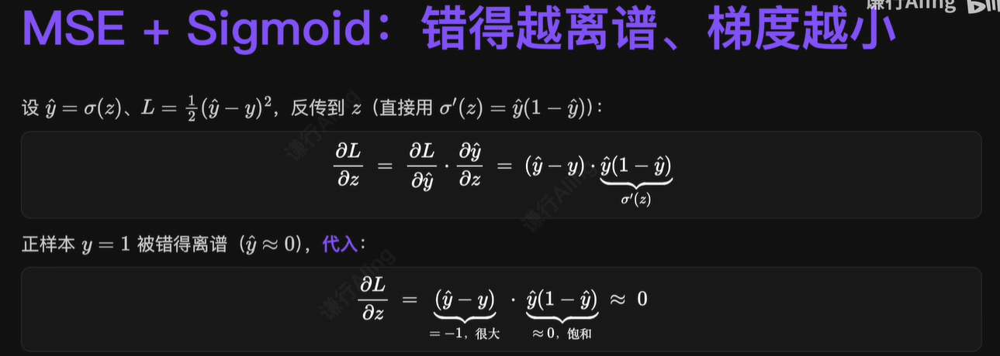

**错得越离谱、梯度反而越小**，这就是分类任务不能用 MSE 最核心的原因。

我们对分类任务的损失函数应该提出一个非常具体的要求：错得越离谱，梯度要越大

这样模型不管被初始化推到多偏，损失函数都能拽回来。模型预测的本质是给每一类一个概率 ，真实标签把  划成两类：**正确类的概率**  和错误类的概率。

一个好的分类损失只要做对一件事：**当**  **越小（错得越离谱），损失越大；当** **（完全对），损失趋于 0**。

#### 分类损失函数应该长什么样

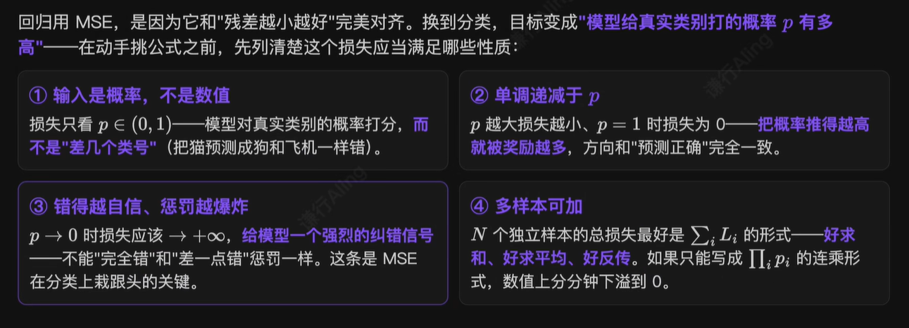

#### 两个候选：$1-p$ vs $-log \ p$

满足上面那条性质的最朴素函数有两个：

| **候选** | **表达式**                                                   | **优劣**                                                     |
| -------- | ------------------------------------------------------------ | ------------------------------------------------------------ |
| 线性惩罚 |  | 满足对应概率越小损失越大，但**损失封顶在 1**——错得再离谱惩罚也就那样，**梯度也是常数**，自适应能力差。违反上一节的③ |
| 对数惩罚 |  |  时 ——**错得越离谱、损失爆炸式增长**；梯度  同样在  小时巨大。满足③ |

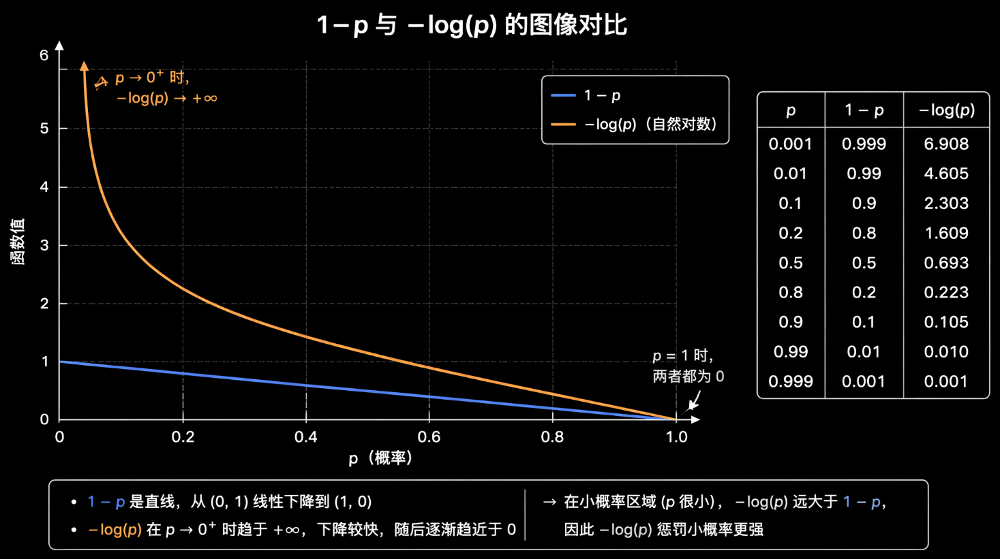

一个 batch 有  个独立样本，总似然是 ，这会导致 0~1 的数连乘会指数级趋于 0，数值上几乎不可处理。


使用对数有一个非常重要的好处——**它把概率连乘变成损失连加**。取负对数后变成 ，于是损失可以**逐样本加起来再求平均**，干净利落。

这条  在信息论里有个大名——**交叉熵（Cross-Entropy）**。

### 信息论

**熵（Entropy）= 一个分布的不确定性**：想搞清楚一件事，平均需要多少信息量。

+ **公平硬币**（50/50）：完全猜不透下一次是哪面，**熵很大**
+ **作弊硬币**（99/1）：几乎没悬念，**熵很小**（100% 时熵 = 0）

形式化定义：$H(p) = -\sum_xp(x)logp(x)$。

**交叉熵（Cross-Entropy）= 两个分布的差异**，用分布  来描述真实分布  时的平均信息量：
$$
H(p,q) = -\sum_xp(x)logq(x)
$$
在分类任务里，这两个分布就是模型预测的概率分布和真实标签分布，**CE Loss 算的就是它们之间的差距——差距越小，模型越靠谱**。

### 交叉熵 Cross-Entropy

> 交叉熵：分类任务的默认损失

#### 二分类交叉熵（BCE）

在二分类任务中，二元交叉熵（Binary Cross-Entropy, BCE） 写作：


为什么公式被拆成两项？因为二分类标签只有两种情况——**正样本（****）**和**负样本（****）**，每一项各管一种。 和  就像两个开关：标签一确定，**就有一项被乘 0 关掉，另一项被乘 1 留下**：

| **真实标签**                                                 | **公式坍缩为**                                               | **含义**                                                     |
| ------------------------------------------------------------ | ------------------------------------------------------------ | ------------------------------------------------------------ |
| （正样本） |  |  损失 ， 损失  |
| （负样本） |  |  损失 ， 损失  |

对于多个样本，交叉熵损失的公式可以记为


在链式法则求导时候，**Sigmoid 的导数和交叉熵的导数恰好大量约分抵消，最终结果和 MSE 一模一样**（推导过程过于复杂，建议大家直接记住就行），唯一的区别在于的含义不同


这并不是偶然，**交叉熵和 Sigmoid 是数学上专门为彼此设计的一对**，同理还有 softmax 和多分类交叉熵。

#### 多分类交叉熵：softmax + CE

多分类任务把 BCE 的一个概率升级成个概率，但交叉熵的核心不变——只需要在前面加一步，把网络输出的个 logit 归一化成一个概率分布，这一步用的就是 **softmax**：


比如 3 类任务下，神经网络给出 logits ，分两步算损失——

**① softmax 转概率**：

**② 套 CE 公式**：假设真实类别是第 0 类，那么真实标签中只能第一个为真 


和 BCE 的开关机制如出一辙， **项里只有正确类那一项计算生效**。反向传播到 logits 的梯度也同样干净（softmax 导数和 CE 的  互相约掉）：


正因为既能精准表达对分类预测错误的惩罚，又有这种线性、不饱和、计算极简的梯度形式，**交叉熵成了分类任务损失函数的不二之选**。

### 三大常用损失：MSE / BCE / Softmax+CE

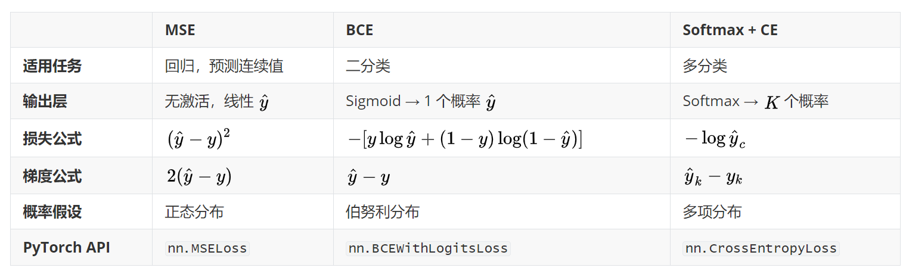

### PyTorch实现

```python
import torch
import torch.nn as nn

# ============ 回归：MSE ============
criterion = nn.MSELoss()                  # 默认 reduction='mean'
loss = criterion(pred, target)            # pred, target 同形状的浮点张量

# ============ 二分类：BCE ============
# 推荐用 BCEWithLogitsLoss——输入是 logits（Sigmoid 之前），数值更稳
criterion = nn.BCEWithLogitsLoss()
loss = criterion(logits, target.float())  # target 是 0/1 浮点

# ============ 多分类：CrossEntropyLoss ============
# 关键：输入是 logits（softmax 之前!），不是概率
criterion = nn.CrossEntropyLoss()
loss = criterion(logits, target.long())   # target 是 LongTensor，存类别下标（不是 one-hot）

# ✅ 正确写法
model = nn.Sequential(
    nn.Linear(784, 256),
    nn.ReLU(),
    nn.Linear(256, 10),         # 留裸 logits
    # nn.Softmax(dim=-1),         # ← 多余！
)
criterion = nn.CrossEntropyLoss()
```

`nn.CrossEntropyLoss` **的输入是 logits，不是 softmax 之后的概率**。它内部已经把 log-softmax 和 NLL 合在一起算了。如果你在网络最后再接 softmax，等于做了两次 softmax，损失几乎不能学。

## 4、梯度下降

参考视频：[梯度下降：神经网络是怎么找到一组好参数的](https://www.bilibili.com/video/BV1XbLh6mEru)

参考笔记：[梯队下降与优化器-up【谦行】](https://www.yuque.com/qx2io/deep-learning/vncdexfe2p50mr5x)

### 神经网络的训练过程

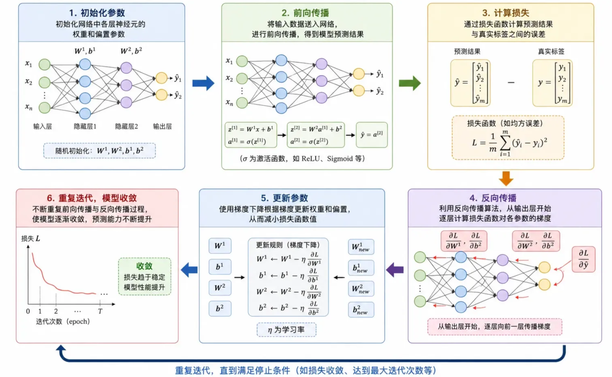

### 导数、梯度、梯度下降

要走下山先得知道上山方向，我们用最简单的例子来体会什么是梯度。一维抛物线 ，它的导数是 ，在不同位置取不同的值：


**导数的切线指向函数上升最快的方向**，大小代表上升的速率。那我们想让函数下降非常自然——沿导数反方向走最快。

推广到多维的损失函数 $L(\theta)$，把函数对每个变量的偏导数组成一个向量 $\nabla L(\theta)$，我们称之为==梯度==。其意义和一维导数完全一样，指向 $L(\theta)$ 在当前点 $\theta$ 处上升最快的方向。给它取反，就是损失函数下降最快的方向。

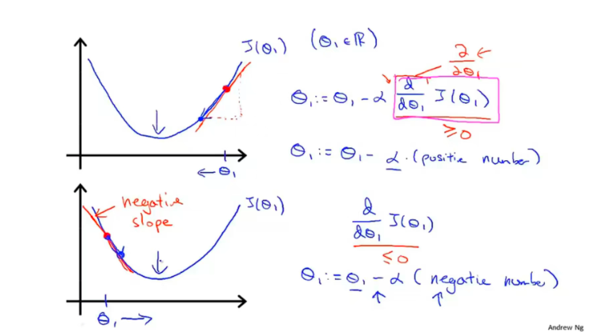

>作出损失函数与参数的图像$J(\theta) -\theta$如图
>
>+ 当梯度大于0，$\theta_1$更新后减小，横轴上向左移动，使得$J(\theta)$值减小，更趋近于最小值
>+ 当梯度小于0，$\theta_1$更新后增大，横轴上向右移动，使得$J(\theta)$值减小，更趋近于最小值

把朝负梯度方向迈一步写成公式，就是梯度下降的更新规则：
$$
\theta _{t+1} = \theta_t - \eta · \nabla L(\theta_t)
$$
其中 $\eta > 0$ 是步长（也叫**学习率**)，控制每一步迈多远。

+ 越靠近最低点，梯度越小，步长自动变小——梯度下降天然带着一个刹车
+ 每一步都比上一步更接近 0，函数值单调下降
+ 永远到不了 0，只能无限逼近——所以工程上需要差不多就停的停止条件

把这套流程搬到真实的神经网络里，只是把维度从 1 涨到了上亿：

+  是所有参数的集合（上亿维向量）。
+ $L(\theta)$ 是 $L$ 对每个参数的偏导构成的向量，通过反向传播算出来。
+ 更新规则 $\theta _{t+1} = \theta_t - \eta · \nabla L(\theta_t)$ 不变。

这里出现的 $\eta$ 是整个训练过程中最敏感的超参数，太大会震荡甚至发散，太小则进展缓慢。

### 梯度下降优化器

#### 朴素梯度下降（Batch GD）

这里的 Batch 指的是**每次参数更新前，都先把整个训练集完整处理一遍。**

1847 年，法国数学家柯西在研究彗星轨道问题时，提出了人类历史上最早的梯度下降思想。面对六个未知数和一组高度非线性的方程，他找不到解析解，只能沿着目标函数下降最快的方向一步步逼近答案。

把这个思路放到机器学习中，如果我们在每一次参数更新时，都使用全部训练样本来计算梯度，就得到了最经典的梯度下降形式：Batch Gradient Descent（批量梯度下降，简称 Batch GD）。


其中  是整个训练集的大小， 是第  个样本上的损失。也就是说在第  次更新参数时，**模型先遍历完整个训练集，计算所有样本损失的平均梯度，然后再执行一次更新**。

Batch GD 的优点很明显：

+ **方向准确、更新稳定**：每一步都沿着全数据上的真实梯度前进，梯度估计几乎没有随机噪声，优化轨迹通常比较平滑。
+ **理论性质好**：在凸优化问题中，只要学习率设置合适，通常可以得到较好的收敛保证。

但它的代价也非常高：

+ **训练成本高、效率低**：因为一次参数更新就要把全部训练数据跑完一遍，数据集越大参数更新越慢，模型往往要很久才能走出几步。
+ **缺少随机性，容易停在平坦区域**：当优化过程进入鞍点或梯度很小的区域时，Batch GD 往往缺乏噪声扰动来帮助它跳出去。

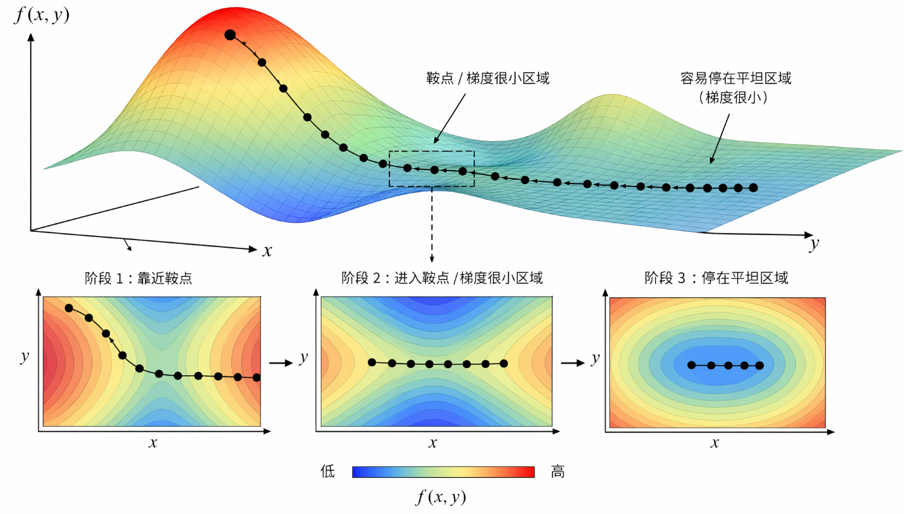

因此 Batch GD 的本质是用更高的计算成本，换取更精确、更稳定的梯度方向。在小规模数据集，或者一些教学场景、经典凸优化问题中，它仍然很有价值；但在现代深度学习里，随着数据和模型规模迅速增大，Batch GD 往往不再现实，于是才有了更常用的 SGD 和 Mini-batch SGD。

#### 随机梯度下降 SGD

1951 年，北卡罗来纳大学的两位统计学家在研究一个看似简单却充满噪声的问题：给小白鼠注射不同剂量的药物，每次只能观察到一个带随机波动的反应结果，如何估计出那个恰好让 50% 个体产生反应的剂量？

他们提出的思想后来被称为随机逼近，核心理念非常朴素，既然每次只能获得一个带噪声的观测，那就用这个观测去做一次小幅调整，长期来看依然可以逼近真实答案。

把这个思想迁移到机器学习中，就变成了随机梯度下降（Stochastic Gradient Descent，SGD）


也就是说，在第  次更新时，我们不再使用整个训练集的平均梯度，而是**随机抽取一个样本，用它的梯度作为对整体梯度的估计。**相比 Batch GD，每一步只用一个样本，带来了几个显著优势：

+ **计算成本骤降**：每次更新从  降到 ，训练效率提升几个数量级。
+ **跳出局部最优**：单样本梯度天然带噪声，这种随机扰动反而能帮助模型跳出鞍点或浅层局部极小值。
+ **支持在线学习**：数据可以一条条流入，模型边接收边更新，非常适合流式数据场景。

但这种轻量化也带来了明显的代价：

+ **更新轨迹剧烈震荡**：单样本梯度的方差很大，参数在最优点附近会不断来回摆动，难以稳定收敛。
+ **学习率需要衰减**：如果学习率固定，参数可能永远在震荡；若衰减过快，又可能过早停在次优位置。
+ **对离群样本敏感**：一个异常样本就可能把参数大幅拉向奇怪的方向。

本质上，用一个样本去估计整个数据集的梯度，本来就是高方差的操作——噪声既是救命稻草，也是隐患来源。它能帮助模型跳出困境，也可能阻碍精细收敛。

因此今天很少有人把纯粹的单样本 SGD 作为最终训练方式，但"用随机子样本近似全样本梯度"这一核心思想已经成为现代深度学习优化方法的基石，后续的优化器几乎都是在这个框架上不断演化出来的。

#### Mini-batch SGD：工程上的甜点

进入 90 年代后，研究者很快意识到一个现实问题：一个样本的梯度太抖，全体样本的梯度太慢。

于是一个折中的方案出现了——**每次随机抽取一小批样本（mini-batch）来计算梯度。**比如 32、64、128、256 个样本，既不过分嘈杂、也不至于代价高昂。


其中是第步随机采到的一个 batch，大小为，Mini-batch SGD 的优势体现在两个层面：统计效率和计算效率

+ **方差显著降低**：多个样本的梯度在 batch 内求平均，随机噪声大约按 1/B 的比例下降，比单样本 SGD 稳定得多。
+ **GPU 友好**：batch 内样本可以并行执行前向和反向传播，充分利用向量化和并行计算能力，这点是 Mini-batch 在深度学习时代的杀手锏。
+ **保留适度随机性**：相比 Batch GD，它仍然带有一定噪声，有助于跳出鞍点；相比单样本 SGD，又不会剧烈震荡。

但它并非没有代价：

+ **Batch size 成为关键超参数**：太小的话噪声大、收敛慢；太大的话又逐渐逼近 Batch GD，梯度过于精确，可能降低泛化能力。
+ **大 batch 需要匹配更大学习率**：否则每次更新幅度过小，等价于有效训练步数不足，这也是为什么大规模训练中常采用学习率预热、线性放大学习率等技巧。

尽管存在这些权衡，Mini-batch SGD 依然在统计效率（降低梯度方差）与计算效率（充分利用硬件并行）之间找到了一个极具工程价值的平衡点。

如今，在深度学习语境下，SGD 默认是指 Mini-batch SGD，它已经成为现代神经网络训练的基础框架，几乎所有优化器本质上都是在 Mini-batch SGD 的框架上做改进。

#### Momentum：给梯度下降装上惯性

1964 年，苏联数学家 Boris Polyak 在研究数值分析中迭代法的收敛速度时，提出了后来广泛应用于机器学习的动量法。它的核心思想是不要只看当前这一步的梯度，而要把过去几步的运动趋势也考虑进来。这样方向一致的更新会被持续强化，而来回震荡的更新则会被逐步抵消。

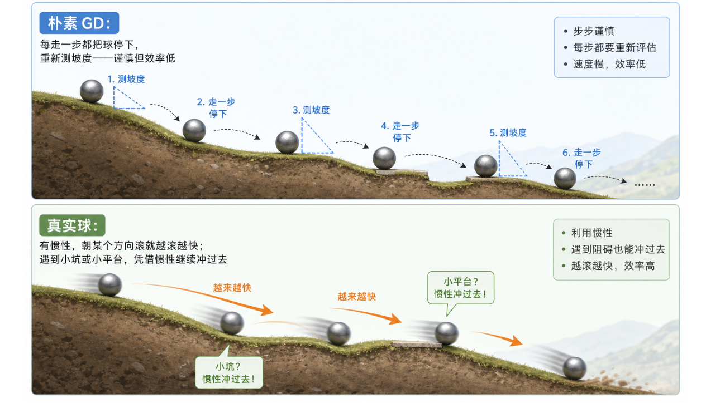

一个经典的比喻是：想象一个铁球从山坡上滚下。朴素的梯度下降就像每走一步都把球停下来，重新测一下地面的坡度，再往前挪一步，然后又停下。这样虽然谨慎但效率很低。而真实的球是有惯性的，如果它一直沿着某个方向往下滚，就会越滚越快；即使途中遇到小坑或小平台，也可能凭借惯性继续冲过去。

Momentum 正是把这种惯性引入优化过程：


其中  可以理解为速度，本质上是梯度的指数滑动平均， 是动量系数，通常取 0.9 左右。

Momentum 的作用主要体现在以下几个方面：

+ **加速一致方向上的前进**：如果连续几步梯度方向相近，速度项会不断累积，参数就在这个方向上越走越快，显著提升收敛速度。
+ **抑制震荡方向上的摆动**：在狭长的谷地中，梯度往往在横向上左右摇摆、符号频繁变化。Momentum 会让这些相反方向的更新彼此抵消，从而减小震荡，把更多更新量留给真正有用的前进方向。
+ **帮助穿越浅鞍点与平台区**：即使某一时刻梯度暂时变小甚至接近 0，只要之前已经积累了一定速度，参数仍然可以继续向前移动一段距离，不至于立刻停住。

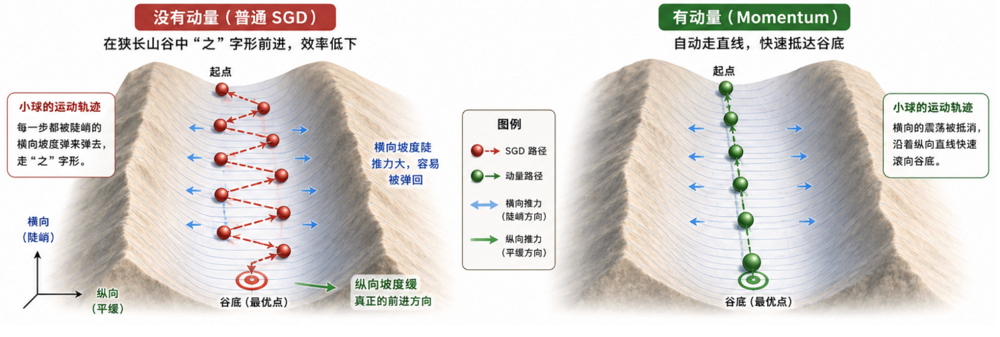

不过，惯性本身也是一把双刃剑。

+ **可能冲过头**：当参数接近最优点时，如果速度项仍然较大，就可能越过最低点，再折返回来，表现为最优点附近的小幅震荡。
+ **对动量系数有一定敏感性**：太小积累效果不明显，太大又可能让系统变得迟钝甚至难以控制。虽然在大多数实践中，0.9 几乎是一个非常稳妥的默认值，但在一些极端任务中仍然需要调节。

总体来看，Momentum 的本质是利用历史梯度累积速度，在正确方向上加速，在震荡方向上减速。它极大改善了 SGD 的优化效率，因此在现代深度学习中几乎已经成为默认配置。

现在几乎所有 SGD 训练默认都会带上 Momentum，在 PyTorch 中`torch.optim.SGD(momentum=0.9)` 几乎可以看作工业界和学术界都广泛接受的标准设置。尤其在 CNN 时代，像 VGG、ResNet 等经典模型的大规模训练，核心方案基本都是 Mini-batch SGD + Momentum。

#### AdaGrad：每个参数有自己的学习率

2011 年斯坦福大学的 John Duchi 等人在研究在线学习与稀疏数据问题时，提出了 AdaGrad（Adaptive Gradient Algorithm）。它的出发点很朴素：不同参数的梯度大小差异悬殊，用同一个学习率来更新所有参数过于简单粗暴。

在自然语言处理等场景里，这个问题尤其突出。"the" 这样的高频词几乎每个 batch 都会出现，对应的参数梯度很大，更新已经很充分；而 "serendipity" 这样的低频词可能整个训练过程里只出现寥寥几次，对应的参数梯度极小，如果和高频词用同样的学习率，它几乎永远都学不动。

AdaGrad 的解决思路是：**给每个参数单独维护一个历史梯度积累量，用它来自适应地调整这个参数的有效学习率。**


其中记录了该参数从训练开始到第 t 步的梯度平方累积和，是一个很小的常数，用于防止分母为零。

这样一来，每个参数的有效学习率就变成了 ：

+ **梯度大、更新频繁的参数**：积累得很大，有效学习率随之缩小——避免更新过度。
+ **梯度小、更新稀少的参数**：积累得很小，有效学习率保持较大——保证这些参数依然能够被充分学习。

这种对历史更新多的参数降速、对历史更新少的参数提速的机制，就是自适应学习率的核心思想，AdaGrad 也因此成为这一思想的开山之作。它的优势也很直接：

+ **告别手动调学习率**：不同参数的有效学习率由历史梯度自动决定，对全局学习率的敏感性大幅降低。
+ **天然适合稀疏数据**：低频特征的参数不会因为梯度小就被忽视，在 NLP 和推荐系统中效果尤其显著。

但 AdaGrad 有一个致命的结构性缺陷——学习率单调递减，且不可逆。只累加、从不减小，**随着训练推进，分母越来越大，每个参数的有效学习率只会越来越小，最终趋近于零。模型在还没有充分收敛的时候，就已经动弹不得了。**这个问题在训练深层网络时尤其明显，往往还没到最优点，学习就提前停滞了。

正是这个缺陷，直接催生了后来的 RMSProp 和 Adam，它们的核心改进都指向同一件事：不要让历史梯度无限积累，而是只保留近期梯度的影响。

#### RMSProp：用滑动平均修补 AdaGrad

2012 年是 AlexNet 引爆深度学习的那一年。随着网络越来越深、训练越来越久，研究者迫切需要一种比 AdaGrad 更适合长期训练的自适应优化方法。

AdaGrad 的思路本身没有问题——给每个参数分配自己的学习率——但分母里的梯度平方一路累加、只增不减，使得有效学习率不可逆地缩小，最终趋近于 0。模型常常还没真正收敛，就已经几乎学不动了。

那要怎么修？答案其实非常直接：**不要把训练以来的所有梯度平方都加起来，只保留近期的梯度信息。**这就是 RMSProp 的核心思想。

有意思的是，RMSProp 并不是以一篇正式论文的形式出现的。它最早来自 Geoffrey Hinton 2012 年在 Coursera 课程 Neural Networks for Machine Learning 的一组讲义幻灯片。Hinton 自己也说过，他当时只是觉得这个改进显然合理，并没把它当成一篇值得发表的工作。但后来全世界做深度学习的人引用 RMSProp 时，最规范的写法竟然就成了 *Hinton, slides of lecture 6e, Coursera, 2012*——一个写在 PPT 里的算法就这样成了主流。

RMSProp 的公式如下：


其中  **表示梯度平方的指数滑动平均**， 通常取 0.9。从形式上看，RMSProp 和 AdaGrad 唯一的差别就是：分母里的"梯度平方累积和"换成了"梯度平方的指数滑动平均"。但正是这个看似简单的改动，化解了 AdaGrad 最致命的问题。

+ **避免学习率衰减到 0**：**滑动平均会逐渐遗忘久远的梯度**，分母不再无限膨胀，有效学习率也就不会不可逆地缩小到接近零。
+ **保留自适应学习率的优势**：每个参数仍然拥有自己的更新尺度——梯度大、变化快的参数自动缩小步长，梯度小或稀疏的参数则保持较大的更新幅度。
+ **更适合非平稳目标**：深度学习中的 loss 曲面会随着训练不断变化，RMSProp 只关注近期梯度，因此比 AdaGrad 更能适应这种动态环境。

不过 RMSProp 也并不完美：

+ **缺少动量信息**：它只利用了梯度的二阶矩（梯度有多大），没有利用一阶矩（梯度朝哪个方向持续前进）。因此在狭长谷地等场景中，它仍可能出现震荡，收敛路径不如带动量的方法平滑。
+ **多了一个超参数** ：虽然实践中 0.9 已经足够好用，但本质上仍然增加了调参空间。

RMSProp 在训练 RNN 时尤其受欢迎。RNN 的损失曲面通常更加崎岖复杂，AdaGrad 那种越训越小、最后停住的死法在这里特别难以接受。RMSProp 通过只记近期、不记远古的方式大大缓解了这一缺陷，因此一度成为循环神经网络训练的常用选择——直到 2015 年 Adam 出现。

#### Adam 与 AdamW：把动量和自适应学习率合体

到了 2014～2015 年，深度学习的优化方法逐渐形成了两条清晰的思路：

+ 一条来自 AdaGrad 和 RMSProp：利用梯度平方的二阶信息，为不同参数自适应地调整学习率。
+ 一条来自 Momentum：利用历史梯度的一阶信息，积累速度，在正确方向上加速，在震荡方向上减速。

既然两种思路各有所长，为什么不把它们合起来？这正是 2014 年 Diederik Kingma 和 Jimmy Ba 提出的 Adam（Adaptive Moment Estimation）的出发点。Adam 既要方向感，又要步长感，它同时维护梯度的一阶矩和二阶矩：


其中  是梯度的滑动平均（一阶矩，对应 Momentum 的速度）， 是梯度平方的滑动平均（二阶矩，对应 RMSProp 的自适应缩放）， 通常分别取 0.9 和 0.999。

值得专门留意  这一步——它叫**偏差校正（bias correction）**。因为  都被初始化为 0，训练刚开始时  会偏向 0，导致前几步的更新被严重低估。除以  这个因子，可以把这种初始偏差消掉，让训练从第一步起就走在合理的尺度上。

把两件事合到一起后，Adam 的表现非常惊艳：

+ **像 Momentum 一样引入惯性**：参考历史梯度让更新方向更平滑，不容易被局部噪声带偏。
+ **像 RMSProp 一样自适应缩放**：为每个参数单独定制步长，频繁更新的参数自动收缩，稀疏的参数保持稳健。
+ **偏差校正稳住训练初期**：避免冷启动阶段的步长过小，让模型从一开始就能高效推进。

这种全能型的表现，让 Adam 具备了极强的开箱即用性，收敛飞快，对初始学习率也不那么挑剔。在很长一段时间里，它几乎是所有开发者首选的默认优化器。

但随着研究深入，人们发现 Adam 有一个隐藏的 bug：它的权重衰减（Weight Decay）失效了。

在传统的 SGD 中，权重衰减和 L2 正则化在数学上是等价的，所以早期的 Adam 实现就直接把 L2 项加进了梯度。但在 Adam 这种自适应优化器里，这种做法会出问题——本该起稳定作用的正则信号被自适应机制一同缩放，导致梯度大的参数衰减不足，梯度小的参数被过度衰减，正则化的效果完全偏离了原意。

2017 年，Ilya Loshchilov 等人提出了 **AdamW**，把梯度更新和权重衰减彻底拆开：


新增的  项就是直接作用在参数上的权重衰减，它不再走梯度通道，也就不会被自适应学习率机制污染。

这个看似细微的修正带来了巨大的工程收益。在 Transformer、BERT、ViT 以及如今的大语言模型中，AdamW 几乎成了雷打不动的事实标准，今天我们见到的绝大多数顶尖模型，底层用的都是它。

#### Muon：把视角从标量抬到权重矩阵

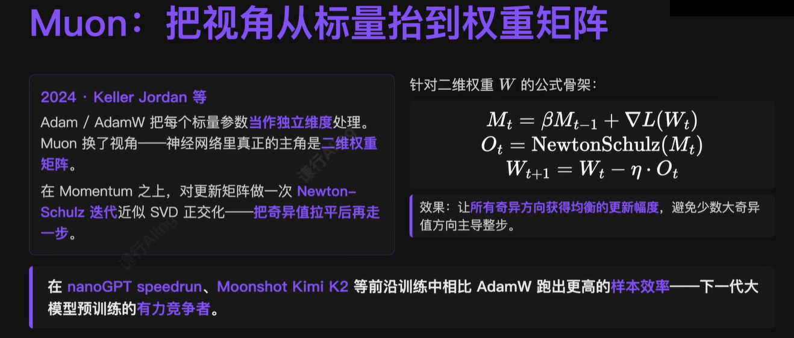

#### 总结

回头看梯度下降优化器的演化路线，每一次改进背后都有同一个问题在驱动：怎么让参数更新得又快又稳？

+ **Batch GD** 奠定了梯度下降的基本框架，方向准但代价过高；
+ **SGD** 用单样本估计换来了训练速度，但不确定性太大；
+ **Mini-batch SGD** 在统计效率和计算效率之间找到了工程上的甜点；
+ **Momentum** 引入惯性，缓解震荡、加速收敛；
+ **AdaGrad** 让每个参数拥有自己的学习率；
+ **RMSProp** 用滑动平均修复了 AdaGrad 学习率衰减到 0 的问题；
+ **Adam** 把动量和自适应步长合体，并用偏差校正稳住了训练初期；
+ **AdamW** 进一步把权重衰减从自适应机制中解耦，成为现代训练范式的事实标准；
+ **Muon** 把视角从标量抬到权重矩阵，正交化更新方向，2024年起在大模型预训练上崛起。

到今天不同的优化器在不同领域发挥着作用

+ **CV 任务**：在很多视觉模型中，尤其是卷积网络，SGD + Momentum 配合精心设计的学习率调度，最终精度往往仍然优于 Adam 系方法。
+ **NLP/大模型**：几乎清一色是 AdamW，从 BERT、GPT、LLaMA 到 Stable Diffusion，这已经成为现代大模型训练的默认配方。
+ **快速试验与原型验证**：Adam 依旧是最省心的起点，默认学习率往往就能跑出一个足够像样的 baseline。
+ **稀疏特征、在线学习、短周期训练**：AdaGrad 依然没有退出历史舞台，在广告 CTR、传统 NLP 等场景下仍有实际价值。


## 5、学习率调度 TODO


## 6、参数初始化

参考视频：[参数初始化——你和调参高手就差一点点](https://www.bilibili.com/video/BV17i7Q6HEFt)

参考笔记：[参数初始化-up【谦行】](https://www.yuque.com/qx2io/deep-learning/fc4gccgfbxubqpp5)

### 为什么权重不能全初始化为 0？

模型的参数在第一次训练前是一片混沌，需要赋予初始值。既然我们不知道哪个值最合适，最朴素的想法就是把所有权重和偏置都初始化为 0，让梯度下降自己去寻找最优解。

提起来很合理，但这样做会带来灾难性的后果。假设一个简单的两层网络：


如如果将权重矩阵  全部初始化为 0，那么无论输入  是什么，隐藏层中每一个神经元接收到的线性组合（）都是 0。经过相同的激活函数  之后，它们的输出  也会完全相同。

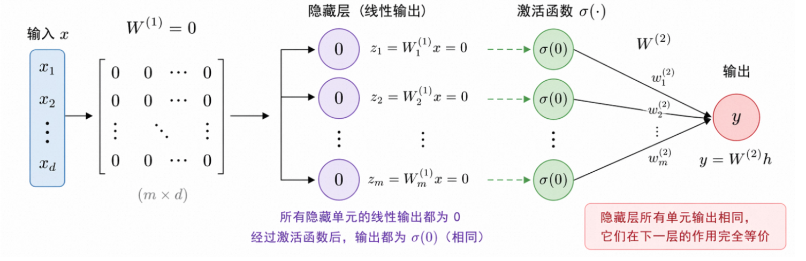

这意味着即使经过梯度的更新，这些神经元对应的参数依然保持一致。换句话说**虽然我们在这一层定义了多个神经元，但它们实际上始终在做完全相同的事。** 网络失去了提取多元化特征的能力，退化成了单个神经元的重复拷贝。

==这就是经典的**对称性问题（symmetry problem）**。==

即使把某一层的权重全部初始化为一个相同的非零常数（例如全 1 或全 0.5），结论依然成立。只要同一层神经元的参数完全对称，它们接收到的梯度就始终相同，对称性就无法打破。

所以，要想让每个神经元学到不同的特征，**权重就必须从一开始就被赋予互不相同的随机值**。

==既然参数相同会引发对称性锁死，那么为什么偏置参数可以设为 0 呢？==

因为神经元之间的差异，主要来自权重对输入的不同加权。一旦权重不同，每个神经元的前向输出就已经不同，后续收到的梯度自然也不同。这时偏置全为 0，并不会重新把它们变得一致。

所以在大多数 MLP、CNN、Transformer 的线性层里，偏置初始化成 0 是最常见的默认选择。

### 每层的输出也需要稳定

参数随机可以解决对称性问题，但无论是前向传播还是反向传播，都会涉及连乘操作。只要每层把信号放大一点，几层之后就被指数级放大；反过来每层稍微衰减一点，几层之后就压缩到接近于 0。层数的加深把任何微小的尺度偏差几何级地放大。


### 如何让信号在层间稳定传播

层数加深会把尺度偏差指数级放大，但尺度本身还是一个模糊的直觉，要想控制它，首先得把它变成一个可以计算的数字。

**方差（variance）** 就是描述一组数散得有多开的标准度量。它对每个值与均值的差取平方再求平均，数值越大说明分布越分散，越小说明越集中。方差的算术平方根叫做**标准差（standard deviation, std）**，它和原始数据同单位，所以讨论信号尺度时两者经常混用。


有了方差，信号稳定就有了精确含义：**每一层输出的方差应该和输入的方差大致相等**。如果某一层把方差放大了 1.5 倍，看似不多，但经过 20 层连乘就变成  倍；反过来如果每层衰减到 0.8 倍，20 层后只剩 ，信号几乎消失殆尽。保住方差，就保住了信号。

那么权重应该满足什么条件，才能让每层的输出方差等于输入方差？

考虑一个没有激活函数的线性层，它有  个输入。某个输出神经元的计算是：


假设权重  和输入  彼此独立，且均值都为 0（随机初始化和输入预处理后的常见状态），那么  的方差可以展开为：


想让 ，就需要 ，即：


==其中就是这一层的输入维度，通常记作==，换成标准差就是 。

也就是说一个神经元要把路信号求和，如果每条路径的权重方差为 1，求和之后方差就放大了倍，所以权重的方差必须反比于，把这路叠加刚好压回原来的幅度。

> 补充：为什么$Var(y) = n·Var(w)·Var(x)$，涉及到概率论的相关知识点

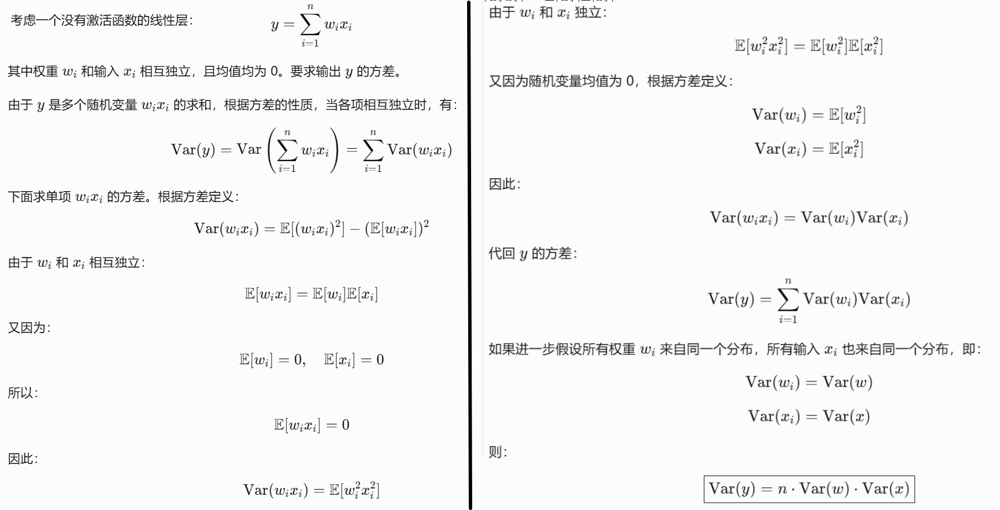

### 参数初始化的核心目标

到这里我们可以归纳出参数初始化的三个核心要求：

1. **打破对称性**：确保同一层的不同神经元拥有不同的初始权重，使它们能学到不同的特征；
2. **控制信号尺度**：在前向传播时，确保激活值的尺度（方差）不随网络加深而爆炸或塌缩；
3. **保证梯度稳定**：在反向传播时，确保误差梯度的尺度在层间保持稳定，避免梯度消失或爆炸。

为了同时满足这些要求，深度学习在不同阶段发展出了两个最为经典的初始化方案：**Xavier 初始化**与 **He 初始化**。

> 经典初始化公式逻辑很相似，首次使用正态、均匀分布打破**对称性**，然后控制方差$Var(w) = \frac{1}{fan_{in}}$，再根据具体激活函数做修正

### Xavier 初始化

2010 年，Glorot 和 Bengio 提出了著名的 Xavier 初始化（也叫 Glorot 初始化）。Xavier 的核心洞察是我们不仅希望前向传播的激活值方差稳定，还希望反向传播时的梯度方差也同样稳定。

+ 为了保证前向传播方差稳定，权重方差应为： ；
+ 为了保证反向传播方差稳定，权重方差应为 。

由于在一层网络中，输入维度和输出维度往往不相等，Xavier 在这两者之间取了一个折中的调和：


在实现上 Xavier 有正态分布和均匀分布两种常见采样方式。PyTorch 里直接有现成 API：

```python
import torch.nn as nn
linear = nn.Linear(256, 128)
# Xavier 正态版
nn.init.xavier_normal_(linear.weight)
# Xavier 均匀版
nn.init.xavier_uniform_(linear.weight)
# 偏置一般置零
nn.init.zeros_(linear.bias)
```

Xavier 假设激活函数在 0 附近近似线性，sigmoid 和 tanh 函数在 0 附近的导数都接近 1，前向和反向都几乎不改变方差，这条假设成立得相当好。事实上 Xavier 提出的年代正是 sigmoid/tanh 被大量应用的年代，在当时效果非常稳定。

但到了 ReLU 主导的时代，这个假设就明显不成立了。

### He 初始化

正如前面所述，Xavier 依赖激活函数在 0 附近近似线性的假设。然而`ReLU` 激活函数定义为：


如果输入是一个均值为 0 且关于 0 对称的分布，经过 `ReLU` 之后，所有小于 0 的部分都会被强制截断为 0。

在正态分布或均匀分布时，会有大约一半的输入信号被置零，信号每穿过一个 `ReLU` 层，其方差就会缩水一半。

2015 年，残差网络的奠基人何恺明教授团队提出了 He 初始化（又称 **Kaiming 初始化**）。**既然 `ReLU` 会把方差削减一半，那我们在初始化权重时，把权重的方差加倍补回来就可以了。**

因此，He 初始化将权重方差修正为：


若采用正态分布进行随机采样，其对应的初始化标准差就是：


现在我们重新审视这段两层网络的手写初始化代码：

```python
W1 = (torch.randn(784, 128) * (2.0 / 784) ** 0.5).requires_grad_()
b1 = torch.zeros(128, requires_grad=True)
W2 = (torch.randn(128, 10) * (2.0 / 128) ** 0.5).requires_grad_()
b2 = torch.zeros(10, requires_grad=True)
```

1. `torch.randn(...)`：生成 784×128 的权重矩阵，元素采样自标准正态分布
2. 乘以 `(2.0/fan_in)**0.5`：执行 He 正态分布初始化，以多出来的因子补偿 `ReLU` 激活函数带来的信号方差折损。
3. `torch.zeros(...)`：将偏置设为 0。因为对称性已经由权重打破，偏置直接设为 0 即可

### PyTorch 默认初始化做了什么？

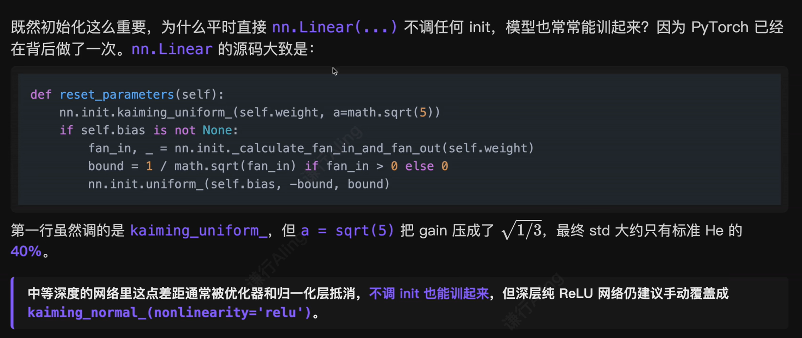

### 总结

参数初始化的真正奥义，绝非只是随意设置一组随机数，而是**让网络在训练一开始就处在一个信号尺度合理的状态里**。

1. 初始化权重不能全相同：必须通过随机值打破神经元的对称性；
2. 权重随机还不够，方差必须精准适配网络宽度，否则前向和反向的信号将呈指数级爆炸或消失；
3. `ReLU` 激活选 He ，`tanh/sigmoid` 激活选 Xavier，偏置置 0；
4. 大型或深层网络建议手动执行 `kaiming_normal_` 覆盖默认设置。

一组优秀的初始化参数能够保证网络在最初的几个 Step 拥有完美的方差守恒状态。然而一旦训练跑起来，随着权重的不断更新，激活值的分布依然会慢慢发生不可控的漂移。

如果想让这种稳定性持续整个训练过程，就需要引入显式归一化机制——**BatchNorm / LayerNorm**。

## 7、批量归一化

参考视频：

+ [归一化：Transformer 用了都说好的训练技巧](https://www.bilibili.com/video/BV1X2Ex6rEu9)
+ [【5分钟深度学习】 #06 批量归一化 Batch Normalization](https://www.bilibili.com/video/BV12d4y1f74C)

参考笔记：[归一化-up【谦行】](https://www.yuque.com/qx2io/deep-learning/cetvzcqi3id3mcn6)

### 为什么要使用归一化

神经网络每层都会经过**线性变换和非线性激活（比如relu）**，使输出数据的均值和方差不断变化。由于反向传播中的梯度依赖于各层输入分布，**当输入分布发生较大变化时，容易导致梯度过大或过小，使训练不稳定**，只能使用较小的学习率，训练时间长。批归一化通过将每层输入调整为均值接近0、方差接近1的分布，使梯度传播更加稳定，从而允许使用更大的学习率，加快模型收敛。

>每层输入分布不一样，参数更新会导致下一层输入分布不断变化，从而使梯度传播困难。这个现象叫做 **内部协变量偏移**（Internal Covariate Shift）

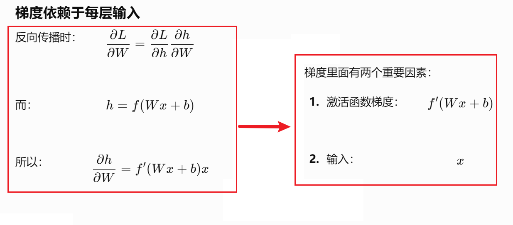

>上面这个例子中，$f(z)$是激活函数。
>
>当$f'(Wx+b)$为relu函数且激活后$Wx+b>0$，此时求出的偏导数为$x^2$，如果因为上一层的输出及其不稳定导致x的值很大，那么梯度很大，更新参数的时候导致参数的变化很大，进一步可能导致**优化器震荡**、**不收敛**等问题。

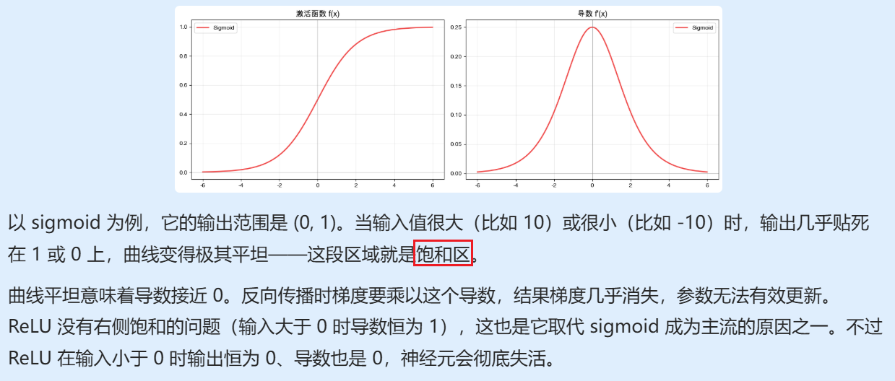

### 归一化 Normalization

在统计学里，归一化和标准化是两个不同的概念：归一化通常指 min-max 缩放到 ，标准化才是减均值除标准差。

但深度学习社区从 2015 年 BatchNorm 论文开始就把后者叫做 Normalization，后续所有变体都沿用了这个名字。所以在深度学习语境下提到的归一化，做的事情实际上就是**标准化（Standardization）**：对一组数据减去均值、再除以标准差，**变换到均值 0、方差 1 的分布**。
$$
\hat x = \frac{x-\mu}{\sigma}
$$
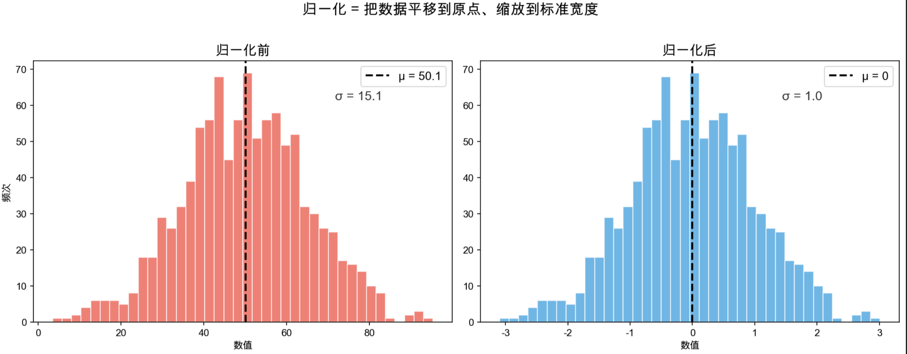

整个过程就是平移和缩放两步操作，分布的形状完全没变。第 7 行的 83.12 是原始数据里最大的，归一化后变成 2.33，仍然是最大的，含义变成了"比均值高 2.33 个标准差"。

数值变了为什么不影响训练？

> 因为神经网络学的是数据中的模式，不是绝对数值。

某层的输入从 $[33,83]$ 变成 $[-1.5,2.3]$，下一层的权重会相应调整来补偿尺度变化。网络的最终输出取决于各层的组合变换能力，不取决于中间某一层用什么尺度表示。

### 批量归一化 BN

归一化的操作只有两步：减均值、除标准差。要在网络里使用，只需要回答一个问题——均值和标准差从哪来。

训练时手上现成的样本就是当前 mini-batch。一个 batch 有 128 个样本，每个样本有 256 维特征，构成一个 128×256 的矩阵。对这个矩阵的每一列（每一个特征），用 128 个样本算出均值和标准差，然后对这一列做标准化。这就是**批归一化（Batch Normalization, BN）**名字的由来——用当前 batch 来算统计量。

写成公式就是对每一列特征 ：


其中  和  分别是这一列在当前 batch 内的均值和方差， 是一个极小的常数，防止除零。

到这一步，每一列激活都被拉回均值 0、方差 1。但只做到这一步还不够，所有层的激活都被压成同一种分布，网络无法让某一层的输出偏大一点或偏小一点，表达能力受到了限制。因此标准化之后还需要两个可学习参数 （缩放）和 （偏移）：


 初始值为 1， 初始值为 0，和网络中其他参数一样通过反向传播更新。这两个参数让网络在标准化的基础上自行决定最终的分布形状：如果某一层保持均值 0、方差 1 就是最优的， 会学到 1、 学到 0；如果需要调整，它们会相应变化。

**先标准化再学回去看起来多余**，但关键在于不做标准化时，前面层的参数一变，当前层的输入分布就漂移，优化器的起点一直在变化。先标准化到  等于**给了优化器一个固定的起点**，剩下的自由度通过  和  交给网络自己去学。

训练时用当前 batch 的统计量做归一化，但推理时往往一次只有一个样本，没有 batch 统计量可用。解决办法是训练时同步维护一组**滑动平均（running mean / running var）**，**推理时直接使用训练期间累积下来的全局统计量**。

> 总结：批归一化通过将每层输入的均值和方差进行标准化，使不同批次、不同训练阶段的数据分布更加稳定，减少由于输入分布变化导致的梯度波动（激活函数有参与），从而使梯度传播更加稳定，提高训练速度和收敛效果。

在 PyTorch 中使用非常简单

```python
model_bn = nn.Sequential(
    nn.Linear(784, 256),
    nn.BatchNorm1d(256),
    nn.ReLU(),
    nn.Linear(256, 10),
)
```

### 层归一化 LN

前面讲的 **BatchNorm 是在 batch 维上做归一化，将不同样本的同一个特征放在一起计算均值和方差**。这个做法有一个前提：同一个特征跨不同样本的关联度要高。在图像任务里这个前提成立，同样是检测竖线的通道，不管输入的是猫还是狗，激活值都应该在差不多的范围内，在 batch 维上做归一化是合理的。

但在序列任务里情况刚好反过来。一个 token 的表示向量内部各维度共同编码它的语义，**同一样本内不同特征之间的关联度更高（同一个句子中的不同token）**，而不同样本在同一位置的特征并没有天然联系。这时候更合理的做法是在同一个样本内部、跨所有特征维度做归一化。


这就是**层归一化（Layer Normalization, LN）**的思路。BN 沿 batch 维 reduce（竖着切，每列一组统计量），LN 沿 feature 维 reduce（横着切，每行一组统计量）。这个方向变化让 LN 拥有 BN 没有的几条好性质：

+ 完全不依赖 batch size，每个样本独立计算，训练和推理用同一套逻辑，不需要 running stats
+ 对变长序列天然友好，Transformer 以及当下几乎所有大语言模型都在使用 LN 或它的简化版

在 PyTorch 中使用 LayerNorm 非常简单：

```python
model_ln = nn.Sequential(
    nn.Linear(784, 256),
    nn.LayerNorm(256),
    nn.ReLU(),
    nn.Linear(256, 10),
)
```

这样我们也能看懂 Transformer 架构的 Norm 层是在做什么了

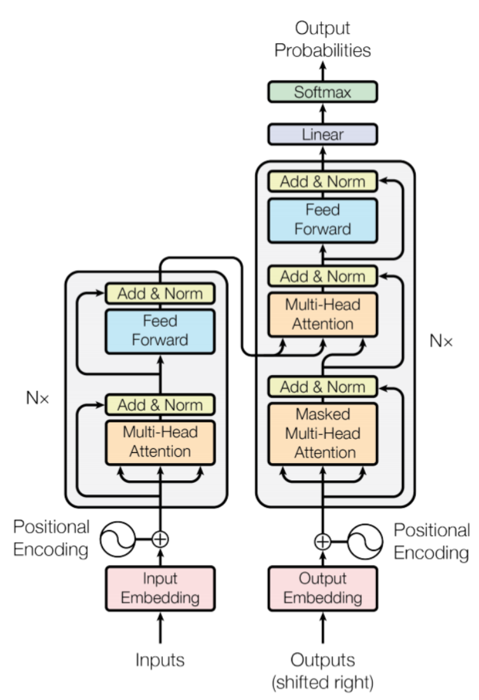

### 归一化家族

除了 BN 和 LN，还有两种常见的归一化方式

+ **组归一化（Group Normalization, GN）**是 BN 与 LN 的折中方案，它把通道分成若干组，每组内一起计算 mean/var。既不依赖 batch，也不像 LN 那样把所有通道混在一起。在 batch size 受显存限制只能设到 2~4 的 CNN 场景中（如目标检测），GN 是 BN 的常见替代品。
+ **RMSNorm** 是 LN 的进一步简化，去掉了减均值这一步，只除以均方根， 参数也省去了。少做一步运算，效果却和 LN 相当甚至更好，同时计算更快、参数更少。LLaMA、Mistral、Qwen 等当代大语言模型几乎全部采用 RMSNorm 替代 LN。

| **归一化** | **统计量算在哪个维度**         | **典型场景**               |
| ---------- | ------------------------------ | -------------------------- |
| BatchNorm  | batch 维（不同样本的同一维）   | CNN、MLP，batch 较大       |
| LayerNorm  | feature 维（同一样本的所有维） | Transformer、RNN、变长序列 |
| GroupNorm  | 分组的 channel 维              | 小 batch CNN（目标检测等） |
| RMSNorm    | feature 维（不减 mean）        | 大语言模型                 |

**初始化和归一化是一对互补**：初始化负责第 0 步的方差守恒，归一化负责全过程的方差守恒。有了归一化兜底，初始化的选择变得没那么敏感——加了 BN/LN 之后，PyTorch 默认初始化就够用，不一定非要手动覆盖成 He。

> 到这里，让网络稳定训练的工具链基本完整：激活函数选 ReLU，损失函数选 CrossEntropy，优化器选 SGD+momentum 或 Adam，学习率配合 warmup + cosine 调度，参数用 He 初始化，每一层后接 BN 或 LN。把这些组合起来，几十层的网络都能稳定收敛。

但训练精度高不等于测试精度高。**过拟合（overfitting）**这个问题很快就会出现：模型在训练集上越来越准，在测试集上反而开始倒退。因此出现应对过拟合的工具——正则化。

## 8、正则化

参考视频：[过拟合克星——正则化](https://www.bilibili.com/video/BV1DHJ76SEmj)

参考笔记：[正则化-up【谦行】](https://www.yuque.com/qx2io/deep-learning/saimafu1l74neqcy)

### 过拟合：训练越好，泛化越差

在实际训练中，经常会出现这样的典型场景：训练集上的 Loss 一路狂飙向下、准确率逼近 100%，但拿去跑验证集却发现 Loss 在某个节点之后开始反弹，准确率不升反降。这就是机器学习中最经典的梦魇——**过拟合（Overfitting）**。

假设我们有一组二维数据点，其背后的真实物理规律是一条平滑的二次曲线：


+ **欠拟合（Underfitting）**：用一个参数极少、容量不足的模型（如线性回归）去拟合，曲线太简单，连基本趋势都抓不住。此时模型在训练集和验证集上的表现都很差。
+ **优秀拟合（Good Fit）**：换一个参数适中的模型，既能捕捉到数据的整体趋势，又能自动忽略个别噪声点。这样的模型具有最强的**泛化能力**。
+ **过拟合（Overfitting）**：如果我们盲目加大模型容量（例如使用极高阶的多项式），模型曲线就会开始试图穿过每一个噪声点，使训练误差几乎降为零，但面对未见过的新数据时，预测结果会完全失控。

过拟合的本质是模型的容量超过了任务本身所需的复杂度。多出来的参数容量没有用来学习通用规律，而是被用来死记硬背训练数据中的噪声和个例。

在实际训练中，判定过拟合最直接的方法就是观察训练曲线：


1. **Loss 曲线分叉**：训练 Loss 持续下降，但验证 Loss 在某个拐点之后先降后升，呈现经典的 U 型反弹。
2. **准确率悬殊**：训练准确率远高于验证准确率，说明模型在训练集上背答案，在验证集上见光死。

**正则化（Regularization）** 就是一系列对抗过拟合的技术，核心思路是限制模型的有效容量，迫使它学习更简洁、更通用的模式，而不是去记忆训练数据的细节。

可以将正则化理解为一种"奥卡姆剃刀"原则的数学实现——在多个能解释训练数据的模型中，我们应该倾向于选择更简单的那个。

### L1 与 L2 正则化

在机器学习中，L1 和 L2 正则化是最经典的处理过拟合方法。它们通过在原始损失函数中引入**权重惩罚项**，对过大的权重施加约束，迫使模型倾向于选择数值更小的权重，从而降低模型复杂度。


其中控制正则化的强度

+ **L1 正则化（Lasso）**：倾向于产生**稀疏权重**（许多参数直接变为 0），相当于在模型内部自动进行特征选择。
+ **L2 正则化（Ridge）**：倾向于让所有权重**均匀缩小**，向 0 靠拢，但不会精确减小到 0，从而保持权重的平滑分布。


+ **基线**：权重像一个宽胖的钟形，散布在较大区间。
+ **L2**：分布形状没变，但整体被向 0 收紧，所有权重均匀缩小，但几乎没有真正等于 0 的。
+ **L1**：在 0 附近堆出一根明显的尖峰，近零权重比例数倍于基线和 L2，这就是 L1 的稀疏化效果。

在深度神经网络中，L2 正则化远比 L1 常用。这是因为神经网络的泛化更依赖于协同作用和参数的平滑分布，而非剔除特定的神经元。此外，L2 处处可导，对基于梯度的优化算法（SGD、Adam 等）更为友好。

### 权重衰减 Weight Decay

权重衰减的核心思路是在每次梯度更新时，强制让权重乘以一个略小于 1 的因子，使其按比例自然缩小。


+  是第  步的权重
+  是学习率， 是权重衰减系数（通常取  ~ ）

权重的更新变成了两步，先让所有权重整体缩水一点，再沿梯度方向修正。就像每个权重都绑着一根回归原点的弹簧，如果梯度没有强烈要求它增大，它就会随时间自然衰减到零附近。

#### 权重衰减与 L2 正则化

细心的同学可能会觉得权重衰减看起来很眼熟，标准 SGD 下如果我们对损失函数加入 L2 正则项：


梯度展开后得到的公式与直接进行权重衰减的参数更新公式完全一致


虽然说 L2 正则化是在损失函数层面给大权重施加惩罚，权重衰减是在优化器层面直接对参数动刀。但可以看到 L2 正则化在标准 SGD 下的效果恰好就是权重衰减，所以对于标准 SGD 权重衰减和 L2 正则化是完全等价的。

#### Adam 与 AdamW

既然 SGD 下两者等价，为什么还要区分它们？因为**当碰上自适应学习率优化器（如 Adam）时，这种等价性不在成立。**

在 Adam 优化器中，会根据历史梯度的平方和（二阶动量 ）对每个参数的梯度进行自适应缩放。如果我们将 L2 正则化写进损失函数：


此时，含有权重惩罚的  会直接被混入 Adam 的一阶动量  和二阶动量  中。这会导致一个严重的隐藏 Bug：

1. 对于梯度原本就很小的参数（其对应的  极小），在自适应除以  时，它的正则化力度会被无形放大。
2. 对于梯度原本就很大的参数（其对应的  极大），它的正则化力度会被过度压缩。

这使得原本统一的正则化强度  被梯度的自适应缩放机制给扭曲了，导致正则化效果大打折扣，甚至无法收敛。为了修复这个 Bug  Ilya Loshchilov 等人在 2017 年提出了 AdamW，其核心思路是将权重衰减从自适应机制中彻底解耦出来：


其中， 和  仅基于**原始损失函数梯度**  计算，不包含任何 L2 惩罚项。而衰减操作直接作用于权重本身，这样一来权重衰减与梯度的自适应缩放完全独立。

### Dropout：随机关闭神经元

L1/L2 正则化是从控制权重数值大小的角度限制模型容量，而 Dropout 则选择从网络结构多样性的角度进行正则化。

在模型训练的每次前向传播中，以一定的概率随机将部分神经元的输出强制置为 0，相当于在本次训练中将其关闭


随机关闭神经元带来两个极其强大的效果：

1. 神经元不能再依赖于相邻特定神经元的输出，每一个神经元都必须被迫学习更独立有用的特征。
2. 由于每个 Batch 随机丢弃的神经元不同，每一次更新实际上都在训练一个不同的子网络，最终的推理过程相当于对成千上万个共享参数的子网络做集体投票。

训练时有部分神经元不工作，意味着其余神经元的负担变重了，它们输出的激活值期望会被放大。为了使推理时（所有神经元全部开启）的输出和训练时的期望保持一致，必须进行缩放平衡。

PyTorch）采用的是 **反向 Dropout（Inverted Dropout）** 机制：

+ **训练阶段**：在丢弃神经元的同时，将剩余神经元的输出直接除以 (1−p)。例如若 p=0.5，存活的激活值将被放大为原来的 2 倍。
+ **推理阶段**：保持模型原样输出，无需做任何缩放调整。

这就是为什么在 PyTorch 中使用 Dropout 时，必须严格注意训练和测试状态的切换：

```python
model.train()   # 训练模式：Dropout 生效，激活值按比例缩放并随机丢弃
# 执行训练代码...

model.eval()    # 推理模式：Dropout 失效，所有神经元正常工作，无随机丢弃
# 执行验证/推理代码...
```

若忘记切换到 `model.eval()` 进行推理，Dropout 会在测试时继续随机关闭神经元，导致每次推理结果不一致，且准确率会大幅暴跌。

Dropout 率的取值取决于网络层的位置和具体任务：

+ **隐藏层**：经典经验值 0.5，此时能最大化网络结构的组合熵；
+ **输入层**：若要使用 Dropout，通常取较小的值（0.1~0.2），避免丢失过多原始输入信息；
+ **Transformer 架构**：由于其本身结构设计合理，Dropout 通常设得很低（如 0.1），过重的 Dropout 会妨碍大规模预训练的学习。
+ **卷积网络**：通常不推荐在卷积层使用 Dropout。因为卷积层的特征图存在强烈的空间局部相关性，丢弃单个像素点意义不大。CNN 广泛采用自带轻微正则化效果的 `BatchNorm`。

### 早停 Early Stopping

既然过拟合表现为验证指标在某个时刻开始恶化，那就在恶化之前停止训练——这就是早停法。

具体做法是在训练过程中持续监控验证集上的指标（通常是验证 loss 或验证准确率）。如果连续若干个 epoch 指标都没有改善，就认为模型已经开始过拟合，终止训练并回退到表现最好的那个 checkpoint。

`patience` 参数控制容忍多少个 epoch 没有改善，通常 5~20 是合理的范围，取决于训练的总 epoch 数和 loss 曲线的波动程度。

严格来说，早停不属于经典意义上的正则化，它没有修改损失函数，也没有改变网络结构。但它的效果等价于限制了模型的有效复杂度。训练步数越少，权重离初始值越近，模型能探索的参数空间越小。从这个角度看，早停是一种隐式的正则化手段。

### 数据增强

常用的正则化技巧都是通过限制模型容量来解决过拟合问题，除了正则化还可以通过**数据增强**来缓解过拟合问题。比如对训练数据施加随机变换（翻转、裁剪、旋转、颜色抖动等）来扩大训练集的多样性，让模型更难记住具体样本，被迫学习更通用的特征，在计算机视觉任务中效果尤其显著。

### 总结

| **方法**     | **作用位置** | **核心思路**                           |
| ------------ | ------------ | -------------------------------------- |
| L1/L2 正则化 | 损失函数     | 惩罚大权重，限制参数幅度               |
| 权重衰减     | 参数更新     | 每步将权重向零衰减，AdamW 中与梯度解耦 |
| Dropout      | 网络结构     | 随机关闭神经元，迫使特征冗余           |
| 早停         | 训练流程     | 验证指标恶化时终止训练                 |
| 数据增强     | 训练数据     | 增加数据多样性，减少记忆个例           |

+ **基线**最终训练 acc 接近 100%、验证 loss 见底后明显反弹——过拟合的标准画像。

+ **L2** 把所有权重均匀压小，权重 L2 范数显著下降，但近零比例几乎没变；训练 acc 不再贴近 100%，验证 loss 曲线变得平坦。
+ **L1** 是唯一让近零比例显著上升的方法，权重直方图在 0 处出现尖峰；这就是它自动特征选择的来源。
+ **Dropout** 不改变权重幅度，但打乱了网络对单个神经元的依赖，验证 acc 随 epoch 持续上升。
+ **AdamW** 避免了 Adam 那种「对小梯度参数过度衰减」的扭曲：Adam 把近 40% 的权重压到了零附近，AdamW 的权重分布则更均匀，验证 acc 也更高。
+ **早停**不需要任何超参数调优，仅取最佳 checkpoint 就能获得接近最高的验证 acc，几乎是零成本的正则化。
+ **数据增强**从数据端扩大了训练分布，是这一组方法中唯一可能让训练 acc 也下降的（因为每个 epoch 看到的都是经过扰动的样本），最终 val_acc 反而最高。

在现代工业界和前沿学术界中， 一个成熟的深度学习训练 Pipeline 往往会同时应用 **AdamW 权重衰减 + 适度 Dropout + 丰富的数据增强 + 早停机制**。它们从不同的维度合力限制和约束模型的容量，最终训练出出泛化性能良好的深度神经网络。

# 六、卷积网络

## 1、卷积神经网络CNN

参考视频

+ [CNN 第一课：CV 任务为什么需要 CNN](https://www.bilibili.com/video/BV1TtjJ6CEbe)
+ [CNN 核心：卷积层是如何提取图像特征的](https://www.bilibili.com/video/BV1NR7L6YEiF)
+ [CNN 3 池化、分类与代码示例](https://www.bilibili.com/video/BV1fW7L6XEiv)
+ [【子豪兄】深度学习之卷积神经网络](https://www.bilibili.com/video/BV1AJ411Q72b)

### 处理图像：MLP vs CNN	

MLP识别手写数字的训练流程


MLP识别图像的缺点


==图像的结构特征==

+ 局部相关性
  +  一个像素的含义，主要由它周围的像素共同决定，而不是由整张图中距离很远的像素决定。
  + 自然图像几乎所有有意义的局部模式都符合局部相关性；局部决定含义，全局影响很小。
  + **在MLP中建立全连接（展平层），本质上是让所有像素彼此之间发生联系。**
+ 平移等变性
  + 同一个局部模式出现在图像左上角或右下角，本质上仍是同一种模式，只是位置发生了变化。
  + 检测器应该做到：输入中的模式平移了，响应也跟着平移，而不必为每个位置重新学习一套检测规则。
+ 层次结构
  + 图像中的高级语义通常不是直接从单个像素产生，而是由底层视觉模式逐级组合而来。即**像素→边缘→纹理→部件→物体**。
  + 低层特征简单且通用（几乎每张图都有边缘）；高层特征复杂且专用（猫脸只在猫相关图像中出现）


> 不同的核找不同模式：横向边、竖向边、颜色、纹理层数越深，简单模式越被组合成形状、部件与语义概念。


### CNN架构


### 卷积层


> 一个卷积核只生成一张特征图。如果有n个通道，做完卷积之后会将各个通道的结果做相加得到一张二维的特征图。
>
> 有m个卷积核，就有$H×W×m$维度的特征图。
>
> 输出通道数 = 卷积核数量


**卷积层参数量的计算**
$$
C_{out}×(C_{in}×K×K)+C_{out}
$$
其中，$C_{out}$是输出通道数，即卷积核个数，$C_{in}$是输入通道数，即输入图像的通道数，$K$是卷积核尺寸。整个公式表示，先求括号内每个卷积核的参数量，再求$C_{out}$个卷积核参数量之和，最后加上$C_{out}$个偏置，因为每个卷积核有一个偏置。

### 激活层


### 池化层


### 展平层、全连接层

全连接层中，每一个神经元与上一层所有神经元相连接。


### CNN的内部变化

+ 空间尺寸变小：池化
+ 通道数变多：卷积核数量增多
+ 语义层级变高：从边缘纹理，巨剑接近不见和整体结构（池化之后，同样大小的卷积核看到的内容越多，扩大感受野）


## 2、残差网络ResNet

### 网络退化


> 在我们的直觉中，下意识认为当层数增加时，即使效果没有变好，也会保持原来的效果，而不会变得更坏。但是网络退化违背了这个直觉。
>
> 实际上，当我们增加网络深度的时候，我们堆叠了许多个层如卷积层、归一化层、激活层等等，而经过这么多层之后保持跟十几层之前的效果一样是几乎不可能的，需要让权重非常的精细。因此会出现退化的问题。

为了解决以上问题，即保持原有效果，提出了残差网络。虽然学习出**恒等映射**很难，但是将权重学习到0很简单（手动设置为0）。这样使用以下公式可以实现，保证原来的最优学习结果
$$
H(x) = F(x) + x
$$

### ResNet主干


上图的流程

+ 输入图像先经过stem转成初始特征图，随后进入多个stage。
+ 每个stage内堆叠残差块；stage之间空间尺寸逐步变小，通道数逐步变多。
+ ResNet不是等宽长链，而是带有尺度变化节奏的CNN主干。

> stage决定尺度，残差块负责修正。

### stem：把像素转换成初始特征图

+ 大图快速降低分辨率（池化），减少后续计算量
+ 小图不能一开始缩小的太快，否则细节会过早丢失。（先增加卷积核个数做几次卷积，然后再池化）


### basic block：残差块


进入新的stage，使用stride=2下采样，形状变化时用1×1 shortcut投影对齐。


### Bottleneck：对深层ResNet降低计算量

ResNet--50、101、152更深，如果每个残差块仍使用两个完整3×3卷积，计算量会非常大。

+ 1×1 卷积 降通道
+ 3×3 卷积 处理空间邻域
+ 1×1 卷积 升通道


### GAP：全局平均池化


## 3、YOLO模型

参考视频：[yolov8目标检测原理与实战（训练自己的数据集）](https://www.bilibili.com/video/BV19nrbYjEyN)

模块：CBS、Bottleneck、C2f、SPPF、DFL

网络结构：backbone、head

head：解耦头，分类分支（分类）+回归分支（定位）

边界框bounding box的位置的计算：DFL模块

预测框实际坐标计算：decode

如何选择预测框：正样本匹配，选择更合适的样本参与训练（损失函数、反向传播）

损失函数

+ BCE（二元交叉熵损失函数）、CIoU（交并比）损失、DFL损失函数
+ 公式：$Loss = \lambda_1·L_{cls} + \lambda_2·L_{CIoU} + \lambda_3·L_{DFL}$

NMS极大值抑制：删除冗余预测框

验证指标：P、R、F_1、PR曲线、AP、mAP、conf、IoU、FPS、FLOPs、Params

补充：ROC曲线、AUC

训练之后的结果统计表：混淆矩阵、P、R、PR曲线、损失、mAP等

yolov8全流程总结

+ 训练：预测 → decode → 正样本匹配 → loss → 反向传播
+ 验证：预测 → decode → NMS → IoU匹配（GT box匹配） → PR曲线 → mAP
+ 推理：预测 → decode → NMS → 输出最终检测框

## 4、注意力机制 attention

参考视频

+ [self-Attention｜自注意力机制 ｜位置编码 ｜ 理论 + 代码](https://www.bilibili.com/video/BV1qo4y1F7Ep?spm_id_from=333.1387.favlist.content.click)
+ [Multi-Head Attention | 算法 + 代码](https://www.bilibili.com/video/BV1gV4y167rS)
+ [【Transformer】15分钟认识注意力·多头注意力 | 数学原理详解](https://www.bilibili.com/video/BV17x8jzvEm6/)

### Q、K、V

推荐算法


对Q、K、V的理解


**注意力机制的本质**


### self-attention 自注意力机制

`self.attention`中的self,表示query、key、value都来自自己，每个token都能提取出自己的query、key、value。

如果想要计算当前token与其他token的相似程度，就用当前token的q值乘以其他token的k值。


+ Q（query）：模型从token中提取出的，对token的理解信息。用于主动与其他token计算相似程度
+ K（key）：模型从token中提取出的，与其他token的关系信息。被用于与其他token计算相似程度。
+ V（value）：表示当前token的重要程度。


softmax：将一个n维的实值向量转换成概率分布，概率和为1
$$
softmax(x_i) = \frac{e^{x_i}}{\sum_{j = 1}^ne^{x_j}}
$$
softmax 的导数（对输入 z）是：
$$
\frac{\partial y_i}{\partial z_j} = 
\begin{cases}
y_i(1-y_i) &,\ i = j \\
-y_iy_j &,\ i≠j
\end{cases}
$$
由于$QK^T$有可能是一个很大的值，次数softmax 输出接近$softmax(zi)≈1,其他≈0$，分布变得非常尖锐（接近 one-hot），最大值$y_i≈1，y_i(1-y_i)≈0$；其他值$y_i≈0，-y_iy_j≈0$，这样整体的导数趋近于0，即**梯度消失**。

为了防止梯度消失，所以公式中需要除以$\sqrt d_k$，其中$d_k$表示K的**维度**（矩阵列数），不是长度（标量$∥k∥$）。避免 softmax 进入饱和区，保持梯度稳定。

缩放点积注意力：
$$
Attention(Q,K,V) = softmax(\frac{QK^T}{\sqrt d_k})V
$$

最终的输出矩阵的**每一行**表示，这个token **结合了输入序列中所有词之后的新表示**。本质是通过注意力权重对所有Value进行加权求和，从而实现信息的全局交互与重构。


> 公式中Q、K的维度是一样的。
>
> V的维度可以与Q、K不一样。
>
> $\frac{QK^T}{\sqrt d_k}$：经过softmax处理后作为V的**注意力权重**，归一化处理（概率归一化）。
>
> W1，W2，W3都是可学习的参数，开始会进行初始化，之后通过模型训练会调整这些参数


Self-Attention得到的结果b1，b2，b3...可以看作是提取出来的features，这些featuresi可以用于下游任务的训练和推理。

每一个b都是由输入token自己的Q和其他的K计算得到的，所以每一个b是具有全局信息的。

### 缩放因子$\sqrt d_k$


除以$\sqrt d_k$可以将方差控制在一个合理的范围内，使softmax工作在敏感的区域，保持梯度的健康流动。

### self-attention 计算过程


### 位置信息

self-attention没有位置信息。输入token在不同位置得到的输出结果值是一样的，所以输出结果并没有涵盖到token的位置信息。


生成位置编码由两种方法

+ 通过公式生成
+ 可学习的位置编码（超参数）

因为第二种方法会增加学习训练参数，从而增加训练复杂度和训练时长，所以可以选择第一种。


### Multi-Head Attention 多头注意力机制

> 多头注意力中的“头（head）”，就是一组独立的注意力计算通道，每个头关注不同的特征或关系。

单头self-attention的缺点

+ 无法捕捉多种关系。比如只能表达一句话中词语在语法上的依赖关系，不能兼顾语义上的关系
+ 表达能力有限。只使用一种权重矩阵来投影输入，限制了模型不可以从多个方面提取信息的能力，同时加权平均的操作会迫使模型将所有的信息压缩混合到一个单一的输出向量里面，从而阻碍了对不同表征子空间的并行独立关注

多头注意力机制

+ 允许模型同时关注来自不同位置、不同视角、不同子空间的信息
+ 注意力头head数量：h，将$d_model$的维度拆分给h个独立的头，$d_model$是词嵌入向量的维度，即自注意力机制的输入向量维度
+ concat操作保留下每个头的独立信息，而不是将它们平均化
+ 每个注意力头有独立的线性变换、独立的注意力计算

$$
MultiHead(Q,K,V) = Concat(head_1,head_2,...,head_n)W^o \\
head_i = Attention(QW_i^Q,KW_i^K,VW_i^V)
$$

举个例子：计算流程，h=2


### 多头注意力机制在transformer中的应用


## 5、神经网络

```
深度学习（Deep Learning）
│
└── 神经网络（Neural Network）
    │
    └── DNN（Deep Neural Network，深度神经网络）
          │
          ├── CNN（卷积神经网络）
          │      │
          │      ├── VGG（CNN具体模型）
          │      ├── ResNet
          │      ├── YOLO Backbone
          │      └── FPN（特征融合模块）
          │
          │
          └── RNN（循环神经网络）
                 │
                 └── LSTM（RNN改进模型）
```

### DNN

DNN 是最基础的深度学习网络，由多个神经网络层组成的网络。

```
输入层 → 隐藏层1 → 隐藏层2 → 隐藏层3 → ... → 输出层
```

缺点：参数太多，不擅长处理图片和序列数据。

### CNN

CNN（Convolutional Neural Network，卷积神经网络），是专门处理**图像数据**的神经网络。使用卷积操作提取空间特征（边缘特征、纹理特征、物体形状、类别等）。

YOLO 的 Backbone 本质就是 CNN。

### VGG

VGG 是一种经典 CNN 网络。其论文《Very Deep Convolutional Networks for Large-Scale Image Recognition》。结构如下：

```
Input Image → Conv3×3 → Conv3×3 → Pooling → Conv3×3 → Conv3×3 → Pooling → FC→ 分类
```

特点：

+ 使用大量 **3×3卷积**
+ 网络结构简单
+ 层数较深


## 6、循环神经网络RNN / LSTM

### RNN

RNN 是处理**序列数据**的网络。

特点：当前状态会记住之前的信息。**长距离信息容易丢失。**

```
x1 → RNN → h1
x2 → RNN → h2
x3 → RNN → h3
```

h 表示隐藏状态（记忆）。

### LSTM

LSTM 是 RNN 的改进版本。解决长距离信息丢失问题。

LSTM 引入：

+ 输入门
+ 遗忘门
+ 输出门

``` 
输入 → LSTM Cell → 输出
```

作用：增强长期记忆能力。

## 7、R-CNN

R-CNN 是目标检测算法。所属范围如下

```
目标检测
|
├── Two-stage
│   │
│   └── R-CNN系列（R-CNN、Fast R-CNN、Faster R-CNN）
│
└── One-stage
    │
    └── YOLO系列、SSD、RetinaNet
```

RNN流程

```
图片 → 候选区域生成 → CNN提取特征 → 分类 → 边界框调整
```

## 8、Transformer（ViT）

参考视频

+ [ViT｜ Vision Transformer ｜理论 + 代码](https://www.bilibili.com/video/BV1xm4y1b7Pw/)


Soft-NMS、DIoU-NMS、AlexNet

